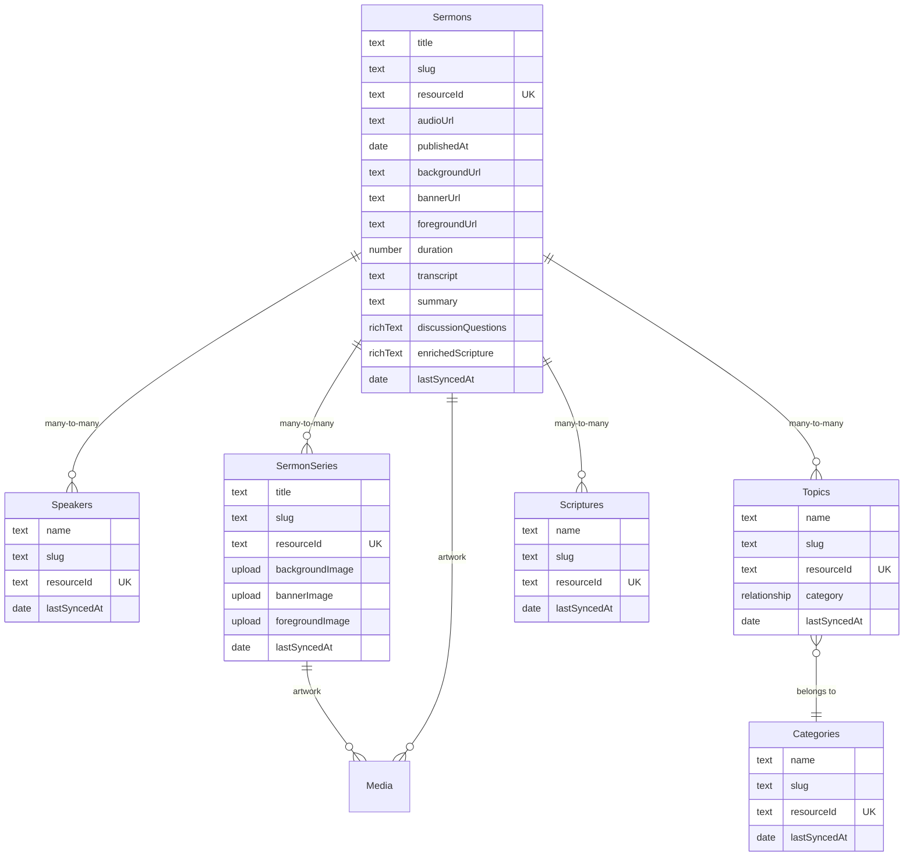

# Sermon Library with Sync, Discovery, Audio Player, and RSS Feed

## Overview

Build an extraordinary sermon library for ev.church that syncs 625 sermons from a GraphQL API (`resources.ev.church/graphql`), provides Netflix-style series browsing with multi-dimensional filtering, a persistent Spotify-style audio player, and an RSS podcast feed generated from Payload data. Replaces the existing Rock RMS `SermonSeries` collection entirely.

## Problem Statement

Ev Church has a rich sermon archive (625 sermons, 78 series, 55 speakers, 47 topics, 53 scripture books) managed through a Rails app at resources.ev.church. None of this content is surfaced on the main website. The existing `SermonSeries` collection synced from Rock RMS is thin (series-level only, no individual sermons, no audio). People have no way to discover, browse, or listen to sermons on ev.church.

## Proposed Solution

A phased build that delivers:

1. **Data model and sync** -- New Payload collections for Sermons, Series, Speakers, Topics, Categories, and Scriptures, synced from the GraphQL API every 15 minutes
2. **Sermon library pages** -- Landing page with hero + Netflix grid + filters, plus detail pages for sermons, series, topics, speakers, and scriptures
3. **Persistent audio player** -- Spotify-style bottom bar with React Context, surviving App Router navigation
4. **RSS podcast feed** -- iTunes-compliant feed generated from Payload data at `/sermons/feed.xml`

## Technical Approach

### Architecture



### Key Technical Decisions

**Persistent audio player** (resolves deferred question from origin): Use a `'use client'` `AudioPlayerProvider` context in the root frontend layout (`src/app/(frontend)/layout.tsx`). The `<audio>` element lives in the provider, never unmounts on navigation. The player bar component renders fixed at bottom. Body gets bottom padding when player is active.

**Series artwork sync** (resolves deferred question from origin): Download during sync, not lazily. Reliability matters more than sync speed. Series only change infrequently (78 total). Use `fetch()` to download from Active Storage redirect URLs, then `payload.create({ collection: 'media' })` with the buffer.

**Filtering strategy** (resolves deferred question from origin): Server-side via Payload `where` queries. 625 sermons is too many for client-side filtering to be snappy, and server-side enables SEO for filtered views. Filter state encoded in URL search params for shareability and back-button support.

**Search** (resolves deferred question from origin): Payload's built-in text search via `where` clause with `like` operator across title fields. Simple, no extra dependencies. Can add Fuse.js client-side later if needed.

**RSS feed** (resolves deferred question from origin): Dynamic Next.js route handler at `src/app/(frontend)/sermons/feed.xml/route.ts` with `unstable_cache` and `revalidateTag`. Regenerated when sermon data changes via cache invalidation.

**Slug collisions**: Sermon slugs are generated as `{series-slug}-{sermon-title-slug}` to ensure uniqueness. A sermon titled "Introduction" in series "Romans" becomes `romans-true-freedom-introduction`. If no series, append the date.

**Deletion strategy**: Soft-delete. Track all `resourceId` values returned by the API. After sync, mark any Payload records whose `resourceId` was NOT in the API response as `isPublished: false`. Exclude unpublished from all queries and RSS.

**Duration field**: Not available from the GraphQL API. Extract from M4A audio file metadata during sync using an HTTP Range request to read the file header (first ~1KB). Store as seconds in a `duration` number field.

**Media Session API**: In scope for initial build. Critical for mobile -- without it, audio pauses when the phone is locked. Integrate via the audio player component.

### Implementation Phases

#### Phase 1: Data Model and Collections

Create the 6 new Payload collections and the GraphQL API client. Remove the old SermonSeries collection and its Rock RMS sync.

**Files to create:**

- `src/collections/Sermons.ts` -- Main sermon collection

```typescript
// Collection slug: 'sermons'
// Fields: title, slug (unique, indexed), resourceId (text, unique, indexed),
//   audioUrl (text), publishedAt (date), duration (number, nullable),
//   backgroundUrl (text), bannerUrl (text), foregroundUrl (text),
//   series (relationship, hasMany, to sermon-series),
//   speakers (relationship, hasMany, to speakers),
//   topics (relationship, hasMany, to topics),
//   scriptures (relationship, hasMany, to scriptures),
//   isPublished (checkbox, default true),
//   -- Future AI fields (all nullable):
//   transcript (textarea), summary (textarea),
//   discussionQuestions (richText), enrichedScripture (richText),
//   lastSyncedAt (date, sidebar, readOnly)
// Access: read: () => true, CUD: isAdmin
```

- `src/collections/Speakers.ts` -- Speaker/author collection

```typescript
// Collection slug: 'speakers'
// Fields: name (text, required), slug (unique, indexed),
//   resourceId (text, unique, indexed), lastSyncedAt
// Access: read: () => true, CUD: isAdmin
```

- `src/collections/Topics.ts` -- Topic collection

```typescript
// Collection slug: 'topics'
// Fields: name (text, required), slug (unique, indexed),
//   resourceId (text, unique, indexed),
//   category (relationship to categories), lastSyncedAt
// Access: read: () => true, CUD: isAdmin
```

- `src/collections/Categories.ts` -- Category collection (4 total: Theology, Life, Culture, Church)

```typescript
// Collection slug: 'categories'
// Fields: name (text, required), slug (unique, indexed),
//   resourceId (text, unique, indexed), lastSyncedAt
// Access: read: () => true, CUD: isAdmin
```

- `src/collections/Scriptures.ts` -- Scripture book collection (53 books)

```typescript
// Collection slug: 'scriptures'
// Fields: name (text, required), slug (unique, indexed),
//   resourceId (text, unique, indexed), lastSyncedAt
// Access: read: () => true, CUD: isAdmin
```

**Files to modify:**

- `src/collections/SermonSeries.ts` -- Replace Rock RMS fields with GraphQL fields

```typescript
// Remove: rockContentItemId (number), content (richText), seriesImage (upload),
//   startDate, resourceUrl, isActive
// Add: resourceId (text, unique, indexed), backgroundImage (upload to media),
//   bannerImage (upload to media), foregroundImage (upload to media),
//   isPublished (checkbox, default true), lastSyncedAt
// Keep: title, slug (update to use new slugify)
```

- `payload.config.ts` -- Register new collections (Sermons, Speakers, Topics, Categories, Scriptures), remove old SermonSeries import and add updated one
- `src/lib/cache-tags.ts` -- Add new cache tags: `sermons`, `speakers`, `topics`, `categories`, `scriptures`
- `src/collections/BlogPosts.ts` -- Update `sermonSeries` relationship field to point to the new collection structure (slug unchanged, so the FK survives)

**Acceptance criteria:**

- [ ] All 6 collections defined with correct field types, access controls, and indexes
- [ ] `payload generate:types` runs clean
- [ ] Old `rockContentItemId` field removed from SermonSeries
- [ ] BlogPosts `sermonSeries` relationship still works
- [ ] New cache tags registered

#### Phase 2: GraphQL Client and Sync Engine

Build the GraphQL client for resources.ev.church and the sync functions for all 6 entity types.

**Files to create:**

- `src/lib/resources-api.ts` -- GraphQL client for resources.ev.church

```typescript
// resourcesGraphQL<T>(query: string, variables?: Record<string, unknown>): Promise<T>
// Handles: POST to https://resources.ev.church/graphql
// Relay cursor pagination helper: fetchAllPages<T>(query, nodeExtractor)
// Typed response interfaces for all entity types
// Retry with exponential backoff (3 retries)
```

- `src/sync/mappers/sermon.ts` -- Sermon entity mapper

```typescript
// mapResourceSermon(node: ResourceSermon): MappedSermon
// Slug generation: series-slug + sermon-title-slug (or date suffix if no series)
// Maps: title, slug, resourceId (UUID), audioUrl, publishedAt,
//   backgroundUrl, bannerUrl, foregroundUrl
// Prefixed fields: _seriesResourceIds, _speakerResourceIds,
//   _topicResourceIds, _scriptureResourceIds (for relationship resolution)
```

- `src/sync/mappers/speaker.ts` -- Speaker mapper
- `src/sync/mappers/topic.ts` -- Topic mapper (includes category resourceId)
- `src/sync/mappers/category.ts` -- Category mapper
- `src/sync/mappers/scripture.ts` -- Scripture mapper
- `src/sync/sermon-sync-runner.ts` -- Dedicated sync runner for sermon entities

```typescript
// runSermonSync(): Promise<SyncResult[]>
// Sync order matters (dependencies first):
//   1. Categories (no deps)
//   2. Scriptures (no deps)
//   3. Speakers (no deps)
//   4. Topics (depends on Categories)
//   5. Sermon Series (no deps, but needs image download)
//   6. Sermons (depends on all above for relationship resolution)
//
// Relationship resolution pattern:
//   After syncing speakers/topics/etc, build a Map<resourceId, payloadId>
//   Use this map to resolve relationship fields on sermons
//
// Image download for series:
//   For each series with backgroundUrl/bannerUrl/foregroundUrl,
//   download the image, create Media doc, store the Payload media ID
//
// Soft-delete: After syncing all sermons, find any Payload sermons
//   whose resourceId is NOT in the set of synced IDs, set isPublished: false
//
// Duration extraction: For each sermon with audioUrl and no duration,
//   make an HTTP Range request for the first 2KB of the M4A file,
//   parse the moov/mvhd atom to extract duration in seconds
```

**Files to modify:**

- `src/sync/sync-runner.ts` -- Remove `syncSermonSeries()` function and its Rock RMS import. Add call to `runSermonSync()` from the new sermon sync runner.
- `src/sync/mappers/sermon-series.ts` -- Delete this file (replaced by new mapper)
- `src/app/api/sync/trigger/route.ts` -- Ensure the cron trigger calls the updated `runFullSync()`

**Acceptance criteria:**

- [ ] GraphQL client can fetch all 625 sermons across paginated requests
- [ ] All 6 entity types sync correctly with create/update/soft-delete reconciliation
- [ ] Series artwork downloaded into Media collection
- [ ] Sermon relationships resolved (series, speakers, topics, scriptures)
- [ ] Duration extracted from M4A file headers where possible
- [ ] Cache tags revalidated after sync
- [ ] Sync completes within a reasonable time (< 5 minutes for full reconciliation)

#### Phase 3: Persistent Audio Player

Build the Spotify-style audio player that persists across all pages.

**Files to create:**

- `src/components/audio/AudioPlayerProvider.tsx` -- React Context provider (`'use client'`)

```typescript
// AudioPlayerContext: { currentSermon, isPlaying, progress, duration,
//   playbackSpeed, play(sermon), pause(), seek(time), setSpeed(speed),
//   skipForward(), skipBack() }
// Manages a single <audio> element ref
// Exposes sermon metadata (title, speaker, series, artwork) alongside controls
// Persists playback speed in localStorage
// Integrates Media Session API for lock screen controls
```

- `src/components/audio/AudioPlayerBar.tsx` -- Fixed bottom player bar (`'use client'`)

```typescript
// Fixed at bottom of viewport, z-40, hidden when no sermon is playing
// Shows: sermon title, speaker name, series name, progress bar,
//   play/pause, skip -15s/+15s, speed control, close button
// Compact mobile variant, expanded desktop variant
// Progress bar is draggable/clickable for seeking
// Smooth transitions for show/hide
```

- `src/components/audio/PlayButton.tsx` -- Reusable play button for sermon cards/pages

```typescript
// Connects to AudioPlayerContext
// Shows play icon if sermon is not current, pause icon if playing
// Handles loading state while audio buffers
```

**Files to modify:**

- `src/app/(frontend)/layout.tsx` -- Wrap body content with `<AudioPlayerProvider>`, add `<AudioPlayerBar />` after `<Footer />`

```tsx
// Before:
//   <body>...<Footer /></body>
// After:
//   <body>
//     <AudioPlayerProvider>
//       ...<Footer />
//       <AudioPlayerBar />
//     </AudioPlayerProvider>
//   </body>
```

- `src/styles/globals.css` -- Add bottom padding utility for when player is active (if needed)

**Acceptance criteria:**

- [ ] Audio plays and persists across page navigations (App Router)
- [ ] Player bar shows/hides smoothly when a sermon starts/stops
- [ ] Play/pause, seek, skip 15s forward/back, speed control all work
- [ ] Playback speed persists in localStorage
- [ ] Media Session API shows sermon info on mobile lock screen
- [ ] Player does not interfere with existing layout (Header z-50, Footer)
- [ ] Footer content not obscured by player bar (body padding adjusts)

#### Phase 4: Sermon Library Pages

Build all the frontend pages for browsing, filtering, and viewing sermons.

**Files to create:**

- `src/app/(frontend)/sermons/page.tsx` -- Library landing page

```typescript
// Server Component
// Hero: Latest sermon with series artwork, play button, sermon title, speaker
// Below hero: Netflix-style series grid (horizontally scrollable rows or card grid)
// Filter controls: Series, Speaker, Topic (grouped by Category), Scripture
// Each filter shows item count (e.g., "Faith (23)")
// Filter state from URL searchParams (server-side filtering)
// Search bar at top
// Podcast subscribe buttons (Apple, Spotify, RSS)
// Caching: unstable_cache with sermon/series cache tags
```

- `src/app/(frontend)/sermons/[slug]/page.tsx` -- Individual sermon page

```typescript
// Server Component with generateMetadata
// Sermon title, speaker link, date, series link, scripture tags, topic tags
// Large play button / audio player integration
// Sermon notes / transcript (when available, future AI content)
// "Next in series" / "Previous in series" navigation
// "More from this speaker" section
// Related topics section
// AudioObject JSON-LD structured data
// BreadcrumbJsonLd: Home > Sermons > Series Name > Sermon Title
```

- `src/app/(frontend)/sermons/series/[slug]/page.tsx` -- Series detail page

```typescript
// Server Component with generateMetadata
// Series artwork (background, banner, foreground layered)
// Series title
// All sermons in series, ordered chronologically
// Each sermon card: title, speaker, date, play button, duration
```

- `src/app/(frontend)/sermons/topics/[slug]/page.tsx` -- Topic page

```typescript
// Server Component
// Topic name as heading, category badge
// All sermons tagged with this topic, paginated
// Related topics sidebar/section
```

- `src/app/(frontend)/sermons/speakers/[slug]/page.tsx` -- Speaker page

```typescript
// Server Component
// Speaker name as heading
// All sermons by this speaker, newest first
// Series they've contributed to
```

- `src/app/(frontend)/sermons/scriptures/[slug]/page.tsx` -- Scripture book page

```typescript
// Server Component
// Book name as heading (e.g., "Sermons from Romans")
// All sermons referencing this scripture book
```

- `src/components/sermons/SermonCard.tsx` -- Reusable sermon card component

```typescript
// Shows: title, speaker, date, series badge, duration, play button
// Links to /sermons/[slug]
// Integrates with AudioPlayerContext for play button state
```

- `src/components/sermons/SeriesCard.tsx` -- Series card with artwork

```typescript
// Shows: series artwork (banner or background), title, sermon count
// Links to /sermons/series/[slug]
// Netflix-style aspect ratio
```

- `src/components/sermons/SermonFilters.tsx` -- Filter controls component (`'use client'`)

```typescript
// Multi-dimensional filter UI
// Dropdowns/accordions for: Series, Speaker, Topic (grouped by Category), Scripture
// Each option shows count
// Reads/writes URL searchParams via useRouter/useSearchParams
// Debounced search input
```

- `src/components/sermons/SermonHero.tsx` -- Hero section for landing page

```typescript
// Large series artwork background
// Latest sermon title, speaker, date
// Prominent play button
// "View Series" secondary CTA
```

- `src/components/sermons/PodcastSubscribe.tsx` -- Podcast subscribe buttons

```typescript
// Apple Podcasts badge, Spotify badge, RSS icon
// Links to platform-specific subscribe URLs
```

- `src/components/seo/SermonJsonLd.tsx` -- AudioObject structured data

```typescript
// Outputs JSON-LD for sermon pages:
// @type: AudioObject with name, author, datePublished,
//   contentUrl, duration, isPartOf (series)
```

**Files to modify:**

- `src/app/sitemap.ts` -- Add sermon pages, series pages, speaker pages, topic pages, scripture pages
- `src/components/layout/Header.tsx` -- Add "Sermons" to main navigation

**Acceptance criteria:**

- [ ] `/sermons` shows hero with latest sermon, series grid, filters, search, podcast buttons
- [ ] Filtering by series/speaker/topic/scripture works via URL params
- [ ] Filter counts display correctly
- [ ] `/sermons/[slug]` shows full sermon detail with play button and metadata
- [ ] Next/previous in series navigation works (hidden at boundaries)
- [ ] `/sermons/series/[slug]` shows series with all sermons
- [ ] `/sermons/topics/[slug]`, `/sermons/speakers/[slug]`, `/sermons/scriptures/[slug]` all work
- [ ] Search returns results across titles, speakers, series, topics
- [ ] All pages have proper metadata, OG tags, and structured data
- [ ] Sitemap includes all sermon-related URLs
- [ ] Navigation updated with Sermons link

#### Phase 5: RSS Podcast Feed

Generate an iTunes-compliant podcast feed from Payload data.

**Files to create:**

- `src/app/(frontend)/sermons/feed.xml/route.ts` -- RSS feed route handler

```typescript
// GET handler returns XML with Content-Type: application/rss+xml
// Channel metadata: title "Ev Church - Sermons", description, language "en",
//   copyright, itunes:author, itunes:owner, itunes:category, itunes:image,
//   itunes:explicit "false", itunes:type "episodic"
// Items: all published sermons ordered by publishedAt desc
//   title, description (speaker | scripture | date), pubDate,
//   enclosure (audioUrl, type "audio/x-m4a"),
//   link (canonical sermon URL), guid,
//   itunes:author, itunes:subtitle, itunes:summary,
//   itunes:duration (from duration field), itunes:image (series banner),
//   itunes:explicit "no"
// Wrapped in unstable_cache with sermons cache tag
// Reference: existing feed at resources.ev.church/resources.rss
```

**Acceptance criteria:**

- [ ] Feed accessible at `/sermons/feed.xml`
- [ ] Feed validates against Apple Podcasts specification
- [ ] All published sermons included with correct metadata
- [ ] Duration displayed when available
- [ ] Feed updates within 15 minutes of data changes (via cache invalidation)
- [ ] MIME type is `application/rss+xml`

## System-Wide Impact

### Interaction Graph

- Sync trigger (`/api/sync/trigger`) calls `runFullSync()` which now includes `runSermonSync()` alongside existing Rock RMS sync
- `runSermonSync()` calls GraphQL API, creates/updates Payload docs, downloads images to Media collection, calls `revalidateTag()` for all sermon-related cache tags
- `revalidateTag()` busts ISR cache for all sermon pages, RSS feed, and any CMS pages using sermon blocks
- `AudioPlayerProvider` context wraps the entire frontend layout -- all page components can access player state

### Error Propagation

- GraphQL API errors: Caught per-entity in sync runner, logged to `SyncResult.errors`, other entities continue syncing
- Image download failures: Logged, sermon/series created without image, retried on next sync cycle
- Audio file errors (duration extraction): Non-fatal, duration field left null, RSS feed omits `<itunes:duration>` for that episode
- Audio playback errors: Caught in AudioPlayerProvider, surfaced via player UI error state

### State Lifecycle Risks

- **Partial sync failure**: If sermons sync but speakers don't, relationship fields may reference non-existent docs. Mitigated by syncing dependencies first (categories, speakers, scriptures before sermons).
- **Orphaned media**: If a series is soft-deleted, its downloaded artwork remains in Media collection. Acceptable -- no cleanup needed for a small number of images.
- **BlogPosts FK**: The `sermonSeries` relationship on BlogPosts uses the collection slug `sermon-series` which is unchanged. The `rockContentItemId` field is being replaced with `resourceId`, but since the Payload doc ID (auto-generated) is the FK target, existing relationships survive.

### API Surface Parity

- Public read access on all new collections (consistent with existing synced collections)
- Admin-only write access (consistent with existing synced collections)
- No new API endpoints beyond the RSS feed route

## Acceptance Criteria

### Functional Requirements

- [ ] All 625 sermons sync from GraphQL API with correct relationships
- [ ] Sermon library browsable at `/sermons` with hero, series grid, and filters
- [ ] Multi-dimensional filtering works (series, speaker, topic, scripture)
- [ ] Persistent audio player works across all pages
- [ ] RSS feed validates against podcast specifications
- [ ] Search returns relevant results
- [ ] Old SermonSeries Rock sync removed cleanly

### Non-Functional Requirements

- [ ] Sync completes in under 5 minutes
- [ ] Sermon pages load in under 3 seconds on mobile
- [ ] Audio starts playing within 2 seconds of pressing play
- [ ] RSS feed responds in under 1 second (cached)
- [ ] All sermon pages have proper SEO metadata and structured data

### Quality Gates

- [ ] TypeScript strict mode passes with no errors
- [ ] All new collections follow existing naming and access patterns
- [ ] `payload generate:types` produces clean output
- [ ] Audio player works on iOS Safari, Android Chrome, and desktop browsers
- [ ] Media Session API shows lock screen controls on mobile

## Dependencies & Prerequisites

- GraphQL API at `resources.ev.church/graphql` -- confirmed working (audioUrl fixed)
- M4A audio files hosted on `resources.ev.church` via Rails Active Storage
- Existing RSS feed at `resources.ev.church/resources.rss` as reference format
- No `<itunes:duration>` in existing feed -- will extract from audio file headers

## Risk Analysis & Mitigation

| Risk | Impact | Mitigation |
|------|--------|------------|
| GraphQL API downtime during sync | Sermon data becomes stale | Retry logic + existing data persists; 15-min cron catches up |
| M4A duration extraction fails | RSS feed missing duration tags | Duration is recommended not required; feed works without it |
| Audio player breaks on specific mobile browser | Core feature degraded | Test on iOS Safari, Android Chrome early; Media Session API has broad support |
| Series artwork download slow (78 images) | Sync takes longer | Download images only when changed (compare URLs); skip on error |
| Slug collisions despite series prefix | 404 errors or overwritten data | Unique constraint on slug field; sync logs collision as error |

## Future Considerations

- **AI content pipeline**: Data model includes nullable `transcript`, `summary`, `discussionQuestions`, and `enrichedScripture` fields. Future workflow: transcribe audio -> generate companion content -> inject Bible passages.
- **Sermon upload via Payload admin**: Currently synced from GraphQL API. Future: allow direct sermon creation/upload in Payload, making ev.church the primary system.
- **Auto-advance playback**: When a sermon finishes, auto-play the next sermon in the series.
- **Personalized recommendations**: User accounts with listening history to power "Continue listening" and "Suggested for you" sections.
- **Podcast feed migration**: Once the new RSS feed at `/sermons/feed.xml` is stable, migrate Apple Podcasts and Spotify subscribers from the old `resources.ev.church/resources.rss` URL.

## Sources & References

### Origin

- **Origin document:** [docs/brainstorms/2026-03-29-sermon-library-requirements.md](../brainstorms/2026-03-29-sermon-library-requirements.md) -- Key decisions carried forward: audio-only (no video), replace Rock RMS sermon sync entirely, generate RSS from Payload, persistent Spotify-style player, future AI pipeline ready data model.

### Internal References

- Sync runner pattern: `src/sync/sync-runner.ts`
- Collection pattern: `src/collections/Campuses.ts`, `src/collections/SermonSeries.ts`
- Cache tag pattern: `src/lib/cache-tags.ts`
- Layout injection point: `src/app/(frontend)/layout.tsx:65-83`
- SEO pattern: `src/components/seo/OrganizationJsonLd.tsx`
- Sitemap: `src/app/sitemap.ts`
- Existing RSS feed: `resources.ev.church/resources.rss`

### External References

- GraphQL API: `https://resources.ev.church/graphql`
- Apple Podcasts RSS spec: RSS tags reference
- Media Session API: MDN Web Docs
- Payload CMS collections: Payload docs

### API Schema Reference

```graphql
# Sermon fields
type Sermon {
  id: ID!
  name: String!
  publishedAt: ISO8601DateTime
  audioUrl: String
  backgroundUrl: String
  bannerUrl: String
  foregroundUrl: String
  authors: [Author!]!
  series: [Series!]!
  topics: [Topic!]!
  scriptures: [Scripture!]!
  connectionScriptures: [SermonScripture!]!
}

# Query filters
sermons(authorIds, categoryIds, ids, scriptureIds, seriesIds, topicIds, first, after)
series(ids, first, after)
authors(first, after)
categories(first, after)
topics(first, after)
scriptures(first, after)
```

### Data Volumes

| Entity | Count |
|--------|-------|
| Sermons | 625 |
| Series | 78 |
| Speakers | 55 |
| Topics | 47 |
| Scriptures | 53 |
| Categories | 4 |
