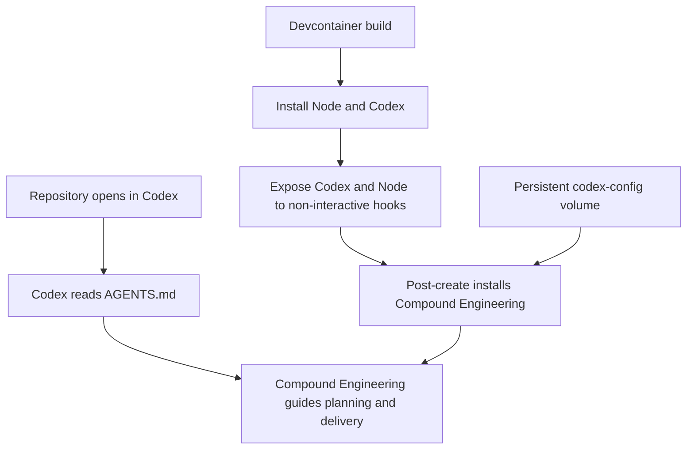

# refactor: Make Codex and Compound Engineering the default development workflow

## Goal Capsule

- **Objective:** Replace Claude-specific development configuration with a Codex-first environment that uses Compound Engineering as the repository's default delivery workflow.
- **Authority:** The user's migration request and the session-settled decisions below override inherited tooling conventions; application runtime behavior remains unchanged.
- **Execution profile:** Configuration and documentation migration with install/runtime smoke verification.
- **Stop conditions:** Stop if the migration would remove the sermon pipeline's runtime AI provider, expose local credentials, or require committing machine-local Codex state.
- **Tail ownership:** LFG owns review, commit, push, pull-request creation, and CI observation.

---

## Product Contract

### Summary

The repository currently teaches agents to use Claude, persists Claude-specific development state, and provisions Claude Code in its devcontainer.
The target state makes Codex the default agent surface, establishes Compound Engineering as the normal way to plan and ship work, and keeps machine-local preferences optional.

### Problem Frame

The application already contains useful project conventions and Compound Engineering artifacts, but its tracked agent guidance and container tooling are coupled to Claude Code.
A partial rename would leave future contributors with conflicting instructions or a container that cannot run Codex non-interactively.
The migration therefore needs to cover repository instructions, CE configuration, persisted container state, installation, and an end-to-end container smoke test.

### Requirements

- R1. Codex must discover authoritative project conventions through a root `AGENTS.md`.
- R2. `AGENTS.md` must make Compound Engineering the primary workflow and map common work types to the appropriate CE skills.
- R3. Compound Engineering must use its default `docs/` artifact root without creating a machine-local config, while the repository carries the current example config and safely ignores any future local config.
- R4. The devcontainer must install Codex, recommend the official Codex editor extension, persist Codex state, and automatically install the Compound Engineering plugin.
- R5. Tracked and untracked Claude-only development configuration must be removed from the active repository.
- R6. The application's Anthropic-backed sermon-processing feature must remain unchanged because it is runtime product behavior rather than development tooling.
- R7. The migrated setup must pass CE health, repository build, configuration syntax, container image build, and inside-container Codex/CE smoke checks.

### Scope Boundaries

**In scope**

- Root agent instructions and Compound Engineering configuration.
- Claude-specific tracked settings and stale local worktree cleanup.
- Devcontainer installation, persisted state, editor recommendation, shell aliases, and post-create setup.
- Verification of both the application and containerized agent environment.

**Deferred to follow-up work**

- Replacing Anthropic as the sermon pipeline's runtime AI provider.
- Adding project-specific CE preferences beyond the documented defaults.
- Installing optional host tools that do not block CE workflows.

---

## Planning Contract

### Key Technical Decisions

- KTD1. **Use `AGENTS.md` as the single tracked agent guide** (session-settled: user-approved — chosen over retaining parallel `CLAUDE.md` and `AGENTS.md`: parallel guides would drift and undermine a full migration). Governs R1, R2, and R5.
- KTD2. **Keep CE's native defaults** (session-settled: user-directed — chosen over creating `.compound-engineering/config.local.yaml`: the user explicitly selected no local config). Commit only the current example and ignore the local filename pattern. Governs R3.
- KTD3. **Install Codex and CE inside the devcontainer** (session-settled: user-approved — chosen over relying only on host installation: the container must remain independently usable and reproducible). Persist `/home/vscode/.codex` in a named volume and install CE idempotently during post-create setup. Governs R4 and R7.
- KTD4. **Preserve the Anthropic application dependency** (session-settled: user-approved — chosen over replacing the runtime provider during tooling migration: provider replacement changes product behavior and requires separate planning). Governs R6.
- KTD5. **Use smoke-first verification for the container**. Syntax checks alone cannot prove that an `fnm`-managed Node binary, the Codex launcher, and post-create plugin installation are available to non-interactive commands. Governs R7.
- KTD6. **Pin validated agent-tool versions while keeping upgrade inputs explicit**. Default the image to the Codex release and Compound Engineering marketplace revision proven by this migration instead of floating on every rebuild; future upgrades change those inputs deliberately and rerun the smoke contract. Governs R4 and R7.

### High-Level Technical Design

### Assumptions

- The official `@openai/codex` package remains the supported container installation path.
- Container users will authenticate Codex once inside the persistent `codex-config` volume when needed.
- Historical planning documents may continue to mention Claude or Anthropic where they accurately describe past decisions or current product behavior.

### Sequencing

1. Establish the repository-level Codex and CE contract.
2. Migrate the devcontainer and ensure non-interactive availability.
3. Remove obsolete local Claude state and verify the combined result.

---

## Implementation Units

### U1. Establish Codex and Compound Engineering repository guidance

- **Goal:** Give Codex a complete, repo-native operating guide and healthy CE configuration.
- **Requirements:** R1, R2, R3, R5, R6
- **Dependencies:** None
- **Files:**
  - Create `AGENTS.md`
  - Create `.compound-engineering/config.local.example.yaml`
  - Modify `.gitignore`
  - Delete `CLAUDE.md`
  - Delete `.claude/settings.json`
- **Approach:**
  1. Carry forward the useful framework, TypeScript, Payload, styling, and repository conventions into `AGENTS.md`.
  2. Add the CE workflow routing and explicitly document the runtime-provider boundary.
  3. Copy the plugin's current example config exactly and ignore future machine-local CE config.
  4. Remove the superseded Claude-specific tracked guidance.
- **Patterns to follow:** Existing conventions in the former `CLAUDE.md`; CE artifact locations already present under `docs/`.
- **Test scenarios:**
  1. Run CE health from the repository root and confirm project configuration is healthy, the artifact root resolves to `docs/`, and the example config is current.
  2. Search active tooling files and confirm no Claude-only development configuration remains; allow documented runtime-provider and template option references.
- **Verification:** Codex has one authoritative root guide and CE health reports no project issues.

### U2. Provision Codex and Compound Engineering in the devcontainer

- **Goal:** Make a rebuilt development container immediately capable of running Codex and CE workflows.
- **Requirements:** R4, R7
- **Dependencies:** U1
- **Files:**
  - Modify `.devcontainer/devcontainer.json`
  - Modify `.devcontainer/Dockerfile`
  - Modify `.devcontainer/docker-compose.yml`
  - Modify `.devcontainer/post_install.py`
  - Modify `.devcontainer/.zshrc`
- **Approach:**
  1. Replace the Claude editor extension, environment variables, volumes, comments, and aliases with Codex equivalents.
  2. Install the official Codex npm package at the validated release after Node is provisioned by `fnm`, retaining a build argument for deliberate upgrades.
  3. Expose both Node and Codex on the global container path so non-interactive post-create commands work.
  4. Persist `~/.codex` and make post-install setup idempotently add the Compound Engineering marketplace at the validated revision and enable its plugin.
  5. Keep plugin-install failure non-destructive by reporting a warning while leaving the base development environment usable.
- **Execution note:** This is packaging and environment configuration; prove it with image and runtime smoke checks rather than adding unit tests.
- **Patterns to follow:** Existing idempotent tmux, ownership, and git configuration helpers in `.devcontainer/post_install.py`.
- **Test scenarios:**
  1. Parse `devcontainer.json`, compile `post_install.py`, and render the Compose configuration without errors.
  2. Build the app image from a clean Docker layer and confirm the official Codex package installs.
  3. Start an ephemeral non-interactive container, run `codex --version`, execute the post-install script, and confirm `compound-engineering@compound-engineering-plugin` is installed and enabled.
  4. Re-run the post-install script against persisted state and confirm it does not duplicate marketplace or plugin entries.
- **Verification:** The container image builds and an inside-container smoke command reaches both Codex and Compound Engineering without interactive shell initialization.

### U3. Remove stale Claude workspace state and verify the application

- **Goal:** Finish the migration without losing recoverability or regressing the application.
- **Requirements:** R5, R6, R7
- **Dependencies:** U1, U2
- **Files:**
  - No additional tracked files expected
- **Approach:**
  1. Move the stale `.claude/worktrees` directory to the operating system Trash with an explicit recovery path.
  2. Prune the stale Git worktree registration.
  3. Confirm the remaining Anthropic references belong only to application runtime behavior or historical documentation.
  4. Run the production build and final diff checks.
- **Execution note:** Preserve stale local state through a recoverable Trash move rather than permanent deletion.
- **Patterns to follow:** Repository build script in `package.json`; explicit destructive-action safeguards in the active agent instructions.
- **Test scenarios:**
  1. Confirm `git worktree list` contains only the active repository.
  2. Run `npm run build` and confirm Payload type generation, TypeScript, and Next.js production output complete successfully.
  3. Run `git diff --check` and confirm no whitespace errors.
- **Verification:** The app build passes, the stale worktree is recoverable from Trash, and tracked application runtime code is unchanged.

---

## Verification Contract

| Gate | Applies to | Done signal |
|---|---|---|
| Compound Engineering health check | U1 | Project config healthy; example current; artifact root `docs/` |
| JSON, Python, and Compose syntax validation | U2 | All configuration parsers exit successfully |
| Devcontainer image build | U2 | `devcontainer-app` image builds successfully |
| Inside-container Codex and CE smoke test | U2 | Codex reports a version and CE is installed and enabled |
| Production application build | U3 | Payload type generation and Next.js production build pass |
| Git diff validation | U1, U2, U3 | `git diff --check` reports no errors |

---

## Definition of Done

- R1-R7 are satisfied without changing application runtime behavior.
- `AGENTS.md` is the single tracked agent guide and makes Compound Engineering the default workflow.
- Compound Engineering project health is green with no local config created.
- The devcontainer independently runs Codex and installs Compound Engineering.
- Claude-only active development configuration is removed.
- The stale Claude worktree is recoverable from the documented Trash location.
- The repository production build and all configuration smoke checks pass.
