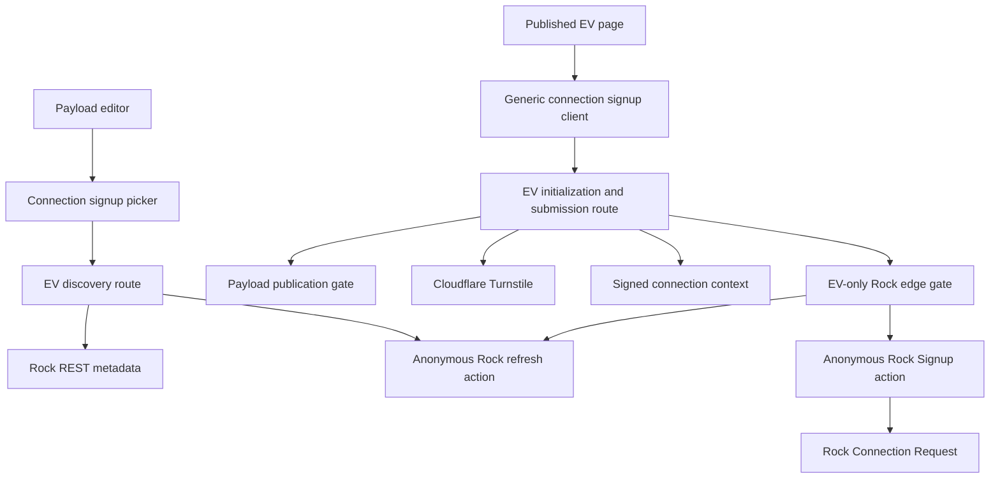
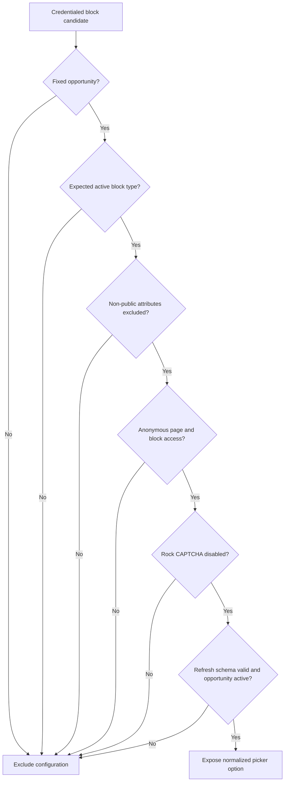
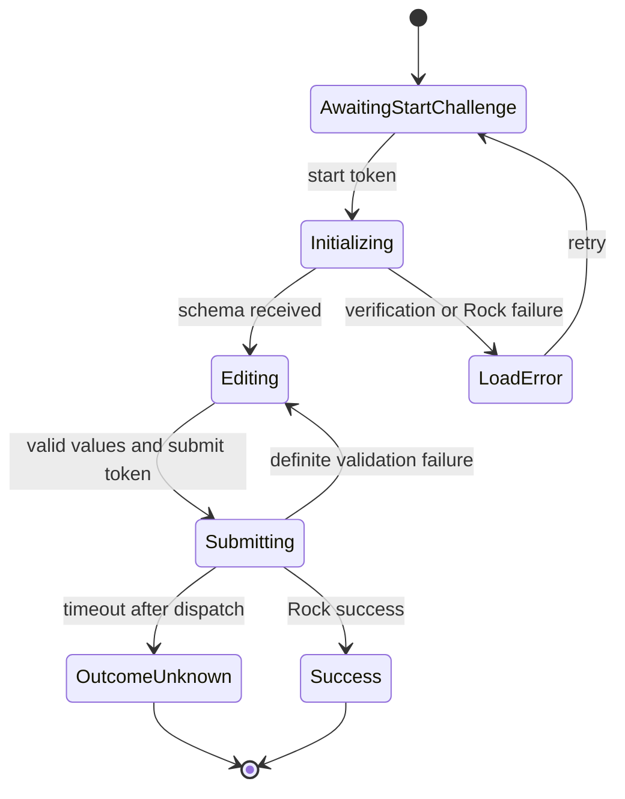

# Rock Connection Opportunity Signups - Plan

## Goal Capsule

- **Objective:** Add a reusable EV website integration for Rock RMS 19.2 Connection Opportunity Signup blocks and configure Newish Connect as its first consumer.
- **Authority:** Current user instructions and this Product Contract override implementation preferences. Exact Rock 19.2 source behavior overrides assumptions copied from later Rock releases.
- **Execution profile:** Build the Connection Signup protocol beside the existing Workflow Form Builder protocol. Prove behavior with focused tests, the full build, and browser checks that stop before a real Connection Request is created.
- **Stop conditions:** Stop for a product-scope conflict, an unsafe production database target, a request to mutate production Rock data, or absence of an enforceable control that prevents direct public calls to the CAPTCHA-disabled Rock BlockActions. Code may be reviewed before that external control exists, but Newish activation and the data migration must not be deployed.
- **Tail ownership:** The shipping workflow owns simplification, review fixes, browser QA, commit, PR creation, and CI. Rock administrator configuration remains an explicit deployment prerequisite when it cannot be completed from this repository.

---

## Product Contract

### Summary

The website will render and submit supported Rock 19.2 Connection Opportunity Signup configurations through a generic same-origin EV component. Newish Connect will use the real Rock signup configuration, while all existing Workflow Form Builder forms retain their current protocol and behavior.

### Problem Frame

The Newish form is a Rock Obsidian Connection Opportunity Signup block, not a Workflow Form Builder workflow. The existing website integration supports Workflow forms only, and the previously used Connect Card workflow GUID does not represent Newish.

The signup block instance owns behavior that an opportunity GUID does not capture: phone visibility, campus context, person defaults, status and source settings, attribute-category filters, public-attribute filtering, comment label, CAPTCHA behavior, and the Lava success message. The website must preserve those settings without exposing Rock credentials or trusting client-selected identifiers.

Rock 19.2 also enforces its own proof-of-work CAPTCHA. The current Newish block reports `disableCaptchaSupport: false`, so an EV Turnstile token cannot satisfy its Rock `Signup` action. Production use therefore needs an eligible Rock proxy configuration whose Rock CAPTCHA is disabled while EV continues to verify Turnstile.

### Actors

- A1. **Visitor:** Completes a public EV signup without a Rock account or direct browser request to Rock.
- A2. **Payload editor:** Selects an eligible Rock signup configuration from a constrained picker.
- A3. **Rock administrator:** Maintains the Rock block configuration and completes the proxy-block prerequisite.
- A4. **Website operator:** Deploys the migration and verifies the target Payload database and Rock configuration.

### Requirements

#### Protocol and persistence

- R1. The website must support Rock 19.2 Connection Opportunity Signup as a protocol separate from Workflow Form Builder.
- R2. Browser requests must use same-origin EV endpoints and must never call Rock directly.
- R3. The EV server must create the Connection Request through Rock's supported `Signup` BlockAction and must not persist submission values in Payload, another database, logs, or an intermediary queue.
- R4. Runtime initialization and submission calls must be anonymous to Rock so an API-person identity cannot prefill or alter the signup; authenticated Rock REST access is limited to discovery metadata.
- R5. Mutation calls must not retry automatically because Rock 19.2 provides no idempotency key for Connection Requests.

#### Eligibility and identity

- R6. Payload must persist the configured signup block GUID as the editor-selected stable identity; the server must derive and bind its canonical page GUID before any runtime Rock action.
- R7. Discovery must expose only active Connection Opportunity Signup blocks with a fixed active opportunity, active connection type, anonymous page and block access, non-public attributes excluded, and Rock CAPTCHA effectively disabled.
- R8. The server must reject a block that changes page, type, opportunity, eligibility, or publication state between discovery, initialization, and submission.
- R9. Public Connection Signup initialization and submission routes must be callable only when a published Payload page currently references that block GUID; authenticated editor discovery is governed separately by R31.

#### Security and validation

- R10. Initialization and submission must each require a fresh Cloudflare Turnstile token with the expected hostname and action.
- R11. A separate short-lived signed Connection Signup context must bind the page GUID, block GUID, interaction context, campus allowlist, phone visibility, and initialized attribute metadata without containing personal values.
- R12. The server must reject expired or tampered context, block or page swaps, non-initialized campuses, hidden phone fields, arbitrary attribute keys, unsupported field types, and oversized values before calling Rock.
- R13. First name, last name, and email must be validated and bounded on the client and server; phones, comments, dynamic values, and any supported files must have protocol-appropriate bounds.
- R14. Public errors must not expose Rock exception text or submitted values, and diagnostics must log only non-personal operation metadata and correlation identifiers.

#### Rendering and response

- R15. The client must render names, email, the initialized campus choices and default, configured phone visibility, Rock's comments label, and supported initialized public Connection Request attributes without hard-coding Newish's field set.
- R16. Dynamic attributes must preserve Rock's required state, description/help, ordering, configuration, and key-based submission semantics for each explicitly supported field type.
- R17. Unsupported required attribute controls must make the configuration unavailable instead of falling back to a lossy text control.
- R18. The client must provide accessible labels, keyboard behavior, disabled and duplicate-submit protection, loading states, validation feedback, safe error recovery, and responsive desktop and mobile layout.
- R19. Rock 19.2 success is determined by `resultType` and a sanitized `responseMessage`; Connection Signup must not implement redirect behavior that exists only in later Rock releases.

#### Payload, migration, and Newish

- R20. `formEmbed` must use a clear discriminator between Workflow Form Builder and Connection Opportunity Signup, with conditionally required, explicitly named identifier fields.
- R21. Existing Workflow selections in live pages and page versions must migrate without value changes and must continue to render through `RockForm`.
- R22. The new migration must correct only Newish rows that the prior migration mapped to the Connect Card workflow, without changing legitimate Connect Card use elsewhere.
- R23. `/newish` must use the eligible editor-selected Connection Signup block and must never restore workflow GUID `00778880-81fe-4871-aa91-7c81783b8c4d`. The current expected block GUID is `495cda8e-60fe-4f77-a452-932b460fb44c`; if the prerequisite requires a clone, its replacement GUID must be applied to migration, seed, tests, and picker selection before merge.
- R24. Payload editors must search and select eligible configurations by useful Rock-derived labels rather than enter free-form identifiers.
- R25. The migration rollback must not coerce Connection Signup rows into Workflow rows or silently discard their identity.

#### Compatibility and verification

- R26. Existing Contact, Explaining Christianity, and the remaining public modern Workflow forms must retain their current field, multi-step, people matching, upload, visibility, and submission behavior.
- R27. Automated verification must cover discovery filtering, origin enforcement, Turnstile order, signed-context tampering and expiry, identity swaps, key allowlisting, serialization, safe errors, migration preservation, and Newish configuration.
- R28. Browser verification must distinguish automated checks from live UI checks and must stop before a production `Signup` action or real personal-data entry.
- R29. A CAPTCHA-disabled Rock proxy must be protected by an enforceable network, WAF, or service-auth rule that only EV server traffic can satisfy; direct unauthenticated `RefreshObsidianBlockInitialization` and `Signup` requests must be denied. Rate limiting alone is insufficient.
- R30. Each signed context must carry a cryptographically random nonce consumed atomically once in a shared short-TTL store before dispatch; store unavailability, concurrent reuse, and replay must fail closed. A timeout after dispatch leaves the nonce consumed and the outcome unknown.
- R31. Discovery is an authenticated Payload-admin capability requiring the effective permission needed to edit `formEmbed`; it returns only normalized eligible labels and GUIDs with `private, no-store`, while public runtime routes never expose credentialed discovery metadata.
- R32. Every Rock-derived string renders as text unless it passes one strict shared HTML sanitizer, and outbound Rock fetches use a fixed production HTTPS origin, validated UUID path segments, fixed actions, redirect refusal, timeouts, bounded JSON bodies, content-type checks, and schema limits.
- R33. Request parsing, errors, logging, and telemetry must enforce byte and field-count bounds and redact request bodies, headers, tokens, contexts, raw IP addresses, Rock exception text, and submitted values; correlation IDs and normalized failure classes are permitted.
- R34. Migration correctness must be database-enforced in live and version tables with an expand/backfill/assert/constrain sequence, precise Newish candidate preflight, atomic refusal on unsafe down migration, and independently idempotent seed behavior.
- R35. Before production activation, an authorized operator must submit one clearly synthetic request through the complete EV-to-Rock path in a non-production Rock environment, verify the resulting record and fields, and clean it up; implementation and production browser QA still must not create a production Connection Request.

### Key Product Decisions

- **Connection Signup is a generic separate protocol.** (session-settled: user-approved — chosen over treating Newish as a Workflow or building a one-off Newish form: Rock owns a different dynamic signup contract.) Governs R1, R15-R19, R26.
- **EV is the only browser-facing service and Rock is the only submission store.** (session-settled: user-approved — chosen over direct browser-to-Rock requests or a Payload submission intermediary: credentials stay server-side and Rock remains the source of truth.) Governs R2-R5, R14.
- **The configured block is the persisted source identity.** (session-settled: user-approved — chosen over a bare opportunity GUID: the block owns the complete form configuration.) Governs R6-R9, R23-R24.
- **Turnstile and signed server context protect both phases.** (session-settled: user-approved — chosen over trusting client identifiers and field metadata: clients must not select Rock-owned state.) Governs R10-R13.
- **Workflow Form Builder remains intact through an additive migration.** (session-settled: user-approved — chosen over rewriting the shipped migration or forcing both protocols through one model: current public forms must not regress.) Governs R20-R22, R25-R27.

### Acceptance Examples

- AE1. **Newish initialization:** Given the Newish page references an eligible block, when a visitor completes the start Turnstile action, then the EV route returns the current Rock-configured phones, campuses, comments label, and public attributes with blank personal prefills. The versioned Newish fixture currently asserts three campuses and both phone fields; live acceptance compares the rendered schema with the same initialization response rather than treating those counts as permanent.
- AE2. **Identity tampering:** Given a signed Newish context, when the client substitutes another block, page, campus, or attribute key, then EV rejects the request before Rock is called.
- AE3. **Successful submission contract:** Given valid bounded values and a fresh submit Turnstile token, when the EV server calls Rock, then it sends the exact 19.2 `__context` and `bag` shape once and returns a sanitized success message.
- AE4. **Unavailable configuration:** Given a block that is restricted, inactive, CAPTCHA-enabled, exposes non-public attributes, uses a page-parameter opportunity, or has an unsupported required field, when discovery runs, then editors and runtime routes cannot select or invoke it.
- AE5. **Workflow preservation:** Given an existing Contact or complex Workflow form, when the migration and renderer changes are applied, then its workflow GUID and current `RockForm` behavior remain unchanged.
- AE6. **Migration correction:** Given a Newish live row or version row with the old Connect Card GUID, when the new migration runs, then only the Newish row becomes a Connection Signup source with the prerequisite-verified block GUID (currently expected to be `495cda8e-60fe-4f77-a452-932b460fb44c`).

### Success Criteria

- `/newish` renders the generic Rock-configured Newish signup after the Rock proxy prerequisite is complete.
- Editors can select multiple eligible signup block configurations and each may produce different campuses, phone visibility, comments labels, and supported public attributes without code changes.
- All mutation traffic routes through EV and calls Rock once without local persistence.
- Existing Workflow Form Builder tests, build behavior, and browser flows remain green.
- No real production Connection Request is created during implementation or verification.

### Scope Boundaries

#### In scope

- Generic Connection Opportunity discovery, initialization, signed context, submission, renderer, Payload configuration, migration, Newish seed data, and regression coverage.
- Small extractions from the current Workflow form code when both protocols genuinely share security or field-rendering behavior.
- Validation of any existing Workflow redirect before navigation, while preserving its current supported redirect contract.

#### Out of scope

- Replacing Rock RMS, changing the Connection Opportunity data model, or persisting submissions outside Rock.
- Rebuilding the deleted legacy local `ContactForm`, `SignupForm`, or form-submission routes.
- Supporting legacy Rock WebForms signup blocks.
- Adding later-Rock Connection Signup redirect behavior to the 19.2 contract.
- Performing the final live production submission, deployment, or production database migration.

### Product Contract Preservation

Product Contract created from the selected handoff and current Rock 19.2 verification. The intended scope is unchanged. The redirect requirement was corrected to the exact 19.2 result contract, and the Rock CAPTCHA prerequisite was made explicit.

---

## Planning Contract

### Key Technical Decisions

- KTD1. **Keep parallel protocol modules.** Add `rock-connection-signups` routes, types, adapter, context, and client code beside `rock-forms`; share only protocol-neutral origin validation, Turnstile verification/widget, sanitized HTML, styles, and genuinely stateless controls. Keep Workflow redirect handling, schema normalization, visibility, serialization, context, and state machines protocol-specific. This implements R1 and R26 without coupling workflow steps to Connection Requests.
- KTD2. **Resolve page identity server-side.** Persist only the block GUID in Payload. At start, resolve its one current direct owning page and sign both GUIDs; at submit, re-resolve and require the page to match the signed context. A page move invalidates outstanding contexts but a fresh initialization accepts it. Reject layout-level, ambiguous, or page-parameter-driven blocks, and establish association from credentialed metadata because refresh does not prove page ownership.
- KTD3. **Use the exact anonymous Rock 19.2 BlockActions wire contract.** Refresh sends `{ "__context": { "pageParameters": {}, "sessionGuid": "...", "interactionGuid": "..." } }`; Signup sends `{ "__context": <the same initialized context>, "bag": <ConnectionOpportunitySignupRequestBag> }` to `/api/v2/BlockActions/{pageGuid}/{blockGuid}/{action}`. Never forward EV query parameters, especially person or opportunity identifiers. Validate `ObsidianBlockConfigBag`, `configurationValues`, top-level block GUID/type, reuse session and interaction GUIDs, omit `Authorization-Token`, use no-store responses, and set mutation retries to zero.
- KTD4. **Treat initialization refresh as an internal pinned seam.** Validate the returned block GUID, page-derived identity, block type GUID `35d5ef65-0b0d-4e99-82b5-3f5fc2e0344f`, initialization schema, and absence of `errorMessage`; fail closed on drift because Rock marks refresh as internal.
- KTD5. **Use a Cloudflare Access service token for the EV-only Rock proxy.** An eligible Rock block must have a fixed opportunity, `Exclude Non-Public Attributes = Yes`, anonymous page/block View access, raw `Disable Captcha Support = Yes`, and effective `disableCaptchaSupport === true`. A dedicated Cloudflare Access application must match only the proxy page and exact `/api/v2/BlockActions/{pageGuid}/{blockGuid}/{RefreshObsidianBlockInitialization|Signup}` paths. EV supplies server-only `CF-Access-Client-Id` and `CF-Access-Client-Secret` headers; Rock still receives an anonymous request with no `Authorization-Token`. Missing credentials fail startup/runtime closed, direct requests without the token are denied, and current/previous service tokens overlap only for a bounded documented rotation window. EV Turnstile remains the browser anti-bot control; Rock page rate limiting is defense in depth only.
- KTD6. **Use a PostgreSQL-backed one-use allowlist token.** The versioned, purpose/audience-bound token uses a dedicated rotating secret, strict algorithm and canonical encoding, timing-safe verification, a cryptographically random nonce, issued-at and expiry. It holds only minimal public constraints: allowed campus IDs, hidden single-campus default, phone flags, and bounded attribute keys plus GUID/type/configuration metadata. At start, store only the nonce digest, purpose, page/block identity, and expiry in a dedicated application-database ledger. After all correctable validation succeeds and immediately before dispatch, atomically `DELETE ... WHERE expires_at > now() RETURNING` the matching row; database unavailability, no returned row, or replay fails closed, while any attempted dispatch leaves the nonce consumed. A bounded cleanup deletes expired rows without storing visitor values.
- KTD6a. **Use the same PostgreSQL boundary for privacy-safe rate counters.** Store only an HMAC of the trusted client address, route class, fixed-window start, count, and expiry. Permit at most 10 starts and 5 submits per trusted client address per 10 minutes, return `429` with `Retry-After`, and fail closed if the counter cannot be updated. Trust `CF-Connecting-IP` only when the Railway origin is locked to Cloudflare and that proxy contract is verified; never trust browser-supplied forwarding headers. Thresholds may be tightened by server-only configuration but tests and documentation use these defaults.
- KTD7. **Support an explicit attribute matrix.** Reuse current field primitives only where Connection Request string serialization matches. Initially fail closed for required file controls; file support requires a separately proven bounded streaming contract with no EV temp file, cache, queue, or retry plus documented Rock abandoned-upload retention. Optional unsupported controls may be omitted only when that does not alter Rock validation or user expectations.
- KTD8. **Keep 19.2 completion message-only.** Sanitize Lava HTML with the existing DOMPurify boundary. Do not parse redirects from HTML. Harden Workflow redirects with a same-origin or explicitly trusted destination validator without adding a redirect to Connection Signup.
- KTD9. **Migrate by an enforced discriminator and reviewed page identity.** Expand both table families with nullable columns and a temporary Workflow default; backfill only null discriminators; preflight exact Newish candidates by parent slug, child row identity, path/order/layout and old GUID; assert invariants; then add equivalent `CHECK` constraints and indexes. The down migration must inspect both families and atomically refuse before DDL whenever Connection rows exist.

### Assumptions

- The Rock administrator will move or recreate the Newish block on a dedicated anonymous proxy page, preserve the full business settings, set `Exclude Non-Public Attributes = Yes`, set `Disable Captcha Support = Yes`, and arrange an enforceable EV-only network/WAF/service-auth rule for the page and BlockAction paths before activation.
- Moving block `495cda8e-60fe-4f77-a452-932b460fb44c` is preferred because it preserves the seeded stable identity. If Rock requires a clone with a new GUID, the editor selection and Newish seed must be updated before deployment.
- The supported initial attribute matrix will be derived from controls already implemented safely in `RockForm`; unsupported optional controls may be omitted only when omission does not alter required data or Rock validation.
- The Newish form belongs immediately before the existing closing call to action, with current copy and layout otherwise unchanged.
- Browser verification may report the Rock proxy prerequisite as externally blocked, but automated adapter and route tests must still prove the full contract without production mutation. Deployment of the Newish-switching migration remains blocked until the prerequisite is proven.

### High-Level Technical Design

#### Component topology



#### Initialization and submission sequence

```mermaid
sequenceDiagram
  participant Browser
  participant EV
  participant Turnstile
  participant Rock
  Browser->>EV: GET site key
  Browser->>Turnstile: Complete start challenge
  Browser->>EV: POST start with block GUID and token
  EV->>Turnstile: Verify hostname and start action
  EV->>EV: Check published reference and current eligibility
  EV->>Rock: EV-authenticated edge request; anonymous Rock refresh
  Rock-->>EV: Block configuration
  EV-->>Browser: Public schema and signed context
  Browser->>Turnstile: Complete submit challenge
  Browser->>EV: POST bounded values and signed context
  EV->>Turnstile: Verify hostname and submit action
  EV->>EV: Verify identity, consume nonce, validate allowlists
  EV->>Rock: EV-authenticated edge request; anonymous Rock Signup once
  Rock-->>EV: Result type and response message
  EV-->>Browser: Sanitized terminal state
```

#### Eligibility gate



#### Client state lifecycle



### System-Wide Impact

- **Payload schema:** `formEmbed` gains a discriminator and a second identifier field across live and version tables. The same migration adds narrowly scoped PostgreSQL nonce-ledger and rate-window tables containing no submission values.
- **Security boundary:** Origin and Turnstile helpers become shared; Connection context stays protocol-specific. Existing workflow redirect navigation gains validation.
- **Rock administration:** Eligible blocks become an explicit public integration surface. Least-privilege REST discovery remains separate from anonymous runtime actions.
- **User data:** Visitor values transit EV memory and Rock only. Logs, context tokens, caches, Payload, and tests must not retain real submission data.
- **Operations:** The migration and local dev server must run only against a verified development database. Rock proxy readiness is checked separately from code deployment.
- **Release order:** Configure the existing Rock block on its dedicated page and EV-only edge rule; prove anonymous Rock eligibility and direct-public denial; then deploy the application and Newish-switching migration. If cloning changes the GUID, update migration, seed, tests, and picker selection before merge rather than after deployment.

#### Security configuration contract

- `ROCK_API_KEY` remains the least-privilege credential for authenticated discovery metadata, including runtime eligibility revalidation; refresh and Signup actions remain anonymous to Rock.
- `ROCK_CONNECTION_CONTEXT_KEYS` is a server-only ordered key ring of `kid:base64-secret` entries; the first key signs, current plus one previous key verify during a documented bounded rotation, unknown keys fail closed, and production has no default.
- `ROCK_CONNECTION_RATE_LIMIT_SECRET` is a separate server-only HMAC key for irreversible client-address bucket keys.
- `ROCK_EDGE_ACCESS_CLIENT_ID` and `ROCK_EDGE_ACCESS_CLIENT_SECRET` are the Cloudflare Access service-token credentials sent only to the fixed Rock origin and exact allowlisted proxy paths.
- Every value is distinct per environment, startup-validated, excluded from `NEXT_PUBLIC_*`, logs, diagnostics, and source control, and covered by provision, rotation, revocation, and rollback instructions in `docs/rock-connection-signups.md`.

#### Initial Connection Request attribute support matrix

All submitted values are keyed by Rock `Attribute.Key`, use the exact normalized string Rock expects, and are bounded on both client and server. Empty optional values serialize as `""`; missing/empty required values fail before nonce consumption.

| Rock field type | GUID | Client value and bound | Rock string serialization |
|---|---|---|---|
| Text | `9c204cd0-1233-41c5-818a-c5da439445aa` | text, max 500 characters | unchanged text |
| Memo | `c28c7bf3-a552-4d77-9408-dedcf760ced0` | textarea, max 4,000 characters | unchanged text |
| Single Select | `7525c4cb-ee6b-41d4-9b64-a08048d5a5c0` | one initialized option value, max 200 characters | selected option value |
| Multi Select | `bd0d9b57-2a41-4490-89ff-f01dab7d4904` | up to 50 initialized option values | comma-delimited selected values in initialized order |
| Boolean | `1edafded-dfe6-4334-b019-6eecba89e05a` | checkbox | `True` or `False` |
| Date | `6b6aa175-4758-453f-8d83-fcd8044b5f36` | valid date input | invariant `yyyy-MM-dd` |
| Integer | `a75dfc58-7a1b-4799-bf31-451b2bbe38ff` | signed 32-bit integer | base-10 integer |
| Currency | `3ee69cbc-35ce-4496-88cc-8327a447603f` | decimal within configured min/max, at most two fraction digits | invariant decimal |
| Phone | `6b1908ec-12a2-463a-a7bd-970ce0faf097` | phone text, max 50 characters | normalized bounded text |
| URL | `c0d0d7e2-c3b0-4004-abea-4bbfad10d5d2` | absolute `https:` URL, max 2,048 characters | canonical URL string |

File, image, person, address, campus, gender, date-time, unknown, or configuration-invalid controls are unsupported initially. Any required unsupported control makes the block ineligible. An optional unsupported control also makes it ineligible unless source verification proves omission is semantically equivalent to Rock's own empty value; no lossy fallback control is rendered. Each supported row requires a Rock-derived fixture proving required/empty behavior, option allowlisting, bounds, and exact serialization.

### Risks and Dependencies

- **Rock internal refresh drift:** Pin types and tests to 19.2, validate the block type and response schema, and fail closed with an operator-safe diagnostic.
- **CAPTCHA mismatch:** Current live Newish is ineligible until Rock CAPTCHA is disabled on the proxy configuration. Never weaken the eligibility check to make testing pass.
- **Direct Rock bypass:** A CAPTCHA-disabled action bypasses every EV control unless the dedicated page and BlockAction paths are access-controlled outside Rock. Activation is blocked until a network/WAF/service-auth rule proves unauthenticated direct refresh and signup are denied while EV server calls succeed; rate limiting is defense in depth only.
- **Replay and request volume:** Turnstile does not prevent reuse with a fresh token. Atomically consume signed-context nonces, fail closed when the shared store is unavailable, and apply EV-edge/application rate limits using an explicit trusted-client-IP policy; Rock will otherwise see the proxy address.
- **Duplicate requests after timeout:** Never retry `Signup`. Tell visitors the outcome is uncertain and advise contact before resubmitting.
- **Dynamic field mismatch:** Unknown field types may serialize differently from Workflow fields. Maintain an explicit support matrix and reject unsafe configurations.
- **Migration drift:** A successful build cannot prove database schema correctness. Inspect generated SQL and test both live and version tables on a safe database.
- **Migration target ambiguity:** Slug and old GUID alone cannot distinguish an accidentally mapped Newish row from intentional content. Require an operator-reviewed preflight manifest and abort on unexpected cardinality or layout before updating either table family.
- **PII leakage:** Framework and APM defaults can capture bodies and headers. Bound request and response bytes before parsing, redact sensitive fields at every logger/error seam, use synthetic markers in tests, and keep responses uncached.
- **Version confusion:** Later Rock releases add `redirectUrl`; exact 19.2 does not. Keep versioned types and tests authoritative.

### Sources and Research

- `src/lib/rock-forms/server.ts` and `src/app/api/rock-forms/[workflowTypeGuid]/route.ts` define the current server-only workflow, Turnstile, no-retry, and signed-context patterns.
- `src/components/forms/RockForm.tsx` contains field controls and sanitization candidates; workflow steps, people matching, visibility, and uploads remain workflow-specific.
- `src/blocks/CardGridBlock.ts` demonstrates Payload discriminators with conditional fields.
- `docs/solutions/developer-experience/payload-dev-server-database-target-safety.md` requires verifying the database target before local Payload startup.
- `docs/solutions/database-issues/missing-migration-column-not-found.md` requires live/version migration artifacts and registry updates.
- [Rock 19.2 Connection Opportunity Signup source](https://github.com/SparkDevNetwork/Rock/blob/19.2.0/Rock.Blocks/Connection/ConnectionOpportunitySignup.cs) defines initialization, eligibility, and mutation behavior.
- [Rock 19.2 BlockAction controller](https://github.com/SparkDevNetwork/Rock/blob/19.2.0/Rock.Rest/v2/BlockActionsController.cs) defines the page/block/action route, authorization, context, and CAPTCHA handling.
- [Rock 19.2 Obsidian block client](https://github.com/SparkDevNetwork/Rock/blob/19.2.0/Rock.JavaScript.Obsidian.Blocks/src/Connection/connectionOpportunitySignup.obs) defines the exact `Signup` payload.
- [Cloudflare Turnstile server validation](https://developers.cloudflare.com/turnstile/get-started/server-side-validation/) defines single-use, five-minute tokens and hostname/action validation.

---

## Implementation Units

### U1. Discover and initialize eligible Rock signup configurations

- **Goal:** Establish the exact Rock 19.2 transport and a fail-closed server adapter for discovery and anonymous initialization.
- **Requirements:** R4-R9, R17, R29, R31-R32, AE1, AE4; KTD2-KTD5, KTD7.
- **Dependencies:** None.
- **Files:** `src/app/api/admin/rock-connection-signups/route.ts`, `src/app/api/admin/rock-connection-signups/route.test.ts`, `src/lib/rock-connection-signups/types.ts`, `src/lib/rock-connection-signups/config.ts`, `src/lib/rock-connection-signups/server.ts`, `src/lib/rock-connection-signups/server.test.ts`, `src/lib/rock-api.ts`.
- **Approach:**
  1. Add explicit 19.2 types for discovery metadata, refresh configuration, `PublicAttributeBag`, request bag, and result bag.
  2. Provide a private authenticated Payload-admin discovery boundary that checks effective `formEmbed` edit authorization, queries Rock metadata with least-privilege credentials, resolves one direct canonical page per fixed-opportunity block, and returns normalized labels/GUIDs only with `private, no-store`.
  3. Call `RefreshObsidianBlockInitialization` anonymously to Rock through the EV-only edge control with generated session and interaction GUIDs, empty page parameters, no Rock credential header, redirect refusal, strict timeouts, and bounded JSON parsing.
  4. Normalize only eligible options and clear all personal prefills before returning a schema.
  5. Define the supported attribute matrix and reject unsafe required controls.
- **Execution note:** Start with failing adapter tests for anonymous transport, exact action shape, eligibility filters, and API-person prefill clearing.
- **Patterns to follow:** `src/lib/rock-forms/server.ts`, `src/lib/rock-forms/types.ts`, `src/lib/rock-forms/schema.ts`.
- **Test scenarios:**
  - An active fixed-opportunity block with anonymous access, expected type, public-only attributes, disabled Rock CAPTCHA, and valid refresh becomes a normalized picker option.
  - Inactive block, inactive opportunity/type, wrong type, ambiguous page, page-parameter opportunity, credentialed-only access, CAPTCHA-enabled, or non-public-attribute-enabled candidates are excluded.
  - Refresh sends no `Authorization-Token`, uses the exact page/block action URL, and receives generated session and interaction context.
  - Prefilled API-person or anonymous values are blanked before the public schema is returned.
  - A required unsupported field type or malformed initialization schema fails closed.
  - One-campus configuration preserves its initialized campus even though the picker will be hidden.
  - Anonymous, expired, read-only, and otherwise unauthorized editor requests receive a non-enumerating denial and never call Rock.
  - Malformed GUIDs, redirects, wrong content type, oversized/deep responses, and timeouts fail closed without a second-origin fetch or credential forwarding.
- **Verification:** Adapter tests prove exact anonymous requests, normalized safe output, and every eligibility rejection without a live mutation.

### U2. Enforce the Connection Signup server security boundary

- **Goal:** Add same-origin initialization and submission APIs with Turnstile, publication checks, signed context, bounded inputs, and no mutation retries.
- **Requirements:** R2-R5, R9-R14, R19, R29-R30, R32-R33, AE2-AE4; KTD3, KTD6-KTD6a, KTD8.
- **Dependencies:** U1.
- **Files:** `src/app/api/rock-connection-signups/route.ts`, `src/app/api/rock-connection-signups/[blockGuid]/route.ts`, `src/app/api/rock-connection-signups/[blockGuid]/route.test.ts`, `src/lib/rock-connection-signups/context-token.ts`, `src/lib/rock-connection-signups/context-token.test.ts`, `src/lib/rock-connection-signups/nonce-store.ts`, `src/lib/rock-connection-signups/nonce-store.test.ts`, `src/lib/rock-connection-signups/rate-limit.ts`, `src/lib/rock-connection-signups/rate-limit.test.ts`, `src/lib/rock-connection-signups/published.ts`, `src/lib/rock-connection-signups/validation.ts`, `src/lib/rock-connection-signups/validation.test.ts`, `src/lib/rock-forms/server.ts`, `src/lib/request-origin.ts`.
- **Approach:**
  1. Extract shared origin and Turnstile primitives without weakening Workflow route behavior.
  2. Expose a site-key GET, protected start POST, and protected submit POST with distinct Turnstile actions.
  3. Sign a minimal versioned Connection-only context with a dedicated rotating secret, strict purpose/audience/algorithm, bounded size, and a random nonce stored in a shared short-TTL one-use store; recheck publication, page ownership, and current Rock eligibility at submission.
  4. Enforce request byte/count/value limits before full parsing, apply the PostgreSQL rate limit, re-resolve publication/Rock identity, and rebuild plus validate the complete Rock `bag`. Only after every correctable validation passes, atomically consume the nonce immediately before calling anonymous `Signup` once through Cloudflare Access with retries disabled.
  5. Normalize definite failures and indeterminate timeouts without logging bodies, headers, IP addresses, tokens, contexts, submitted values, or Rock exception text; use only server correlation IDs and normalized failure metadata.
- **Execution note:** Add route and token tests before connecting the real adapter, then prove Turnstile is invoked before any Rock action.
- **Patterns to follow:** `src/app/api/rock-forms/[workflowTypeGuid]/route.ts`, `src/lib/rock-forms/context-token.ts`, `src/lib/rock-forms/published.ts`.
- **Test scenarios:**
  - Production rejects missing, malformed, or cross-origin requests; local development follows the existing explicit allowance.
  - Start and submit require separate valid Turnstile actions, expected hostname, and a fresh token before Rock is called.
  - Tampered or expired context, route block mismatch, page/block swap, and changed opportunity identity are rejected.
  - A campus outside the signed list, a phone hidden by Rock, or an attribute key absent from initialization is rejected.
  - Built-in fields and values are bounded; required name and valid email failures never reach Rock.
  - Phone, hidden single campus, comments, and dynamic key-based attributes serialize to the exact Rock 19.2 bag.
  - `Signup` uses no API credential and no retry; a timeout returns an outcome-unknown state.
  - Rock non-success status or result type maps to a fixed public error with no personal data in logs.
  - Connection success accepts `resultType` and `responseMessage` without requiring or following a redirect.
  - Concurrent requests with one context produce exactly one Rock call; replay with a new Turnstile token is rejected, while a fresh context works. A dispatch timeout consumes the nonce.
  - Pre-dispatch validation errors leave the nonce usable for a corrected request; every attempted Rock dispatch, including definite failure or timeout, leaves it consumed.
  - Eleven starts or six submits from one trusted address inside ten minutes return `429` and `Retry-After`; a new window succeeds, untrusted forwarding headers do not change the bucket, and database failure denies the request without logging the raw address.
  - Token tests reject cross-protocol substitution, unknown key/version/fields, algorithm confusion, oversized tokens, and expiry boundaries while allowing the documented key-rotation overlap.
  - Logger/error spies prove distinctive synthetic names, email, phone, comments, attributes, tokens, contexts, exception text, and raw IP never appear on validation, Rock failure, malformed response, timeout, or oversized-body paths.
- **Verification:** Route tests prove ordering and tamper resistance, and adapter spies prove exactly one anonymous mutation call.

### U3. Build the reusable Connection Signup client and shared form primitives

- **Goal:** Render the normalized Rock schema accessibly and submit through EV with clear state transitions and sanitized results.
- **Requirements:** R10, R15-R19, R32, AE1, AE3-AE4; KTD1, KTD7-KTD8.
- **Dependencies:** U1, U2.
- **Files:** `src/components/forms/RockConnectionOpportunitySignup.tsx`, `src/components/forms/RockConnectionOpportunitySignup.test.tsx`, `src/components/forms/RockForm.tsx`, `src/components/forms/RockAttributeField.tsx`, `src/components/forms/TurnstileWidget.tsx`, `src/components/forms/SafeRockHtml.tsx`, `src/lib/rock-connection-signups/field-types.ts`, `src/lib/rock-connection-signups/field-types.test.ts`.
- **Approach:**
  1. Characterize Workflow behavior, then extract only Turnstile, sanitized HTML, common styles, and truly stateless compatible controls from `RockForm` without moving workflow redirect, schema, visibility, serialization, context, or state-machine logic.
  2. Implement the start, editing, submitting, success, definite-error, and outcome-unknown states.
  3. Render Rock ordering, required state, help, campus behavior, phone flags, comments label, and supported dynamic attributes.
  4. Reset Turnstile after every attempt and prevent concurrent or duplicate submissions.
- **Patterns to follow:** `src/components/forms/RockForm.tsx`, `src/lib/rock-forms/field-types.ts`.
- **Test scenarios:**
  - Covers AE1. Newish's initialized schema renders names, email, three campuses, two phones, comments, and no invented attributes.
  - A single campus is hidden but preserved for submission; multiple campuses require an allowed selection.
  - Supported required and optional attributes render correct labels, help, order, controls, and serialized values.
  - Unsupported configuration displays an actionable unavailable state rather than a text fallback.
  - Submit is disabled during mutation, duplicate clicks create one request, and Turnstile resets after each attempt.
  - Every Rock-derived label, description, help text, option, and picker string renders as text; sanitized success HTML removes scripts, handlers, styles/SVG, protocol-relative or unsafe-scheme URLs, and applies safe link attributes.
  - A mutation timeout shows outcome-unknown guidance and does not offer an automatic resubmit.
  - Outcome-unknown replaces the form with a focusable announced status stating that the request may have succeeded, provides a direct Contact link for confirmation, and exposes no submit or retry action. Success likewise moves focus to and announces the sanitized terminal message.
  - Keyboard navigation, labels, error focus, and loading announcements remain usable.
- **Verification:** Component tests and browser checks prove accessible responsive behavior and no direct Rock network request.

### U4. Add the Payload discriminator, picker, and renderer dispatch

- **Goal:** Let editors choose either protocol safely and render each through its dedicated client.
- **Requirements:** R1, R6, R20, R24, R26, R31, AE4-AE5; KTD1-KTD2.
- **Dependencies:** U1, U3. The picker consumes only the private authenticated admin discovery endpoint; public runtime routes expose no credentialed metadata.
- **Files:** `src/blocks/FormEmbedBlock.ts`, `src/components/admin/RockConnectionSignupPicker.tsx`, `src/components/admin/RockWorkflowPicker.tsx`, `src/components/blocks/FormEmbedBlockComponent.tsx`, `src/components/blocks/RenderBlocks.tsx`, `src/payload-types.ts`.
- **Approach:**
  1. Add a required source discriminator and sibling-aware conditional validation so exactly one named identifier applies.
  2. Add a separate searchable picker backed by the normalized eligible discovery route.
  3. Preserve the form section shell and dispatch only the inner protocol component.
  4. Regenerate Payload types and keep strict exhaustive renderer typing.
- **Patterns to follow:** `src/blocks/CardGridBlock.ts`, `src/components/admin/RockWorkflowPicker.tsx`, `src/components/blocks/FormEmbedBlockComponent.tsx`.
- **Test scenarios:**
  - Existing Workflow source values validate and render `RockForm` without requiring a Connection block.
  - Connection source requires a valid discovered block GUID and renders the new client without requiring a workflow GUID.
  - Hidden sibling fields do not cause validation failures and stale identifiers are not submitted as the active source.
  - Picker labels distinguish duplicate opportunity configurations using Rock-derived page/block context.
  - Discovery errors are actionable and do not degrade to free-form identifier entry.
  - The picker has distinct disabled-loading, no-eligible-configurations, no-search-match, and retryable discovery-error states. A saved GUID that becomes ineligible remains visible as a non-selectable warning and blocks publish until the editor deliberately replaces it.
- **Verification:** Generated types compile, renderer dispatch is exhaustive, and both source types render through their existing section layout.

### U5. Migrate stored blocks and configure Newish

- **Goal:** Preserve all Workflow data while adding the Connection source and correcting Newish in live pages, versions, and seed data.
- **Requirements:** R20-R25, R34, AE5-AE6; KTD9.
- **Dependencies:** U4.
- **Files:** `src/migrations/20260804_rock_connection_signup.ts`, `src/migrations/20260804_rock_connection_signup.json`, `src/migrations/20260804_rock_connection_signup.test.ts`, `src/migrations/index.ts`, `src/seed/seed-pages.ts`, `src/seed/seed-pages.test.ts`.
- **Approach:**
  1. Generate and inspect a new Payload migration rather than editing the shipped migration.
  2. In one transactional expand/backfill/assert/constrain sequence, add nullable discriminator and Connection GUID columns to both table families, add dedicated nonce-ledger and rate-window tables/indexes, keep a temporary Workflow default for old-app compatibility, and backfill only null discriminators without changing existing Workflow GUIDs.
  3. Emit a read-only candidate manifest containing child/parent IDs, path, order, old GUID, and version/latest state. Permit zero eligible live candidates for a fresh database, transform exactly one reviewed candidate when present, and abort on duplicates or mismatched layout; update only rows matching the Newish parent slug, form-embed identity, and exact old GUID.
  4. Assert zero null, dual-identity, or mismatched rows, then add equivalent database `CHECK` constraints plus live lookup index and any needed version-editor index. Use bounded statement/lock timeouts and prove rollback on a forced assertion failure.
  5. Make down inspect both table families and raise before any DDL when a Connection source/GUID exists; allow Workflow-only down, followed by lossless re-up.
  6. Insert exactly one centered Newish form before its closing call to action and retain all current copy; seed upsert idempotency is tested independently from migration registry semantics.
- **Execution note:** Verify the database target before any migration or dev-server run. Use a disposable development database for apply and rollback checks.
- **Patterns to follow:** `src/migrations/20260803_110431_rock_form_embed.ts`, `src/migrations/index.ts`, `src/seed/seed-pages.ts`.
- **Test scenarios:**
  - Existing Contact and Explaining Christianity live/version rows become Workflow sources with unchanged GUIDs.
  - Only current and version Newish rows with the old Connect Card value become Connection sources with the prerequisite-verified block GUID; fixtures use current expected GUID `495cda8e-60fe-4f77-a452-932b460fb44c` unless a clone is selected before merge.
  - A legitimate Connect Card selection on another page remains a Workflow source.
  - Down migration atomically refuses for live or version Connection rows without schema/data change; a Workflow-only fixture can down and re-up without GUID drift.
  - Newish seed contains the Connection block and never contains workflow GUID `00778880-81fe-4871-aa91-7c81783b8c4d`.
  - Unexpected duplicate Newish candidates abort; candidate IDs, parents, path, order, layout, row counts, and copy stay unchanged across the targeted correction.
  - An empty database migrates successfully with zero Newish candidates, then repeated seed runs create exactly one correctly positioned form.
  - Repeated seed execution produces exactly one Newish form immediately before the closing CTA and does not alter unrelated blocks; a failed migration transaction can be retried through normal registry semantics.
  - Distinctive synthetic submission markers are absent from Payload/live/version writes, context payloads, caches, logs, telemetry, browser storage, fixtures, snapshots, and queues.
- **Verification:** Migration SQL and tests cover both table families, a safe database apply/rollback succeeds, and regenerated schema matches block configuration.

### U6. Prove integration and Workflow compatibility

- **Goal:** Complete automated and real-browser verification without creating a production Connection Request.
- **Requirements:** R26-R29, R35, AE1-AE6.
- **Dependencies:** U2-U5.
- **Files:** `src/app/api/rock-forms/[workflowTypeGuid]/route.test.ts`, `src/lib/rock-forms/context-token.test.ts`, `src/components/forms/RockForm.tsx`, `docs/rock-connection-signups.md`.
- **Approach:**
  1. Add or preserve characterization coverage for Workflow start, complex fields, redirects, and shared helpers affected by extraction.
  2. Document exact Rock administrator settings, EV-only edge control, environment configuration, safe release order, direct-denial verification, rate-limit trusted-client-IP policy, and no-production-submit boundary.
  3. Run full repository gates, then verify Newish, Contact, and one complex Workflow form in the browser at desktop and mobile sizes.
  4. Inspect browser network traffic for same-origin-only EV APIs and stop before the final Rock mutation.
  5. As a separate pre-activation operator gate, run one synthetic end-to-end request against non-production Rock, verify the created Connection Request and supported attributes, then remove it according to that environment's test-data procedure. Do not substitute a production request.
- **Patterns to follow:** Existing Vitest route tests, `docs/solutions/developer-experience/payload-dev-server-database-target-safety.md`, repository build guidance.
- **Test scenarios:**
  - Contact still initializes and submits through the existing mocked Workflow protocol after shared extractions.
  - A complex Workflow still renders its advanced controls, steps, visibility, people matching, and upload affordances.
  - Workflow redirects accept relative or explicitly trusted destinations and reject external, protocol-relative, or unsafe schemes.
  - Newish loads the Connection Signup schema and never requests `/api/rock-forms/00778880-81fe-4871-aa91-7c81783b8c4d`.
  - Desktop and mobile Newish layouts remain usable with validation, loading, and Turnstile states.
  - Network inspection shows EV endpoints from the browser and no direct Rock request; read-only probes prove direct Rock refresh and signup are denied without the EV-only credential/network while EV server requests reach refresh.
  - A separately authorized non-production receipt records the synthetic marker, expected Rock request ID/fields, cleanup result, environment, and timestamp without copying PII or secrets into repository artifacts.
- **Verification:** Automated gates pass; browser findings are reported separately; no real Connection Request is created.

---

## Verification Contract

| Gate | Applies to | Required outcome |
|---|---|---|
| Focused Vitest suites | U1-U6 | New and affected tests pass while iterating. |
| `npm test` | U1-U6 | All unit, route, migration, seed, and regression tests pass. |
| `npx tsc --noEmit` | U1-U6 | Strict TypeScript passes with no generated-type drift. |
| `npm run build` | U1-U6 | Payload types regenerate and the Next.js production build succeeds. |
| `git diff --check` | U1-U6 | No whitespace errors or malformed patches remain. |
| Safe migration apply/rollback | U5 | Current/version schema and data transformations behave honestly on a verified development database. |
| Rock access-control prerequisite | U1, U2, U6 | Before Newish activation, direct unauthenticated refresh and signup are denied, EV server refresh succeeds, raw and effective CAPTCHA-disable settings agree, and EV rate limiting has a trusted-client-IP policy. |
| Desktop and mobile browser QA | U3-U6 | Newish is usable, network traffic is same-origin, and Workflow forms retain behavior. |
| Production mutation boundary | U2, U6 | Verification stops before `Signup`; the report states that no real production request was created. |

---

## Definition of Done

- All R1-R35 requirements and AE1-AE6 acceptance examples are implemented; deployment of the Newish-switching migration remains blocked until the documented Rock administrator, EV-only access-control, and non-production end-to-end prerequisites are proven.
- Payload editors can choose eligible Connection Signup blocks without free-form identifiers.
- Newish uses the Connection source and contains no reference to the old Connect Card workflow.
- Signed context, publication checks, eligibility checks, Turnstile, origin validation, field allowlists, and no-retry mutation behavior are covered by tests.
- One-use nonce consumption, authenticated editor discovery, fixed-origin fetch hardening, privacy-safe logging, direct-Rock denial, and EV-side rate limiting are covered by tests or prerequisite evidence as appropriate.
- Rock 19.2 types and tests contain no Connection Signup `redirectUrl` dependency.
- Existing Workflow Form Builder forms and their advanced behavior remain covered and green.
- The new migration, snapshot, registry entry, generated types, constraints, indexes, preflight/postcondition checks, and independently idempotent seed are internally consistent.
- Full automated checks and browser checks are reported separately.
- The final report names any Rock administrator action and states whether any Connection Request was created and in which environment.
- Dead-end experiments, unsafe fallbacks, temporary diagnostics, submitted values, and unrelated changes are absent from the final diff.
