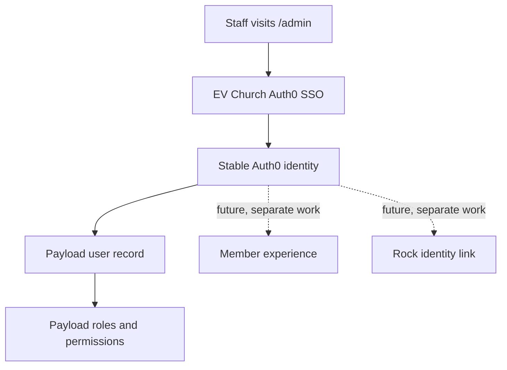
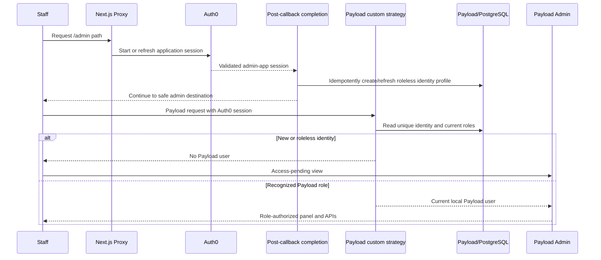

# Auth0 Payload Admin SSO - Plan

## Goal Capsule

- **Objective:** Replace Payload's local admin credential flow with EV Church Auth0 SSO while retaining Payload user records and authorization.
- **Product authority:** This plan owns authentication for the Payload admin panel only. Member sign-in, Rock identity linking, and member-facing access are surrounding future work, not active scope.
- **Open blockers:** None. The first administrator is established by a one-time direct PostgreSQL role promotion after their initial SSO login.
- **Authority order:** Product Contract requirements and session-settled decisions override the Planning Contract; KTDs override unit-local preferences.
- **Stop conditions:** Stop before schema writes or browser provisioning if the target database is not confirmed disposable. Stop if the Auth0 application cannot provide stable issuer, subject, and email claims.
- **Execution profile:** Authentication and authorization change; use test-first proof for identity, access, and redirect boundaries, then run full build and browser acceptance.
- **Tail ownership:** The implementation owner carries focused tests, migration verification, configured Auth0 browser smoke, PR creation, and CI follow-through.

---

## Product Contract

### Summary

The Payload admin panel will use EV Church's existing Auth0 tenant for sign-in. Auth0 will establish identity, while Payload will keep one local user record per admin identity and remain the source of truth for roles and permissions.

### Problem Frame

EV Church already uses Auth0 SSO and allows users to choose an established identity provider. Payload's separate email-and-password login would introduce another credential system for the same staff and would separate website administration from EV Church's existing sign-in experience.

The site is not yet in production, so existing development user accounts do not need migration or transitional password access.

### Key Decisions

- **Bridge Auth0 identity into Payload authorization.** (session-settled: user-directed — chosen over a separate Auth0 login followed by an independent Payload login: Auth0 should replace credential verification without replacing Payload user records or permissions.) Governs R1-R7.
- **Keep roles in Payload.** (session-settled: user-directed — chosen over Auth0-managed roles and a proposed new content-manager role: the existing Payload roles already express the required editorial permissions.) Governs R5-R7.
- **Limit this work to admin authentication.** The shared Auth0 tenant provides a future identity foundation, but member and Rock behavior will be designed separately. Governs R8-R9.

### Requirements

**Admin sign-in and identity**

- R1. A signed-out visitor to `/admin` is redirected immediately to EV Church Auth0 without first seeing the Payload password form.
- R2. After successful authentication, the user returns to the intended location within `/admin`; return destinations must remain within the EV Church site.
- R3. Auth0 is the sole verifier of admin login credentials, and Payload's email-and-password login, password reset, and password fallback are unavailable.
- R4. A successful Auth0 admin sign-in resolves to one local Payload `users` record using the stable Auth0 identity; the record is created on first sign-in when absent.
- R5. A newly created Payload user has no role and cannot access the admin panel until an existing Payload administrator assigns a role.

**Payload authorization**

- R6. Payload remains the source of truth for the existing `admin`, `content-lead`, and `editor` roles and for all permissions derived from those roles.
- R7. Role changes continue to happen inside the Payload admin panel under the existing role-management permissions; Auth0 roles or provider claims do not grant editorial permissions.

**Future identity boundary**

- R8. The Auth0 integration must preserve a stable identity boundary that can later support a member-facing application in the same tenant without granting member identities access to Payload admin.
- R9. Linking an Auth0 identity to a Rock person, requesting Rock access on behalf of a member, and building `/members` are not required for admin SSO.

**Session and failure behavior**

- R10. A failed, cancelled, or invalid Auth0 login does not create a Payload user or grant access to `/admin` and leaves the user with a safe way to retry.
- R11. A successfully authenticated user without a Payload role sees an access-pending message that tells them to ask an administrator for access.
- R12. Signing out ends access to the Payload admin application and returns the user away from protected admin content without requiring federated sign-out from Google or Microsoft.
- R13. The initial administrator is established by promoting the first roleless Payload user directly in PostgreSQL; automatic first-user elevation and permanent bootstrap configuration are unavailable.
- R14. Removing a user's final recognized Payload role revokes their admin page and API access on the next request, even while their Auth0 application session remains valid.
- R15. The system prevents ordinary role management from removing or deleting the final administrator; a narrowly controlled PostgreSQL recovery procedure exists only for accidental lockout.

### Actors

- A1. **EV Church staff user:** Signs in through the existing SSO choices and uses Payload according to their locally stored role.
- A2. **Auth0:** Verifies identity and returns the stable, linked identity already used by EV Church SSO.
- A3. **Payload:** Maintains the local user record, roles, permissions, and admin access decisions.
- A4. **Payload access administrator:** Verifies a staff access request and assigns or removes an existing Payload role without changing Auth0 identity data.
- A5. **Trusted deployment operator:** Performs the audited initial-admin bootstrap or emergency lockout recovery against a verified database target.

### Key Flows

- F1. First admin sign-in
  - **Trigger:** A1 visits `/admin` without an active admin session.
  - **Actors:** A1, A2, A3
  - **Steps:** The site redirects A1 to A2; A2 authenticates the user and returns a stable identity; A3 creates the missing local user without a role and denies panel access.
  - **Outcome:** The user sees an access-pending message and can ask an administrator to assign a Payload role.
  - **Covers:** R1-R5.
- F2. Returning admin sign-in
  - **Trigger:** A known A1 returns to `/admin` and needs to authenticate.
  - **Actors:** A1, A2, A3
  - **Steps:** A2 authenticates the user; A3 resolves the existing local record and its current roles.
  - **Outcome:** Existing role changes and permissions remain effective across sign-ins.
  - **Covers:** R1-R4, R6-R7.
- F3. Authentication failure
  - **Trigger:** Auth0 authentication is cancelled, fails, or returns an invalid result.
  - **Actors:** A1, A2, A3
  - **Steps:** A3 refuses admin access and does not provision a local user; A1 can safely retry the SSO flow.
  - **Outcome:** No partial or unauthorized Payload identity is created.
  - **Covers:** R10.
- F4. Admin sign-out
  - **Trigger:** A1 chooses to sign out of Payload admin.
  - **Actors:** A1, A2, A3
  - **Steps:** The admin application ends its usable session and redirects A1 away from protected admin content.
  - **Outcome:** A1 cannot continue using Payload admin from the ended session, while upstream Google or Microsoft sessions are not deliberately terminated.
  - **Covers:** R12.
- F5. Administrator grants access
  - **Trigger:** A roleless SSO user asks an existing Payload administrator for access.
  - **Actors:** A1, A3, A4
  - **Steps:** A4 verifies the requester and assigns one of the existing Payload roles to the local user record; the user chooses “Check access again” or makes another admin request using the existing Auth0 session.
  - **Outcome:** Payload permits panel access according to the newly assigned role without requiring a new Auth0 login.
  - **Covers:** R5-R7, R11.
- F6. Initial administrator bootstrap
  - **Trigger:** The first trusted operator has completed SSO and has a roleless Payload user record.
  - **Actors:** A1, A3, A5
  - **Steps:** A5 promotes that specific record to `admin` directly in PostgreSQL; the user signs in again through Auth0.
  - **Outcome:** The first administrator can manage all later role assignments inside Payload.
  - **Covers:** R13.
- F7. Administrator revokes access
  - **Trigger:** A4 removes a user's final recognized Payload role.
  - **Actors:** A1, A3, A4
  - **Steps:** A4 saves the role change; A1 makes another admin page or API request with the same Auth0 application session.
  - **Outcome:** Payload denies the request immediately and routes the user to the access-pending experience without requiring Auth0 logout or re-login.
  - **Covers:** R6-R7, R14-R15.

### Acceptance Examples

- AE1. **Covers R1-R5, R11.** Given an EV Church SSO user has never used Payload, when they visit `/admin` and complete Auth0 login, then one roleless Payload user is created, panel access is denied, and the user is told to ask an administrator for access.
- AE2. **Covers R5-R7, R11.** Given an administrator assigns the new user the `editor` role, when that user signs in again, then the same Payload record opens the panel with editor permissions.
- AE3. **Covers R4, R6-R7.** Given an existing Payload user has been promoted from `editor` to `content-lead`, when that person signs in again through either linked Auth0 provider, then Payload resolves the same user record and applies `content-lead` permissions.
- AE4. **Covers R2.** Given a user starts sign-in from a nested admin page, when authentication succeeds, then they return to that safe admin destination rather than an external or untrusted URL.
- AE5. **Covers R3.** Given a user knows an email address previously stored by Payload, when they try to use Payload's local login or password-reset operations, then those operations cannot authenticate the user.
- AE6. **Covers R10.** Given the user cancels Auth0 login, when control returns to the site, then `/admin` remains protected, no Payload user is created, and the user can retry.
- AE7. **Covers R8-R9.** Given the same Auth0 tenant later serves a member-facing application, when a member authenticates outside the admin application, then that authentication alone does not create a Payload admin user or grant access to `/admin`.
- AE8. **Covers R13.** Given the first trusted user has a roleless record, when an operator promotes only that record to `admin` in PostgreSQL and the user signs in again, then the panel opens with administrator permissions and later role changes can happen inside Payload.
- AE9. **Covers R14.** Given an authenticated admin user has their final recognized Payload role removed, when they make the next admin page or mutation API request with the same Auth0 session, then access is denied and protected content is not served from cache.
- AE10. **Covers R15.** Given only one Payload administrator remains, when an ordinary admin operation attempts to remove that role or delete that user, then the operation fails without changing the final administrator.

<!-- ce-section: work-relationships -->
### How This Work Fits Together

This plan owns Payload admin SSO. The broader identity direction below is contextual and may be revised when each area is planned.

- **Payload admin SSO:** Uses Auth0 for identity and Payload for authorization.
  - **Enables future member sign-in:** A later member application can share the Auth0 tenant while maintaining a separate authorization boundary.
  - **Enables future Rock linking:** A later flow can associate the stable Auth0 identity with a Rock person.
    - **Depends on future consent and token design:** Accessing Rock on behalf of a member requires its own requirements and security decisions.
  - **Can proceed independently of `/members`:** Admin SSO delivers value before member-facing accounts exist.

### Scope Boundaries

**Included**

- Immediate Auth0 redirect and safe return behavior for `/admin`.
- Roleless local Payload user provisioning and lookup from an Auth0 identity.
- Preservation of existing Payload roles, permissions, and administrator-controlled role assignment.
- A documented one-time PostgreSQL promotion for the first administrator.
- Removal of local Payload password authentication and a target-safe one-time procedure for removing disposable development users before bootstrap.

**Deferred for later**

- A `/members` page or any member-facing authenticated experience.
- Auth0-to-Rock person matching.
- Obtaining or using Rock access on behalf of an authenticated member.
- Member profile, consent, account recovery, and data-access behavior.

### Dependencies and Assumptions

- EV Church's Auth0 tenant and application configuration are available for the site environments.
- Auth0 already offers the intended provider choices and links a person's provider identities into one stable Auth0 user.
- Only the admin authentication context established by this feature can provision a Payload admin user; sharing the tenant does not make every future Auth0 application an admin authority.
- Existing Payload user data is development-only and can be removed without migration or rollback requirements.
- Direct PostgreSQL promotion is a one-time deployment operation for the initial administrator, not an ongoing authorization path.
- Admin logout clears this application's Auth0 cookie and the Auth0 tenant SSO session, but does not request federated logout from Google or Microsoft. Existing sessions in other tenant applications are not revoked; their next SSO behavior is owned by those applications.
- The admin application uses an eight-hour absolute session limit and a two-hour inactivity limit. Offboarding or incident response removes Payload roles immediately; Auth0 disablement alone does not revoke an already-issued application cookie before its limit.

### Sources and Research

- `src/collections/Users.ts` — current Payload authentication collection and role model; its default `editor` role must be removed for roleless provisioning.
- `src/access/roles.ts` — current access decisions based on the local Payload user.
- `payload.config.ts` — Payload admin is bound to the `users` collection.
- `src/app/(payload)/admin/[[...segments]]/page.tsx` — generated Payload admin route at `/admin`.
- [Payload custom authentication strategies](https://payloadcms.com/docs/authentication/custom-strategies) — supported external authentication strategy returning a Payload user document.
- [Auth0 Next.js login quickstart](https://auth0.com/docs/quickstart/webapp/nextjs) — application callback, login, and logout behavior for Next.js.

---

## Planning Contract

**Product Contract preservation:** Session-settled product decisions remain unchanged. The non-interactive review added explicit revocation and final-administrator safety outcomes that make the agreed Payload authorization model operable.

### Key Technical Decisions

- KTD1. **Use one Auth0 application session and no Payload login session.** (session-settled: user-directed — chosen over a separate Auth0 login followed by an independent Payload login: Auth0 replaces credentials while Payload supplies authorization.) Use `@auth0/nextjs-auth0` `4.26.0`, the Next.js 16 proxy integration, and a Payload custom strategy. Admin logout clears both the admin application's cookie and the Auth0 tenant SSO session, but never requests federated Google or Microsoft logout. Governs R1-R4, R10-R12.
- KTD2. **Key local identities by a unique issuer-and-subject identity value.** Never match, merge, bootstrap, or authorize by email. The verified email and display name are profile data only. Governs R4-R5, R8, R10.
- KTD3. **Provision once after the successful admin callback; keep authentication read-only.** A dedicated post-callback completion route validates the admin-app session and idempotently creates a roleless record when absent. The Payload custom strategy performs no writes and returns a user only when that existing record has a recognized local role. Ordinary `payload.auth()` calls can therefore never provision accounts as a side effect. Governs R4-R7, R10-R11.
- KTD4. **Keep authorization current on every request.** Resolve the local record and roles from Payload for each authenticated request; never copy roles into Auth0 claims or a long-lived session snapshot. Governs R5-R7.
- KTD5. **Use Proxy only for the Auth0 session perimeter.** `src/proxy.ts` mounts Auth0 routes, maintains rolling sessions, and redirects signed-out `/admin` paths. Database provisioning and authorization stay in server-side application and Payload code. Redirect origins come only from configured canonical URLs, never `Host` or forwarding headers. Governs R1-R2, R10-R12.
- KTD6. **Bootstrap the first administrator with one verified PostgreSQL transaction.** (session-settled: user-directed — chosen over an environment allowlist, retaining a local-password admin, or automatic first-user elevation: the initial trusted identity will be promoted once after its roleless record exists.) Select the exact identity key, assert one row, insert the `admin` role, and verify the result. Governs R13.
- KTD7. **Use a separate Auth0 application for admin access within the shared tenant.** Bind session validation to the exact configured issuer, admin client, and session cookie. Future member and Rock clients may share the tenant but their sessions cannot provision or authenticate a Payload admin user. Governs R8-R9.
- KTD8. **Use one request-bound Auth0 session adapter.** Proxy, completion, pending UI, and the Payload strategy consume the same SDK-backed adapter. Strategy authentication uses the headers supplied by Payload rather than ambient `cookies()`, so REST, GraphQL, custom admin APIs, jobs, and server rendering evaluate the same request identity. Governs R1-R5, R8, R10-R11.
- KTD9. **Treat role removal as the immediate revocation control.** Admin sessions have an eight-hour absolute lifetime and two-hour inactivity lifetime, but every protected request reloads current Payload roles. Offboarding removes roles and disables the Auth0 identity as coordinated actions; either action alone is not documented as a complete emergency response. Governs R6-R7, R12, R14-R15.

### High-Level Technical Design

### Implementation Constraints

- Request only `openid profile email`; do not request a Rock audience or `offline_access` for this feature.
- Consume only the SDK-validated server session. Do not decode ID tokens manually, trust forwarded identity headers, or store tokens in browser storage.
- Accept sessions only from the configured admin issuer, client, and SDK session cookie; a session from another application in the shared tenant fails closed.
- Construct return destinations from the incoming `/admin` pathname and query. Reject absolute, protocol-relative, malformed, encoded external, and non-admin destinations.
- Derive absolute callback and logout destinations from configured canonical application URLs, never request-controlled host or forwarding headers.
- Keep `src/app/(payload)/layout.tsx` and `src/app/(payload)/admin/[[...segments]]/page.tsx` generated and unmodified.
- Make first-login provisioning idempotent with a database unique constraint and refetch-on-conflict handling.
- Encode issuer and subject collision-safely within database length limits and keep the resulting identity immutable. Retry/refetch only when the identity uniqueness constraint wins a concurrent race; email conflicts fail closed.
- Make roles optional with no default. A missing or unknown role is never editor-equivalent.
- Use a generic callback or provisioning error screen. Do not expose provider errors, claims, tokens, or cookies.
- Store only the identity key and necessary profile fields; never persist access, ID, or refresh tokens or provider metadata.
- Keep protected, pending, callback-error, and logout responses private and non-cacheable; do not cache roles in Auth0 claims, Payload JWTs, React caches, or client state.
- Require non-placeholder Payload and Auth0 secrets in deployed runtime. Build-time imports may remain side-effect-free, but an authentication request with missing configuration must fail closed without revealing secret material.
- Preserve Payload-supported exact-origin CSRF/origin protection for mutation endpoints and secure, HTTP-only, host-only, SameSite Auth0 cookies.
- Because Payload's built-in CSRF checks are tied to its local cookie strategy, require the Auth0 request adapter to enforce the configured canonical `Origin` and a documented `Sec-Fetch-Site` fallback before accepting cookie-authenticated state-changing requests.
- Provision only inside Auth0 SDK `onCallback`, after the SDK validates the one-time callback transaction. Do not expose a separate completion endpoint or accept provisioning from ordinary authenticated requests.
- Keep an explicit required, unique, indexed email profile field when local strategy fields are disabled. Preserve the existing email column, but remove password, reset-token, API-key, and Payload-session credential paths.
- The production admin Auth0 application must use approved EV Church identity connections, MFA or equivalent strong assurance for privileged staff, and the tenant's brute-force and breached-credential protections. Any exception is a recorded deployment risk.

### Risks and Dependencies

- **Roleless privilege leakage:** `isEditor` and `publishedOnly` currently trust any Payload user. Harden them before enabling provisioning and audit all similar checks.
- **Implicit collection access:** `users` lacks collection CRUD rules and `media` lacks mutation rules. Add explicit role-aware access so an unapproved identity cannot reach APIs through an overlooked default.
- **Identity collision:** Payload email is unique, while email is not the identity key. A different identity presenting an existing email must fail closed and must not inherit the existing record.
- **Concurrent provisioning:** Parallel requests can race after the initial lookup. The unique identity constraint must decide the winner.
- **Shared-tenant logout:** Admin logout must clear the Auth0 application and tenant SSO session without requesting federated Google or Microsoft logout; document the effect on future sign-in to other tenant applications.
- **Provisioning side effects:** Payload invokes authentication from many surfaces. Keeping the strategy read-only prevents an ordinary REST, GraphQL, admin, or job request from creating a user.
- **Session revocation:** Auth0 account disablement does not introspect and revoke an existing encrypted application cookie on every request. Short bounded sessions limit exposure; immediate access removal is the Payload role-removal path and must be part of offboarding.
- **Final-admin lockout:** Ordinary user deletion or role removal must not eliminate the last administrator. The rollout runbook carries an audited database recovery path distinct from automatic bootstrap.
- **Request-context drift:** Ambient cookies can authenticate the wrong request in server code. Route all consumers through the request-bound session adapter and prove parity across HTTP surfaces.
- **Destructive development cleanup:** Existing user rows are disposable only because the site is not in production, but deletion also affects roles, sessions, preferences, and document locks. Keep cleanup out of the durable schema migration and require a confirmed disposable target plus snapshot or explicit disposability attestation.
- **External configuration:** Each environment needs an Auth0 Regular Web Application, callback/logout allowlists, web origin, and the documented secrets before browser acceptance can run.
- **Roleless account abuse:** Only the dedicated admin client may provision; its completion route is rate-limited and audited. Stale roleless records use a small operational cleanup procedure, not a new account-lifecycle subsystem.

### System-Wide Impact

- **Authentication entry points:** `/admin`, Payload REST and GraphQL auth evaluation, existing `/api/admin/*` handlers, jobs that call `payload.auth`, and the new callback-completion route all share one request-bound session interpretation.
- **Authorization propagation:** Roles are read from PostgreSQL on each protected request. Granting or removing a role changes the next request without waiting for an Auth0 re-login or cached token expiry.
- **Data writes:** Only the successful post-callback completion route may create or refresh the local identity profile. The custom strategy is read-only; all role writes remain Payload-admin operations except the audited first-admin bootstrap.
- **Failure isolation:** Invalid claims, cross-client sessions, email collisions, database errors, and callback failures create no privileged record and return generic, non-cacheable retry or pending responses.
- **External clients:** A later member or Rock application uses its own Auth0 client in the same tenant and cannot satisfy the admin application's session boundary.

### Sequencing

1. Harden Payload authorization for roleless identities.
2. Add the Auth0 application-session perimeter and safe redirect helpers.
3. Add identity persistence, callback provisioning, read-only resolver, and custom strategy.
4. Add pending-access, failure, and Auth0-aware logout UX.
5. Verify the one-time bootstrap and complete configured browser acceptance.

### Sources and Research

- [Auth0 Next.js SDK quickstart](https://auth0.com/docs/quickstart/webapp/nextjs) and [v4 migration guide](https://github.com/auth0/nextjs-auth0/blob/main/V4_MIGRATION_GUIDE.md) — current App Router routes and environment contract.
- [Auth0 SDK changelog](https://github.com/auth0/nextjs-auth0/blob/main/CHANGELOG.md) — Next.js 16 support and security fixes require a current v4 release.
- [Payload custom strategies](https://payloadcms.com/docs/authentication/custom-strategies) and [collection access](https://payloadcms.com/docs/access-control/collections) — custom authentication and Admin Panel gating.
- [Payload custom views](https://payloadcms.com/docs/custom-components/custom-views) and [root components](https://payloadcms.com/docs/custom-components/root-components) — supported admin view replacement and the additive nature of `beforeLogin`.
- [Payload Local API access](https://payloadcms.com/docs/local-api/access-control) — server-side provisioning must use explicit access override with verified input.
- `docs/solutions/integration-issues/phase3-payload-collections-blocks-globals.md` — preserve the established three-role authorization model.
- `docs/solutions/build-errors/tailwind4-payload3-layout-shell-build-fixes.md` — preserve Payload's generated layout shell.
- `docs/solutions/developer-experience/payload-dev-server-database-target-safety.md` — confirm database safety before schema or browser work.

---

## Implementation Units

### U1. Harden the roleless authorization boundary

- **Goal:** Make a roleless local identity unable to access admin content, drafts, user management, or mutation APIs.
- **Requirements:** R5-R7, R11; F1-F2, F5; AE1-AE3.
- **Dependencies:** None.
- **Files:** `src/access/roles.ts`, `src/access/roles.test.ts`, `src/collections/Users.ts`, `src/collections/Users.test.ts`, `src/collections/Media.ts`.
- **Approach:** Replace authenticated-user checks with explicit membership in `admin`, `content-lead`, or `editor`. Add the collection-level Admin Panel gate and explicit user/media CRUD access. Keep role updates admin-only and prevent ordinary updates or deletion from eliminating the final administrator. Audit the remaining collections and globals for any direct `Boolean(user)` authorization assumptions.
- **Execution note:** Start with failing tests that prove a roleless user currently receives editor-like access.
- **Patterns to follow:** Preserve the hierarchy in `src/access/roles.ts` and the explicit mutation access used by `src/collections/Pages.ts` and synced collections.
- **Test scenarios:**
  - Covers AE1. A roleless user is not an editor, cannot see drafts, and fails the Admin Panel gate.
  - Each recognized role receives the existing hierarchy without widening permissions.
  - A roleless user cannot enumerate or mutate users and cannot mutate media.
  - An editor or content lead cannot assign roles or self-escalate; an admin can assign existing roles.
  - Removing the last recognized role revokes authorization on the next request.
  - Removing or deleting the sole remaining administrator fails atomically; removing one of multiple administrators succeeds.
- **Verification:** Focused access and collection tests pass, and an audit finds no remaining any-authenticated-user shortcut in the admin authorization path.

### U2. Add the Auth0 session perimeter

- **Goal:** Establish Auth0 v4 routes and immediate, safe `/admin` redirection without modifying generated Payload files.
- **Requirements:** R1-R3, R8-R10, R12; F1-F4; AE4-AE7.
- **Dependencies:** U1.
- **Files:** `package.json`, `package-lock.json`, `.env.example`, `src/auth/auth0-client.ts`, `src/auth/auth0-session.ts`, `src/auth/auth0-session.test.ts`, `src/auth/safe-admin-return.ts`, `src/auth/safe-admin-return.test.ts`, `src/proxy.ts`, `src/proxy.test.ts`.
- **Approach:** Pin `@auth0/nextjs-auth0` `4.26.0`. Configure the server client for `openid profile email`, an eight-hour absolute and two-hour inactivity application session, safe errors, exact admin issuer/client binding, and no Rock audience. Implement the request-bound session adapter, adapter-level mutation-origin enforcement, and canonical-origin return helper. Delegate `/auth/*` to the SDK and guard `/admin` in the Next.js 16 proxy while preserving Auth0 response cookies and headers.
- **Execution note:** Prove redirect normalization and fail-closed configuration with unit tests before exercising an external Auth0 tenant.
- **Patterns to follow:** Keep environment documentation in `.env.example`; use a pure helper for return-path normalization so hostile inputs can be tested without network calls.
- **Test scenarios:**
  - Covers AE4. `/admin`, nested admin paths, and their query strings produce only local admin return destinations.
  - Absolute URLs, protocol-relative URLs, backslashes, encoded bypasses, callback routes, and non-admin paths fall back to `/admin`.
  - A signed-out admin request redirects immediately to `/auth/login`; an existing session continues without losing SDK cookies or headers.
  - `/auth/login`, `/auth/callback`, `/auth/logout`, and SDK asset exclusions do not enter a redirect loop.
  - A session for another Auth0 client in the shared tenant fails closed.
  - Request-controlled host and forwarding headers cannot change callback, logout, or return origins.
  - Hostile-origin mutation requests fail even with a valid Auth0 cookie; the documented same-site fallback covers clients that omit `Origin`.
  - Session cookies have the required secure attributes and stop working after absolute expiry, inactivity expiry, logout, or session-secret rotation.
  - Missing, placeholder, or invalid server configuration fails without leaking secrets.
- **Verification:** Proxy and Auth0 client tests pass; the application builds on Next.js 16 with the pinned SDK.

### U3. Persist Auth0 identities and authenticate approved Payload users

- **Goal:** Create one roleless local identity on first valid SSO and return a Payload user only after a local role is assigned.
- **Requirements:** R3-R11; F1-F3, F5; AE1-AE3, AE5-AE7.
- **Dependencies:** U1, U2.
- **Files:** `src/auth/auth0-client.ts`, `src/auth/auth0-client.test.ts`, `src/auth/auth0-identity.ts`, `src/auth/auth0-identity.test.ts`, `src/auth/provision-auth0-user.ts`, `src/auth/provision-auth0-user.test.ts`, `src/auth/resolve-auth0-user.ts`, `src/auth/auth0-payload-strategy.ts`, `src/auth/auth0-payload-strategy.test.ts`, `src/collections/Users.ts`, `payload.config.ts`, `src/migrations/index.ts`, `src/migrations/<timestamp>_auth0_admin_sso.ts`, `src/migrations/<timestamp>_auth0_admin_sso.json`, `src/migrations/<timestamp>_auth0_admin_sso.test.ts`, `src/payload-types.ts` (generated; do not hand-edit).
- **Approach:** Add one immutable, collision-safe unique identity value derived from verified issuer and subject and an explicit required, unique email profile field. Remove the default/required role. Disable Payload's local strategy and register the Auth0 strategy. The SDK-validated `Auth0Client.onCallback` provisions and refetches only after an identity-constraint race; no separate completion route exists. The strategy resolves only by identity, performs no writes, and returns only users with recognized current roles.
- **Execution note:** Implement identity resolution and strategy behavior test-first; generate the migration only against a confirmed disposable database.
- **Patterns to follow:** Register migrations through `src/migrations/index.ts`; preserve `payload.auth({ headers })` callers by integrating at the auth collection boundary.
- **Test scenarios:**
  - Covers AE1. A first valid completion creates exactly one roleless record and the subsequent strategy returns no authorized Payload user.
  - Covers AE2-AE3. Assigning, changing, or removing a local role changes the same identity's authorization on the next request without requiring a new Auth0 login.
  - Missing session, issuer, subject, email, or verified profile requirements create nothing and authenticate nobody.
  - A changed profile with the same identity does not create a second record or modify roles.
  - A different identity presenting an existing email fails closed and never inherits that account.
  - Concurrent first requests produce one record through unique-conflict recovery.
  - Callback errors, missing sessions, invalid verified-profile claims, and provisioning failures create no privileged session and redirect to a generic error; only the SDK-validated callback can provision.
  - Ordinary `payload.auth()` calls never create or modify users, including REST, GraphQL, `/api/admin/*`, and job contexts.
  - Auth0 role or app metadata claims never populate Payload roles.
  - Payload password login, reset, refresh, API-key, stale Payload cookie, and JWT paths cannot establish access.
  - The migration preserves email as an explicit profile field, removes local credential columns and paths, adds the identity constraint, leaves roles optional with no default, and rolls back cleanly under an induced failure; it does not delete development users.
- **Verification:** Focused resolver, strategy, collection, and migration tests pass; generated types reflect optional roles and immutable identity.

### U4. Add pending-access and Auth0 logout experiences

- **Goal:** Give unapproved users a stable access-pending state and make admin logout end the Auth0 application session.
- **Requirements:** R10-R12; F1, F3-F5; AE1-AE2, AE5-AE6.
- **Dependencies:** U2, U3.
- **Files:** `src/components/admin/Auth0PendingAccess.tsx`, `src/components/admin/Auth0PendingAccess.test.tsx`, `src/components/admin/Auth0LogoutButton.tsx`, `src/components/admin/Auth0LogoutButton.test.tsx`, `src/app/(frontend)/auth/pending/page.tsx`, `src/app/(frontend)/auth/error/page.tsx`, `payload.config.ts`, `src/app/(payload)/admin/importMap.js` (generated; do not hand-edit).
- **Approach:** Use a dedicated non-cacheable pending route and only Payload 3.80-supported component/view slots verified against the installed types; `beforeLogin` is additive and must not be treated as a replacement. Callback completion routes roleless users to `/auth/pending`, authorized users to their safe intended admin destination, and invalid sessions back through sign-in. Later roleless `/admin` requests must resolve to pending without exposing Payload's login form or looping. Check-again loads fresh roles, returns to the safe destination on success, and otherwise stays pending with an announced status. Replace the Payload-only logout action with full navigation to the SDK logout route and the canonical `/` destination; clear the tenant SSO session without federated provider logout.
- **Patterns to follow:** Use `payload.config.ts` custom-component paths and regenerate the Payload import map. Match existing EV Church page styling without broad visual changes.
- **Test scenarios:**
  - Covers AE1. A valid roleless identity sees the pending message and never sees admin content or a Payload password form.
  - Covers AE2. Check-again admits the same session after an administrator assigns a role.
  - Check-again disables while loading, announces unchanged/error status, preserves the intended safe admin destination, and remains retryable.
  - Covers AE5-AE6. Callback cancellation, invalid state, or provisioning failure shows a generic retry path and creates no privileged record.
  - Cancellation or invalid transaction offers Start sign-in again; transient completion failure offers Try again and Sign out; repeated failure directs the user to an administrator without exposing provider detail.
  - Pending, error, and logout responses are private/no-store and contain no claims or provider errors.
  - Logout clears the admin application and Auth0 tenant SSO sessions, lands outside `/admin`, and does not request federated Google or Microsoft logout.
  - Returning to `/admin` after logout requires Auth0 SSO again rather than silently restoring a Payload session.
  - Pending and error routes have a programmatic heading, route-arrival focus, keyboard-operable named actions, visible focus, and announced status changes. Mobile and desktop acceptance proves readable content, visible actions, and no horizontal overflow.
- **Verification:** Component tests pass, the import map resolves both overrides, and the complete admin shell still renders through Payload's generated RootLayout after authorization.

### U5. Document and verify the initial-admin rollout

- **Goal:** Make the one-time PostgreSQL promotion and environment rollout safe, auditable, and reproducible.
- **Requirements:** R13; F6; AE8.
- **Dependencies:** U3, U4.
- **Files:** `docs/runbooks/auth0-payload-admin-sso.md`, `.env.example`.
- **Approach:** Document per-environment Auth0 applications, approved connections and MFA posture, secret-store locations, least-privilege access, rotation/emergency revocation, callback/logout allowlists, database environment fingerprinting, write quiescing, development cleanup before bootstrap when preflight finds an existing administrator, first roleless login, exact identity verification, and transactional insertion into the normalized `users_roles` table. The bootstrap transaction must assert one matching identity, zero current roles, no existing admin, insert exactly one deterministic `admin` row, capture it for rollback, and verify one administrator. Separately document destructive development-user cleanup with preflight counts across users, roles, sessions, preferences, and locks, plus a snapshot or explicit disposable-database attestation. Add a distinct emergency recovery transaction for final-admin lockout, coordinated Auth0-disable plus Payload-role-removal offboarding, and a small stale-roleless cleanup procedure. Record operator, timestamp, target fingerprint, identity, pre/post counts, and inserted row without tokens or secrets; rehearse on a disposable database before rollout. Keep future member/Rock configuration absent.
- **Test expectation:** None — this unit documents an operational procedure; U3's migration tests and configured browser acceptance verify its technical prerequisites.
- **Verification:** A reviewer can identify the correct target record by immutable identity, predict every write before it runs, verify exactly one administrator afterward, safely recognize an already-completed rerun, and roll back only the captured bootstrap assignment before ordinary role management begins. The reviewer can also follow offboarding, secret rotation, final-admin recovery, development cleanup, and stale-roleless cleanup without exposing tokens or widening the feature into a member lifecycle system.

---

## Verification Contract

| Gate | Applies to | Required evidence |
|---|---|---|
| Focused unit tests | U1-U4 | New access, proxy, resolver, strategy, migration, and component tests pass. |
| Full test suite | U1-U4 | `npm test` passes without weakening existing admin API or content access assertions. |
| Payload generation and production build | U2-U4 | `npm run build` regenerates types and completes the Next.js build with the Auth0 SDK integration. |
| Migration and rollout safety | U3, U5 | Empty/disposable migration tests, induced rollback, identity uniqueness, zero-row roleless state, target fingerprint, cleanup preflight, bootstrap one-row assertions, captured rollback row, and audit evidence are verified. |
| HTTP authorization matrix | U1-U4 | Roleless, unknown-role, revoked, wrong-client, hostile-origin, missing-claim, and invalid-callback requests fail across Payload REST/GraphQL, `/api/admin/*`, auth endpoints, and representative jobs; role grant/removal applies on the next request. |
| Configured browser acceptance | U2-U5 | With a safe database and Auth0 credentials, signed-out, roleless, promoted, authorized, revoked, failure, nested-return, check-again, and logout/replay flows match AE1-AE8. |
| Security regression audit | U1-U4 | No email identity matching, client token storage, Auth0-derived roles, arbitrary/request-host origins, generated-layout edits, strategy writes, cached authorization, placeholder production secrets, or roleless mutation path remains. |

---

## Definition of Done

- U1 is done when roleless identities have no editor, draft, user-management, media-mutation, or panel access and the existing three-role hierarchy remains intact.
- U2 is done when Auth0 v4 owns the admin application session, `/admin` redirects safely, and all required environment settings are documented.
- U3 is done when the SDK-validated callback creates one roleless identity, the strategy is demonstrably read-only, approved roles are loaded from Payload on every request, local credential paths fail, and the migration is registered and tested.
- U4 is done when pending, retry, check-again, and Auth0-aware logout experiences work accessibly at mobile and desktop widths without modifying generated Payload routes or layouts.
- U5 is done when development cleanup and first-admin promotion are separate target-safe procedures, the promotion is transactional and one-row, rollback evidence is captured, and stale roleless records have an operational retention path.
- The full test suite and production build pass.
- Configured browser acceptance is completed against a confirmed disposable database, or missing external credentials are recorded as an explicit deployment verification requirement without fabricating a pass.
- Abandoned experiments, obsolete local-login UI, temporary debug output, sensitive logs, and unused Auth0 claims are absent from the final diff.
