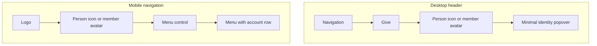
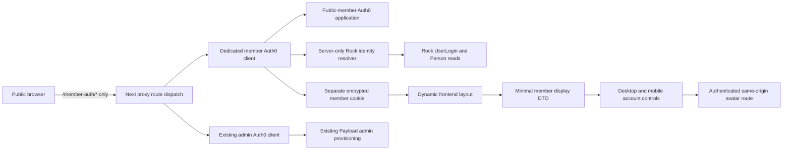
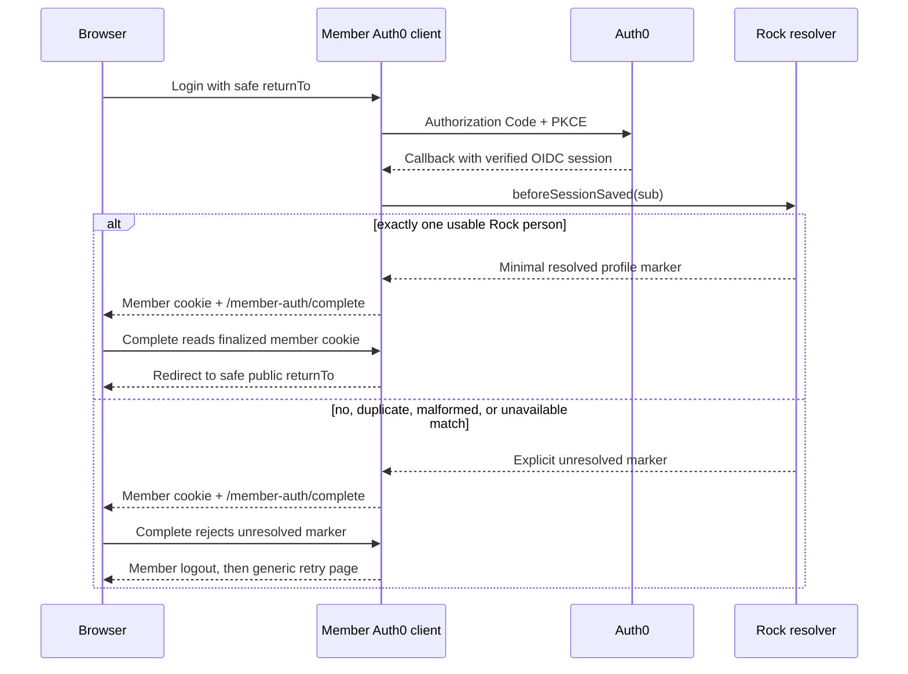
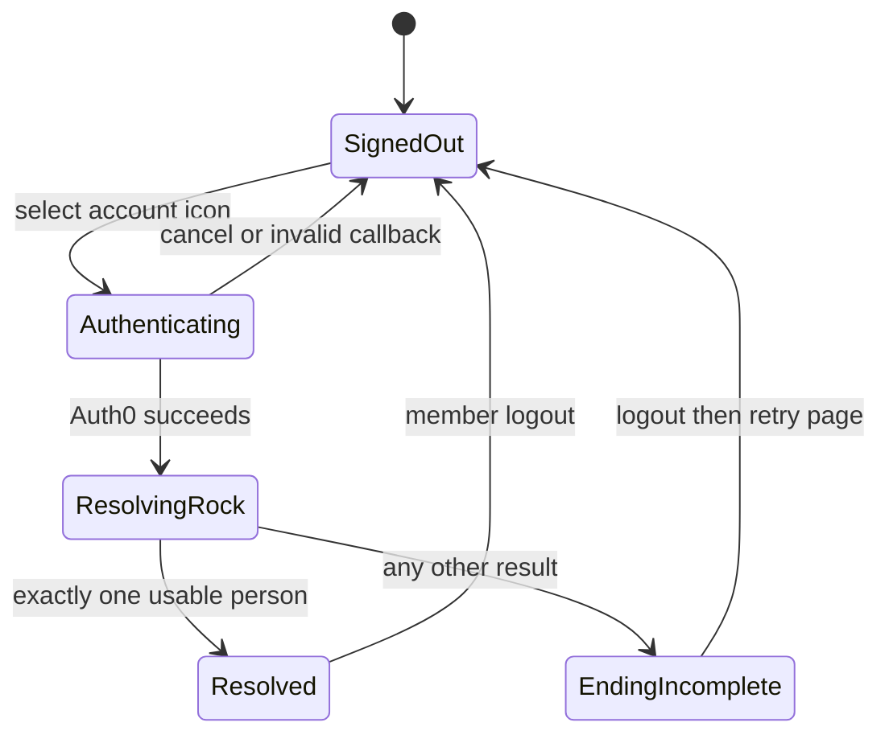

# Public Member Authentication - Plan

## Goal Capsule

- **Objective:** Establish public member sign-in, exact Rock person resolution, and a minimal account popover as the identity foundation for later connect-group functionality.
- **Product authority:** This plan owns public member authentication and profile presentation only. Connect-group rosters, member directories, leader resources, and their authorization rules are surrounding work, not active scope.
- **Authority order:** Product Contract decisions and requirement IDs are authoritative; the Planning Contract below chooses implementation details without changing that scope.
- **Execution profile:** Implement in dependency order, preserve the existing Payload-admin Auth0 path, and ship behind configuration readiness rather than inventing an identity fallback.
- **Open blockers:** None for implementation. Production enablement is gated on proving one real member's Auth0 `sub` is the exact value stored by Rock and on confirming least-privilege Rock read access.
- **Stop conditions:** Stop and surface a blocker if Rock cannot resolve exactly one person from the configured Auth0 subject, if the deployed Rock contract differs from the explicit adapter contract, or if the change would require sharing the admin Auth0 client/session. Never substitute email matching.
- **Tail ownership:** The implementation workflow owns code, tests, browser verification, documentation, review, and the pull request. Auth0/Rock production-console configuration remains an operator gate documented by the runbook.

---

## Product Contract

### Summary

The public website will let members authenticate through Auth0, resolve the exact corresponding Rock person, and access a minimal avatar popover containing their name, email, and logout action.

### Problem Frame

The existing website gives connect-group leaders access to group information and resources.
The replacement website cannot eventually take over that role without first establishing a trustworthy member identity linked to Rock.
The current Auth0 integration serves Payload administrators only, and the public header has no member sign-in or account experience.

### Key Decisions

- **Match Auth0 to Rock through the associated identity.** (session-settled: user-directed — chosen over email matching: Rock's person record carries the identity intended to match the Auth0 ID.) Governs R3-R5.
- **Use the minimal identity popover.** (session-settled: user-directed — chosen over a connection-status card or menu-ready account panel: this phase establishes identity without implying a member portal.) Governs R6-R8.
- **End incomplete member sessions.** (session-settled: user-directed — chosen over keeping an Auth0-only session with degraded profile data: a member is signed in only when the Rock profile resolves.) Governs R4, R10-R11.
- **Expose the account in both mobile surfaces.** (session-settled: user-directed — chosen over header-only or drawer-only placement: members should find the account from either mobile entry point.) Governs R8.

### Requirements

**Member authentication and identity**

- R1. A signed-out visitor can start member authentication from a neutral person icon next to Give on desktop, beside the mobile menu control, or from the mobile menu.
- R2. Successful Auth0 authentication creates a public website member session that is separate from the Payload admin application and grants no Payload role or admin access.
- R3. The website resolves the member by matching the authenticated Auth0 identity to the associated identity on a Rock person; email is never an identity key or fallback match.
- R4. A member is considered signed in only after the exact Rock person, name, and email have been resolved.
- R5. Repeated sign-ins for the same Auth0 identity resolve the same Rock person unless the upstream associated identity changes.

**Profile and navigation**

- R6. A signed-in member sees the Rock profile photo as the account avatar, with initials or a neutral avatar when Rock has no usable photo.
- R7. Selecting a signed-in avatar or the mobile account row opens the minimal identity popover with the member's avatar, name, email, and logout action.
- R8. Desktop places the avatar beside Give, while mobile presents it both beside the menu control and as an account row inside the menu.
- R9. The account trigger and popover remain usable with keyboard navigation, touch, and assistive technology at the supported desktop and mobile layouts.

**Session completion and failure**

- R10. Logging out ends the usable public member session and returns the account surfaces to their signed-out state.
- R11. If authentication succeeds but the Rock person or required profile cannot be resolved, the website ends the member session, reveals no Rock data, and presents a safe retry path.
- R12. Cancelled, failed, or invalid authentication leaves the visitor signed out and provides a safe way to retry.

### Actors

- A1. **Public member:** Uses the website account control and expects it to represent their own Rock person.
- A2. **Auth0:** Authenticates the member and supplies the stable identity used for the Rock association.
- A3. **Rock:** Owns the person record, associated identity, name, email, and profile photo.
- A4. **Public website:** Maintains the member application session, resolves the Rock profile, and renders account state without granting Payload access.

### Key Flows

- F1. First or returning member sign-in
  - **Trigger:** A1 selects a signed-out person icon.
  - **Actors:** A1, A2, A3, A4
  - **Steps:** A4 starts authentication with A2; A2 returns the authenticated identity; A4 resolves the matching A3 person and profile before completing the member session.
  - **Outcome:** The account controls show the member's avatar and open the minimal identity popover.
  - **Covers:** R1-R8.
- F2. Member profile access
  - **Trigger:** A signed-in A1 selects their avatar on desktop or mobile.
  - **Actors:** A1, A4
  - **Steps:** A4 opens the account popover and presents the resolved profile fields and logout action.
  - **Outcome:** A1 can confirm the active account or log out without entering a member portal.
  - **Covers:** R6-R10.
- F3. Incomplete profile resolution
  - **Trigger:** A2 authenticates A1, but A4 cannot resolve the exact A3 person or required profile.
  - **Actors:** A1, A2, A3, A4
  - **Steps:** A4 never completes or retains a usable member session. It may persist a transient unresolved marker only so the completion route can immediately pass through member logout before presenting a safe retry path.
  - **Outcome:** A1 remains signed out and no unrelated Rock person can be displayed.
  - **Covers:** R3-R4, R11-R12.
- F4. Member logout
  - **Trigger:** A1 selects Log out from the profile popover.
  - **Actors:** A1, A2, A4
  - **Steps:** A4 ends the usable member application session from the identity popover and restores the signed-out account controls.
  - **Outcome:** Protected member identity is no longer available from the ended session.
  - **Covers:** R10.

### Acceptance Examples

- AE1. **Covers R1-R8.** Given a signed-out visitor has an Auth0 identity associated with a Rock person, when they authenticate from any public account control, then the website resolves that exact person and displays the account avatar, using the Rock photo when usable and the required fallback otherwise.
- AE2. **Covers R3-R5.** Given two Rock people share an email address or a person's email changes, when the member signs in, then resolution still uses only the associated Auth0 identity and never selects a person by email.
- AE3. **Covers R6-R7.** Given a resolved Rock person has a profile photo, name, and email, when the member opens the account popover, then all four requested elements—avatar, name, email, and logout—are present.
- AE4. **Covers R6.** Given the resolved Rock person has no usable photo, when account controls render, then an initials or neutral fallback is shown without blocking sign-in.
- AE5. **Covers R8-R9.** Given a signed-in member uses a mobile viewport, when they inspect the header and open the menu, then the account is available in both places and can be operated by touch or keyboard.
- AE6. **Covers R10.** Given a member is signed in, when they log out, then the member session can no longer expose their Rock profile and all public account controls return to the signed-out state.
- AE7. **Covers R11-R12.** Given Auth0 succeeds but Rock is unavailable or no exact associated identity resolves, when the website attempts to complete sign-in, then the session is ended, no Rock profile is shown, and the visitor can safely retry.
- AE8. **Covers R2.** Given a public member session exists, when the member requests Payload admin, then the member session alone creates no Payload user, role, or authorization.

<!-- ce-section: work-relationships -->
### How This Work Fits Together

This plan owns the public identity foundation; the broader breakdown below is the current understanding and not a committed roadmap.

- **Public member authentication:** Resolves one Auth0 identity to one Rock person and presents the minimal account UI.
  - **Enables connect-group leader access:** A later plan can authorize leaders to see the people in groups they lead.
  - **Enables connect-group member visibility:** A later plan can decide which group-member details peers may see and under what consent or privacy rules.
  - **Enables leader resources:** A later plan can expose Rock-managed content relevant to running a group.
  - **Shares the Rock identity boundary:** All later member features should act on the resolved Rock person rather than inventing a second member identity.
  - **Can proceed independently of Payload admin SSO:** Member authentication and admin authorization remain separate applications and access boundaries.

### Scope Boundaries

**Included**

- Public Auth0 sign-in and member-session behavior.
- Exact associated-identity resolution to a Rock person.
- Rock photo, name, and email presentation.
- Signed-out controls, signed-in avatar, minimal account popover, mobile account row, logout, and failure states.

**Deferred for later**

- Connect-group leader rosters and leader-specific authorization.
- Visibility of other connect-group members and the privacy rules governing that directory.
- Rock-managed connect-group leader resources.
- A member portal, profile editing, account-linking recovery, or other account menu destinations.

**Outside this plan's identity**

- Payload admin authentication, role assignment, or authorization changes.
- Email-based person matching or website-driven creation of Rock people.

### Dependencies and Assumptions

- The Auth0-to-Rock connection is assumed to create or link the Rock person and persist an associated identity that the website can match to the authenticated Auth0 identity.
- Rock must expose a secure way for the website to resolve the exact associated identity and read the required profile fields.
- The associated identity is assumed to be stable, unique to one Rock person, and suitable for repeated sign-in resolution.
- Rock profile-photo delivery must be usable by the public website without exposing broader Rock access.

### Outstanding Questions

**Resolved for implementation**

- The website will use the case-sensitive OIDC `sub` as the only lookup candidate, through a small Rock identity adapter. Rock's current Auth0 implementation records that value on a `UserLogin` (`ForeignKey = sub`, with an Auth0 authentication entity and `AUTH0_` username convention); the adapter must validate the deployed representation and exact-one cardinality.
- The website will not create or link Rock people. The existing Auth0-to-Rock connection is assumed to own that behavior; zero matches, duplicate matches, and mismatched subjects all fail closed.
- The callback will read only the Rock login/person fields needed to establish the link and display name, email, and avatar. Production requires a dedicated least-privilege Rock key or purpose-built endpoint.

**Deployment gates**

- Prove a real member's `sub` from the public Auth0 application equals the value stored by the deployed Rock connection. OIDC subjects can differ by client configuration.
- In a non-production environment, authenticate a controlled identity with no pre-existing Rock association, confirm the upstream Auth0-to-Rock connection creates or links exactly one person within the callback lookup budget, and verify the website resolves that association without email matching.
- Register the exact member callback and logout URLs and confirm the effect of member OIDC logout on the shared Auth0 tenant SSO session is acceptable. The admin local cookie remains separate and untouched.
- Verify the Rock credential can read only the required login/person/photo data and can be rotated or revoked independently.

### Sources and Research

- `docs/plans/2026-08-06-001-feat-auth0-payload-admin-sso-plan.md` — establishes the separate Payload admin authentication and authorization boundary.
- `docs/runbooks/auth0-payload-admin-sso.md` — requires a dedicated admin application rather than reusing a future member client.
- `src/components/layout/Header.tsx` — current desktop Give placement and distinct mobile header and menu surfaces.
- `src/lib/rock-api.ts` — current Rock person representation includes name, email, and photo URL profile data.
- `src/auth/auth0-client.ts`, `src/auth/auth0-config.ts`, and `src/proxy.ts` — existing Payload-admin client, session, callback, and route boundary that the member implementation must not reuse.
- `docs/solutions/architecture-patterns/auth0-authentication-payload-authorization.md` — established rule that public-member authentication remains separate from Payload authorization.
- `docs/solutions/security-issues/rock-form-capability-boundaries.md` — server-only Rock calls, response minimization, and fail-closed behavior.
- [Auth0 Next.js SDK v4.26 examples](https://github.com/auth0/nextjs-auth0/blob/v4.26.0/EXAMPLES.md) — supported `beforeSessionSaved`, `onCallback`, custom-route, and session patterns.
- [Auth0 Next.js SDK client options](https://auth0.github.io/nextjs-auth0/interfaces/types.Auth0ClientOptions.html) — separate route, cookie, transaction, logout, and access-token endpoint configuration.
- [Rock Auth0 authentication implementation](https://github.com/SparkDevNetwork/Rock/blob/develop/Rock.Security.Authentication.Auth0/Auth0Authentication.cs) — current `sub` to `UserLogin`/`ForeignKey` association behavior.
- [OpenID Connect Core](https://openid.net/specs/openid-connect-core-1_0-22.html) — issuer and subject identity semantics; mutable email is not an identity key.
- [OAuth 2.0 Security Best Current Practice](https://www.rfc-editor.org/rfc/rfc9700.html) — exact redirect handling and open-redirect avoidance.

---

## Planning Contract

The Product Contract above is preserved unchanged in meaning. The decisions and units below operationalize R1-R12, F1-F4, and AE1-AE8 without adding connect-group authorization or changing Payload admin SSO.

### Key Technical Decisions

- **KTD1 — Separate Auth0 application boundary.** Add a dedicated member `Auth0Client` with member-only environment variables, `/member-auth/*` routes, session secret, session cookie, and transaction-cookie prefix. Keep `/auth/*`, the admin cookie, Payload provisioning, and admin-role checks unchanged. This prevents a member session from becoming an admin identity and covers R2, R10, and AE8. Reusing the admin client was rejected because it couples public sign-in to Payload provisioning and creates cookie/route collisions.
- **KTD2 — Route each request through exactly one Auth0 client.** `src/proxy.ts` will dispatch `/member-auth/*` to the member client and existing admin/auth/API paths to the admin client. The member session is non-rolling with an eight-hour absolute lifetime, so ordinary public pages do not need broad proxy middleware. Running both clients sequentially was rejected because one response can discard the other's `Set-Cookie` and private-cache headers. Covers R2 and R10.
- **KTD3 — Resolve only the exact Auth0 subject.** A server-only Rock adapter receives a nonempty, bounded-length OIDC `sub` without control characters, escapes it as an OData string literal before URL encoding, and queries at most two matching Auth0 `UserLogin` rows. It validates exact case-sensitive equality against the returned foreign key, the expected authentication entity/username convention, and a non-null person link, and accepts exactly one result. It then reads only the linked person's required fields. Zero, duplicate, malformed, denied, or unavailable results fail identically; there is no email fallback. Covers R3-R5, R11, AE2, and AE7.
- **KTD4 — Persist a server-authored resolved marker before accepting the session.** Use the SDK-supported `beforeSessionSaved` hook to perform the bounded Rock lookup and return a minimal `rockProfile` snapshot on success or an explicit unresolved marker on expected failure. `onCallback` always redirects to `/member-auth/complete`; that route reads the finalized cookie and permits a return only when the marker validates. An unresolved session is immediately sent through member logout and then a generic retry page. Throwing from `beforeSessionSaved` or relying on `onCallback` object mutation was rejected as unsupported/error-prone. Covers R4, R11-R12, F1, F3, and AE7.
- **KTD5 — Treat session profile data as display-only.** Store the Rock person ID server-side plus a compact name/email/photo reference snapshot at sign-in. Render the public header from the server-read member session to avoid a signed-out flash or a Rock request on every page. Later group authorization must re-check Rock and may not trust this display snapshot. Covers R4, R6-R8.
- **KTD6 — Proxy protected avatars safely.** Expose a same-origin authenticated avatar route tied only to the current resolved member. It may fetch only an allowed HTTPS/relative path from the configured Rock origin, follows no unvalidated redirects, requires a supported raster image content type and size limit, and returns `private, no-store` plus `nosniff`. Invalid/missing images fall back to initials or a neutral icon and do not end the session. Covers R6 and AE4.
- **KTD7 — Sanitize all return paths.** A member-specific helper accepts only relative public paths, rejects absolute/protocol-relative paths and admin/auth/member-auth routes, and falls back to `/`. Login, completion, logout, and retry use it consistently. Covers R1, R10-R12.
- **KTD8 — Keep the account UI a client leaf.** The dynamic frontend layout reads the session server-side and passes only the sanitized display DTO into the existing header. A reusable `MemberAccountControl` client component owns popover state, focus, outside press, Escape, and the desktop/mobile variants. Auth0 claims, Rock IDs, credentials, and identity metadata never reach client props. Covers R6-R9 and AE3-AE5.

### High-Level Technical Design

These diagrams show boundaries and state transitions, not prescribed code structure beyond the decisions above.

### Assumptions and Constraints

- The public Auth0 application and Rock connection already create/link the person upstream; this website only resolves the resulting association.
- The implementation adapter initially targets Rock's current Auth0 `UserLogin` representation (`ForeignKey = sub`, `UserName = AUTH0_ + sub`, correct authentication entity). The exact deployed authentication-entity identifier is configuration or a narrowly documented constant verified at deployment.
- Expected Rock-resolution failures are caught and reduced to reason-category logs; no subject, email, profile, response body, token, or credential is logged.
- Interactive Rock lookup uses a short timeout and at most one bounded retry for timeout, 429, or 5xx. Missing or duplicate matches are not retried.
- Member cookies are host-only, HttpOnly, SameSite=Lax, Secure in HTTPS deployments, and use a distinct 32-byte secret. The member transaction prefix is distinct in both HTTP development and HTTPS production.
- Member sessions are non-rolling and expire absolutely after eight hours; configuration cannot lengthen that maximum silently.
- Supported OIDC logout can end the shared tenant SSO session even though only the member application's local cookie is cleared. This is accepted for this phase and documented; the admin local cookie must remain intact.
- Personalized session, completion, profile, and avatar responses are dynamic and `private, no-store`. Shared caches never receive member profile data.

### Implementation Units

#### U1 — Isolated member Auth0 configuration and routing

- **Requirements:** R1-R2, R10, R12; AE8; KTD1, KTD2, KTD7.
- **Files:** Add `src/auth/member-auth0-config.ts`, `src/auth/member-auth0-client.ts`, `src/auth/member-rock-config.ts`, `src/auth/member-rock-client.ts`, `src/auth/safe-member-return.ts`; update `src/proxy.ts` and `.env.example`.
- **Approach:** Parse explicit member Auth0 credentials and a distinct member Rock URL/key without falling back to admin Auth0 credentials or the repository-wide Rock key. Expose one validated `memberAuthEnabled` signal that is true only when the full Auth0 and Rock configuration is present. Configure custom `/member-auth/*` routes, a non-rolling eight-hour session, member cookie and transaction prefix, OIDC logout, disabled access-token endpoint, and SDK-owned Authorization Code/PKCE flow. Dispatch member routes to only the member client and preserve existing admin route behavior and failure responses. Login/logout controls use plain anchors so Auth0 navigation is not prefetched.
- **Tests:** Add `src/auth/member-auth0-config.test.ts`, `src/auth/safe-member-return.test.ts`, `src/auth/member-auth0-client.test.ts`; extend `src/proxy.test.ts`.
  - Valid member config produces distinct routes, cookie, transaction prefix, and secret from admin configuration.
  - Member Rock configuration uses a distinct URL/key boundary and never falls back to the shared `ROCK_API_KEY`.
  - Missing/invalid configuration fails only member auth requests with a private 503 and does not break ordinary public pages or admin auth.
  - Disabled configuration yields `memberAuthEnabled = false`, skips session access in the public layout, and omits all account controls.
  - Member session expiry is non-rolling and fixed at the eight-hour maximum.
  - `/member-auth/*` invokes only the member client; `/auth/*` and `/admin/*` invoke only the admin client; simultaneous cookie/transaction names do not collide.
  - Relative public paths preserve pathname/query; absolute, protocol-relative, admin, API, and auth paths fall back to `/`.
  - A member cookie alone cannot satisfy the admin path, and member logout does not delete the admin local or transaction cookies.
- **Depends on:** None.

#### U2 — Exact Rock identity and profile resolver

- **Requirements:** R3-R6, R11; AE2, AE4, AE7; KTD3, KTD5.
- **Files:** Add `src/auth/rock-member-profile.ts` and `src/auth/rock-member-profile.test.ts`; make only the narrow reusable error/type adjustments needed in `src/lib/rock-api.ts`.
- **Approach:** Define explicit Rock `UserLogin` and selected-person response interfaces. Validate the subject's length/control-character bounds, escape it as an OData literal before URL encoding, query at most two candidates, and compare returned foreign keys with exact case-sensitive equality. Validate the Auth0 authentication entity and expected fields, require exactly one person ID, then fetch/select display name, email, and photo metadata. Return a discriminated success/failure result with reason categories. Use U1's dedicated member Rock client, a short timeout, and bounded retry only for transient upstream failures.
- **Tests:**
  - Exactly one valid `sub` login resolves its linked person and minimal DTO.
  - Empty, oversized, control-character, quote-containing, and filter-shaped subjects are rejected or safely escaped and can never broaden the query.
  - Shared or changed emails never influence identity selection.
  - Zero, two, wrong-authentication-entity, case-mismatched, missing-person, missing-name/email, 401/403/404/429/5xx, timeout, and malformed responses all fail closed with no profile leakage.
  - Transient errors retry only within the stated bound; missing/duplicate identities do not retry.
  - Logs contain reason categories/status only and never include `sub`, email, credentials, or upstream bodies.
- **Depends on:** U1 configuration contract.

#### U3 — Atomic callback completion and member-session reading

- **Requirements:** R2-R5, R10-R12; F1, F3, F4; AE1, AE6-AE8; KTD3-KTD5, KTD7.
- **Files:** Complete `src/auth/member-auth0-client.ts`; add `src/auth/member-session.ts`, `src/auth/member-session.test.ts`, `src/app/(frontend)/member-auth/complete/route.ts`, and `src/app/(frontend)/member-sign-in/error/page.tsx`; extend client/config tests.
- **Approach:** In `beforeSessionSaved`, derive a valid OIDC subject, call U2, and store only a versioned resolved display marker or explicit unresolved marker. Catch all expected lookup failures. In `onCallback`, handle OAuth errors safely and otherwise redirect to completion with a sanitized return path. Completion reads the finalized cookie, accepts only the versioned resolved marker, and otherwise redirects through member logout to the generic retry page. Session readers reject tampered, expired, Auth0-only, or malformed markers. Retry copy never reveals whether the failure was a missing person or Rock outage.
- **Tests:**
  - Resolved callback persists the minimal marker and returns to a valid originating public path.
  - Auth0 denial, missing/invalid state/session, callback replay behavior exposed by the SDK, and malformed OIDC claims leave the visitor signed out with a safe retry.
  - Zero/duplicate/Rock-error resolution persists no usable member identity; completion performs the required logout hop before error display.
  - Header/session reads reject an Auth0-only cookie, unresolved marker, wrong marker version, tampered cookie, and missing required display fields.
  - Logout clears member state, preserves admin local cookies, and falls back safely when return paths are hostile.
- **Depends on:** U1 and U2.

#### U4 — Personalized header and accessible account controls

- **Requirements:** R1, R4, R6-R10; F2; AE1, AE3-AE6; KTD5, KTD8.
- **Files:** Update `src/app/(frontend)/layout.tsx` and `src/components/layout/Header.tsx`; add `src/components/layout/MemberAccountControl.tsx` and `src/components/layout/MemberAccountControl.test.tsx` (or the repository's established DOM-test location).
- **Approach:** Make the already-dynamic frontend layout check U1's `memberAuthEnabled` signal, skip member-session access and omit all account controls when disabled, and otherwise pass only U3's server-read display DTO. Insert a neutral signed-out control or resolved avatar after Give on desktop, before the hamburger on mobile, and as an account row in the mobile drawer. Reuse one component with unique IDs and variants; include name, email, avatar, and plain-anchor logout. Implement `aria-expanded`/`aria-controls`, labelled buttons, Escape/outside dismissal, focus restoration, route-change dismissal, and coordination with the mobile drawer. Account triggers and logout meet WCAG 2.2 AA target sizing of at least 24 by 24 CSS pixels or its spacing exception.
- **Tests:**
  - Signed-out and signed-in states render consistently in all three placements without a client-side flash.
  - Disabled configuration renders ordinary public pages without member controls or member-session access.
  - The popover contains only avatar/fallback, name, email, and logout; no Rock person ID, Auth0 subject, or admin affordance appears.
  - Keyboard Enter/Space opens, Escape closes and restores focus, outside press closes, tab order is usable, and unique IDs prevent cross-instance collisions.
  - Mobile header and drawer account row are both touch-operable at the supported breakpoint, with each account/logout target meeting the 24-by-24 CSS-pixel minimum or spacing exception; opening/closing the drawer cannot leave a hidden popover active.
- **Depends on:** U3.

#### U5 — Authenticated avatar delivery and operator runbook

- **Requirements:** R6, R11; AE3-AE4; KTD6.
- **Files:** Add `src/app/(frontend)/member-avatar/route.ts` and its route tests; update or add `docs/runbooks/public-member-authentication.md`.
- **Approach:** Derive the person/photo reference only from U3's validated server session, validate it against U1's dedicated member Rock origin/path, and fetch with the member-only Rock client without accepting a user-supplied upstream URL or the shared Rock key. Constrain redirects/content type/bytes and send private security headers. The account component falls back locally on any invalid/missing/failed image. Document Auth0 application URLs, member secrets, distinct member Rock URL/key, exact-sub proof, a controlled first-time identity creation/link smoke test, logout/SSO behavior, rollout, rollback, and independent secret rotation.
- **Tests:**
  - No/invalid member session returns no image and never contacts Rock.
  - Allowed raster photo succeeds with `private, no-store`, `nosniff`, and the correct content type.
  - Arbitrary host/path, redirect, SVG/non-image type, oversized body, upstream denial, and timeout fail without proxying data or ending the member session.
  - UI image failure produces the initials/neutral fallback.
- **Depends on:** U2 and U3; integrates with U4.

### System-Wide Impact and Rollout

- **Security:** This adds a new public authentication surface and a read path into Rock. The primary risks are identity confusion, cookie collision, open redirects, SSRF/avatar proxying, PII caching, and accidental Payload authorization. The units above pair each risk with an isolated boundary and adversarial tests.
- **Data:** No database migration and no Payload collection/schema change. No website-driven Rock person creation or mutation. The encrypted member cookie contains a compact display snapshot; later group authorization must query current server-side truth.
- **Performance/reliability:** Rock is contacted during successful sign-in and avatar fetch, not on every page. Callback budgets are bounded. A Rock outage prevents new member sign-in but does not break anonymous pages or admin auth; existing resolved sessions keep display data until expiry, while a failed photo degrades visually.
- **Observability:** Emit structured event and reason-category logs for member callback, resolution, completion rejection, and avatar failures, without identity values or upstream bodies. Production smoke checks should compare member and admin cookie names and route behavior.
- **Rollout:** Deploy code with `memberAuthEnabled` false whenever any required member Auth0 or member Rock setting is absent; the public layout omits all account controls and member-session reads in that state, while `/member-auth/*` returns the private 503. Complete the runbook gates, enable in a non-production environment, verify one real member and simultaneous admin/member sessions, then enable production. Roll back by removing/turning off member configuration and controls; existing admin auth remains untouched.

### Verification Contract

| Gate | Command or check | Expected result | Covers |
|---|---|---|---|
| Focused auth tests | `npm test -- src/auth/member-auth0-config.test.ts src/auth/safe-member-return.test.ts src/auth/member-auth0-client.test.ts src/auth/rock-member-profile.test.ts src/auth/member-session.test.ts src/proxy.test.ts` | Route isolation, exact identity resolution, callback completion, failure logout, and safe returns pass | R2-R5, R10-R12; AE2, AE6-AE8 |
| Focused UI/route tests | `npm test -- src/components/layout/MemberAccountControl.test.tsx` plus the member avatar route test path | All account surfaces, accessibility behavior, and safe avatar handling pass | R1, R6-R9; AE1, AE3-AE5 |
| Full test suite | `npm test` | Existing admin auth, Rock integration, and site behavior remain green | R2, R10; AE8 |
| Production build | `npm run build` | Payload types regenerate and Next.js compiles in strict mode | All implementation units |
| Desktop browser acceptance | At a desktop viewport, exercise signed-out icon, Auth0 success, popover, reload, logout, and retry failure path | Icon is next to Give; resolved Rock profile appears only after completion; logout and failure return signed out | R1, R4, R6-R7, R10-R12; AE1, AE3, AE6-AE7 |
| Mobile browser acceptance | At a mobile viewport, exercise header icon, drawer account row, keyboard/touch popover, drawer coordination, target sizing, and logout | Both account placements work without hidden overlays; each account/logout target is at least 24 by 24 CSS pixels or satisfies the WCAG spacing exception | R8-R9; AE5 |
| Isolation acceptance | With admin and member sessions simultaneously present, exercise both route families and member logout | Member never enters Payload; admin cookie remains; member logout behavior matches the documented tenant-SSO caveat | R2, R10; AE8 |
| Deployment readiness | Follow `docs/runbooks/public-member-authentication.md` against the target environment | Exact-sub proof, controlled first-time identity creation/link, callback/logout allowlists, least-privilege Rock access, secrets, and rollback are recorded | R2-R5, R11 |

### Definition of Done

**Per unit**

- The unit's listed files and behavior are implemented without broadening its requirements.
- Every listed happy-path, failure-path, security, and isolation scenario has an automated test or an explicit browser/operator gate.
- New external-response types are explicit; no `any`, leaked credentials, raw profile logs, or dead compatibility code remains.
- Focused tests for the unit pass before dependent units proceed.

**Global**

- R1-R12 and AE1-AE8 trace to implemented units and passing verification gates.
- Public member and Payload admin clients, routes, cookies, transactions, and authorization remain independently testable.
- An Auth0-only or unresolved callback can never render a signed-in member UI.
- Identity resolution accepts exactly one verified Rock association and never email.
- Desktop and both mobile account surfaces match the selected minimal identity design and meet keyboard/touch/assistive expectations.
- `npm test` and `npm run build` pass; local browser acceptance covers signed-out, success, failure, reload, and logout.
- The deployment runbook documents configuration, exact-sub and least-privilege gates, SSO logout caveat, rollout, rollback, and secret rotation.
- No unrelated Payload admin, connect-group, schema, or styling work is included.
