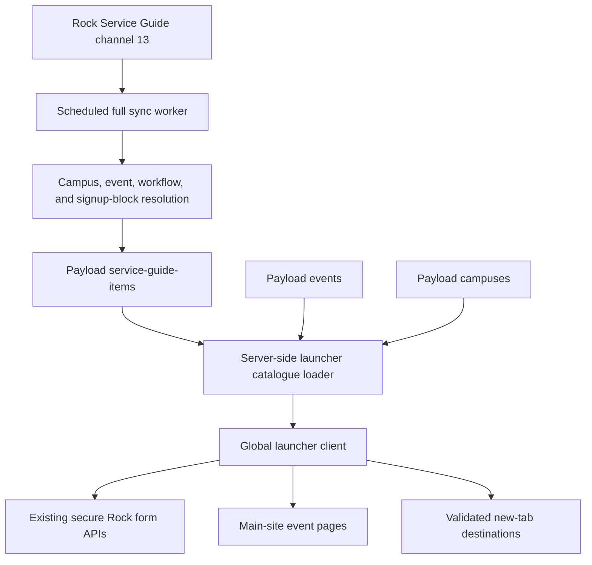
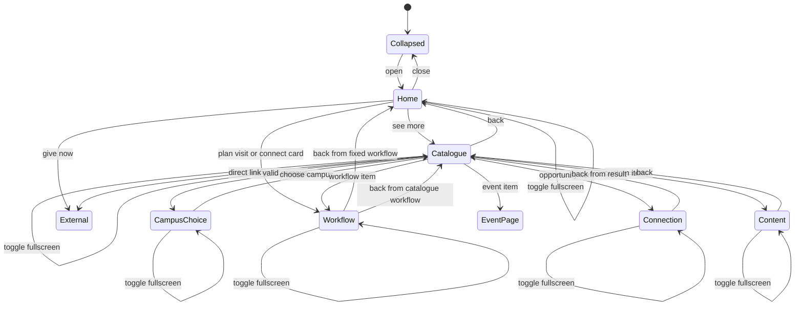

# Next Steps Launcher - Plan

## Goal Capsule

- **Objective:** Add a global bottom-right next-steps launcher that gives visitors a short default menu and a searchable campus-aware catalogue backed by Rock Service Guide records synced into Payload.
- **Product authority:** The decisions in this plan reflect the launcher flow confirmed in the planning conversation. Rock remains authoritative for Service Guide records, while the launcher home actions remain hard-coded for the first release.
- **Execution profile:** This is a deep integration plan because it adds persistent data, a Rock sync contract, public form authorization, and a global interactive overlay.
- **Stop conditions:** Stop if the live Rock Service Guide contract no longer matches Content Channel 13, if a required public form cannot satisfy the existing security boundary, or if a migration would target an unconfirmed database.
- **Tail ownership:** `ce-work` owns implementation, local verification, review, and repository commits. Pushing or opening a pull request remains user-directed.

---

## Product Contract

### Summary

The public site will provide a launcher anchored to the bottom-right corner on every frontend route. Its home view will offer Plan a Visit, Give Now, Connect Card, and See more next steps. The first and third actions render existing Rock workflows inside the launcher. See more presents eligible Service Guide items after campus selection and search.

### Problem Frame

The current Service Guide is a separate, long campus page that makes visitors scan many options before finding a useful next action. The replacement must keep Rock's existing content ownership and ordering while presenting a small entry point inside the main website. The first release must establish the functional data and interaction model without attempting personalized sign-in or the future giving experience.

### Actors

- A1. An anonymous public visitor looking for a clear next step.
- A2. A Rock content editor maintaining Service Guide items, dates, campuses, order, and destinations.
- A3. A site operator running the existing scheduled Rock-to-Payload reconciliation.

### Requirements

**Launcher entry and controls**

- R1. Mount one launcher in the shared frontend layout, anchored to the bottom-right and absent from Payload admin routes.
- R2. The launcher home shows Plan a Visit, Give Now, Connect Card, and See more next steps in that order.
- R3. Close collapses the launcher, Back returns one internal launcher level, and full-screen expands the current launcher state into a full-viewport overlay without navigation or remounting.
- R4. Back restores the prior search query and scroll position, and launcher layout changes preserve in-progress form state where the existing form security lifecycle permits it.
- R5. The launcher provides keyboard focus management, Escape-to-close, focus restoration, accessible labels, and background interaction blocking in full-screen mode.

**Hard-coded primary actions**

- R6. Plan a Visit renders the published Rock workflow `de3d06a6-7fca-41a5-8c37-a485767de970` inside the launcher.
- R7. Connect Card renders the Rock workflow `00778880-81fe-4871-aa91-7c81783b8c4d` inside the launcher.
- R8. Give Now navigates to `/give` in the first release and remains replaceable by a future in-launcher giving flow.

**Rock-to-Payload catalogue**

- R9. Sync every item from Rock Content Channel 13 into an authenticated-read, externally read-only Payload `service-guide-items` collection during the existing scheduled full reconciliation; public launcher data is exposed only through the eligibility-filtered loader DTO.
- R10. Sync only the fixed launcher contract: Rock item identity, title, content, promotional blurb, status, start and expiry dates, priority, stable source order, campuses, Direct Link, Event, Workflow, Connection Opportunity, and last-sync metadata.
- R11. Do not sync or use `Link Button URL` or `FluroFormId`, and do not sync the Rock content-type definition.
- R12. Reconcile creates, updates, and removals by durable Rock item ID only after a complete channel fetch and reference-resolution pass; a failed Service Guide fetch leaves the last successful Payload snapshot usable.
- R13. Rock remains the source of truth, and normal Payload admin users cannot create, update, or delete Service Guide mirror records.

**Campus selection, eligibility, and search**

- R14. See more infers campus from `/campus/north`, `/campus/central`, or `/campus/unichurch`; outside those routes it uses a valid locally remembered campus or asks for one before listing results.
- R15. The active campus selector remains visible above search and can be changed inside the launcher; an explicit choice is persisted locally, while no form data or other personal information is persisted.
- R16. An item is eligible when its Rock status is active, its start time is reached, its expiry time has not been reached, and its synced campuses include the selected campus; a blank campus set is treated as all campuses for compatibility.
- R17. Eligible items are ordered by priority descending, Rock source order ascending, then Rock item ID ascending; a blank search preserves that order.
- R18. Search is case-insensitive across title, promotional blurb, and plain text derived from custom content, with explicit unavailable, empty, and no-results states.

**Item routing**

- R19. Resolve item actions using this compatibility precedence: safe Direct Link, eligible Connection Opportunity, published Workflow, matched public Event, then sanitized custom content.
- R20. Direct Links open in a new tab with `noopener noreferrer`; unsafe or malformed URLs are not actionable.
- R21. Connection Opportunity and Workflow actions render through the existing secure website form components inside the launcher without exposing Rock capability credentials.
- R22. Event actions navigate to the matching main-site `/events/{slug}` page; when no public Payload event exists, use non-empty custom content or omit the item.
- R23. Custom content renders inside the launcher through the existing restricted Rock HTML sanitizer and never creates or navigates to a standalone content page.
- R24. An item with no usable action and no non-empty custom content is omitted from the public catalogue and surfaced as a sync diagnostic.

### Key Flows

- F1. **Primary form action**
  - **Trigger:** A1 selects Plan a Visit or Connect Card.
  - **Steps:** The launcher pushes a form view, starts the approved Rock workflow through the existing website API, retains the same launcher instance across compact/full-screen changes, and shows the completion or safe redirect behavior already defined by the form component.
  - **Outcome:** A1 completes the form without leaving the launcher unless Rock returns an explicitly validated redirect.
  - **Covered by:** R3, R4, R6, R7, R21
- F2. **Campus-aware discovery**
  - **Trigger:** A1 selects See more next steps.
  - **Steps:** The launcher resolves a route or remembered campus, asks when none is valid, shows the visible campus selector and search, filters the synced catalogue, and preserves ordered results.
  - **Outcome:** A1 sees only current next steps for the selected campus and can change campus immediately.
  - **Covered by:** R14-R18
- F3. **Service Guide action resolution**
  - **Trigger:** A1 selects an eligible search result.
  - **Steps:** The launcher applies R19, then opens a safe new tab, renders a secure form, navigates to an event, or renders sanitized content.
  - **Outcome:** Mixed legacy records behave consistently without exposing unsupported Rock actions.
  - **Covered by:** R19-R24
- F4. **Scheduled reconciliation**
  - **Trigger:** A3 runs the existing full Rock sync worker.
  - **Steps:** The worker fetches Content Channel 13 with attributes, resolves campus, event, and eligible signup-block references, upserts the mirror, and removes records absent from the complete snapshot.
  - **Outcome:** The public launcher reads a current Payload snapshot and retains the previous snapshot when the new fetch cannot complete.
  - **Covered by:** R9-R13

### Acceptance Examples

- AE1. **Covers R14-R18.** Given a visitor on `/campus/north` with no remembered choice, when they open See more, then North is selected and only current North-eligible items appear in priority order.
- AE2. **Covers R14-R18.** Given a visitor outside a campus route with no valid stored campus, when they open See more, then the campus chooser is visible and no unfiltered catalogue appears before selection.
- AE3. **Covers R19.** Given a Service Guide item with both Direct Link and Event, when selected, then the validated Direct Link opens in a new tab and the Event is not used.
- AE4. **Covers R19 and R21.** Given a legacy item with both Connection Opportunity and Event, when selected, then the eligible connection signup opens inside the launcher.
- AE5. **Covers R3 and R4.** Given a visitor who searched and opened an item, when they toggle full-screen and then use Back, then the same launcher instance returns to the prior query and scroll position.
- AE6. **Covers R12.** Given Rock fails before a complete Service Guide snapshot is available, when the scheduled sync ends, then existing Payload Service Guide records are not deleted.

### Scope Boundaries

**Included now**

- Functional launcher shell, data sync, campus filtering, search, supported action routing, form integration, responsive layouts, and accessibility behavior.
- A first visual treatment grounded in the current EV Church design system that can be refined after the real interaction exists.

**Deferred to follow-up work**

- Public-member sign-in, remembered intent beyond campus, and personalized next-step recommendations.
- Complete giving inside the launcher, giving history, recurring-gift management, and payment processing.
- Payload configuration for the launcher home actions.
- Analytics and experimentation for launcher conversions.
- Support for Rock `Link Button URL`, `FluroFormId`, Service Guide images, or arbitrary future Rock content-type fields.

---

## Planning Contract

### Key Technical Decisions

- KTD1. **Mirror Service Guide items in a dedicated Payload collection.** (session-settled: user-directed — chosen over live Rock reads: runtime should use Payload and align with the site's existing one-way sync architecture.) The collection stores Rock-owned fields only and denies external mutation. This implements R9-R13.
- KTD2. **Keep primary launcher actions in code for the first release.** (session-settled: user-directed — chosen over Payload configuration: the Give Now action is expected to become a specialized in-launcher flow.) The four home actions use explicit typed descriptors. This implements R2 and R6-R8.
- KTD3. **Resolve Rock references during reconciliation.** Campus GUIDs map to Payload campus relationships, EventItem GUIDs map through Rock EventItems to Payload events, and Connection Opportunity GUIDs map to eligible Obsidian signup block GUIDs. Runtime launcher reads do not call Rock.
- KTD4. **Extend existing public-form allowlists, not the API trust boundary.** Workflow and connection APIs may accept identifiers referenced by currently published launcher records in addition to published Page blocks. Arbitrary GUIDs remain denied, and existing encrypted contexts, Turnstile, origin checks, rate limits, replay rules, and redirect validation remain unchanged. This implements R21.
- KTD5. **Model launcher navigation as a mounted client state machine.** Home, catalogue, workflow, connection signup, and custom-content views remain in one global client component. Full-screen is presentation state, Close is collapsed state, and Back uses an internal view stack. Only campus is stored in local storage.
- KTD6. **Reuse the existing sanitizer and add a server-safe Direct Link classifier.** Custom Rock HTML keeps the current restricted tag and attribute allowlist. Direct Links accept relative site paths and HTTPS URLs but always open in a new tab per the Rock field contract.
- KTD7. **Treat the current Payload snapshot as the availability boundary.** A reconciliation failure returns an entity error and skips destructive cleanup. The launcher remains available from the last successful snapshot and does not fetch Rock from the browser or request path.

### High-Level Technical Design

### Implementation Constraints

- Fetch Content Channel 13 with `loadAttributes=simple`; live inspection confirmed `Campuses` is a comma-separated Campus GUID list, `Event` is an EventItem GUID, `Workflow` is a Workflow Type GUID, and `ConnectionOpportunity` is an opportunity GUID.
- Resolve Connection Opportunity to an eligible fixed Obsidian block. If multiple eligible blocks expose the same opportunity, choose the first deterministic option from the sorted eligible configuration list. If none exists, fall back to custom content or omit the item per R22-R24.
- Store an explicit source-order value from the ordered Rock response and keep Rock ID as the final deterministic tie-breaker.
- Evaluate start as inclusive and expiry as exclusive using absolute timestamps. The current deployment timezone is Pacific/Auckland, but stored comparisons must not depend on a browser-local timezone.
- Preserve `RockForm` and `RockConnectionOpportunitySignup` security and restart semantics. Do not persist form fields. Do not reuse a spent form context after a view restart.
- Replace `RockForm`'s page-level `window.scrollTo` behavior with an optional launcher-owned scroll target while preserving the default page behavior.
- The compact launcher must avoid the persistent audio player. The full-screen launcher must sit above existing header, media, and video layers and lock background interaction.

### Sequencing

U1 establishes the collection and generated types. U2 adds the reconciliation contract and reference resolution. U3 makes the synced records safely consumable by public form and launcher loaders. U4 builds the mounted launcher state machine. U5 integrates the global UI and completes interaction verification.

---

## Implementation Units

### U1. Add the read-only Service Guide collection and migration

- **Goal:** Define the Payload mirror and database schema for the fixed Service Guide launcher contract.
- **Requirements:** R9-R13
- **Dependencies:** None
- **Files:**
  - `src/collections/ServiceGuideItems.ts`
  - `payload.config.ts`
  - `src/payload-types.ts`
  - `src/migrations/20260807_service_guide_items.ts`
  - `src/migrations/20260807_service_guide_items.json`
  - `src/migrations/index.ts`
  - `src/collections/ServiceGuideItems.test.ts`
- **Approach:** Add indexed durable Rock identity, Rock-owned content and action fields, has-many campus relationships, an optional event relationship, and last-sync metadata. Keep record-level storage limited to Rock-owned mirror data and resolved references; report unusable records through reconciliation logs and counts, and store collection-level successful-snapshot state separately. Deny unauthenticated reads and all request-scoped create/update/delete access. Generate Payload types and a complete migration rather than editing generated artifacts by hand.
- **Execution note:** Start with collection access and field-contract tests, then generate and inspect the Payload migration against a confirmed non-production database configuration.
- **Patterns to follow:** `src/collections/Events.ts`, `src/collections/ConnectGroups.ts`, and `docs/solutions/database-issues/missing-migration-column-not-found.md`.
- **Test scenarios:**
  1. The collection exposes authenticated administrative reads but denies unauthenticated reads and request-scoped create, update, and delete access.
  2. Rock ID is required, unique, and indexed; priority, source order, dates, campuses, and action references have the expected generated types.
  3. Migration up creates the collection, relationship tables, indexes, and foreign keys; down removes them; re-applying up succeeds on a clean safe database.
- **Verification:** Payload types generate successfully, migration artifacts remain in sync with the config, and focused collection/migration tests pass.

### U2. Reconcile Rock Service Guide records into Payload

- **Goal:** Add a complete, failure-safe Service Guide entity pass to the scheduled Rock sync.
- **Requirements:** R9-R13, R16, R17, R19, R22, R24
- **Dependencies:** U1
- **Files:**
  - `src/lib/rock-api.ts`
  - `src/sync/mappers/service-guide-item.ts`
  - `src/sync/mappers/service-guide-item.test.ts`
  - `src/sync/sync-runner.ts`
  - `src/sync/sync-runner.test.ts`
  - `src/lib/rock-connection-signups/server.ts`
  - `src/lib/rock-connection-signups/types.ts`
  - `src/lib/rock-connection-signups/server.test.ts`
- **Approach:** Extend the Rock response type with top-level priority, order, expiry, GUID, and attribute values. Add a pure mapper for scalar fields and parsed action identifiers. In `syncServiceGuideItems`, fetch the complete channel, Rock campuses, EventItems, and eligible connection signup configurations; resolve Payload relationships; upsert by Rock ID; then delete only records absent from the successfully resolved snapshot. Add the entity after campus and event reconciliation in `runFullSync`.
- **Execution note:** Build the mapper from a sanitized fixture matching the live `loadAttributes=simple` response before adding database writes.
- **Patterns to follow:** Existing pure mappers in `src/sync/mappers/`, `syncEvents`, `syncConnectGroups`, and `listEligibleRockConnectionSignups`.
- **Test scenarios:**
  1. A live-shaped Rock fixture maps comma-separated Campus GUIDs, EventItem GUID, Workflow GUID, Connection Opportunity GUID, dates, priority, content, and promotional blurb without using ignored fields.
  2. Duplicate legacy actions remain stored so R19 can select the compatible precedence later.
  3. A complete fetch creates and updates records, preserves deterministic source order, resolves public events and eligible signup blocks, and deletes records absent from the snapshot.
  4. A channel-fetch or required reference-fetch failure reports an entity error and performs no destructive cleanup.
  5. An unresolved event uses custom content when present, otherwise the record is marked unavailable or omitted from the public result with a diagnostic.
  6. Multiple eligible blocks for one opportunity select the deterministic first configuration.
  7. `runFullSync` executes Service Guide reconciliation after campuses and events and includes its counts in worker failure reporting.
- **Verification:** Mapper and sync-runner tests prove the full snapshot, failure, and reconciliation paths without calling live Rock or a production database.

### U3. Authorize and load launcher actions from the synced snapshot

- **Goal:** Convert Payload mirror records into a safe public launcher contract and allow only synced form capabilities.
- **Requirements:** R16-R24
- **Dependencies:** U1, U2
- **Files:**
  - `src/lib/service-guide-items.ts`
  - `src/lib/service-guide-items.test.ts`
  - `src/lib/rock-forms/published.ts`
  - `src/lib/rock-forms/published.test.ts`
  - `src/lib/rock-connection-signups/published.ts`
  - `src/lib/rock-connection-signups/published.test.ts`
  - `src/components/forms/SafeRockHtml.tsx`
  - `src/components/forms/SafeRockHtml.test.tsx`
- **Approach:** Query active-date records with controlled depth and selected fields, resolve event slugs and campus slugs, validate Direct Links, derive plain search text, apply R19, and omit unusable records. Extend both publication checks to accept currently published launcher references while retaining the existing published-Page path and denying arbitrary identifiers.
- **Execution note:** Add denial tests before expanding either form publication query.
- **Patterns to follow:** `src/lib/events.ts`, the current published-form helpers, and `classifyRockHref` in `SafeRockHtml.tsx`.
- **Test scenarios:**
  1. Start time is inclusive, expiry is exclusive, inactive records are excluded, and the comparison is stable across timezone settings.
  2. Campus matching includes selected-campus and compatibility all-campus records but excludes other-campus records.
  3. Sorting uses priority descending, source order ascending, then Rock ID ascending.
  4. Action resolution enforces Direct Link over Connection Opportunity over Workflow over Event over custom content.
  5. Relative and HTTPS Direct Links produce safe new-tab actions; protocol-relative, credentialed, HTTP, control-character, and malformed values are rejected.
  6. A workflow or signup block referenced by an eligible synced launcher record passes publication; expired, inactive, missing, and arbitrary GUIDs remain denied.
  7. An unresolved event falls back to sanitized non-empty content or is omitted.
- **Verification:** Focused loader, URL safety, sanitizer, and publication tests pass and no Rock capability token appears in the public DTO.

### U4. Build the mounted launcher interaction state machine

- **Goal:** Implement the compact and full-screen launcher with hard-coded home actions, campus selection, search, detail views, and secure embedded forms.
- **Requirements:** R1-R8, R14-R24
- **Dependencies:** U3
- **Files:**
  - `src/components/launcher/NextStepsLauncher.tsx`
  - `src/components/launcher/NextStepsLauncher.test.tsx`
  - `src/components/launcher/launcher-state.ts`
  - `src/components/launcher/launcher-state.test.ts`
  - `src/components/forms/RockForm.tsx`
  - `src/components/forms/RockForm.test.tsx`
- **Approach:** Use a reducer with collapsed, home, catalogue, workflow, connection, and content views plus presentation mode and internal history. Keep view subtrees mounted when that is required to retain current-tab state. Persist only campus. Derive route campus from the current pathname. Render the two fixed workflows with existing form components, `/give` as navigation, resolved item actions, and explicit loading/unavailable/no-results states.
- **Execution note:** Prove reducer transitions and non-remount behavior before styling the complete component.
- **Patterns to follow:** Existing client provider patterns in `src/components/media/MediaPlayerProvider.tsx`, `RockForm`, `RockConnectionOpportunitySignup`, and EV Church color/type tokens in `src/styles/globals.css`.
- **Test scenarios:**
  1. Open, Close, Back, and full-screen transitions preserve the selected view and restore focus to the trigger.
  2. Plan a Visit and Connect Card instantiate their exact workflow GUIDs inside the launcher; Give Now targets `/give`.
  3. A campus route initializes selection, a valid stored campus initializes outside campus routes, and an invalid stored value shows the chooser.
  4. Manual campus changes update local storage and immediately re-filter results; form fields and search text are never stored there.
  5. Search matches title, blurb, and content text case-insensitively while blank search preserves source order and no matches show an explicit state.
  6. Full-screen toggling does not remount an active form or lose its entered values; Close preserves current-tab state; route change clears form drafts.
  7. Back from an item restores catalogue query and scroll; Back from catalogue returns home.
  8. Escape, focus containment, accessible names, background lock, and compact/full-screen responsive behavior meet dialog expectations.
  9. A multi-step Rock workflow scrolls the launcher container rather than the document when hosted in the launcher and keeps page behavior elsewhere.
- **Verification:** Reducer and DOM interaction tests pass at desktop and mobile dimensions without relying on implementation-only state inspection.

### U5. Integrate the launcher globally and verify real user flows

- **Goal:** Mount the server-loaded launcher in the public layout and prove the complete sync-to-interaction experience.
- **Requirements:** R1-R24
- **Dependencies:** U1-U4
- **Files:**
  - `src/app/(frontend)/layout.tsx`
  - `src/app/(frontend)/layout.test.tsx`
  - `src/components/launcher/NextStepsLauncher.tsx`
  - `src/styles/globals.css`
- **Approach:** Load a selected launcher DTO in the server layout, pass it to the client launcher, and keep the launcher outside the page content while inside the shared frontend shell. Set z-index, safe-area spacing, audio-player avoidance, and mobile/full-screen sizing. Verify the default launcher, campus catalogue, forms, event/direct-link routing, custom content, focus behavior, and state restoration in a real browser.
- **Execution note:** Use the actual local route and real browser after focused tests; visual refinement must not conceal broken loading, filtering, scrolling, or form states.
- **Patterns to follow:** `src/app/(frontend)/layout.tsx`, persistent media UI layering, and the approved interaction sketch as product direction rather than pixel specification.
- **Test scenarios:**
  1. Public frontend routes render exactly one launcher and Payload admin routes render none.
  2. With a representative Payload fixture, the default actions and See more flow reach the expected forms, filtered results, event route, safe Direct Link, and sanitized content.
  3. With no successful Service Guide snapshot, the three primary actions remain available and See more shows a retryable unavailable state.
  4. Compact desktop, compact mobile, and full-screen layouts do not overlap navigation, persistent media controls, or safe-area insets.
  5. Keyboard-only use can open, traverse, back, expand, close, and restore focus without reaching inert background controls in full-screen mode.
- **Verification:** Focused integration tests pass, `npm run build` succeeds, and browser smoke tests cover desktop and mobile launcher flows on the exact local routes.

---

## System-Wide Impact

- **Data lifecycle:** The scheduled Rock worker gains a sixth Rock entity mirror. Entity-level errors continue to fail the worker while leaving prior Service Guide data intact.
- **Security:** Public form authorization expands only to identifiers present in eligible synced Service Guide records. Existing capability encryption, Turnstile, origin validation, rate limits, replay prevention, and safe redirect behavior remain authoritative.
- **Database:** A new collection and relationship tables require a committed Payload migration and a confirmed safe migration target for local application tests.
- **Frontend shell:** The launcher becomes persistent across frontend route changes and must coexist with announcement, header, audio, and video layers.
- **Operations:** Initial deployment needs the migration before the first successful full sync. Until that sync completes, primary actions still work and the catalogue reports unavailable.

---

## Risks and Dependencies

- **Eligible connection block prerequisite:** The Service Guide stores an opportunity GUID, while the website signup API requires an eligible fixed Obsidian block GUID. Rock must contain at least one block that passes the existing eligibility checks for each public launcher opportunity.
- **Event coverage:** A Rock Service Guide event may not be present in Payload because the event sync only includes active, future events on the Website (Public) calendar. R22 prevents broken event links.
- **Schema drift:** Payload config and database schema can diverge while TypeScript still builds. U1 must keep the collection, migration TypeScript, snapshot, and index together.
- **Overlay and form lifecycle:** Unmounting can discard form state or invalidate one-use contexts. U4 uses mounted presentation changes and tests Close, Back, route changes, and restart-required outcomes.
- **Live Rock contract:** The mapper depends on Content Channel 13 and the inspected attribute keys. Sanitized fixtures protect the contract, and a mismatch must fail the Service Guide entity without deleting the last snapshot.

---

## Documentation and Operational Notes

- Add the new entity name and result counts to existing sync diagnostics so a failed Service Guide reconciliation is visible in the worker output.
- Deploy the schema migration before relying on the new sync entity.
- Run the first Service Guide reconciliation only against the intended environment after confirming `DATABASE_URL` and Rock credentials.
- Record a follow-up after the first release for native giving, sign-in personalization, and launcher design refinement.

---

## Sources and Research

- `src/sync/sync-runner.ts` and `src/workers/rock-sync.ts` establish sequential reconciliation and worker-level failure handling.
- `src/lib/rock-forms/published.ts` and `src/lib/rock-connection-signups/published.ts` establish public identifier allowlists.
- `src/components/forms/RockForm.tsx`, `src/components/forms/RockConnectionOpportunitySignup.tsx`, and `src/components/forms/SafeRockHtml.tsx` establish secure form and content rendering boundaries.
- `docs/solutions/integration-issues/phases3-8-full-build-completion.md` documents pure mappers, durable-ID upserts, and central sync patterns.
- `docs/solutions/security-issues/rock-form-capability-boundaries.md` documents capability confidentiality, bounded inputs, origin checks, restart semantics, and safe redirects.
- `docs/solutions/database-issues/missing-migration-column-not-found.md` documents the required Payload migration artifacts and database verification boundary.
- Live authenticated Rock inspection on 2026-08-06 and 2026-08-07 confirmed 50 Service Guide items, Content Channel ID 13, `loadAttributes=simple`, campus GUID lists, action GUID field shapes, and the absence of populated Link Button URLs.

---

## Verification Contract

| Gate | Applies to | Required outcome |
|---|---|---|
| Focused mapper and sync tests | U2 | Live-shaped fixtures, reference resolution, full reconciliation, and no-delete failure behavior pass. |
| Focused publication and loader tests | U3 | Eligibility, action precedence, URL safety, event fallback, and form allowlists pass without exposing capabilities. |
| Reducer and launcher DOM tests | U4 | Internal navigation, mounted full-screen, campus memory, search, form-state rules, focus, and accessibility pass. |
| Migration verification | U1 | Generated migration and snapshot match the collection; up/down/re-apply run only on a confirmed safe database. |
| `npm run generate:types` | U1-U5 | Generated Payload types include the new collection and no generated file was edited manually. |
| `npm run build` | U1-U5 | Strict TypeScript, Payload type generation, and Next.js production build succeed. |
| Browser smoke at desktop and mobile | U5 | The exact local routes prove launcher placement, campus filtering, scrolling, forms, direct links, events, custom content, Back, Close, and full-screen behavior. |

---

## Definition of Done

- Every requirement R1-R24 is implemented or explicitly blocked by invalidating external Rock evidence.
- U1-U5 test scenarios pass with behavior-bearing tests added before each unit is declared complete.
- The new Payload schema includes its generated migration TypeScript, snapshot, migration index entry, and regenerated Payload types.
- The scheduled sync produces a Service Guide entity result and never deletes the prior snapshot after an incomplete fetch or resolution failure.
- Public form APIs accept only published Page or eligible synced-launcher identifiers and continue to deny arbitrary GUIDs.
- The launcher is present on all intended frontend routes, absent from Payload admin, and verified at desktop and mobile widths in a real browser.
- Plan a Visit, Connect Card, Give Now, campus selection, search, every supported item action, and unavailable/error states work end to end.
- No Rock API credential, capability grant, form field value, or other personal information is exposed or persisted by the launcher.
- Abandoned experiments, duplicate launcher implementations, temporary fixtures, and unrelated formatting changes are removed from the final diff.
