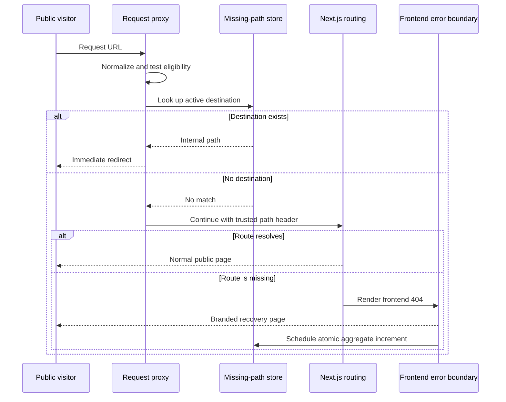
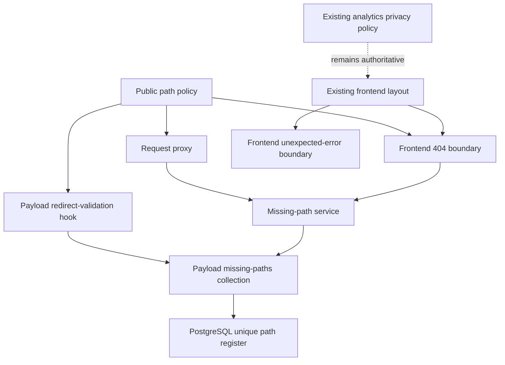
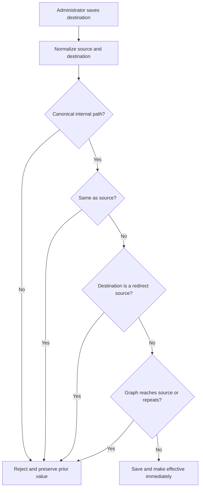

# Public Error Pages and Redirects - Plan

## Goal Capsule

- Objective: give public visitors a calm, branded way out of missing-page and unexpected-error states, while giving the church team a small, privacy-conscious register of recurring missing public paths and the ability to resolve a path with an immediate internal redirect.
- Product authority: preserve the existing public-site visual context, analytics privacy boundary, and scope limits defined in this plan.
- Open blockers: none identified beyond implementation details that must still satisfy the confirmed requirements and validation rules.

## Product Contract

### Summary

The public website presents dedicated branded experiences for a missing page and an unexpected crash. Missing public paths are aggregated by normalized path in Payload so the team can see which broken destinations recur. An administrator may add one valid internal destination to a missing path; subsequent visits then redirect immediately. Collection remains aggregate-only and follows the website's existing analytics privacy boundary.

### Problem Frame

Visitors who follow an outdated, mistyped, or broken public link currently lack a deliberately designed recovery experience. The church team also lacks a compact view of which missing public paths matter most, so it cannot distinguish isolated bot noise from repeated broken links or repair a known path without a code change.

The solution must not become a general observability platform, link-management system, or visitor-tracking store. It needs to preserve privacy, avoid redirect hazards, and remain small enough for routine content administration.

### Actors

- **Public visitor:** reaches a missing public path or encounters an unexpected public-page crash and needs a clear recovery action.
- **Payload administrator:** reviews aggregated missing paths and may assign an internal replacement destination.
- **Church website team:** uses aggregate counts to identify recurring broken public links while relying on the existing analytics boundary for browser-error visibility.

### Key Decisions

- (session-settled: user-directed — chosen over generic recovery actions: the public 404 experience is branded and offers one action only, **Return home**.) Governs R3.
- (session-settled: user-directed — chosen over a single fallback path: the public unexpected-crash experience offers **Try again** as the primary action and **Return home** as the fallback.) Governs R5-R6.
- (session-settled: user-directed — chosen over a per-visit event log: missing-path collection is a minimal aggregate register in Payload.) Governs R8-R10.
- (session-settled: user-directed — chosen over preserving query variants and slash variants separately: a missing path is stored without its query string, and trailing-slash variants are merged into one entry.) Governs R11-R13.
- (session-settled: user-directed — chosen over multiple destinations or staged publishing: each register entry may have one optional internal redirect destination, and a valid saved destination takes effect immediately.) Governs R16-R19.
- (session-settled: user-directed — chosen over external, chained, or looping redirect support: redirect destinations are internal paths only, and invalid self-redirects, redirect chains, and redirect loops are rejected.) Governs R17, R20-R24.
- (session-settled: user-directed — chosen over broad path coverage: member, admin, API, and asset paths are outside both the public error-page register and redirect feature.) Governs R14-R15.
- (session-settled: user-directed — chosen over widening browser-error tracking: existing PostHog analytics privacy rules remain authoritative, and this feature does not widen tracking on sensitive routes.) Governs R25-R27.
- (session-settled: user-directed — chosen over Ahrefs ingestion, alerts, external redirects, and detailed visit records: those are excluded.) Governs Scope Boundaries.

## Requirements

### Public error experiences

- **R1.** An unresolved missing public page must return a branded Ev Church 404 experience within the normal public-site visual context.
- **R2.** The 404 experience must explain in plain language that the requested page could not be found.
- **R3.** The 404 experience must offer exactly one recovery action, labelled **Return home**, which takes the visitor to the main page.
- **R4.** An unexpected crash affecting a public page must present a branded Ev Church error experience rather than raw framework or technical error details.
- **R5.** The unexpected-crash experience must offer **Try again** as its primary action and **Return home** as its fallback action.
- **R6.** **Try again** must retry the failed public experience without requiring the visitor to understand or change the URL.
- **R7.** Neither public error experience may expose stack traces, internal identifiers, configuration details, or other diagnostic data.

### Aggregated missing-path register

- **R8.** An unresolved eligible public 404 must contribute to a Payload-managed register of missing paths.
- **R9.** Each register entry must show the normalized missing path and an aggregate occurrence count.
- **R10.** The register must not retain a row or event record for each visit.
- **R11.** Query strings must be stripped before a missing path is counted or stored.
- **R12.** A path with and without a trailing slash must contribute to the same register entry.
- **R13.** Repeated eligible requests for the same normalized path must increment its existing aggregate count rather than create duplicate entries.
- **R14.** The register must exclude member, admin, API, and asset paths.
- **R15.** The register must not collect visitor identity, session identity, IP address, query-string contents, form contents, or referring-page details.

### Internal redirects

- **R16.** A Payload administrator may assign one optional replacement destination to a registered missing path.
- **R17.** A replacement destination must be an internal website path; absolute or external destinations must be rejected.
- **R18.** Once a valid replacement destination is saved, it must apply immediately to subsequent live visits to the missing path.
- **R19.** Redirect entries must not have a separate publication, enablement, draft, or status control.
- **R20.** A replacement destination identical to its normalized source path must be rejected.
- **R21.** A replacement destination that is itself configured as a redirect source must be rejected so redirects cannot form chains.
- **R22.** Any redirect configuration that would create a direct or indirect loop must be rejected.
- **R23.** An eligible request with a valid redirect must go directly to the saved internal destination instead of showing the 404 experience or adding another unresolved occurrence.
- **R24.** Removing a replacement destination must return the source path to unresolved-404 behaviour for later visits.

### Analytics and privacy

- **R25.** Public error handling must preserve the existing PostHog analytics privacy boundary and its sensitive-route exclusions.
- **R26.** The missing-path register must be independent of session replay and browser-exception capture; disabling or excluding analytics on a sensitive route must not create a register entry through another path.
- **R27.** Unexpected browser exceptions on eligible public routes may continue to be collected by the existing PostHog configuration, without adding a second error-monitoring product in this scope.

## Key Flows

### Flow A: unresolved public 404

1. A public visitor requests a missing eligible path.
2. The website normalizes the path by removing the query string and merging its trailing-slash form.
3. No valid replacement destination exists.
4. The normalized path's aggregate count is created or incremented.
5. The visitor sees the branded 404 experience with **Return home**.

### Flow B: administrator resolves a recurring missing path

1. A Payload administrator opens the missing-path register.
2. The administrator reviews a normalized path and its aggregate count.
3. The administrator enters a valid internal destination.
4. The destination is saved and becomes effective immediately.
5. A later visitor requesting the source path is sent directly to the destination.

### Flow C: invalid redirect configuration

1. An administrator enters an external destination, the same source path, a redirect source, or a destination that would create a loop.
2. The value is rejected with a clear explanation.
3. The prior valid configuration, if any, remains unchanged.

### Flow D: unexpected public crash

1. A public page encounters an unexpected recoverable error.
2. The visitor sees the branded unexpected-error experience.
3. The visitor can choose **Try again**.
4. If retry does not help, the visitor can choose **Return home**.
5. Existing eligible-route PostHog exception collection continues under the established privacy boundary.

## Acceptance Examples

- **A1. Missing legacy link:** Visiting `/community/kids/club` when it has no matching page and no redirect shows the branded 404 page, records `/community/kids/club`, increments its aggregate count, and offers only **Return home**.
- **A2. Trailing-slash merge:** Visiting `/community/kids/club/` contributes to the same `/community/kids/club` register entry rather than creating a second entry.
- **A3. Query stripping:** Visiting `/community/kids/club/?utm_source=ahrefs` contributes only to `/community/kids/club`; the query string is neither stored nor displayed.
- **A4. Immediate resolution:** After an administrator saves `/kids` as the destination for `/community/kids/club`, the next visit to either `/community/kids/club` or `/community/kids/club/` redirects directly to `/kids`.
- **A5. External destination rejected:** `https://example.com/kids` cannot be saved as the replacement destination.
- **A6. Self redirect rejected:** `/community/kids/club` cannot be saved as its own destination.
- **A7. Chain rejected:** If `/old-kids` already redirects to `/kids`, `/community/kids/club` cannot be configured to redirect to `/old-kids`.
- **A8. Loop rejected:** If the current redirect set would eventually route a destination back to `/community/kids/club`, the new value cannot be saved.
- **A9. Excluded path:** A missing member, admin, API, or asset request does not create or increment a public missing-path register entry.
- **A10. Public crash recovery:** An unexpected error on an eligible public page shows **Try again** first and **Return home** second, without exposing technical details.
- **A11. Redirect removal:** Removing `/kids` from the `/community/kids/club` entry causes a later request to show the 404 experience and resume aggregate counting.

## Success Signals

- Public visitors never see a generic or technical error screen for the covered 404 and unexpected-crash states.
- Every covered 404 offers an obvious route to the main page, and every covered crash offers retry plus home fallback.
- Repeated variants of the same missing public path consolidate into one useful aggregate entry.
- Administrators can resolve a recurring missing path with one valid internal destination and observe that resolution on the next live request.
- Invalid external, self-referential, chained, and looping redirects cannot enter the active redirect set.
- Sensitive and non-public paths remain absent from the missing-path register and outside any newly widened analytics collection.

## Scope Boundaries

### In scope

- One branded public 404 experience.
- One branded unexpected-crash experience.
- Aggregate counting of eligible normalized public 404 paths in Payload.
- One optional immediate internal redirect per registered path.
- Validation preventing external, self, chained, and looping redirects.
- Continued use of the existing PostHog public-route privacy boundary.

### Out of scope

- Importing or synchronizing Ahrefs crawl or backlink data.
- Alerts, notifications, escalation rules, or uptime monitoring.
- Per-visit 404 logs or visitor/session attribution.
- External redirects.
- Redirect chains, multiple destinations, scheduled redirects, status workflows, drafts, approvals, or redirect analytics dashboards.
- Capturing or managing missing member, admin, API, or asset paths.
- Replacing PostHog or adding a separate error-monitoring provider.
- Automatically suggesting destinations or repairing links.

## Dependencies and Assumptions

- The website continues to have a stable main-page destination at `/`.
- Payload administrators are trusted to manage the optional redirect destination.
- The existing public layout and Ev Church design language remain available to both error experiences.
- The existing PostHog configuration and route privacy policy remain the source of truth for eligible browser exception collection.
- The website can distinguish public page requests from member, admin, API, and asset requests consistently enough to enforce the stated boundary.
- Path comparison uses the same normalized representation for aggregation and redirect validation, including query removal and trailing-slash merging.
- A redirect destination is expected to resolve to a normal internal website destination; destination validity is checked before it becomes live.

---

## Planning Contract

### Product Contract preservation

Product Contract unchanged.

### Key Technical Decisions

- KTD1. **Use the public route group for both recovery experiences.** Add the 404 and unexpected-error boundaries under `src/app/(frontend)` so they inherit the existing header, footer, announcement, media providers, launcher, global styles, and analytics manager. The error boundary remains a Client Component because Next.js 16 supplies its `retry()` recovery callback only there. (session-settled: user-directed — chosen over generic recovery actions: the public error experiences retain the exact actions in R3 and R5-R6.)
- KTD2. **Separate early redirect resolution from confirmed-404 recording.** The request proxy normalizes eligible public paths, checks for a saved redirect before route resolution, and replaces any inbound internal-path header with a trusted normalized value. A public catch-all routes otherwise-unmatched URLs through the frontend hierarchy, while the shared frontend 404 boundary schedules aggregate recording only after Next.js has selected a 404. This avoids counting valid pages while preserving immediate redirects. (session-settled: user-directed — chosen over multiple destinations or staged publishing: one valid destination applies on the next request per R16-R19 and R23-R24.)
- KTD3. **Use one pure path-policy module across all boundaries.** Normalization, exact-or-child prefix exclusions, file-like asset detection, and internal-destination parsing live in `src/lib/public-paths.ts`. Proxy lookup, 404 recording, and collection validation consume this module so query, slash, sensitive-route, and malformed-path handling cannot drift. The policy aligns with `src/lib/analytics-privacy.ts` without changing PostHog capture or replay rules. (session-settled: user-directed — chosen over broad path coverage and widened tracking: R11-R15 and R25-R27 remain the authority.)
- KTD4. **Store a minimal private Payload collection and validate redirect invariants at its write boundary.** `missing-paths` contains one unique indexed normalized path, an aggregate count, and one optional internal destination. Admin reads and mutations use the existing Payload role helpers; public REST/GraphQL access remains closed. A collection hook normalizes the source and destination and rejects malformed, external, self, chained, and cyclic configurations before commit. (session-settled: user-directed — chosen over per-visit records and redirect workflows: R8-R10 and R16-R24 define the schema and validation boundary.)
- KTD5. **Increment counts atomically and fail open for the visitor experience.** The recording service performs a PostgreSQL upsert against the unique normalized-path index so concurrent misses cannot lose increments or create duplicates. The 404 boundary schedules the write with Next.js `after()` and logs a sanitized operational error if it fails; the visitor still receives the branded 404. (session-settled: user-directed — chosen over a per-visit event log: only the aggregate required by R8-R10 is persisted.)
- KTD6. **Treat the collection as a production schema change.** Generate and inspect the Payload migration and schema snapshot, register the migration, regenerate `src/payload-types.ts`, and exercise migration up, down, and re-apply against an explicitly confirmed development PostgreSQL database. The migration follows the repository's lock-timeout, statement-timeout, index, and locked-document relation conventions.

### High-Level Technical Design

The sketches below are directional. They describe component boundaries and ordering, not implementation syntax.

#### Request and recovery sequence

#### Component topology

#### Redirect validation decisions

### Assumptions and Constraints

- The proxy runs in the Next.js 16 Node.js runtime and may call the Payload Local API. The implementation must confirm that loading Payload on the broadened public matcher is acceptable before settling any optimization.
- Proxy matchers are compile-time constants. They must explicitly exclude framework internals, public assets, metadata files, API routes, admin routes, authentication routes, and member routes.
- The proxy-provided normalized-path header is internal transport, not user input. The proxy must overwrite or remove an inbound value before forwarding the request.
- `not-found.tsx` receives no pathname prop. It may read the trusted header during render and pass the normalized value into `after()`; request APIs must not be called from inside the callback.
- `after()` is available on the repository's Node.js deployment, but migration and browser verification must confirm graceful completion under Railway shutdown behavior.
- A missing-path write failure is observable through sanitized server logging and is non-fatal to the public response. No visitor, session, query, referrer, or form data may enter the log or collection.
- Database-backed acceptance work begins only after the implementer confirms that `DATABASE_URL` targets an intended disposable or development Ev Church database.

### Sequencing

1. Establish the canonical path and eligibility contract before any request, persistence, or validation code consumes it.
2. Add the collection, invariant hook, schema migration, and generated types before request-time services depend on the new collection slug.
3. Add atomic recording and redirect lookup services behind focused unit tests.
4. Add the public recovery UI, catch-all routing, and proxy integration after the shared contracts are stable.
5. Run migration, full-build, and browser acceptance gates only after focused tests pass.

### Risks and Mitigations

- **Public matcher overhead:** A database lookup on every eligible public request could add latency. Measure the focused request path during implementation; retain indexed exact lookup and avoid a cache that would violate R18 unless it has synchronous invalidation.
- **False aggregation:** Recording in proxy would count valid pages. Record only from the selected frontend 404 boundary and prove a normal public page does not increment.
- **Header spoofing:** A client could send the internal path header. Overwrite it in proxy and reject recording when the trusted value is absent or ineligible.
- **Concurrent misses:** Read-then-write loses increments. Use a unique index plus an atomic upsert and test parallel increments against PostgreSQL.
- **Redirect graph races:** Concurrent admin saves can each pass a stale graph check. Serialize redirect-changing validation with a transaction-scoped advisory lock, then re-read the active graph before commit.
- **Routing regressions:** A broad proxy matcher could affect Auth0, Payload, APIs, metadata, or assets. Preserve the existing auth branches and add explicit regression cases for every excluded family.
- **Schema drift:** A generated type or successful build does not prove the deployed schema. Commit migration artifacts and run the repository's PostgreSQL migration integration gate before release.

### Sources and Research

- `src/app/(frontend)/layout.tsx` — public layout and provider composition to preserve.
- `src/proxy.ts` and `src/proxy.test.ts` — existing Auth0 proxy behavior that the public matcher must not regress.
- `src/lib/analytics-privacy.ts`, `src/components/seo/AnalyticsManager.tsx`, and their tests — current privacy boundary and prefix semantics.
- `src/hooks/protectLastAdmin.ts` — transaction-session, advisory-lock, and `APIError` precedent for persistent invariants.
- `src/migrations/20260811_daily_bible_readings.ts`, `src/migrations/index.ts`, and `src/migrations-directory.test.ts` — schema, timeout, registration, and migration-test placement conventions.
- `docs/solutions/architecture-patterns/public-analytics-sensitive-route-boundary.md` — institutional privacy rule carried into KTD3.
- `docs/solutions/security-issues/rock-form-capability-boundaries.md` — treat redirect destinations as untrusted capabilities.
- `docs/solutions/database-issues/missing-migration-column-not-found.md` and `docs/solutions/developer-experience/payload-dev-server-database-target-safety.md` — schema drift and database-target safeguards.
- `node_modules/next/dist/docs/01-app/03-api-reference/03-file-conventions/not-found.md` — Next.js 16.3 not-found placement, missing props, and layout behavior.
- `node_modules/next/dist/docs/01-app/03-api-reference/03-file-conventions/error.md` — Client Component boundary and `retry()` behavior.
- `node_modules/next/dist/docs/01-app/03-api-reference/03-file-conventions/proxy.md` and `node_modules/next/dist/docs/01-app/03-api-reference/04-functions/after.md` — matcher exclusions, execution order, trusted request data, and response-tail work.

---

## Implementation Units

### U1. Canonical public-path policy

- **Goal:** Provide one tested definition of normalization, register eligibility, and valid internal redirect destinations.
- **Requirements:** R11-R15, R17, R20, R25-R26; Flow A; A2-A3, A5-A6, A9.
- **Files:** `src/lib/public-paths.ts`, `src/lib/public-paths.test.ts`, and, only if shared prefix logic is extracted without behavior change, `src/lib/analytics-privacy.ts` and `src/lib/analytics-privacy.test.ts`.
- **Approach:** Normalize from URL pathname, preserve `/`, remove trailing slashes, reject encoded or structural bypasses, and use segment-aware excluded prefixes plus file-like asset detection. Keep analytics eligibility separate but mechanically aligned with its existing sensitive-route policy per KTD3.
- **Dependencies:** None.
- **Test scenarios:**
  1. Normalize `/community/kids/club/` and the pathname from a URL containing a query to `/community/kids/club`.
  2. Preserve `/` and avoid converting empty or malformed input into an eligible path.
  3. Exclude exact and child paths for member, admin, API, authentication, framework-internal, metadata, and asset families without excluding lookalikes such as `/memberships`.
  4. Accept a canonical root-relative destination and reject absolute, protocol-relative, backslash, control-character, fragment-only, query-only, and encoded bypass values.
  5. Confirm existing analytics allow/deny and replay cases remain unchanged.
- **Verification:** Focused Vitest coverage proves every consumer can share the same canonical representation without widening analytics.

### U2. Private missing-path collection and redirect invariants

- **Goal:** Add the minimal Payload-managed register with role-based administration and transaction-safe redirect validation.
- **Requirements:** R8-R10, R16-R22, R24; Flows B-C; A5-A8, A11.
- **Files:** `src/collections/MissingPaths.ts`, `src/collections/MissingPaths.test.ts`, `src/hooks/validateMissingPathRedirect.ts`, `src/hooks/validateMissingPathRedirect.test.ts`, `payload.config.ts`, `src/payload-types.ts`, `src/migrations/<timestamp>_missing_paths.ts`, `src/migrations/<timestamp>_missing_paths.json`, `src/migrations/index.ts`, and `src/migration-tests/<timestamp>_missing_paths.integration.test.ts`.
- **Approach:** Register a non-versioned `missing-paths` collection with a unique indexed path, non-negative count, optional destination, timestamps, private public access, and existing editor-role administration. Normalize and validate changes under a transaction-scoped lock before saving. Generate migration artifacts and types instead of hand-editing generated output per KTD4 and KTD6.
- **Dependencies:** U1.
- **Test scenarios:**
  1. An authorized Payload editor can read and update the register; anonymous, member-only, and public API callers cannot read or mutate it.
  2. Saving a valid internal destination succeeds and clearing it returns the entry to unresolved state without adding workflow fields.
  3. External, malformed, self, chain, direct-loop, and multi-hop-loop destinations raise a clear `APIError` and preserve the prior valid value.
  4. Two concurrent graph-changing saves serialize and cannot create a chain or loop from stale reads.
  5. Migration up creates the table, unique path index, timestamps, and locked-document relation; down removes them safely; re-apply succeeds on a clean development database.
- **Verification:** Collection and hook tests pass, generated types contain the new collection, migration SQL is inspected, and the PostgreSQL integration test passes against a confirmed development target.

### U3. Atomic aggregate and redirect lookup services

- **Goal:** Provide request-time operations that read an active redirect and atomically record a confirmed unresolved 404.
- **Requirements:** R8-R13, R18, R23-R24; Flows A-B; A1-A4, A11.
- **Files:** `src/lib/missing-paths.ts`, `src/lib/missing-paths.test.ts`, and `src/migration-tests/<timestamp>_missing_paths.integration.test.ts`.
- **Approach:** Use an indexed exact-path lookup with `depth: 0` and a narrow `select` for destinations. Use PostgreSQL conflict-update semantics for aggregate increments and pass the active Payload request/transaction context where available. Return no visitor-facing error when recording fails; emit only the normalized path and failure category to server logs per KTD5.
- **Dependencies:** U1, U2.
- **Test scenarios:**
  1. Lookup returns the saved internal destination for the exact normalized source and returns no destination for unresolved or absent entries.
  2. The first confirmed miss creates one row with count one; subsequent slash/query variants increment that row.
  3. Parallel increments for one path produce one row whose count equals the number of accepted calls.
  4. A path with a destination is not incremented through the unresolved-recording operation.
  5. Database failure is sanitized, reported to the server logger, and returned as a non-throwing recording result.
- **Verification:** Unit harness tests cover query shape and error handling; PostgreSQL integration proves uniqueness and concurrency behavior.

### U4. Branded public recovery experiences

- **Goal:** Render the exact settled 404 and unexpected-error actions inside the existing public visual context.
- **Requirements:** R1-R7, R27; Flow D; A1, A10.
- **Files:** `src/components/errors/PublicErrorExperience.tsx`, `src/components/errors/PublicErrorExperience.test.tsx`, `src/app/(frontend)/not-found.tsx`, `src/app/(frontend)/not-found.test.tsx`, `src/app/(frontend)/error.tsx`, and `src/app/(frontend)/error.test.tsx`.
- **Approach:** Reuse the existing `Button` component and Ev Church brand tokens. Keep the 404 server-rendered with one home action. Keep the unexpected-error boundary client-side, render `Try again` as primary and home as fallback, call the Next.js 16 `retry()` callback, and never display the error object or digest per KTD1.
- **Dependencies:** U1, U3.
- **Test scenarios:**
  1. The 404 renders plain-language missing-page copy and exactly one actionable control labelled `Return home` with destination `/`.
  2. The error boundary renders `Try again` before `Return home`, invokes `retry()` once when selected, and links home to `/`.
  3. Neither boundary renders a supplied stack, message, digest, configuration value, or internal identifier.
  4. The not-found boundary schedules one recording call only when the trusted normalized-path header is present and eligible.
  5. A rejected recording operation does not replace or remove the 404 content.
- **Verification:** Component tests assert accessible names, action order/count, callbacks, data non-disclosure, and inherited public-layout placement.

### U5. Public routing, immediate redirects, and exclusions

- **Goal:** Connect eligible requests to immediate redirects or confirmed frontend 404 handling without regressing protected routes.
- **Requirements:** R1, R8, R11-R15, R18, R23-R27; Flows A-B; A1-A4, A9, A11.
- **Files:** `src/proxy.ts`, `src/proxy.test.ts`, `src/app/(frontend)/[...missing]/page.tsx`, `src/app/(frontend)/[...missing]/page.test.tsx`, `src/app/(frontend)/[slug]/page.tsx`, and `src/app/(frontend)/[slug]/page.test.tsx`.
- **Approach:** Broaden the constant proxy matcher only to the request families needed for redirect lookup. Preserve Auth0 branches, strip any inbound internal-path header, attach the trusted normalized pathname to eligible fall-through requests, and redirect immediately when U3 returns a destination. Route otherwise-unmatched multi-segment public paths through the frontend catch-all and `notFound()`. Ensure existing dynamic public pages that call `notFound()` reach the shared boundary per KTD2.
- **Dependencies:** U1, U3, U4.
- **Test scenarios:**
  1. `/community/kids/club?utm_source=ahrefs` with no destination reaches the frontend 404 and records only `/community/kids/club` once.
  2. Slash and query variants of a configured source redirect directly to the saved destination without rendering 404 or incrementing the count.
  3. Clearing the destination causes the next source request to render 404 and resume incrementing.
  4. A normal public page continues without redirect or aggregate increment.
  5. Member, admin, API, authentication, `_next`, metadata, and file-like asset requests neither query the register nor attach a recordable header.
  6. A spoofed internal-path request header is overwritten for eligible requests and absent on excluded requests.
  7. Existing signed-out admin redirects and Auth0 failure behavior remain unchanged.
- **Verification:** Proxy and route tests cover both branches and exclusions; focused browser QA proves the live navigation and request status behavior.

---

## Verification Contract

| Gate | Applies to | Evidence required |
|---|---|---|
| Focused Vitest | U1-U5 | New normalization, validation, storage, UI, proxy, and catch-all tests pass with the scenario assertions above. |
| Full Vitest suite: `pnpm test` | U1-U5 | No regression in public pages, Auth0 proxy behavior, Payload access, analytics privacy, or migration-directory rules. |
| Lint: `pnpm lint` | U1-U5 | Strict TypeScript/ESLint conventions pass with no suppressed new errors. |
| Payload generation and production build: `pnpm build` | U2-U5 | Payload types regenerate and Next.js 16.3 builds every route and special file successfully. |
| PostgreSQL migration integration: `pnpm test:migration:postgres` | U2-U3 | On a confirmed development database, migration up/down/re-apply and concurrent increment scenarios pass. |
| Browser acceptance | U4-U5 | Desktop and mobile verify A1-A4 and A9-A11, including action order, full public chrome, redirect immediacy/removal, and excluded paths. |
| Admin acceptance | U2 | Payload shows only path, count, and optional destination; valid changes are immediate and invalid graph changes preserve the prior value. |
| Privacy regression | U1, U5 | Existing PostHog initialization, exception capture, replay allowlist, and sensitive-route exclusions remain unchanged. |

Release verification must record local unit/build results separately from migration execution and browser acceptance. Do not run migration or Payload-backed browser gates until the database target has been confirmed.

---

## Definition of Done

- All R1-R27 behavior is implemented without changing the Product Contract or adding excluded features.
- U1-U5 satisfy their listed test scenarios and dependency order.
- Public 404 and unexpected-error states use the existing frontend chrome and expose only their settled actions.
- Eligible misses aggregate atomically by normalized path with no per-visit or visitor-identifying data.
- Valid internal redirects apply on the next request; external, self, chain, and loop configurations cannot commit.
- Member, admin, API, authentication, framework-internal, metadata, and asset paths remain outside the register and any widened analytics behavior.
- Migration artifacts, registration, generated Payload types, and PostgreSQL migration verification are complete.
- `pnpm test`, `pnpm lint`, and `pnpm build` pass.
- Desktop and mobile browser acceptance covers the unresolved, resolved, removed-redirect, crash-retry, and excluded-path flows.
- No abandoned experiments, duplicate policy helpers, stale generated files, or unrelated changes remain in the implementation diff.
