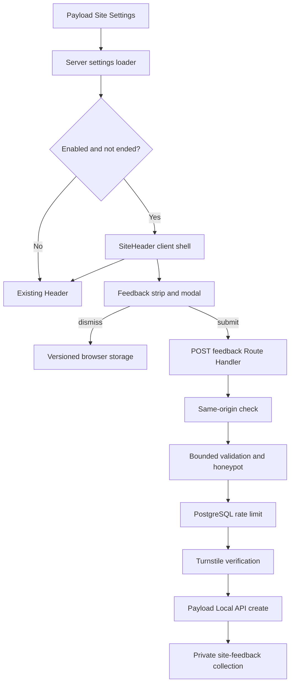

## Goal Capsule

- Objective: add a small, dismissible feedback strip above the current menu that opens a compact feedback modal, stores anonymous submissions in Payload, and reappears when the configured dismissal version changes.
- Product authority: the broader site shell, Payload globals, and existing admin roles stay as-is unless this feature explicitly extends them.
- Execution profile: deliver the persistent model and abuse controls before the public UI, then verify the composed shell at responsive widths.
- Stop conditions: stop if the target database is not confirmed before migration work, if the public create path cannot fail closed, or if implementation requires changing a settled Product Contract decision.
- Tail ownership: the implementation run owns code, generated Payload types, migration artifacts, tests, browser verification, and final repository checks.
- Open blockers: none.

## Product Contract

### Summary

This feature adds a top-of-site feedback entry point for public visitors.
The strip stays visible above the current menu when enabled, opens a compact modal for feedback, and lets admins and content-lead review submissions in Payload.

### Problem Frame

Ev Church needs an always-available, low-friction way for visitors to send feedback without leaving the page they are on.
The strip must be visible enough to notice, but light enough that it does not compete with the existing menu or become a permanent distraction.

### Key Decisions

- Put the feedback entry point in a strip above the current menu, not inside the menu or on a separate page. (session-settled: user-approved — chosen over burying it in navigation so it stays visible without becoming a destination) Governs R1, R2.
- Use the existing admin/content-lead model for review and management, not a new `content-manager` role. (session-settled: user-directed — chosen over adding another role because the repo already has a role boundary for site settings and editorial work) Governs R7.
- Store dismissal state in the browser by configured version and invalidate it when that version changes. (session-settled: user-approved — chosen over a permanent dismissal so copy and behavior changes can resurface the prompt) Governs R5, R6.
- Keep the thank-you state inside the modal. (session-settled: user-approved — chosen over a redirect so submission completion stays lightweight and immediate) Governs R4.

Product Contract preservation: unchanged.

### Actors

- A1. Public visitor: sees the strip, opens the modal, and submits feedback.
- A2. Browser: stores dismissal state per configured version for that visitor.
- A3. Payload administrator: reviews and manages stored feedback.
- A4. Content lead: controls the feature settings in Payload.

### Requirements

- R1. Show a dismissible feedback strip above the current menu whenever the feature is enabled.
- R2. Keep the strip clear of the menu by using the menu's actual responsive height, and remove any offset without leaving a gap when the strip dismisses or expires.
- R3. Default the banner copy to `Help us improve the new ev.church.` and the CTA label to `Share feedback.` unless Site Settings overrides them.
- R4. Clicking the CTA opens a compact centered modal, and successful submission stays in that modal as a thank-you confirmation.
- R5. Collect a required comment, an optional email address, and the current page URL automatically when feedback is submitted.
- R6. Hide the strip in the current browser after dismissal until the configured dismissal version changes.
- R7. Save submitted feedback in Payload, and make it readable and manageable only by admin and content-lead users.
- R8. Accept public creates only; do not require a signed-in user for submission.
- R9. Enforce same-origin requests, bounded input size, and automated-abuse safeguards on the public submission path.
- R10. Expose feature controls in Site Settings for enabled state, banner copy, CTA label, modal title, modal intro, dismissal version, and an optional end date, with sensible defaults for the banner copy and CTA and staff-editable modal title and intro.
- R11. When an end date is present and has passed, hide the feature without changing the enabled state or the configured dismissal version.
- R12. Do not add ratings, categories, survey branching, a dedicated feedback page, a new content-manager role, editor access to settings or submissions, or any public read path for submissions.

### Key Flows

- F1. Visitor sees the strip.
  - **Trigger:** a public page loads and the feature is enabled.
  - **Actors:** visitor, browser, layout shell.
  - **Steps:** the strip renders above the menu; the menu is offset below the strip using the strip's actual responsive height; when the strip is dismissed or expires, the menu returns to its normal position with no gap.
  - **Outcome:** the visitor gets a clear but unobtrusive entry point to feedback.

- F2. Visitor submits feedback.
  - **Trigger:** the visitor opens the modal and clicks submit after entering a comment.
  - **Actors:** visitor, browser, public submission endpoint, Payload.
  - **Steps:** the modal collects comment and optional email, attaches the current page URL, sends the submission, and shows success in the modal.
  - **Outcome:** feedback is stored in Payload and the visitor stays in context.

- F3. Browser suppresses a dismissed strip.
  - **Trigger:** the visitor dismisses the strip.
  - **Actors:** browser, layout shell.
  - **Steps:** the browser stores the configured dismissal version locally; later visits hide the strip until the version changes.
  - **Outcome:** the same visitor does not see the strip again for that version.

### Acceptance Examples

- AE1. Strip placement and offset
  - **Covers:** R1, R2.
  - **Given:** the feature is enabled and the page header is in its normal responsive state.
  - **When:** the visitor loads the site.
  - **Then:** the feedback strip appears above the current menu, the menu is offset below it using the strip's actual responsive height, and the menu returns to normal without a gap when the strip is dismissed or expires.

- AE2. Modal submission
  - **Covers:** R4, R5, R7, R8, R9.
  - **Given:** the visitor has opened the modal and entered a comment.
  - **When:** the visitor submits feedback with or without an email address.
  - **Then:** the modal shows a thank-you confirmation and the submission is stored in Payload with the page URL attached.

- AE3. Dismissal version change
  - **Covers:** R6, R10, R11.
  - **Given:** a visitor dismissed the strip while dismissal version `v1` was active.
  - **When:** Site Settings changes the dismissal version to `v2`.
  - **Then:** the strip becomes visible again for that browser on the next eligible page load.

### Scope Boundaries

- Deferred for later:
  - Feedback analytics, trend dashboards, or export tooling.
  - Multi-step surveys, ratings, tags, or category selection.
  - A dedicated public feedback page.

- Outside this product's identity:
  - Replacing the existing site menu or page shell.
  - Introducing a new content-manager role.
  - Giving editor access to settings or submissions.
  - Adding a scheduled start date.
  - Making feedback publicly readable.
  - Turning the modal into a workflow engine or branching questionnaire.

### Sources and Research

- `src/app/(frontend)/layout.tsx:73-113`
- `src/components/layout/Header.tsx:17-51`
- `src/components/layout/AnnouncementBanner.tsx:26-77`
- `src/components/launcher/NextStepsLauncher.tsx:145-240`
- `src/globals/SiteSettings.ts:4-53`
- `payload.config.ts:48-103`
- `src/access/roles.ts:4-33`
- `src/collections/Users.ts:11-97`
- `src/app/api/rock-forms/[workflowTypeGuid]/route.ts:193-220`
- `src/lib/turnstile.ts:18-66`
- `src/app/api/rock-connection-signups/[blockGuid]/handler.ts:115-245`
- `docs/plans/2026-03-22-001-feat-evchurch-nextjs-payload-rebuild-plan.md:704-731`
- `docs/brainstorms/2026-03-22-phased-build-plan-requirements.md:96-103`

---

## Planning Contract

### Key Technical Decisions

- KTD1. **Use a dedicated `site-feedback` collection and extend `site-settings`.** The collection owns private submissions and the global owns public presentation settings. Register both through existing Payload configuration and generate a database migration plus `src/payload-types.ts`. This follows the collection/global boundary in `src/collections/Announcements.ts`, `src/globals/SiteSettings.ts`, and `payload.config.ts`. Covers R3, R5, R7, R10, R11.
- KTD2. **Keep the public write behind an application Route Handler.** Set collection create, read, update, and delete access to admin/content-lead only. The Route Handler performs the anonymous write through the Payload Local API only after request checks pass; do not expose direct public collection create access. This preserves a narrow public contract while the admin UI uses normal collection access. Covers R7-R9.
- KTD3. **Apply layered, fail-closed abuse controls before persistence.** Reuse `isSameOriginRequest` from `src/lib/request-origin.ts`, `verifyTurnstileToken` from `src/lib/turnstile.ts`, and the PostgreSQL-backed rate-limit shape in `src/lib/rock-connection-signups/rate-limit.ts`. Validate JSON shape and exact length limits before Turnstile and database work. Include a hidden honeypot field and a dedicated Turnstile action. A rate-limit backend failure returns an unavailable response rather than accepting an unbounded write. Covers R5, R8, R9.
- KTD4. **Load public feedback settings in the Server Component layout and pass a serializable projection to an interactive leaf.** `src/app/(frontend)/layout.tsx` is already dynamic and owns shell data loading. Read the public global with `depth: 0` and select only feedback settings; compute enabled/end-date eligibility on the server, while the client leaf owns local dismissal, modal state, current `window.location.href`, and submission. This follows the Next.js 16 server/client boundary and avoids another settings request after hydration. Covers R1, R3, R4, R6, R10, R11.
- KTD5. **Compose the strip and header in one fixed shell with measured geometry.** Introduce a client `SiteHeader` shell that renders the feedback strip above `Header`, measures the strip with `ResizeObserver`, and supplies the live height to header positioning and hide/show transforms. Dismissal removes the strip from flow and resets the offset to zero. The mobile drawer remains viewport-fixed and is not pushed down by the strip. This avoids hard-coded responsive heights and prevents a gap after dismissal. Covers R1, R2, R6.
- KTD6. **Version browser dismissal keys by normalized configured version.** Store a namespaced key such as `evchurch:site-feedback-dismissed:<version>` only after an explicit dismiss action. Treat unavailable storage as non-fatal and show the strip. A changed version naturally uses a different key, and an expired server projection prevents the leaf from rendering. Covers R6, R11.
- KTD7. **Keep modal state accessible and recoverable.** Use the repository's bounded modal styling from `src/components/launcher/NextStepsLauncher.tsx`, add dialog semantics, label and description relationships, Escape/backdrop close, initial focus, focus restoration, and background scroll locking. Keep validation and server errors inside the form, disable duplicate submission while pending, and replace the form with the thank-you state only after a confirmed create. Covers R4, R5, R9.
- KTD8. **Treat Site Settings as request-time shell data.** The public frontend layout is already `force-dynamic`, so read the narrow feedback projection on each request and avoid adding a second cache layer. The optional end date is evaluated against the current request time, so expiration does not depend on a scheduled invalidation. Covers R10, R11.

### High-Level Technical Design

### Assumptions

- The implementation may add a dedicated PostgreSQL rate-limit table and a collection table in the same migration. No existing production rows need backfill.
- Comment text is stored as plain text. The route trims outer whitespace and preserves internal newlines.
- The current page URL is accepted only as a bounded same-origin HTTP(S) URL. The server derives the trusted origin from the request and does not trust an arbitrary client origin.
- The optional email uses Payload email validation after trimming. Empty input is stored as absent.
- Defaults are applied in the Payload field configuration and in the public settings projection so an existing Site Settings row remains usable immediately after migration.
- The feature is global across public routes. No route exclusion is introduced in this scope.

### Sequencing

U1 establishes the data and settings contract. U2 adds the guarded create path against that contract. U3 loads the settings into the shell. U4 builds the visitor interaction on the stable settings and endpoint contracts. U5 adds the database migration after the final schema is known and closes integration verification. U2 and U5 may share the existing Rock Connection rate-limit ledger only if implementation proves its route-class and retention contract is suitable; otherwise U5 creates a dedicated ledger.

### System-Wide Impact

- **Data lifecycle:** anonymous feedback adds retained visitor text, optional contact information, source URL, timestamps, and abuse-control ledger rows. Admin/content-lead users can manage submissions through Payload; public reads remain unavailable.
- **Authorization:** the existing `admin` and `content-lead` roles gain collection access. The `editor` role remains excluded from submissions and Site Settings.
- **Layout:** the fixed navigation shell gains a variable-height region. Scroll progress, header hide/show behavior, the mobile drawer, hero content, and launcher z-index interactions require composed browser verification.
- **Operations:** deployment must apply the migration before enabling the setting. Turnstile configuration remains an availability dependency for public submission.

### Risks and Dependencies

- A hard-coded top offset would regress at text wrapping or responsive breakpoints. Measure the rendered strip and test height changes.
- A direct Payload public-create rule would broaden the API beyond the guarded route. Keep collection access private and use Local API `overrideAccess` only inside the checked handler.
- In-memory rate limiting would not be reliable across Railway replicas. Use a PostgreSQL-backed store with bounded expired-row cleanup.
- The workspace does not currently contain installed dependencies, so the Next.js 16 documentation path under `node_modules/next/dist/docs/` is unavailable in this worktree. Before implementation, install with the locked package manager and read the Route Handler, Server/Client Component, and caching/revalidation guides shipped with Next.js 16.3.0.

---

## Implementation Units

### U1. Define feedback settings and private submissions

- **Goal:** create the Payload schema and authorization boundary for configuration and stored feedback.
- **Requirements:** R3, R5, R7, R10-R12; A3, A4.
- **Files:** `src/collections/SiteFeedback.ts` (new), `src/collections/SiteFeedback.test.ts` (new), `src/globals/SiteSettings.ts`, `src/globals/SiteSettings.test.ts` (new), `src/access/roles.ts`, `payload.config.ts`, `src/payload-types.ts` (generated).
- **Approach:** define plain-text comment, optional email, source URL, and abuse-metadata fields with admin labels and sensible default columns. Use `isContentLead` for all collection operations and the existing Site Settings update boundary. Group feedback controls in the global and add defaults and maximum lengths. Register the collection and regenerate types.
- **Patterns:** `src/collections/Announcements.ts`, `src/globals/Navigation.ts`, `src/globals/SiteSettings.ts`, `src/access/roles.test.ts`.
- **Dependencies:** none.
- **Test scenarios:**
  1. Admin and content-lead users can create, read, update, and delete feedback; editor, anonymous, and unrelated authenticated users cannot.
  2. Site Settings stays publicly readable, admin/content-lead editable, and editor read-only.
  3. Default banner copy and CTA resolve to the Product Contract values when the stored fields are absent.
  4. Feedback settings field bounds and defaults match the public projection contract.
- **Verification:** run the new collection/global tests and `pnpm run generate:types`.

### U2. Build the guarded anonymous submission path

- **Goal:** accept valid anonymous feedback without exposing submissions or an unguarded write surface.
- **Requirements:** R5, R7-R9; F2; AE2; KTD2, KTD3.
- **Files:** `src/app/api/site-feedback/route.ts` (new), `src/app/api/site-feedback/route.test.ts` (new), `src/lib/site-feedback/validation.ts` (new), `src/lib/site-feedback/validation.test.ts` (new), `src/lib/site-feedback/rate-limit.ts` (new), `src/lib/site-feedback/rate-limit.test.ts` (new), `src/lib/request-origin.ts`, `src/lib/turnstile.ts`.
- **Approach:** create a POST-only Route Handler that rejects invalid origin, content type, malformed JSON, honeypot use, oversized comment/email/URL fields, bad email, and non-same-origin source URLs before persistence. Enforce a dedicated PostgreSQL rate limit and Turnstile action, then create through Payload Local API with server-owned metadata. Return a small stable error/success envelope and `Retry-After` for rate limits. Do not add a GET handler.
- **Patterns:** `src/app/api/rock-connection-signups/[blockGuid]/handler.ts`, `src/app/api/rock-forms/[workflowTypeGuid]/route.ts`, `src/lib/rock-connection-signups/rate-limit.ts`, `src/lib/request-origin.test.ts`, `src/lib/turnstile.test.ts`.
- **Dependencies:** U1.
- **Test scenarios:**
  1. A same-origin request with a non-empty bounded comment, optional valid email, valid current-page URL, empty honeypot, valid Turnstile token, and available rate-limit store creates one feedback document.
  2. Missing/cross-origin requests, invalid source origins, non-JSON requests, malformed JSON, blank comments, invalid email, and every oversized field are rejected before Payload create.
  3. Honeypot, failed/expired Turnstile, exhausted rate limit, and unavailable rate-limit storage fail closed; rate limiting returns `429` with `Retry-After`.
  4. Repeated or concurrent client submits cannot cause duplicate creates from one pending UI action, while independent valid requests remain supported.
  5. Unsupported GET returns no feedback data.
- **Verification:** run route, validation, rate-limit, origin, and Turnstile tests.

### U3. Load eligible settings into the public shell

- **Goal:** give every public route the current eligible feedback configuration without exposing unnecessary global data.
- **Requirements:** R1, R3, R10, R11; F1; AE1, AE3; KTD4, KTD8.
- **Files:** `src/lib/site-feedback/settings.ts` (new), `src/lib/site-feedback/settings.test.ts` (new), `src/app/(frontend)/layout.tsx`, `src/app/(frontend)/layout.test.tsx`.
- **Approach:** add a request-time server loader using Payload Local API with `depth: 0` and a narrow projection. Normalize defaults and dismissal version. Hide the projection when disabled or when an end date is at or before the current instant. Load it in the existing layout `Promise.all` and pass only serializable visitor-facing settings to the header shell.
- **Patterns:** `src/lib/launcher/service-guide.ts`, `src/app/(frontend)/layout.tsx`, `src/globals/Navigation.ts`.
- **Dependencies:** U1.
- **Test scenarios:**
  1. Enabled settings without an end date return normalized visitor-facing values and configured overrides.
  2. Disabled settings and settings whose end date has passed return no banner projection without mutating enabled/version values.
  3. A future end date remains eligible, and the exact boundary uses a deterministic injected clock in tests.
  4. The layout loads feedback settings alongside existing shell data and passes no private collection data to the client.
- **Verification:** run settings and frontend layout tests.

### U4. Add the responsive strip and accessible modal

- **Goal:** provide the complete visitor interaction while preserving the existing header and page-shell behavior.
- **Requirements:** R1-R6, R9, R11; A1, A2; F1-F3; AE1-AE3; KTD5-KTD7.
- **Files:** `src/components/layout/SiteHeader.tsx` (new), `src/components/layout/SiteHeader.dom.test.tsx` (new), `src/components/layout/FeedbackStrip.tsx` (new), `src/components/layout/FeedbackStrip.dom.test.tsx` (new), `src/components/layout/Header.tsx`, `src/app/(frontend)/layout.tsx`, `src/styles/globals.css` if a reusable measurement/layout token is needed.
- **Approach:** keep `Header` focused on navigation and let `SiteHeader` own strip/header composition, measured height, dismissal, and the shared transform. Implement the strip/modal as an interactive leaf. Read/write the versioned local-storage key after mount, collect `window.location.href` at submit time, render Turnstile through the existing widget, prevent duplicate submission, and keep recoverable validation/network/rate-limit errors in the modal. Restore focus and scroll state on close.
- **Patterns:** `src/components/layout/Header.tsx`, `src/components/launcher/NextStepsLauncher.tsx`, `src/components/forms/TurnstileWidget.dom.test.tsx`, `src/components/forms/RockConnectionOpportunitySignup.dom.test.tsx`.
- **Dependencies:** U2, U3.
- **Test scenarios:**
  1. Eligible settings show the strip above the menu; measured height offsets the header on mobile and desktop, including wrapped copy and `ResizeObserver` updates.
  2. Dismissal removes the strip and offset with no residual gap, persists the configured version, survives reload for that version, and does not suppress a new version.
  3. Missing/unavailable local storage does not crash or permanently hide the strip.
  4. The CTA opens a labelled modal, moves focus into it, closes by Escape/backdrop/close control, restores focus, and locks/unlocks background scrolling.
  5. Blank feedback cannot submit; valid submission sends comment, optional email, current URL, honeypot, and Turnstile token once and shows the in-modal thank-you state only on success.
  6. Server validation, bot-check, rate-limit, and network failures retain user input and expose a retryable message without showing success.
  7. Header scroll hiding, mobile drawer position, progress bar, launcher, and existing navigation remain usable with the strip visible and dismissed.
- **Verification:** run the new DOM tests plus existing launcher, Turnstile widget, and frontend layout tests; then perform responsive browser verification.

### U5. Ship the database migration and close integration coverage

- **Goal:** make the schema deployable and prove forward/rollback safety plus the cross-layer acceptance flows.
- **Requirements:** R5, R7, R9-R11; AE1-AE3; KTD1, KTD3.
- **Files:** `src/migrations/20260812_site_feedback.ts` (new), `src/migrations/20260812_site_feedback.json` (new), `src/migrations/index.ts`, `src/migration-tests/20260812_site_feedback.test.ts` (new), `src/migration-tests/20260812_site_feedback.integration.test.ts` (new), `.env.example` only if the dedicated Turnstile action or abuse controls require a new variable.
- **Approach:** generate the Payload schema migration after U1-U4 stabilize, then review its SQL. Include the private feedback table and Site Settings columns. Reuse the existing rate-limit ledger through a dedicated route class when its schema is sufficient; add a dedicated ledger with bounded cleanup only if it is not. Keep up/down operations idempotent where the repository convention permits, add lock/statement timeouts for custom SQL, and make down refuse destructive rollback if feedback rows exist unless the generated Payload migration can preserve them safely. Register the migration and test both SQL shape and a real PostgreSQL application.
- **Patterns:** `src/migrations/20260804_rock_connection_signup.ts`, `src/migration-tests/20260804_rock_connection_signup.test.ts`, `src/migration-tests/20260804_rock_connection_signup.integration.test.ts`, `src/migrations-directory.test.ts`.
- **Dependencies:** U1-U4.
- **Test scenarios:**
  1. The snapshot contains feedback, settings, and rate-limit schema with expected nullability, indexes, keys, and timestamps.
  2. Up succeeds on a clean database and preserves an existing Site Settings row while supplying runtime defaults.
  3. Rate-limit cleanup is bounded and its ledger key/window constraints match the handler.
  4. Down is safe on an unused schema and refuses or preserves non-empty feedback data according to the chosen migration mechanism.
  5. The integration fixture proves an anonymous route create is visible to admin/content-lead access and invisible to editor/public reads.
- **Verification:** run focused migration tests and `pnpm run test:migration:postgres` against the explicitly confirmed test database.

---

## Verification Contract

| Gate | Command or check | Proves | Applies to |
|---|---|---|---|
| Focused data and access tests | `pnpm test -- src/collections/SiteFeedback.test.ts src/globals/SiteSettings.test.ts src/access/roles.test.ts` | Payload authorization, defaults, and cache invalidation | U1 |
| Focused API tests | `pnpm test -- src/app/api/site-feedback/route.test.ts src/lib/site-feedback/validation.test.ts src/lib/site-feedback/rate-limit.test.ts src/lib/request-origin.test.ts src/lib/turnstile.test.ts` | Input bounds, origin, abuse controls, response envelopes, and private persistence | U2 |
| Focused shell tests | `pnpm test -- src/lib/site-feedback/settings.test.ts 'src/app/(frontend)/layout.test.tsx' src/components/layout/SiteHeader.dom.test.tsx src/components/layout/FeedbackStrip.dom.test.tsx` | Eligibility, dismissal, measured geometry, modal behavior, and submission states | U3, U4 |
| Regression tests | `pnpm test -- src/components/launcher/NextStepsLauncher.test.tsx src/components/forms/TurnstileWidget.dom.test.tsx src/components/forms/RockConnectionOpportunitySignup.dom.test.tsx` | Existing modal, Turnstile, and launcher behavior stays intact | U4 |
| Migration unit test | `pnpm test -- src/migration-tests/20260812_site_feedback.test.ts src/migrations-directory.test.ts` | Schema snapshot, SQL safety, and migration registration | U5 |
| Migration integration | `pnpm run test:migration:postgres -- src/migration-tests/20260812_site_feedback.integration.test.ts` | Real PostgreSQL up/down and access behavior | U5 |
| Full unit suite | `pnpm test` | Repository regression coverage | U1-U5 |
| Lint | `pnpm run lint` | TypeScript and React static rules | U1-U5 |
| Production build | `pnpm run build` | Regenerated Payload types and Next.js 16 production compilation | U1-U5 |
| Browser acceptance | Inspect `/` and a dark-at-top internal route at mobile, tablet, and desktop widths; exercise visible, wrapped, dismissed, modal success, modal failure, mobile drawer, scroll-hide, and version-change states | AE1-AE3 and the composed fixed-shell behavior | U3, U4 |

Before any implementation code, install the locked dependencies if needed and read the relevant Next.js 16.3.0 guides under `node_modules/next/dist/docs/`. Do not run migration integration against an unconfirmed database. The production build is the final repository gate because it regenerates Payload types before building Next.js.

---

## Definition of Done

- U1 is done when the registered schema exposes the specified settings and private feedback collection, role tests pass, and generated Payload types are current.
- U2 is done when only the guarded POST route can create anonymous feedback, all abuse and validation failures occur before persistence, and no public read path exists.
- U3 is done when the server shell receives only eligible, normalized request-time settings and the end-date boundary is deterministic in tests.
- U4 is done when AE1-AE3 pass in automated coverage and responsive browser verification without regressing navigation, drawer, progress, launcher, focus, or scroll behavior.
- U5 is done when the reviewed migration passes unit and confirmed-PostgreSQL integration tests and has a safe rollback posture for retained feedback.
- `pnpm test`, `pnpm run lint`, and `pnpm run build` pass.
- The final diff contains no unrelated styling changes, temporary diagnostics, abandoned approaches, generated artifacts outside repository convention, or secrets.
- The feature remains disabled until staff enable it in Site Settings, and the deployment order applies the migration before enabling it.
