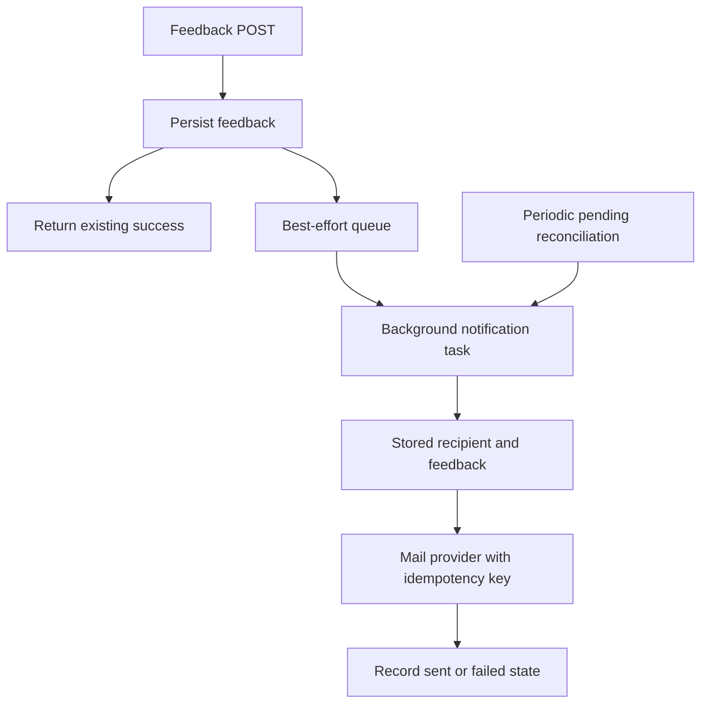

# Site Feedback Email Notifications - Plan

## Goal Capsule

- Objective: email every new site-feedback submission to a recipient managed in Payload, without making notification delivery part of the public submission success path.
- Product authority: the existing feedback persistence, validation, anti-abuse, and visitor confirmation behavior remain authoritative; email is a recoverable downstream notification only.
- Execution profile: add persisted notification state and an idempotent background delivery task, then add the editable recipient and production mail configuration.
- Stop conditions: do not expose feedback or abuse metadata publicly, do not let mail configuration or delivery failures change a successful feedback response, and do not claim production delivery until the provider is configured and a live email is received.
- Tail ownership: implementation owns schema, migration, generated types, tests, PR/CI, deployment observation, and live verification.
- Open blockers: production needs a verified sender and mail-provider credential before live delivery can be confirmed.

---

## Product Contract

### Summary

Each newly stored feedback submission should produce an email notification to the address configured under Site Feedback settings.
The initial recipient is `tataihono@ev.church`, and staff can change or clear it without a deployment.

### Problem Frame

Feedback is currently stored privately in Payload, which requires staff to remember to inspect the admin collection.
The user needs prompt awareness of new submissions, while the public submission path must remain reliable even when email is slow, misconfigured, or unavailable.

### Key Decisions

- **Manage a dedicated recipient under Site Feedback settings.** (session-settled: user-directed — chosen over a deployment-only or hard-coded recipient: staff can change the destination without shipping code) Governs R2, R3.
- **Keep feedback persistence authoritative.** (session-settled: user-directed — chosen over coupling success to email delivery: notification issues must never fail or delay a valid feedback submission) Governs R1, R5, R6.
- **Use the visitor email as Reply-To when supplied.** (session-settled: user-approved — chosen over body-only display: the recipient can reply directly without changing the verified sender) Governs R4.

### Actors

- A1. Public visitor: submits feedback and may provide an email address.
- A2. Feedback recipient: receives the notification and may reply to the visitor.
- A3. Content lead or administrator: manages the notification recipient and reviews delivery state in Payload.
- A4. Background worker: sends and retries notifications independently of the public response.

### Requirements

- R1. Save valid feedback and return the existing success response without waiting for email delivery.
- R2. Add an editable feedback-notification recipient under Site Feedback settings, initially `tataihono@ev.church`.
- R3. Treat a blank recipient as notifications disabled while feedback collection continues normally.
- R4. Send the comment, source page, submission time, and optional visitor email; use the visitor email as Reply-To when present, and exclude client-address digests and user-agent data.
- R5. Deliver notifications through durable background work with bounded automatic retries and duplicate-resistant delivery within the provider idempotency window.
- R6. Mail-provider absence, queuing failure, timeout, rejection, or exhausted retries must not change feedback persistence, the API status, or the visitor confirmation.
- R7. Keep enough private delivery state on each feedback record for staff and recovery work to distinguish pending, sent, and failed notifications.
- R8. Do not send notifications for historical feedback automatically when the feature deploys.
- R9. Log terminal or configuration failures without logging feedback content or visitor email addresses.
- R10. Keep the configured notification recipient unavailable to public global reads and public frontend projections.
- R11. Send only the R4 message fields to a production-approved provider and avoid provider tracking or metadata that unnecessarily retains visitor content.

### Key Flows

- F1. New feedback notification
  - **Trigger:** a valid public feedback submission is persisted.
  - **Actors:** A1, A4, A2.
  - **Steps:** the API returns success from persistence; background work reads the saved submission and its snapshotted intended recipient, sends once through the configured provider, and records delivery state.
  - **Outcome:** the recipient is notified without joining the visitor request lifecycle.
- F2. Delivery failure and recovery
  - **Trigger:** mail delivery cannot start or fails.
  - **Actors:** A4, A3.
  - **Steps:** the public request remains successful; the failure is recorded privately; retryable work retries with duplicate protection; unresolved state remains inspectable.
  - **Outcome:** feedback remains safe in Payload and delivery can recover without visitor action.
- F3. Reply to visitor
  - **Trigger:** the notification contains a visitor email and A2 selects Reply.
  - **Actors:** A2, A1.
  - **Steps:** the verified site address remains From and the visitor address is Reply-To.
  - **Outcome:** the response is addressed to the visitor without spoofing the sender domain.

### Acceptance Examples

- AE1. Given valid feedback and an unavailable mail provider, when the visitor submits, then the feedback is saved and the existing success response is returned with no email error exposed.
- AE2. Given `tataihono@ev.church` is configured and mail delivery is available, when new feedback is saved, then one notification arrives containing the comment, source URL, submission time, the visitor email when supplied, and no abuse metadata.
- AE3. Given the visitor supplied an email, when the recipient replies, then the reply targets the visitor while the notification From address remains the verified site sender.
- AE4. Given the recipient is blank, when feedback is submitted, then it is stored successfully and no notification attempt is made.
- AE5. Given a retry occurs after an ambiguous provider response within 24 hours, when delivery is attempted again, then the stable provider idempotency key prevents a duplicate email.

### Scope Boundaries

- Deferred: multiple recipients, digests, per-user preferences, delivery dashboards, and manual resend controls.
- Excluded: notifying for historical submissions, emailing abuse-control metadata, changing the public feedback form, and making mail part of API success.

### Sources and Research

- `src/app/api/site-feedback/route.ts`
- `src/app/api/site-feedback/route.test.ts`
- `src/collections/SiteFeedback.ts`
- `src/globals/SiteSettings.ts`
- `payload.config.ts`
- `docs/plans/2026-08-12-001-feat-site-feedback-banner-plan.md`
- Payload Jobs Queue and Email documentation, consulted 2026-08-13.
- Resend idempotency-key documentation, consulted 2026-08-13.

---

## Planning Contract

### Key Technical Decisions

- KTD1. **Persist first, notify through Payload jobs.** Create feedback normally, return success from that persistence result, and queue background delivery only through a best-effort boundary that catches and logs queue failures. This instantiates R1, R5, and R6 without changing the public contract.
- KTD2. **Persist private delivery state on the feedback record.** New submissions begin pending only when a recipient is configured; sent and failed outcomes record timestamps and a bounded sanitized failure summary. Existing rows remain unnotified. This supports recovery and staff visibility without a second notification collection. Covers R3, R7, R8, R9.
- KTD3. **Use a one-minute notification queue plus scheduled reconciliation.** A retryable send task handles one feedback ID; a reconciliation task scheduled every five minutes queues pending records whose retry window has not expired. Register a matching `autoRun` entry for the `notifications` queue so both tasks execute in the long-running Railway website process. Covers R5-R7.
- KTD4. **Use Resend's HTTP API with a submission-derived idempotency key and bounded recovery window.** Keep provider code behind a small transport interface, require a verified From value and API key at runtime, apply a timeout, and use one stable idempotency key per feedback record. Retry and reconcile automatically only within Resend's documented 24-hour idempotency window; after that, mark the record terminally failed rather than risk an automatic duplicate. Avoid adding the provider SDK for this single endpoint. Covers R4-R6.
- KTD5. **Snapshot recipient eligibility atomically with the feedback create, then read the stored recipient during delivery.** Read the setting before persistence and include the intended destination and initial notification state in the original feedback document; only enqueueing occurs after successful persistence. Clearing or changing Site Settings affects later submissions, not already pending work. Covers R2, R3, R5, R7.
- KTD6. **Make notification metadata read-only in Admin and private through the existing collection access.** Public requests receive the same `{ ok: true }` envelope and never receive job or provider details. Covers R1, R6, R7, R9.
- KTD7. **Apply field-level privacy to the notification recipient.** Site Settings remains publicly readable for current shell data, so the recipient field itself must be readable only by admin/content-lead users and must never enter `PublicSiteFeedbackSettings`. Covers R10.
- KTD8. **Claim each record before contacting the provider.** Use an atomic pending/retryable-to-sending state transition with a short lease so overlapping jobs cannot send concurrently; a stale lease may be recovered only inside the 24-hour idempotency window. A provider-accepted send followed by a failed state update remains duplicate-resistant only within that documented window and becomes terminal rather than auto-resending afterward. Covers R5-R7.

### High-Level Technical Design

### Assumptions

- Railway's long-running website service can run Payload `autoRun`; the existing config already uses it for default and pipeline queues.
- A Resend account or equivalent compatible HTTP credential can be supplied in production, with an ev.church sender domain verified outside the repository.
- Feedback volume is low enough that a bounded periodic pending scan is inexpensive.
- Notification errors are operational data and must be sanitized before persistence or logging.

### Sequencing

1. Add settings and feedback delivery fields with generated types and a reviewed migration.
2. Add message construction, transport, job handlers, retry/idempotency behavior, and focused tests.
3. Connect post-persistence queuing behind an error-swallowing boundary and add route regression tests.
4. Configure production credentials/sender, deploy, verify submission independence, and confirm one live notification.

---

## Implementation Units

### U1. Notification configuration and persisted delivery state

- **Goal:** make recipient control and private notification status durable.
- **Requirements:** R2, R3, R7-R10.
- **Files:** `src/globals/SiteSettings.ts`, `src/globals/SiteSettings.test.ts`, `src/collections/SiteFeedback.ts`, `src/collections/SiteFeedback.test.ts`, `src/payload-types.ts`, `src/migrations/<timestamp>_site_feedback_email_notifications.ts`, `src/migrations/<timestamp>_site_feedback_email_notifications.json`, `src/migrations/index.ts`, `src/migration-tests/<timestamp>_site_feedback_email_notifications.test.ts`.
- **Approach:** add the dedicated recipient with the selected initial value and field-level read access for admin/content-lead users only; add read-only status, intended recipient, attempt, timestamp, and sanitized-error fields; make the migration preserve existing rows as notification-disabled rather than pending.
- **Test Scenarios:** field defaults and access remain correct; anonymous/public global reads and `PublicSiteFeedbackSettings` cannot expose the recipient; blank recipient is valid and disables later notifications; existing-row migration state cannot trigger historical mail; schema snapshot and migration registration match generated configuration.
- **Verification:** focused global/collection tests, generated-type diff, migration unit test, and migration integration when a disposable PostgreSQL target is confirmed.
- **Dependencies:** none.

### U2. Idempotent background email delivery

- **Goal:** deliver one safe notification per eligible record with retry and recovery behavior.
- **Requirements:** R3-R11.
- **Files:** `src/lib/site-feedback/notification.ts`, `src/lib/site-feedback/notification.test.ts`, `src/jobs/site-feedback-notification.ts`, `src/jobs/site-feedback-notification.test.ts`, `payload.config.ts`, `.env.example`.
- **Approach:** construct text and HTML messages with escaping, keep visitor data out of logs, send only the approved message fields through a time-bounded transport with a stable idempotency key and no open/click tracking, atomically claim records with a recoverable lease, update private delivery state, and register retryable send plus five-minute reconciliation schedules with a matching one-minute `notifications` auto-runner.
- **Test Scenarios:** complete content and Reply-To behavior; omitted Reply-To; HTML escaping; a record with no snapshotted intended recipient does not send; clearing Site Settings does not cancel an already-pending record; missing provider configuration leaves recoverable state; provider rejection and timeout throw for retry; overlapping jobs cannot both contact the provider; provider-accepted/state-update-failed recovery remains idempotent within 24 hours; records outside the window become terminal rather than auto-send; success records provider ID and timestamp; terminal failure is sanitized; jobs queued to `notifications` have a matching runner.
- **Verification:** focused notification/task tests and generated job input types.
- **Dependencies:** U1.

### U3. Submission-path isolation and enqueue recovery

- **Goal:** connect new feedback to notifications without changing any current success or failure behavior.
- **Requirements:** R1, R3, R5, R6, R8.
- **Files:** `src/app/api/site-feedback/route.ts`, `src/app/api/site-feedback/route.test.ts`.
- **Approach:** return the created feedback identity from persistence, snapshot configured notification eligibility, and invoke best-effort queuing only after successful persistence; catch and sanitize every enqueue failure while allowing reconciliation to recover pending work.
- **Test Scenarios:** existing success response remains 201; persistence failure remains 503; queue success occurs after persistence; queue rejection still returns 201; absent recipient does not queue; no invalid request queues; historical feedback is not queued.
- **Verification:** focused route tests including explicit invocation-order and swallowed-error assertions.
- **Dependencies:** U1, U2.

### U4. Production activation and proof

- **Goal:** activate and prove real notification delivery without risking public feedback.
- **Requirements:** R1-R9.
- **Files:** Railway website-service variables and Payload Site Settings; no secret values enter git.
- **Approach:** configure the provider API key and verified sender in Railway, deploy the merged migration/code, confirm the recipient setting, submit one clearly identified production test through the real form, and check the stored record, job outcome, received email, Reply-To, and live response independently.
- **Test Scenarios:** deployment succeeds and remains healthy; valid live feedback returns success before notification processing; the notification arrives once; logs and provider metadata expose no feedback body or visitor email beyond the intended message.
- **Verification:** GitHub CI, Railway deployment revision/status and logs, Payload delivery state, live browser/API flow, and recipient inbox confirmation.
- **Dependencies:** U1-U3 and external provider configuration.

---

## Verification Contract

| Gate | Command or evidence | Proves | Units |
|---|---|---|---|
| Focused schema tests | `pnpm test -- src/globals/SiteSettings.test.ts src/collections/SiteFeedback.test.ts` | Recipient and private status model | U1 |
| Focused notification tests | `pnpm test -- src/lib/site-feedback/notification.test.ts src/jobs/site-feedback-notification.test.ts` | Content safety, retry, timeout, and idempotency | U2 |
| Focused route tests | `pnpm test -- src/app/api/site-feedback/route.test.ts` | Submission isolation and queue recovery | U3 |
| Migration unit | `pnpm test -- src/migration-tests/<timestamp>_site_feedback_email_notifications.test.ts src/migrations-directory.test.ts` | Migration registration and non-historical defaults | U1 |
| Migration integration | `pnpm run test:migration:postgres -- src/migration-tests/<timestamp>_site_feedback_email_notifications.integration.test.ts` | Real PostgreSQL up/down safety when a disposable target is confirmed | U1 |
| Repository quality | `pnpm lint && pnpm build && git diff --check` | Types, generated schema, Next.js production build, and clean diff | U1-U3 |
| Production proof | Approved provider, GitHub checks, Railway successful deployment on merged revision, live feedback response, Payload job/status, and received email | End-to-end behavior and independence | U4 |

---

## Definition of Done

- U1 is done when the recipient and delivery state are private, generated types and migration agree, and pre-existing feedback cannot be notified automatically.
- U2 is done when a retryable, idempotent, escaped notification can be delivered or fail recoverably without logging visitor content.
- U3 is done when route regression tests prove queue and provider problems cannot change the existing feedback response.
- U4 is done only when production is on the merged revision, Railway is healthy, `tataihono@ev.church` is configured, and a live notification is received exactly once with correct Reply-To behavior.
- No abandoned provider experiments, debug routes, plaintext secrets, or unrelated refactors remain in the diff.
