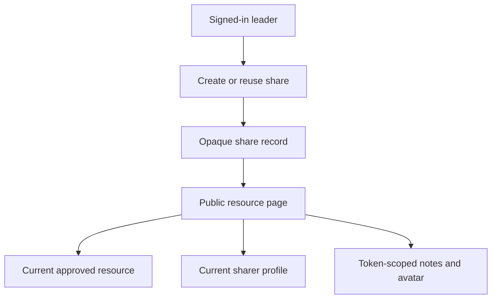

# Shareable Leader Resources - Plan

## Goal Capsule

- **Objective:** Let Connect Group leaders share one current training resource with another person through a stable public link that identifies the leader who shared it.
- **Product authority:** This contract defines the public sharing experience for existing Connect Group leader resources. The member portal and its access rules remain outside this public surface.
- **Open blockers:** None.
- **Execution profile:** Standard, security-sensitive code change with persistent share records, one public page, and two public asset routes.
- **Tail ownership:** LFG owns implementation, review, PR creation, and CI.

---

## Product Contract

### Summary

Add a Share link action to Connect Group leader resources. It copies a permanent opaque link to a public page containing the current resource and identifying the leader who shared it.

### Problem Frame

Leaders can play training videos and open supporting notes inside the member portal, but they cannot share that material with a person they are training without asking them to sign in. Leaders currently fall back to finding and sending separate YouTube or document links, which loses the resource context and the identity of the leader who shared it.

### Key Decisions

- **Share the real resource, not a snapshot** (session-settled: user-approved — chosen over preserving the originally shared version: later resource updates should reach existing links). Governs R5 and R6.
- **Identify the sharing leader without a Connect Group** (session-settled: user-directed — chosen over leader-and-group attribution: the link should stay useful across the leader's groups). Governs R3, R7, and R8.
- **Permanent opaque links** (session-settled: user-directed — chosen over revocable links: revocation is not needed, but identifiers must not be guessable). Governs R3, R4, and R10.
- **Public access is limited to one resource** (session-settled: user-approved — chosen over requiring member login: the recipient needs frictionless access without exposure to the member portal). Governs R5, R6, and R9.

### Actors

- A1. **Sharing leader:** A signed-in Connect Group leader who can access leader resources and creates or reuses a share link.
- A2. **Recipient:** Anyone holding the opaque link, including a person who is not signed in.
- A3. **Resource owner:** EV staff who maintain the source resource, video, description, and leader notes.

### Requirements

**Leader actions**

- R1. Each resource with shareable content offers actions in the order **Play now**, **Notes**, and **Share link**, omitting actions whose content is unavailable.
- R2. Selecting **Share link** copies the public URL to the clipboard and gives an immediate visible acknowledgement such as **Link copied**.
- R3. The public URL is specific to the resource and sharing leader, with no Connect Group identity included.
- R4. The same leader sharing the same resource always receives the same URL, including across repeated clicks and later sessions.

**Public resource page**

- R5. Anyone holding a valid share URL can open the page without signing in and see only the linked resource.
- R6. The page renders the resource's current title, description, video, and leader notes whenever it is opened.
- R7. The page shows the sharing leader's latest full name and avatar.
- R7a. If the sharing leader has no usable photo, the page shows the site's established name-based initials avatar.
- R8. The page does not show a Connect Group name or imply that the resource belongs to one group.
- R9. The page does not expose member navigation, other resources, member-only files beyond the linked leader notes, or other portal data.

**Link lifecycle and failure states**

- R10. The identifier in a share URL is opaque and cannot be derived by substituting visible resource or person IDs.
- R11. A valid link remains usable while the source resource exists, even if the sharing person later stops being a Connect Group leader.
- R12. If the resource no longer exists, the public page shows the normal not-found experience and reveals no information about the leader or former resource.
- R13. If the leader record no longer exists, the public page keeps the resource available but omits the sharer attribution.
- R14. If clipboard access fails, the leader can still copy the URL manually and receives an honest failure message rather than a false success acknowledgement.
- R15. Raw share tokens are excluded or redacted from application logs, analytics, session replay, and error telemetry.
- R16. Shared pages are not indexed, send no referrer, and are not stored in shared caches.

### Key Flows

- F1. **Create or reuse a share link. Covers R2-R4, R10.** A leader selects **Share link**. The system resolves the stable link for that leader and resource, copies it, and acknowledges success.
- F2. **Open a shared resource. Covers R5-R9.** A recipient opens the link without authentication. The page loads the current resource and current sharer attribution while exposing no wider portal surface.
- F3. **Open an older link after change. Covers R6, R11-R13.** The same URL reflects resource and leader updates, survives the leader losing access, and fails safely if its resource is gone.

### Acceptance Examples

- AE1. **Covers R2 and R4.** A leader clicks **Share link** twice for resource 245. Both clicks copy the same opaque URL and show a success acknowledgement.
- AE2. **Covers R3, R7, and R8.** A leader who belongs to several Connect Groups shares a resource. The recipient sees that leader's full name and avatar, but no group name.
- AE3. **Covers R5, R6, and R9.** A signed-out recipient opens a valid link and can view the current video, description, and leader notes. They cannot browse other leader resources or member pages.
- AE4. **Covers R6.** Staff replace the resource video or notes after the link was shared. Opening the existing URL shows the replacement content.
- AE5. **Covers R11.** The sharer later stops leading a Connect Group. The existing link still opens and retains the sharer's current attribution while their person record exists.
- AE6. **Covers R12.** Staff remove the source resource. Opening its former share URL returns the normal not-found experience without exposing the leader's identity.
- AE7. **Covers R14.** Clipboard permission is denied. The interface presents the URL for manual copying and does not say **Link copied**.

### Scope Boundaries

- No Connect Group identity in the URL or public page.
- No link revocation or expiry controls.
- No messaging-platform integration; sharing outside the site begins with copying the URL.
- No public directory, search, related-resource navigation, member roster, attendance, or other member portal capability.
- Member studies and other files are not public unless separately approved; this scope includes only the resource's leader notes.

### Dependencies / Assumptions

- Existing leader resources remain the source of truth for resource content.
- A leader's current profile remains the source of truth for their displayed full name and avatar.
- The sharing leader is authenticated and authorized when the link is first obtained.
- Anyone with the opaque URL may view its public content, so the approved leader notes must be suitable for link-based public access.
- Once a resource has been shared, attaching or replacing its leader notes is an intentional public release through every existing share link for that resource.

### Sources / Research

- `src/app/(frontend)/members/connect-group-leader-resources/[rockId]/page.tsx` provides the existing single-resource member page.
- `src/lib/members/data.ts` exposes the current resource fields and signed-in member profile used by the member experience.
- `src/lib/members/leader-resource-media.ts` maps each resource's stored YouTube URL into the shared media player.

---

## Planning Contract

### Key Technical Decisions

- KTD1. **Persist one random token per resource and leader.** Create an application-owned share record keyed by resource Rock ID and sharer Rock person ID, with a unique opaque token containing at least 128 bits of entropy from Node's cryptographically secure random API. Use a fixed URL-safe format and validate that exact shape before lookup. A uniqueness constraint on the pair makes repeated requests deterministic without encoding either ID in the URL. Governs R3, R4, and R10.
- KTD2. **Resolve public content from current mirrors.** Share records hold scalar identity references only. Each public request reads the current resource and current participant profile, so existing links reflect later edits and omit attribution if the participant disappears. Resource approval or expiry changes do not invalidate an issued link; deletion does. Governs R6, R7, R11-R13.
- KTD3. **Authorize creation, then use capability access.** Only a signed-in Connect Group leader who can access the resource may create or retrieve its share record. Possession of the opaque token authorizes read-only access to that one public resource and its leader notes/avatar assets. Governs R5 and R9.
- KTD4. **Keep public assets token-scoped.** Public notes and avatar routes accept the share token, re-resolve the share, and expose only the asset allowed by that share. Existing member-only asset routes stay protected. Governs R7 and R9.
- KTD5. **Keep the capability store server-only.** Deny all external Payload REST and GraphQL CRUD for share records. Only server-side sharing code may override access, and negative API tests prove the collection cannot become a token directory. Governs R9, R10, and R15.
- KTD6. **Treat capability URLs as secrets in operations.** Shared routes opt out of analytics and replay, redact tokens from logs and errors, emit noindex/nofollow and no-referrer controls, and prevent shared-cache storage. Governs R15 and R16.

### High-Level Design

The implementation adds an application-owned Payload collection for share records. The member resource UI requests the stable share URL through an authenticated server boundary and copies it through a client control. The public page and asset routes resolve the token through a narrow read model that never returns member memberships, email, phone, attendance, or unrelated resources.

### Constraints and Sequencing

- Add the share collection and migration before building routes that depend on it.
- Preserve the existing Rock-synced resource collection as read-only and unchanged by sharing.
- Handle concurrent first-click requests through the resource-and-sharer uniqueness constraint, returning the winning record after a conflict.
- Make the migration additive and data-preserving after first production use. Runtime code may roll back independently, but routine rollback must not drop issued share records; destructive removal requires an explicit backup-and-restore procedure.
- Keep generated Payload types generated by `pnpm build`; do not edit them manually.
- Treat missing, malformed, or unknown tokens uniformly as not found.

---

## Implementation Units

### U1. Persist deterministic share identities

- **Goal:** Create or reuse one opaque share record for an authorized leader and resource.
- **Requirements:** R3, R4, R10, R11.
- **Files:** `src/collections/LeaderResourceShares.ts`, `src/collections/LeaderResourceShares.test.ts`, `src/payload.config.ts` or the active Payload config, `src/migrations/index.ts`, a new migration pair under `src/migrations/`, `src/lib/members/leader-resource-sharing.ts`, and `src/lib/members/leader-resource-sharing.test.ts`.
- **Approach:** Add a server-only application-owned collection with unique token and a database-enforced unique resource/sharer pair. Generate a fixed-format token with at least 128 bits of entropy only for the first record. Resolve concurrent duplicate creation by reading the existing pair. Reuse current resource access but require an active leader membership before creating or returning a share. Deny external Payload CRUD.
- **Test scenarios:** authorized leader gets a URL; repeated requests return the same token; a different leader or resource gets a different token; coaches without a leader membership and other unauthorized users cannot create a share; malformed tokens fail closed; concurrent duplicate creation returns one stable record; external Payload APIs cannot list, read, create, update, or delete shares.
- **Verification:** Focused collection and sharing-library tests pass, and generated types include the new collection.

### U2. Add the public single-resource experience

- **Goal:** Render current resource content and current sharer attribution through one opaque capability URL.
- **Requirements:** R5-R13.
- **Files:** `src/app/(frontend)/shared/leader-resources/[token]/page.tsx`, token-scoped notes and avatar route handlers beneath that route, supporting public read functions in `src/lib/members/leader-resource-sharing.ts`, and focused page/route tests.
- **Approach:** Resolve the share token, then separately load the current resource and participant profile with minimal field selections. Reuse the existing YouTube parsing/player presentation where it does not require member state. Stream only leader notes and the current avatar through token-scoped routes, preserving the existing not-found versus upstream-unavailable distinction. Use the site's initials fallback when the participant exists without a photo. Return the standard not-found experience for absent resources or invalid tokens; omit attribution when only the participant is absent. Apply KTD6 controls to the page and assets.
- **Test scenarios:** signed-out valid access; current video, description, and notes after edits; full name and avatar without group data; missing photo uses initials while its asset route returns not found; missing participant omits attribution; removed resource returns not found; approval or expiry changes do not invalidate an issued link; invalid token reveals nothing; temporary Rock file failure returns unavailable; member studies and unrelated assets remain inaccessible; tokens do not enter telemetry or response metadata.
- **Verification:** Focused public page and asset-route tests pass, including negative access assertions.

### U3. Add Share link to leader resource actions

- **Goal:** Give leaders a reliable copy-to-clipboard action alongside Play now and Notes.
- **Requirements:** R1, R2, R4, R14.
- **Files:** `src/components/members/LeaderResourceShareButton.tsx`, its test file, `src/components/members/LeaderResourceTimeline.tsx`, `src/app/(frontend)/members/connect-group-leader-resources/[rockId]/page.tsx`, and the authenticated share route or server action selected during implementation.
- **Approach:** Reuse the U1 creation boundary and place the action after available Play and Notes actions. Copy the absolute public URL, announce success accessibly, and expose the URL for manual copying when clipboard access fails. If share creation fails, clear loading, retain no stale URL, skip clipboard access, and show an honest retryable error. Apply the action consistently on the resource detail and timeline surfaces that already present Play and Notes.
- **Test scenarios:** action order is Play now, Notes, Share link; unavailable actions are omitted; success copies once and acknowledges; repeated clicks return and copy the same URL; clipboard failure shows the URL and no false success; creation failure clears loading and permits retry without invoking clipboard; loading prevents duplicate visible operations.
- **Verification:** Focused component and authenticated-boundary tests pass, followed by browser checks of desktop and narrow layouts.

---

## Verification Contract

- Run focused Vitest coverage for the new collection, sharing library, public page/routes, and share button.
- Run existing member data, leader resource timeline, media, and authentication regression suites affected by the change.
- Run `pnpm build` to regenerate Payload types and prove the Next.js production build.
- Run `git diff --check`.
- Browser-test a signed-in leader obtaining the same link twice and a signed-out recipient opening that link, viewing notes, and seeing current leader attribution.
- Verify negative paths: token tampering, removed resource, absent participant, and attempts to reach other member assets.

---

## Definition of Done

- U1-U3 are complete with their named tests passing.
- Every requirement R1-R14 and acceptance example AE1-AE7 is covered by implementation or verification evidence.
- The database migration is idempotent and deploys before runtime use.
- The public page exposes only the approved resource, leader notes, and current sharer name/avatar.
- The same leader-resource pair returns the same opaque link across repeated requests.
- Clipboard success and failure states are honest and accessible.
- `pnpm build` and focused regression suites pass.
- Browser verification covers the signed-in sharing flow and signed-out recipient flow.
- Abandoned approaches, debug output, and unrelated changes are absent from the final diff.
