# Connect Group Attendance Entry - Plan

## Goal Capsule

- **Objective:** Let an authenticated Connect Group leader reach a focused attendance screen for a group they actively lead, record or edit one of its four most recent meetings, and persist the canonical result directly in Rock RMS.
- **Product authority:** The requirements and session-settled decisions in this plan override implementation convenience; current repository conventions and verified Rock behavior govern details the contract leaves open.
- **Open blockers:** None for local implementation. U1 begins with a read-only contract probe; if the deployed Rock version exposes neither usable schedule instances nor the schedule/location data needed for compatible recurrence expansion, implementation must stop rather than invent meeting dates.
- **Execution profile:** Code change with authorization, external-API, and user-data risk. Keep production writes outside automated verification.
- **Tail ownership:** LFG owns implementation, focused review, commit, PR creation, and CI follow-through.

---

## Product Contract

### Summary

Add a stable leader-attendance resolver and an ID-based, mobile-first attendance screen. The screen reads scheduled meetings, attendance, notes, and did-not-meet state from Rock, then writes leader edits directly back to Rock.

### Problem Frame

Connect Group leaders follow a legacy link such as `/page/368`, but the rebuilt website has no canonical attendance-entry destination. The existing group page already shows the current roster and historical attendance, yet it cannot record or correct attendance in Rock.

### Actors

- **Connect Group leader:** May record and edit attendance only for a group they actively lead.
- **Connect Group coach:** Retains the existing attendance visibility but cannot use the entry or write flow.
- **Rock RMS:** Owns meeting occurrences, attendance records, notes, and did-not-meet state.
- **Payload Missing Paths administrator:** May configure a legacy path to the stable resolver without a code change.

### Key Decisions

- **Use a stable resolver plus ID-based attendance route.** (session-settled: user-approved — chosen over hard-coding `/page/368` or a Rock group ID: Missing Paths remains the configurable legacy-routing surface.) Governs R1-R5.
- **Use a dedicated attendance screen.** (session-settled: user-directed — chosen over editing inside the metrics roster or sending leaders into Rock: the task should be focused and work well on mobile.) Governs R6-R17.
- **Default a genuinely new meeting to everyone present.** (session-settled: user-directed — chosen over blank or checkbox-only attendance: leaders usually need to change only absences.) Governs R10-R12.
- **Save immediately.** (session-settled: user-directed — chosen over a confirmation dialog: pressing Save should perform the write.) Governs R15-R17.
- **Include notes and exclude visitors.** (session-settled: user-directed — chosen over visitor search or creation in the first release: meeting notes are required while visitor handling is deferred.) Governs R13, R20.
- **Limit entry to group leaders.** (session-settled: user-directed — chosen over coach editing: coaches remain read-only.) Governs R3, R5, R18.

### Requirements

#### Resolver and authorization

- R1. The website must expose `/members/connect-groups/attendance` as a stable authenticated attendance resolver suitable for a configurable Missing Paths destination.
- R2. A signed-out visit to the resolver must preserve that route through member sign-in.
- R3. The resolver must derive active leader memberships from the authenticated member context and must not qualify ordinary memberships or coach status.
- R4. Exactly one led group must redirect to `/members/connect-groups/[rockGroupId]/attendance`; multiple led groups must show a chooser; no led groups must show a private unavailable state.
- R5. Every group-specific page load and save must independently verify that the authenticated member actively leads the requested active group.

#### Meeting reads and editing
- R6. The attendance screen must offer the four most recent non-future scheduled meetings returned by Rock, newest first, and select the newest by default.
- R7. Fewer than four available meetings must render the available set; an unavailable or ambiguous schedule lookup must fail closed without creating attendance.
- R8. Selecting a meeting must load its canonical occurrence, occurrence-level notes, did-not-meet state, and current roster attendance directly from Rock.
- R9. An existing canonical occurrence must distinguish explicit present, explicit absent, and unrecorded Rock states; it must never reinterpret a partial or failed read as a new meeting.
- R10. Only a scheduled meeting proven by a complete Rock read to have no canonical occurrence may initialize every current roster member as Present.
- R11. Each roster row must provide explicit Present and Absent controls, with Present selected initially under R10.
- R12. Visitors and attendance aliases outside the active Connect Group roster must not be displayed, created, deleted, or directly modified by roster saves. Rock's native occurrence-level did-not-meet operation is the explicit exception and may clear marks for every attendee already attached to that occurrence.
- R13. Leaders must be able to read, add, replace, or clear the occurrence-level meeting notes.
- R14. Leaders must be able to select “Group did not meet”; this disables individual controls and saves Rock's occurrence-level state, with individual marks cleared according to Rock semantics.
- R15. Save must write immediately without a confirmation dialog, prevent duplicate submission, and display the intended present/absent totals before and during the write.
- R16. A save must create or reuse the correct occurrence and upsert only the active roster's attendance, notes, and did-not-meet state without duplicating an existing occurrence.
- R17. After saving, the website must read the meeting back from Rock and render the canonical saved result. Definite rejection, timeout/outcome-unknown, and partial-success states must not claim success or retry a write automatically.

#### Access and integration
- R18. Coaches, ordinary members, leaders of another group, removed leaders, malformed IDs, inactive groups, and signed-out requests must be unable to write attendance.
- R19. The existing Connect Group detail page must give eligible leaders a clear link to the group-specific attendance screen and retain its existing roster, metrics, and coach visibility.
- R20. Visitor search/creation, roster mutation, future meeting entry, and attendance older than the four most recent scheduled meetings are outside this release.
- R21. `/page/368` and any legacy page number must not be hard-coded in application routing; administrators may set its destination to the stable resolver through the existing Missing Paths collection.

### Key Flows

- F1. **Legacy entry:** Missing Paths redirects a legacy URL to the stable resolver; member sign-in completes; the resolver routes a one-group leader to the ID-based screen.
- F2. **New meeting:** Rock supplies recent scheduled meetings; the latest has no saved attendance; the roster initializes Present; the leader changes absences/notes and saves; the screen reloads the Rock result.
- F3. **Correction:** The leader chooses another of the four meetings; saved marks, notes, and did-not-meet state load from Rock; Save updates the same occurrence.
- F4. **Did not meet:** The leader selects the occurrence-level option, individual controls disable, Save applies Rock semantics, and read-back confirms the state.
- F5. **Denied or failed:** A non-leader cannot reach the write surface; an incomplete Rock read or uncertain write outcome fails closed and offers a safe reload/retry without an automatic mutation.

### Acceptance Examples

- AE1. Given a signed-out request to `/members/connect-groups/attendance`, successful sign-in returns to the resolver rather than `/members`.
- AE2. Given one active led group with Rock ID 29043, the resolver redirects to `/members/connect-groups/29043/attendance`.
- AE3. Given coach-only access or an ordinary membership, the resolver does not choose that group and a direct save is denied.
- AE4. Given a latest scheduled meeting with no canonical occurrence after a complete Rock read, every active roster member renders Present by default.
- AE5. Given saved explicit absences and notes, reopening the meeting reproduces those values and Save updates rather than duplicates the occurrence.
- AE6. Given “Group did not meet,” roster marking is disabled and Rock read-back shows did-not-meet with no individual attended marks.
- AE7. Given a Rock timeout while determining existing state, the page does not default or save everyone Present.
- AE8. Given `/page/368` configured in Missing Paths to the stable resolver, it redirects through normal data-driven routing; with no configuration, no application constant special-cases it.

### Scope Boundaries

#### In scope

- Stable leader resolver, optional chooser, group-specific entry screen, Rock schedule/occurrence/attendance/notes read-back, leader-only save, and a group-page entry link.

#### Deferred to Follow-Up Work

- Visitor lookup or creation, adding visitors to a group, roster management, broad historical administration, reminders, and attendance analytics changes.

### Sources

- `src/lib/members/data.ts` for authenticated member, membership, group, roster, and current attendance visibility patterns.
- `src/lib/members/attendance.ts` for current Rock occurrence/alias/attendance reads.
- `src/lib/rock-api.ts` for the server-held Rock API boundary.
- `src/lib/missing-paths.ts` and `src/proxy.ts` for data-driven legacy redirects.
- Rock RMS `GroupAttendanceDetail`, `AttendanceService`, and REST attendance controllers for occurrence, mark, note, and did-not-meet semantics.

---

## Planning Contract

### Key Technical Decisions

- KTD1. Add server-only leader-resolution and group-authorization functions beside the current member data boundary; never authorize from client state or the broad leader-resources flag. Implements R3-R5 and R18.
- KTD2. Extend the Rock request client for the exact verbs and empty-body responses required by the selected attendance endpoints while retaining one authenticated, timeout-bounded boundary. Implements R6-R17.
- KTD3. Treat schedule discovery, occurrence read-back, and save as a dedicated attendance-entry service separate from historical metrics aggregation. The entry service owns complete-state validation and visitor exclusion. Implements R6-R17.
- KTD4. Resolve meeting identity by Rock occurrence ID where one exists and by the complete group/date/schedule/location tuple for an unsaved scheduled meeting, preventing duplicate occurrences. Implements R6-R9 and R16.
- KTD5. After every successful mutation, invalidate relevant cached history and re-read canonical Rock state; do not optimistically claim that the local payload is authoritative. Implements R17 and R19.
- KTD6. Use a client leaf for roster editing and save state while routes, authentication, authorization, initial Rock reads, and writes remain server-controlled. Implements R5, R11, R14-R18.
- KTD7. Keep `/page/368` out of source. The shipped code provides only the canonical resolver and specific route; production content configuration is independently verified after deployment. Implements R1 and R21.

### High-Level Technical Design

```mermaid
flowchart LR
  Legacy["Configurable legacy path"] --> Resolver["Stable attendance resolver"]
  Resolver --> Auth["Authenticated member context"]
  Auth --> LedGroups["Active led groups"]
  LedGroups --> Specific["Group ID attendance route"]
  Specific --> Authorize["Re-authorize specific leader"]
  Authorize --> RockRead["Rock schedules and canonical occurrence"]
  RockRead --> Editor["Mobile attendance editor"]
  Editor --> Save["Server save boundary"]
  Save --> RockWrite["Rock occurrence and attendance write"]
  RockWrite --> RockRead
```

### Implementation Constraints

- Do not run automated tests against production Rock or mutate production attendance during implementation.
- A complete successful read is a prerequisite for the all-present default.
- Preserve attendee records outside the active roster and do not implement visitor behavior accidentally through bulk replacement.
- Follow Next.js 16 server/client and async parameter guidance from the installed package docs before adding routes or server mutations.
- Preserve private, no-store behavior on member routes and avoid logging attendance notes or person-level mark payloads.

### Risks and Mitigations

- **Rock API permissions or endpoint mismatch:** Verify the deployed Rock version's endpoint contract and API-key permissions with read-only probes, then use a controlled non-production write smoke before release.
- **Partial multi-record writes:** Prefer Rock's combined/idempotent operation when available; otherwise report uncertain outcomes, re-read canonical state, and never retry automatically.
- **Stale leadership or roster:** The resolver and page may use the synced mirror, but the save boundary must fetch current active group memberships live from Rock, prove the actor still holds a leader role, derive the writable roster from that same response, and fail closed if it cannot.
- **Accidental mass-present record:** Require a complete occurrence and attendance lookup before applying the new-meeting default; display totals on Save.
- **Concurrent leader edits:** Re-read after save and, where Rock exposes stable modified/version data, detect or surface intervening changes rather than overwriting silently.

### Sequencing

U1 establishes the Rock contract, U2 builds authenticated resolution on top of it, U3 builds the editor and save flow, and U4 integrates entry points and regression coverage. U3 depends on U1 and U2; U4 depends on U2 and U3.

---

## Implementation Units

### U1. Rock attendance-entry service

**Goal:** Provide a typed server-only contract for recent scheduled meetings, canonical entry state, and safe occurrence-level save/read-back.

**Requirements:** R6-R17, R20

**Dependencies:** None

**Files:** `src/lib/rock-api.ts`, `src/lib/rock-api.test.ts`, `src/lib/members/attendance-entry.ts`, `src/lib/members/attendance-entry.test.ts`

**Approach:**

1. Begin with read-only endpoint probes against the deployed Rock version. Prefer a supported endpoint that returns schedule instances; otherwise fetch the group's schedule/location identities and expand its iCalendar recurrence with a tested Rock-compatible parser, exclusions, and Auckland timezone handling. Stop if neither contract is available.
2. Extend the shared client only for the verified HTTP methods and response-body behavior required by Rock.
3. Discover the latest four non-future scheduled meeting identities for the group, retaining schedule/location identity and matching existing occurrences.
4. Load occurrence notes, did-not-meet, explicit attendance marks, and current primary aliases; classify a meeting as new only when the complete read proves no canonical occurrence exists.
5. Save the occurrence and live active-roster marks using idempotent identities, preserve out-of-roster attendees during ordinary roster saves, then read back the canonical state. Applying did-not-meet intentionally follows Rock's occurrence-wide clearing semantics, including hidden visitors.
6. Represent definite rejection, outcome-unknown, and partial/read-back failure distinctly.

**Patterns to follow:** `src/lib/members/attendance.ts`, `src/lib/rock-api.ts`, and the error boundaries in `src/lib/rock-connection-signups/server.ts`.

**Test scenarios:**

- Covers AE4. Complete no-record state defaults current roster members Present.
- Covers AE5. Existing true/false/unrecorded marks and occurrence notes round-trip without duplicating the occurrence.
- Covers AE6. Did-not-meet saves occurrence state and clears marks according to Rock semantics.
- Covers AE7. Schedule, occurrence, alias, or attendance read failure never returns a new all-present draft.
- The latest four unique scheduled meetings are ordered newest first; future dates and older meetings are excluded; fewer than four remain valid.
- Duplicate same-day schedules retain distinct complete meeting identities.
- Visitor/out-of-roster attendance is excluded from display and untouched by ordinary roster saves; did-not-meet follows Rock's occurrence-wide clearing semantics.
- Empty notes clear the occurrence note; whitespace and Rock field limits are validated.
- Timeout after a mutation yields outcome-unknown and no automatic retry; successful write must be followed by canonical read-back.
- Empty-body and JSON Rock responses are both handled correctly for supported methods.

**Verification:** Focused service/client tests prove state classification, identity preservation, write safety, and failure semantics without a live mutation.

### U2. Leader resolver and route authorization

**Goal:** Add the stable resolver and reusable server authorization for the ID-based attendance route.

**Requirements:** R1-R5, R18, R21

**Dependencies:** U1 for attendance route data types

**Files:** `src/lib/members/data.ts`, `src/lib/members/data.test.ts`, `src/app/(frontend)/members/connect-groups/attendance/page.tsx`, `src/app/(frontend)/members/connect-groups/attendance/page.test.tsx`, `src/app/(frontend)/members/connect-groups/[rockGroupId]/attendance/page.tsx`, `src/app/(frontend)/members/connect-groups/[rockGroupId]/attendance/page.test.tsx`

**Approach:**

1. Expose active led-group summaries and a specific-group leader context from the existing authenticated participant boundary for resolution and page reads.
2. Preserve the stable resolver through sign-in, redirect a single led group, render a chooser for multiple groups, and show a private unavailable state for none.
3. Independently authorize the group-specific route; coach status and leadership of another group do not grant access. Save must additionally prove live Rock leadership and derive the current writable roster from the same live response.

**Patterns to follow:** `getMemberPortalHome`, `getMemberGroupDetail`, `/members/connect-groups/page.tsx`, and `MemberPortalChrome`.

**Test scenarios:**

- Covers AE1. Signed-out resolver preserves its return path through sign-in.
- Covers AE2. Exactly one active led group redirects to its ID-based attendance route.
- Multiple led groups render only active led groups as choices; no led groups render the private unavailable state.
- Covers AE3. Coach-only, ordinary member, leader of another group, removed leader, inactive group, malformed ID, and signed-out direct requests cannot obtain an editable context.
- A direct save authorization check reaches the same group-specific leader decision rather than trusting route rendering.

**Verification:** Route and data tests prove all resolver branches and server-side authorization boundaries.

### U3. Mobile attendance editor and save handler

**Goal:** Deliver the dedicated editor with recent-meeting selection, all-present new drafts, notes, did-not-meet, immediate save, and canonical reload.

**Requirements:** R6-R18

**Dependencies:** U1, U2

**Files:** `src/components/members/ConnectGroupAttendanceEditor.tsx`, `src/components/members/ConnectGroupAttendanceEditor.test.tsx`, `src/app/(frontend)/members/connect-groups/[rockGroupId]/attendance/actions.ts`, `src/app/(frontend)/members/connect-groups/[rockGroupId]/attendance/actions.test.ts`

**Approach:**

1. Render recent meeting selection and a Present/Absent segmented control per current roster member.
2. Default only meetings with no canonical occurrence to Present. Existing unrecorded members remain unmarked, are omitted from totals, and must be explicitly marked Present or Absent before Save enables.
3. Add occurrence-level notes and did-not-meet behavior, including disabled marks when selected.
4. Changing meetings immediately disables Save and the editor, shows meeting-specific loading, ignores stale responses, and renders either the newly loaded canonical state or a non-writable error/empty state.
5. Show live totals on an immediate Save control, disable duplicate submission, authorize again live against Rock, and replace the editor with canonical read-back state after success.
6. Provide distinct, actionable failure states without logging sensitive content or automatically replaying an uncertain write.
7. Use semantic radio groups with member-specific labels, keyboard support, accessible disabled states, touch-sized targets, focus recovery after errors, and polite saved/error status announcements.

**Patterns to follow:** interactive leaf components under `src/components/members/`, private member routes, and server-side Rock form handlers.

**Test scenarios:**

- New meetings initialize all roster rows Present; changing one row updates displayed totals.
- Existing explicit marks and notes render correctly and remain editable.
- Unrecorded existing marks remain distinguishable, are omitted from totals, and block Save until the leader marks them.
- Changing meetings disables stale controls, ignores an out-of-order response, and handles zero recent meetings without exposing a writable editor.
- Did-not-meet disables rows, remains saved/readable with notes, and switching it off uses canonical Rock state rather than resurrecting cleared local marks.
- Save fires once without a confirmation dialog and remains disabled while pending.
- Definite rejection, timeout/outcome-unknown, and canonical read-back failure show distinct recovery guidance and never claim success.
- Direct action calls by every R18 denied actor fail before any Rock mutation.
- Roster changes between load and save cannot write a person no longer in the current authorized roster.
- Keyboard and screen-reader users can operate every mark, notes, did-not-meet, meeting selection, and save state with useful focus and status announcements.

**Verification:** Component and action tests prove interaction state, leader-only writes, sensitive failure handling, and canonical reload.

### U4. Group-page entry and configurable legacy routing regression

**Goal:** Make the feature discoverable from the existing group experience while keeping legacy routing entirely data-driven.

**Requirements:** R19, R21

**Dependencies:** U2, U3

**Files:** `src/app/(frontend)/members/connect-groups/[rockGroupId]/page.tsx`, `src/app/(frontend)/members/connect-groups/[rockGroupId]/page.test.tsx`, `src/proxy.test.ts`, `src/lib/missing-paths.test.ts`

**Approach:**

1. Add a clear attendance action only for the active leader of that group; coaches retain the current metrics view without the action.
2. Add regression coverage showing Missing Paths may target the stable resolver and that no page number is embedded in application redirect configuration.
3. Keep the existing roster, resources, contact actions, and attendance metrics unchanged.

**Test scenarios:**

- A group leader sees a link to the correct group-ID attendance route; an ordinary member and coach do not.
- Covers AE8. Configured `/page/368` data resolves to the stable route through the existing proxy lookup, while an unconfigured path remains unresolved.
- No `next.config.ts`, proxy constant, or route component contains a legacy page-specific redirect.
- Existing member and coach group-page variants retain their prior content and attendance visibility.

**Verification:** Focused page/proxy tests and browser QA prove discoverability and data-driven legacy routing without regressions.

---

## Verification Contract

- Run focused Vitest coverage for `attendance-entry`, member data, resolver/specific routes, editor/action, group detail, Rock client, proxy, and missing-path behavior.
- Run the full `pnpm test` suite.
- Run `pnpm build` because the work adds App Router routes, server actions, client components, and external integration types.
- Run authenticated browser QA at mobile and desktop widths for one-group resolution, meeting selection, new defaults, existing edits, notes, did-not-meet, denial states, and group-page navigation.
- Use mocked Rock writes for repeatable automated coverage. The PR does not authorize deployment, production content mutation, or live attendance writes.

### Post-Merge Rollout Prerequisites

- Provision and verify a dedicated per-environment Rock integration identity with only the group, membership, schedule, occurrence, attendance, and alias permissions required by this feature; document rotation ownership and confirm it cannot mutate unrelated Rock entities.
- With explicit approval, perform a controlled write/read-back smoke against a non-production or designated test group.
- Configure `/page/368` to target the stable resolver through production Missing Paths, then verify the deployed redirect and signed-in flow separately.

---

## Definition of Done

- Every R-ID and applicable AE-ID is implemented and covered by the units above.
- Only an active leader of the requested group can mutate its attendance; direct handler bypasses fail closed.
- Rock is authoritative on load and after save; incomplete reads never trigger an all-present draft.
- The latest four scheduled meetings, explicit marks, notes, did-not-meet, visitor exclusion, and immediate-save behavior round-trip safely.
- The stable resolver and ID-based route work for signed-out, zero-, one-, and multi-led-group states.
- `/page/368` remains absent from application routing and can target the resolver through Missing Paths data.
- Focused tests, full tests, production build, browser QA with mocked Rock writes, commit, PR, and CI complete within LFG's authorized tail.
- The dedicated Rock credential, controlled Rock write smoke, production Missing Paths configuration, and live redirect verification remain explicit post-merge rollout prerequisites and are not claimed complete by this PR.
- No abandoned experiments, debug logging, temporary credentials, or unrelated refactors remain in the diff.
