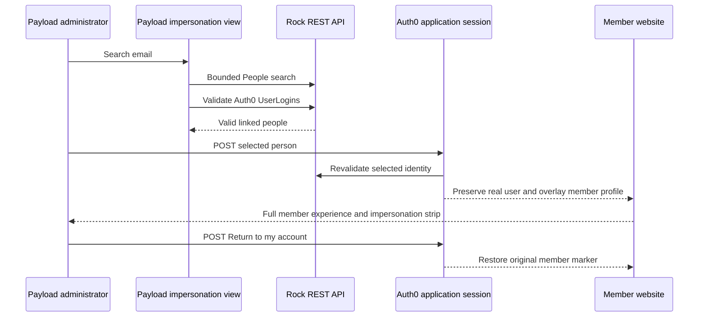

# Admin Member Impersonation - Plan

## Goal Capsule

- **Objective:** Let a Payload administrator reproduce a member's website experience by searching Rock for an Auth0-linked person and temporarily using that person's member profile.
- **Product authority:** The Product Contract and session-settled decisions in this plan govern behavior, followed by `AGENTS.md` and the existing Auth0, Rock, Payload, and member-access boundaries.
- **Execution profile:** Security-sensitive feature spanning a Rock read path, the shared Auth0 session, a protected Payload custom view, and the public header.
- **Open blockers:** None for local implementation. Broad Rock search permission is a release gate; failure leaves impersonation unavailable without changing existing sign-in behavior.
- **Stop conditions:** Stop if target selection cannot validate the expected Auth0 `UserLogin`, if implementation would replace the real admin identity, if a non-admin can reach any search or start action, or if the Rock credential needs write access.
- **Tail ownership:** LFG owns implementation, focused tests, build, browser verification, review, pull request creation, and CI follow-through.

---

## Product Contract

### Summary

Payload administrators can search Rock by email for people with a valid Auth0-linked login and impersonate one member across the website.
The member experience remains fully interactive while a persistent top strip identifies the impersonated member and returns the administrator to their own account.

### Problem Frame

Members can report access problems that depend on their Rock person, Connect Group memberships, or leadership state.
An administrator cannot currently reproduce the exact member authorization result without using that person's account.
The website does not keep a local registry of ordinary member identities, while Rock already owns the Auth0-to-person association used by member sign-in.

### Key Decisions

- **Use Rock's Auth0-linked people as the searchable user directory.** (session-settled: user-directed — chosen over scanning Auth0 or creating a local member registry: Rock already holds the identity-to-person association required by the member experience.) Governs R2-R5, R13.
- **Provide full impersonation.** (session-settled: user-directed — chosen over a read-only preview: troubleshooting must reproduce everything the member can do.) Governs R7-R8.
- **Restrict impersonation to the exact Payload `admin` role.** (session-settled: user-directed — chosen over the broader set of Payload panel roles: content leads and editors must not receive this capability.) Governs R1, R6, R12.
- **Do not add impersonation auditing.** (session-settled: user-directed — chosen over a new audit log or impersonation-history subsystem: the requested tool should remain narrowly scoped.) Governs R11.
- **Replace the feedback strip while impersonating.** (session-settled: user-approved — chosen over stacking two fixed banners: impersonation state must remain obvious without creating competing top bars.) Governs R9-R10.

### Requirements

**Administrator entry and search**

- R1. The public account control offers an **Admin** link whenever the real authenticated Payload user has the exact `admin` role, even when that administrator has no resolved Rock member profile.
- R2. The Payload admin panel provides an **Impersonate User** view that searches Rock by email without creating local member records.
- R3. Search results include only Rock people linked to the expected Auth0 authentication entity through a valid `UserLogin`.
- R4. Each result shows enough non-sensitive profile information to distinguish candidates, including name and email.
- R5. Empty, malformed, ambiguous, denied, timed-out, or unavailable Rock results fail closed and do not start impersonation.
- R6. Search and start actions re-check the real Payload user's exact `admin` role on the server for every request.

**Impersonated member behavior**

- R7. Starting impersonation makes member pages, assets, group access, leader access, attendance actions, and other member authorization behave as the selected Rock person.
- R8. Impersonation does not downgrade the member experience to read-only or add action-specific exceptions.
- R9. While impersonating, the normal feedback strip is replaced by a persistent strip naming the impersonated member and offering **Return to my account**.
- R10. Returning restores the administrator's original member profile state and the normal feedback-strip behavior without requiring a new Auth0 login.

**Identity and scope boundaries**

- R11. The feature adds no audit log, impersonation history, member registry, or database migration.
- R12. Impersonation never replaces the Auth0 session's real user identity or grants Payload access through the impersonated member.
- R13. Email is a search term only; the selected member is authorized through the validated Rock person and Auth0 `UserLogin` association.
- R14. Identity subjects, Rock person IDs, raw Rock responses, cookies, and profile data are not written to application logs.
- R15. Active impersonation cannot be nested or switched without first returning to the original account.

### Actors

- A1. **Payload administrator:** Holds the exact Payload `admin` role, searches for a member, impersonates them, and returns to their own account.
- A2. **Rock:** Supplies candidate people and the Auth0 `UserLogin` association used to validate each candidate.
- A3. **Website member boundary:** Uses the active member profile for member authorization while retaining the real Auth0 identity for Payload authorization.

### Key Flows

- F1. Find an impersonation target
  - **Trigger:** A1 opens the admin impersonation view and submits an email search.
  - **Actors:** A1, A2
  - **Steps:** The server verifies A1's exact Payload role, searches Rock for bounded person candidates, validates each candidate's expected Auth0 login, and returns safe display fields.
  - **Outcome:** A1 sees only valid member targets or a private failure state.
  - **Covers:** R2-R6, R13-R14.
- F2. Start impersonation
  - **Trigger:** A1 selects a validated result.
  - **Actors:** A1, A2, A3
  - **Steps:** The server re-verifies A1, re-validates the selected Rock identity, preserves the original member profile marker, and activates the target member profile without replacing the Auth0 user.
  - **Outcome:** Member authorization behaves as the selected person and the impersonation strip replaces the feedback strip.
  - **Covers:** R6-R9, R12-R15.
- F3. Return to the administrator
  - **Trigger:** A1 selects **Return to my account**.
  - **Actors:** A1, A3
  - **Steps:** The server restores the saved original member marker, removes impersonation state, and redirects to a safe website destination.
  - **Outcome:** The administrator remains authenticated as themselves and normal header behavior returns.
  - **Covers:** R9-R10, R12, R15.

### Acceptance Examples

- AE1. **Covers R1, R6, R12.** Given an editor, content lead, roleless user, or anonymous visitor, when they inspect the account control or request an impersonation surface directly, then no capability is exposed and the server refuses the request; an exact admin without a Rock profile still receives the admin entry point.
- AE2. **Covers R2-R5, R13.** Given an administrator searches for part of an email, when Rock returns people with and without the expected Auth0 login, then only validated linked people appear.
- AE3. **Covers R5-R6.** Given Rock rejects the broad search or becomes unavailable, when an administrator searches or starts impersonation, then the operation fails privately and the current session remains unchanged.
- AE4. **Covers R7-R8.** Given the target is an ordinary member, leader, or coach, when the administrator visits member pages or submits a permitted member action, then access and behavior match that target's Rock memberships and roles.
- AE5. **Covers R9-R10.** Given feedback is configured and impersonation is active, when any public page renders, then the impersonation strip occupies the feedback-strip position; after return, ordinary feedback behavior resumes.
- AE6. **Covers R10, R12, R15.** Given an administrator had either a resolved or unresolved personal Rock profile before impersonation, when they return, then that exact prior state is restored and no nested impersonation remains.
- AE7. **Covers R11, R14.** Given searches, impersonated actions, and return occur, when storage and logs are inspected, then no new impersonation record exists and no sensitive identity value was logged by this feature.

### Scope Boundaries

**Included**

- A live, bounded Rock email search for Auth0-linked people.
- A protected Payload root view for search and target selection.
- Session-scoped full member impersonation and explicit return.
- An admin-only account-menu link.
- Replacement of the feedback strip during impersonation.

**Excluded**

- Auth0 Management API integration or tenant-user export.
- A local member-user collection, backfill, sync, or migration.
- Audit logs, impersonation history, approval workflows, or dedicated permissions.
- Read-only mode, action allowlists, or per-feature impersonation exceptions.
- Rock people without a valid Auth0-linked login.

---

## Planning Contract

### Key Technical Decisions

- KTD1. **Search people first, then validate Auth0 logins.** Use the existing server-only Rock client to run a bounded escaped email search against `People`, then validate returned person IDs against `UserLogins` and the existing `AUTH0_ROCK_ENTITY_TYPE_GUID`. This avoids depending on navigation-property filtering that the current adapter does not use. Covers R2-R5, R13-R14.
- KTD2. **Keep the Auth0 user immutable and overlay only member state.** Store a validated impersonation marker alongside the current session, preserve the original `rockProfile` marker, and project the target profile through the existing member-session reader. Payload authorization continues to resolve from `session.user`. Covers R7-R8, R10, R12, R15.
- KTD3. **Use explicit POST transitions.** Start and return use same-origin POST route handlers, reject untrusted requests, validate current session state, and update the encrypted Auth0 application session before redirecting to a fixed safe path. Covers R5-R6, R10, R12, R15.
- KTD4. **Secure the custom Payload view in the component.** Payload custom root views are public by default, so the server view checks `initPageResult.req.user` for the exact `admin` role before rendering or searching. The start handler independently repeats the same authorization. Covers R1-R6, R12.
- KTD5. **Give impersonation strip precedence in the existing offset shell.** Extend `SiteHeader` to render one measured strip: impersonation when active, otherwise the dismissible feedback strip. The impersonation strip is not dismissible and posts to the return handler. Covers R9-R10.
- KTD6. **Avoid persistence and schema work.** Keep search results and impersonation state request/session scoped. No Payload collection, migration, job, cache, or audit sink is introduced. Covers R11, R14.

### High-Level Technical Design

### System-Wide Impact

- **Authentication:** The Auth0 identity remains the administrator. Only session-local member profile state changes.
- **Authorization:** Payload checks use the real local Payload user; member checks use the impersonated Rock person.
- **Rock:** The feature adds bounded read traffic and must use the existing credential without expanding it to writes.
- **Public layout:** Impersonation becomes the highest-priority fixed strip and feeds the existing header offset behavior.
- **Persistence:** No database schema or durable data lifecycle changes.

### Risks and Dependencies

- The current Rock API credential may permit exact `UserLogin` lookup but reject broad person or login queries. Implementation must characterize this with a safe read-only request and retain a private unavailable state if denied.
- Rock email filtering may be case-insensitive or may not support the preferred substring function. The adapter must keep filtering bounded, escape OData literals, and locally validate returned email text without falling back to email as identity.
- Session-cookie growth can exceed browser limits if raw responses or duplicate profiles are stored. The marker must contain only the original member marker and the minimal validated target profile.
- An administrator may lose the `admin` role while impersonating. New search/start requests must fail immediately; return remains available so the session cannot become trapped.
- Payload or session lookup can fail while rendering a public page. Admin-link discovery must fail closed without affecting the member account control or anonymous page rendering.
- Full impersonation can create real member-side mutations. This is intentional product scope, and tests must prove the target member identity reaches existing mutation authorization unchanged.

### Sources and Research

- `src/auth/rock-member-profile.ts:274` — exact Auth0 subject to Rock `UserLogin` and person validation.
- `src/auth/member-rock-client.ts:14` — server-only authenticated Rock request pattern.
- `src/auth/member-session.ts:67` — validated member marker and current-session projection.
- `src/auth/auth0-payload-strategy.ts:14` — Auth0 identity to current Payload-role authorization.
- `src/components/layout/SiteHeader.tsx:9` — measured feedback strip and fixed-header offset pattern.
- `src/components/layout/MemberAccountControl.tsx:355` — current account-menu item pattern.
- `docs/solutions/architecture-patterns/auth0-authentication-payload-authorization.md` — established rule that Auth0 proves identity while Payload owns admin authorization.
- [Payload custom views](https://payloadcms.com/docs/custom-components/custom-views) — root-view configuration, server props, and explicit view security requirement.
- [Auth0 Next.js SDK `updateSession`](https://auth0.github.io/nextjs-auth0/classes/server.Auth0Client.html) — supported application-session update mechanism.

---

## Implementation Units

### U1. Add the bounded Rock Auth0-user directory

- **Goal:** Search Rock by email and return only minimally shaped people with a validated Auth0 login.
- **Requirements:** R2-R5, R13-R14; KTD1, KTD6.
- **Files:** `src/auth/rock-member-directory.ts`, `src/auth/rock-member-directory.test.ts`, `src/auth/rock-member-profile.ts` if shared parsing helpers need narrow extraction.
- **Approach:** Reuse `memberRockFetch`, request only needed person and login fields, bound result counts and timeouts, escape user input, validate response shapes, and categorize upstream failures without logging identity data.
- **Test scenarios:**
  - Partial and case-varied email text returns bounded candidates that also have the expected Auth0 `UserLogin`.
  - People without a matching login, wrong authentication entity, missing person link, invalid email, or malformed response are excluded or fail closed as appropriate.
  - Quotes and OData-like input remain escaped and cannot broaden the filter.
  - Empty, short, oversized, timed-out, rate-limited, denied, and 5xx searches return categorized private failures.
  - Revalidation by selected Rock person ID returns the same minimal profile only when the valid Auth0 link still exists.
- **Verification:** `pnpm vitest run src/auth/rock-member-directory.test.ts src/auth/rock-member-profile.test.ts`.

### U2. Add secure session impersonation transitions

- **Goal:** Start and stop full member impersonation without changing the real Auth0 or Payload identity.
- **Requirements:** R5-R8, R10-R15; KTD2-KTD3, KTD6.
- **Files:** `src/auth/member-session.ts`, `src/auth/member-session.test.ts`, `src/auth/member-impersonation.ts`, `src/auth/member-impersonation.test.ts`, `src/app/(frontend)/member-impersonation/start/route.ts`, `src/app/(frontend)/member-impersonation/start/route.test.ts`, `src/app/(frontend)/member-impersonation/stop/route.ts`, `src/app/(frontend)/member-impersonation/stop/route.test.ts`.
- **Approach:** Define a strictly validated versioned marker, keep `session.user` untouched, preserve the prior `rockProfile`, revalidate target identity at start, and restore the prior marker at stop. Use same-origin POST requests, fixed redirects, no nesting, and no identity logging.
- **Test scenarios:**
  - Exact Payload admins can start impersonation after target revalidation; editors, content leads, roleless users, anonymous users, and cross-site requests cannot.
  - Starting stores only minimal target and original-profile state while leaving `session.user` unchanged.
  - Existing member readers return the target profile during impersonation, so current group/leader authorization receives the selected person ID.
  - Stop restores resolved, unresolved, legacy, and absent original profile markers and removes impersonation state.
  - Stop remains available after role removal, while a second start or nested target switch is rejected.
  - Failed Rock revalidation or session update leaves the original session unchanged.
- **Verification:** `pnpm vitest run src/auth/member-session.test.ts src/auth/member-impersonation.test.ts 'src/app/(frontend)/member-impersonation/start/route.test.ts' 'src/app/(frontend)/member-impersonation/stop/route.test.ts'`.

### U3. Add the protected Payload search view and admin account link

- **Goal:** Give exact Payload admins a minimal search-and-select interface and an account-menu route into admin.
- **Requirements:** R1-R6, R12-R14; KTD1, KTD4.
- **Files:** `payload.config.ts`, `src/components/admin/MemberImpersonationView.tsx`, `src/components/admin/MemberImpersonationView.test.tsx`, `src/components/layout/MemberAccountControl.tsx`, `src/components/layout/MemberAccountControl.test.tsx`, `src/app/(frontend)/layout.tsx`, `src/auth/payload-admin-session.ts`, `src/auth/payload-admin-session.test.ts`, `src/app/(payload)/admin/importMap.js` if regenerated by Payload.
- **Approach:** Register an exact custom root view under `/admin`, render a server-side GET search against U1, post selected targets to U2, and return a not-found/denied state for non-admins. Resolve exact real-admin status from the unchanged Auth0 identity and pass only an optional admin URL into the existing account control.
- **Test scenarios:**
  - Exact admins see the custom view and search results; every other role and anonymous access receives no useful view or data.
  - Search renders validation, no-result, unavailable, and bounded-result states without exposing raw Rock responses.
  - Target selection posts only the selected Rock person identifier to the start handler.
  - Desktop, mobile-icon, and drawer account controls show **Admin** only for exact admins, including an admin without a resolved Rock member profile, and preserve existing member links and logout behavior.
  - Generated Payload import-map output resolves the custom view.
- **Verification:** `pnpm vitest run src/components/admin/MemberImpersonationView.test.tsx src/components/layout/MemberAccountControl.test.tsx src/auth/payload-admin-session.test.ts` and `pnpm run generate:types`.

### U4. Replace feedback with the persistent impersonation strip

- **Goal:** Keep impersonation visible on every normal website page and provide a one-action return path.
- **Requirements:** R7-R10, R12, R15; KTD2, KTD5.
- **Files:** `src/components/layout/ImpersonationStrip.tsx`, `src/components/layout/SiteHeader.tsx`, `src/components/layout/SiteHeader.dom.test.tsx`, `src/app/(frontend)/layout.tsx`, and existing member-page tests only where needed to prove target identity propagation.
- **Approach:** Pass minimal impersonation display state from the server layout to `SiteHeader`; render one measured fixed strip with impersonation taking precedence over feedback; keep the strip non-dismissible and submit return through U2.
- **Test scenarios:**
  - Active impersonation renders the target name and return action, never the feedback prompt, regardless of feedback dismissal state.
  - No impersonation preserves current feedback visibility, dismissal persistence, spacer height, and header offset behavior.
  - Strip resizing updates the header offset and spacer through the existing observer pattern.
  - Return submits a same-origin POST and does not expose a target or original identity in the URL.
  - Member home, group, leader-resource, and attendance loaders receive the impersonated person ID through the unchanged member-session API.
- **Verification:** `pnpm vitest run src/components/layout/SiteHeader.dom.test.tsx src/components/layout/MemberAccountControl.test.tsx src/lib/members/data.test.ts`.

---

## Verification Contract

| Gate | Command or proof | Covers |
|---|---|---|
| Rock directory | `pnpm vitest run src/auth/rock-member-directory.test.ts src/auth/rock-member-profile.test.ts` | U1 |
| Session and routes | `pnpm vitest run src/auth/member-session.test.ts src/auth/member-impersonation.test.ts 'src/app/(frontend)/member-impersonation/start/route.test.ts' 'src/app/(frontend)/member-impersonation/stop/route.test.ts'` | U2 |
| Admin and menus | `pnpm vitest run src/components/admin/MemberImpersonationView.test.tsx src/components/layout/MemberAccountControl.test.tsx src/auth/payload-admin-session.test.ts` | U3 |
| Public strip and member propagation | `pnpm vitest run src/components/layout/SiteHeader.dom.test.tsx src/lib/members/data.test.ts` | U4 |
| Full regression | `pnpm test` | U1-U4 |
| Generated types and production compilation | `pnpm build` | U1-U4 |
| Read-only Rock contract | Against the intended environment, search an operator-owned test email and report only candidate count, validation count, and categorized failure; print no identity or profile values | U1 |
| Browser acceptance | As an exact admin, search the controlled member, impersonate them, verify affected member pages and one approved action, confirm strip precedence, return, and confirm admin access and feedback behavior | U2-U4 |

Do not run the read-only Rock contract or browser acceptance until the target environment and its database are confirmed safe.
Any Payload schema reconciliation prompt is a stop condition; this feature requires no schema change.

---

## Definition of Done

- D1. R1-R15 and AE1-AE7 are satisfied by implementation and focused tests.
- D2. The real Auth0 identity and current Payload role remain the sole admin authorization source throughout impersonation.
- D3. Rock search is bounded, read-only, escaped, response-validated, and proven against the intended credential without exposing identity values.
- D4. Full member behavior uses the impersonated Rock person through the existing member-session API.
- D5. The impersonation strip replaces feedback, remains non-dismissible, and returns to the exact original member-profile state.
- D6. No collection, migration, audit log, member registry, Auth0 Management API permission, or Rock write permission is added.
- D7. Focused tests, `pnpm test`, and `pnpm build` pass.
- D8. Browser acceptance passes for desktop and mobile account menus, admin search, impersonation, affected member access, strip behavior, and return.
- D9. Generated Payload artifacts required by the custom view are committed and unrelated generated changes are absent.
- D10. The final diff contains no abandoned experiments, identity-bearing debug output, or unrelated cleanup.
