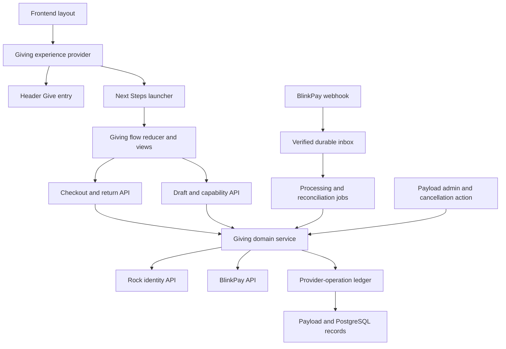
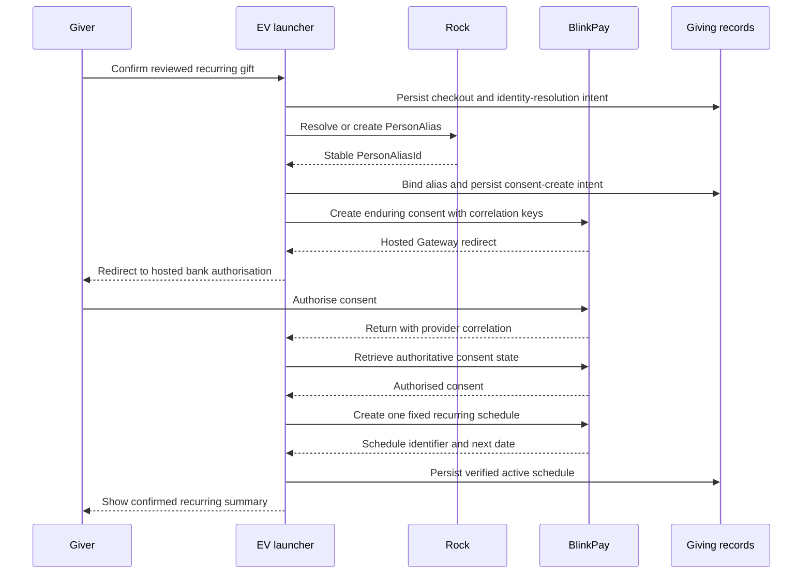
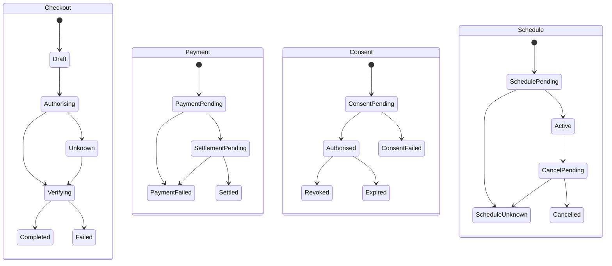
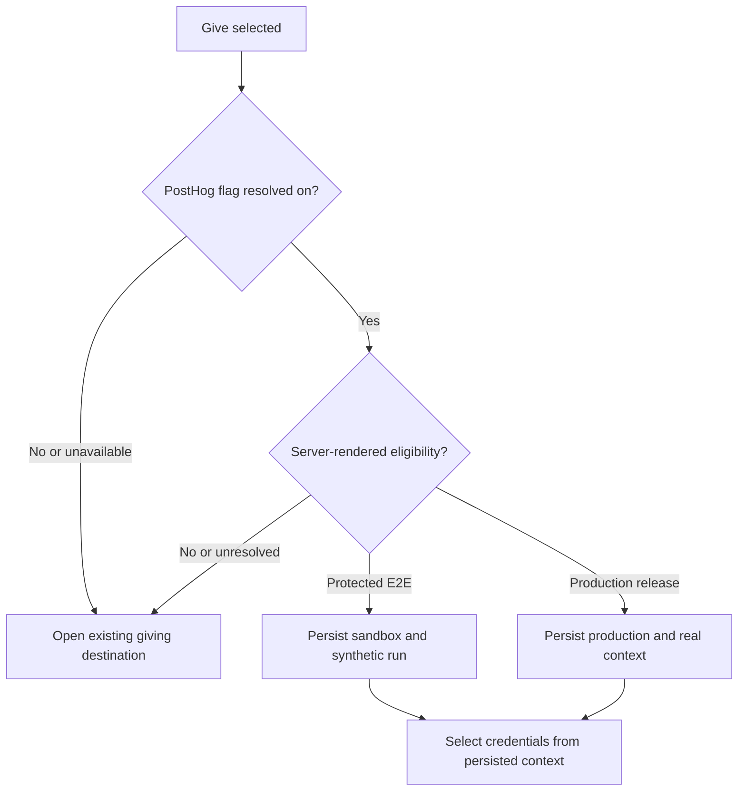

# Launcher Giving Pilot - Plan

## Goal Capsule

- **Objective:** Let a person configure and authorise a one-off or fixed recurring bank-account gift from the EV Church launcher with the shortest practical flow and a gentle preference for recurring giving.
- **Product authority:** The giving-flow decisions were settled in the product conversation. BlinkPay's current Going Live, Testing, Recurring Payments, and Fixed Recurring Payments documentation owns the external production-readiness contract.
- **Execution profile:** This is a financial integration pilot involving persisted giving records, hosted bank authorisation, signed webhooks, administrative controls, feature-flagged exposure, monitoring, and E2E evidence.
- **Stop conditions:** Do not enable real giving until BlinkPay certification is complete, production credentials are isolated from sandbox credentials, the production-readiness acceptance examples pass, and a controlled real-money smoke test succeeds.
- **Tail ownership:** Implementation may prepare the production-shaped integration and sandbox proof. Production credentials, real-money tests, public feature-flag exposure, deployment, and external financial-system mutations remain explicitly controlled release actions.

---

## Product Contract

### Summary

EV Church will replace the launcher and header's disconnected external giving journey with a concise, mobile-first giving flow that asks one question at a time and hands bank authorisation to BlinkPay's hosted Gateway. BlinkPay will execute fixed recurring gifts through Fixed Recurring Payment schedules, while EV owns giver identity, fund allocation, reconciliation identifiers, administration, confirmations, and operational evidence.

### Problem Frame

Giving currently takes people from the EV Church website to a different giving website. That transition breaks the continuity of the launcher, adds friction at a high-intent moment, and prevents EV from shaping a short mobile experience or automatically associating digital gifts with known people and funds.

The Nucleus reference demonstrates the desired interaction discipline: one decision per view, very little explanatory text, compact summaries of earlier choices, and the ability to go back without losing later configuration. The supplied church-giving report indicates that recurring and bank-account giving account for disproportionate giving volume in its Nucleus dataset. EV will use that evidence directionally to prioritise recurring giving without hiding or obstructing one-off gifts.

### Actors

- A1. A guest who wants to give without creating or signing into an account.
- A2. A signed-in EV member whose known name and email can be reused.
- A3. An authorised EV giving administrator managing funds, givers, gifts, schedules, and exceptions.
- A4. BlinkPay's hosted Gateway, consent, payment, fixed-recurring-payment, and webhook services.
- A5. An EV operator responsible for production access, monitoring, incident response, and controlled rollout.

### Key Decisions

- **Use BlinkPay's hosted Gateway.** (session-settled: user-directed — chosen over sending the giver to an unrelated giving website or implementing a direct bank-selection flow: the experience should remain recognisably EV while BlinkPay owns bank authorisation.) Governs R1, R13, R20 and R21.
- **Let BlinkPay manage fixed recurring execution.** (session-settled: user-directed — chosen over an EV-owned payment scheduler: BlinkPay supports Fixed Recurring Payment schedules with starting dates, retries, cancellation, status and webhooks.) Governs R7-R10 and R26-R29.
- **Prioritise recurring giving gently.** (session-settled: user-directed — chosen over equal visual weight or a recurring-only path: recurring giving is strategically valuable while one-off giving must remain clear and available.) Governs R5 and R6.
- **Ask guests for identity immediately before BlinkPay.** (session-settled: user-directed — chosen over asking at the beginning: early configuration should feel fast, and known signed-in data should not be collected twice.) Governs R14, R15 and R21.
- **Use PostHog for controlled exposure.** (session-settled: user-directed — chosen over a PostgreSQL feature flag: staff must be able to prove sandbox and production behaviour before public activation.) Governs R34-R40.
- **Run marked sandbox E2E journeys against the production origin.** (session-settled: user-directed — chosen over limiting E2E to a local or preview deployment: the deployed EV return paths and launcher must be proven without creating real transactions.) Governs R38-R40.
- **Use Rock `PersonAliasId` as the permanent giver identity.** (session-settled: user-directed — chosen over Rock's mutable Giving ID: the live Rock API confirms aliases remain mapped to the surviving person after a merge, while `P{PersonId}` and `G{GivingGroupId}` can change.) Governs R20-R24, R26 and R27.
- **Match an unsigned guest only by one unique normalised email.** (session-settled: user-directed — chosen over name compatibility or always creating a new Rock person: names are not unique, while a unique email match keeps the flow short and reduces duplicate people.) Zero or multiple active matches create a separate person, and guest input never reveals whether a Rock record exists. Governs R21-R23.
- **Use the existing exact `admin` role for giving administration in the pilot.** (session-settled: user-directed — chosen over a giving-specific allowlist or new permission: the current administrator group is acceptable for this narrow release.) Governs R25-R29.
- **Register BlinkPay webhooks through controlled merchant onboarding.** (session-settled: user-directed — chosen over application-managed subscription mutations: subscription registration is release configuration rather than a donor-facing runtime operation.) The release runbook records required scopes, registration and delivery proof. Governs R30-R33 and R41-R43.
- **Keep the first work unit production-shaped but narrow.** (session-settled: user-approved — chosen over a complete giving-management platform: the immediate goal is BlinkPay production readiness and a safe donor flow.) Governs R14-R19 and the Scope Boundaries.

### Requirements

**Launcher experience**

- R1. Give Now in the existing launcher and Give in the shared header open the same giving flow when the PostHog flag is enabled and the server reports production or protected E2E eligibility; otherwise both preserve the existing giving destination.
- R2. The flow presents one primary question per view, uses only copy needed to complete that decision, and is designed first for effortless one-handed mobile use.
- R3. The launcher retains the shared Back, full-screen, Close, and Sign In controls, while Sign In remains launcher functionality rather than a required giving step.
- R4. A giver can return to any completed step and edit it without losing other valid answers; only answers made invalid by the change are cleared.
- R5. The frequency view gives monthly recurring the strongest prominence, presents weekly and fortnightly recurring choices next, keeps one-off giving clearly available with secondary emphasis, and places less common supported frequencies behind a compact additional-options action.
- R6. Recurring encouragement remains invitational: the flow does not preselect a financial commitment, hide one-off giving, introduce shame-based copy, or add extra steps to the one-off path.

**Gift configuration**

- R7. A recurring gift captures a fixed NZD amount, BlinkPay-supported frequency, and first payment date before authorisation.
- R8. Starting date uses a Nucleus-style view with a small set of immediately understandable near-date choices and a custom-date option, and the chosen date must satisfy BlinkPay's NZ-time validation.
- R9. Supported recurring choices map exactly to BlinkPay enduring-consent periods; unsupported twice-monthly patterns such as the 1st and 15th are not presented as native schedules.
- R10. EV creates a BlinkPay Fixed Recurring Payment schedule only after its enduring consent is confirmed as authorised, and BlinkPay remains responsible for initiating subsequent fixed payments.
- R11. General is the default fund and appears as a compact editable summary row, allowing the common path to proceed without a mandatory fund-selection screen.
- R12. The giver can select any other active public fund, and every submitted gift is associated with exactly one fund.
- R13. The review before BlinkPay shows amount, fund, one-off or recurring frequency, recurring starting date when applicable, name and email as separate concise editable summary rows.

**Identity and confirmation**

- R14. A guest supplies name and email immediately before leaving EV for BlinkPay.
- R15. A signed-in giver is not asked for name or email already present in the EV member profile and is asked only for a missing required field.
- R16. Signing in midway through giving preserves the valid gift configuration and resumes at the appropriate point.
- R17. Giving remains available to guests, and neither account creation nor sign-in is required to complete a gift.
- R18. EV displays one-off success only after verifying authoritative BlinkPay payment settlement, and displays recurring success only after verifying both an authorised consent and an active fixed-recurring schedule; the browser return alone never proves either outcome.
- R19. The confirmed result summarises the gift in clear language; branded emailed receipts and annual tax statements are deferred from the pilot.

**Giving identity and reconciliation**

- R20. EV uses Rock `PersonAliasId` as the permanent identity for every real giver and associates each gift, consent and recurring schedule with that alias.
- R21. Immediately before BlinkPay authorisation, EV resolves a signed-in or guest giver to an existing Rock alias or creates a Rock person when no unambiguous match exists, then uses a distinct `EV{PersonAliasId}` bank reference without presenting it as Rock's mutable Giving ID.
- R22. EV stores the selected fund independently from bank-statement text so truncation or statement formatting cannot change allocation.
- R23. EV does not treat BlinkPay as a source for giver name or email and does not request account-information access solely to infer identity.
- R24. EV does not store bank credentials or account details returned only within BlinkPay's hosted bank experience.

**Funds and administration**

- R25. An authorised giving administrator can create, edit, order, activate, deactivate, and choose the default from the funds shown in the public flow.
- R26. An authorised giving administrator can find a giver and see their Rock person alias, stable EV bank reference, contact identity, gifts, BlinkPay identifiers, recurring arrangements and current statuses.
- R27. An authorised giving administrator can inspect a gift or recurring arrangement by EV bank reference, Rock person alias, BlinkPay consent ID, schedule ID or payment ID.
- R28. An authorised giving administrator can cancel an active BlinkPay recurring schedule with an explicit confirmation and can distinguish schedule cancellation from consent revocation.
- R29. The administration surface highlights failed payments, cancelled schedules, revoked or expired consents, and webhook-processing exceptions that require attention.

**BlinkPay lifecycle and reliability**

- R30. One-off gifts use BlinkPay's hosted one-off payment path, while recurring gifts use an authorised enduring consent followed by one Fixed Recurring Payment schedule per consent.
- R31. EV records BlinkPay consent, payment, fixed-recurring-payment, next-payment-date, and lifecycle identifiers and statuses needed to reconcile the authoritative state.
- R32. EV verifies signed fixed-recurring-payment webhooks against the raw request body, deduplicates events, durably records receipt before processing, and safely handles completed, failed, and cancelled events without assuming delivery order.
- R33. The integration refreshes authentication after an applicable `401`, uses bounded backoff for retryable `5xx` failures, applies explicit timeouts, prevents duplicate financial actions, and records BlinkPay request IDs for support.

**Feature flag, environments and measurement**

- R34. A PostHog feature flag controls exposure of the new giving experience in both the launcher and shared header as one rollout decision.
- R35. The existing production giving destination remains available unless both the PostHog flag and server eligibility are true for the session; only that conjunction opens the new in-launcher flow.
- R36. Sandbox and production BlinkPay endpoints, API credentials, and webhook secrets remain strictly separated, server-side only, and impossible to switch through browser input or the PostHog flag.
- R37. The initial flag remains unavailable to the public while transactions are mocked or sandboxed and becomes publicly eligible only after all production gates in this contract pass.
- R38. The production deployment provides a protected E2E test-session mechanism that routes only an explicitly authorised test session to BlinkPay sandbox credentials and endpoints without allowing a public query parameter, browser field, PostHog property, or client-side value to select the payment environment.
- R39. Every giver, gift, consent, payment, recurring schedule, webhook event, confirmation and administrative record created by a production-origin sandbox E2E session is durably marked as test data, visibly distinguished in administration, and excluded from real giving totals, receipts, exports and downstream financial integrations.
- R40. PostHog measures flow starts, step progression, returns from BlinkPay, verified completions, recurring selection and authorisation, errors, and time to completion without sending gift amounts, identity, BlinkPay identifiers, or other financial data; E2E events are marked as synthetic and excluded from production conversion reporting by default.

**Production readiness**

- R41. The release satisfies BlinkPay's current Going Live and Testing requirements for consent creation, hosted authorisation, payment initiation, return handling, error handling, security, mobile UX, monitoring, and the PNZ sandbox.
- R42. Operators monitor payment success, consent-authorisation success, API and webhook error rates, and completion time, and subscribe to BlinkPay service-status updates. Excluding time spent inside the giver's bank, the pilot targets p95 of five seconds from final confirmation to BlinkPay redirect and five seconds from BlinkPay return to the first authoritative result.
- R43. Public activation requires BlinkPay production certification, separate production credentials, a controlled real-money one-off test, a controlled real-money recurring setup and cancellation test, and verified reconciliation in EV.
- R44. The public rollout has a documented owner, a reversible PostHog acquisition flag action, and a response path for payment, consent, schedule, and webhook failures. Once any real recurring schedule exists, disabling new checkout acquisition must not disable or roll back compatible webhook ingestion, reconciliation, administration, or cancellation until every recurring obligation has ended.

### Key Flows

- F1. **Configure a recurring gift as a guest**
  - **Trigger:** A1 opens Give from the launcher or header.
  - **Steps:** The flow captures amount, retains General or accepts another fund, offers recurring frequencies with monthly prominence, captures a starting date, gathers name and email, and presents an editable review.
  - **Outcome:** A1 reaches BlinkPay with a complete recurring-gift configuration and no unnecessary account step.
  - **Covered by:** R1-R14, R17 and R30
- F2. **Authorise and schedule a recurring gift**
  - **Trigger:** A1 or A2 confirms the reviewed recurring gift.
  - **Steps:** EV creates the enduring consent, sends the giver through BlinkPay's hosted Gateway, verifies authorisation on return, creates the fixed recurring schedule, and persists the resulting identifiers.
  - **Outcome:** BlinkPay owns future execution and EV shows a verified schedule summary.
  - **Covered by:** R10, R13, R18, R20-R24, R30 and R31
- F3. **Complete a one-off gift**
  - **Trigger:** A1 or A2 chooses one-off and confirms the reviewed gift.
  - **Steps:** EV gathers only missing identity, creates the hosted one-off BlinkPay payment journey, verifies the returned state, and records the allocated gift.
  - **Outcome:** The giver receives an EV confirmation and the administrator can reconcile the gift.
  - **Covered by:** R6, R11-R24, R26, R27, R30 and R31
- F4. **Edit an earlier answer**
  - **Trigger:** A1 or A2 selects an earlier summary row or uses Back.
  - **Steps:** The launcher returns to that question, applies the new answer, preserves independent later answers, clears invalid dependants, and returns to the updated progression.
  - **Outcome:** The giver can correct configuration without starting again.
  - **Covered by:** R3, R4 and R13
- F5. **Sign in during giving**
  - **Trigger:** A1 chooses the launcher's shared Sign In action after configuring some or all of a gift.
  - **Steps:** The launcher preserves the non-sensitive configuration across authentication, resolves the member profile, removes redundant identity questions, and resumes the flow.
  - **Outcome:** A2 continues without losing configuration or re-entering known details.
  - **Covered by:** R3 and R14-R17
- F6. **Process a recurring lifecycle event**
  - **Trigger:** A4 sends a signed completed, failed, or cancelled webhook.
  - **Steps:** EV verifies and records the event, deduplicates it, correlates the schedule and giver, updates lifecycle state, and surfaces exceptions to A3.
  - **Outcome:** EV's operational view reflects BlinkPay without duplicate gifts or silent failures.
  - **Covered by:** R26-R33 and R42
- F7. **Release the production flow**
  - **Trigger:** A5 prepares to enable real public giving.
  - **Steps:** A5 confirms sandbox evidence, BlinkPay certification, credential isolation, real-money smoke tests, monitoring and rollback, then expands the PostHog audience.
  - **Outcome:** Real giving is exposed intentionally and can be withdrawn without redeploying.
  - **Covered by:** R34-R44
- F8. **Run sandbox E2E against the production origin**
  - **Trigger:** The authorised E2E runner establishes a protected test session on the deployed EV site.
  - **Steps:** EV validates the test-session authority on the server, binds that session to the sandbox environment, completes the launcher and hosted BlinkPay journey, and propagates the test marker through return handling, persistence, webhooks, administration and analytics.
  - **Outcome:** The deployed production-origin journey is proven end to end without using production BlinkPay credentials or contaminating real financial records and metrics.
  - **Covered by:** R36 and R38-R41

### Acceptance Examples

- AE1. **Covers R1-R6 and R11-R13.** Given the PostHog flag and server eligibility are enabled for a mobile guest, when they select Give in either entry point, then the launcher opens at amount, General is already available as the fund summary, monthly has strongest recurring prominence, and one-off remains plainly selectable.
- AE2. **Covers R3, R4 and R13.** Given a giver has selected amount, General, monthly and a starting date, when they edit the amount and move forward, then fund, frequency and starting date remain unchanged.
- AE3. **Covers R7-R10.** Given a giver selects monthly with a valid future starting date and authorises the enduring consent, when EV creates the fixed recurring schedule, then BlinkPay reports an active schedule with the expected amount and next payment date.
- AE4. **Covers R8 and R9.** Given a giver selects a recurring frequency, when the starting-date view opens, then it offers concise near-date choices and a valid custom date without offering a twice-monthly schedule BlinkPay cannot represent.
- AE5. **Covers R14-R17.** Given a signed-in member has both name and email, when they configure a gift, then no identity view appears; given only email is missing, then only email is requested.
- AE6. **Covers R16.** Given a guest has configured a recurring gift and then signs in through the launcher, when authentication returns, then the same configuration is restored and known identity fields are skipped.
- AE7. **Covers R18, R30 and R31.** Given BlinkPay redirects the browser back before an authoritative success state is available, when EV handles the return, then it shows a processing state and does not show success until verification completes.
- AE8. **Covers R20-R24.** Given a Rock person has been merged after a gift was configured, when an administrator searches by the stored alias-derived EV bank reference, then the alias resolves to the surviving person and the original fund and BlinkPay payment remain traceable.
- AE9. **Covers R25-R29.** Given an administrator deactivates a non-default fund, when a new giving flow begins, then that fund is absent while historical gifts retain their allocation.
- AE10. **Covers R28.** Given an administrator confirms cancellation of an active schedule, when BlinkPay accepts it, then EV records the schedule as cancelled and does not falsely describe the underlying enduring consent as revoked.
- AE11. **Covers R32.** Given BlinkPay delivers the same signed completed event more than once or out of order, when EV processes the deliveries, then only one gift outcome is recorded and the durable event history remains inspectable.
- AE12. **Covers R33.** Given BlinkPay returns an authentication failure or transient server failure, when the operation is safe to retry, then EV refreshes or backs off within bounded limits without creating a duplicate payment or schedule.
- AE13. **Covers R34-R40.** Given the feature flag is disabled for an ordinary visitor, when they use either Give entry point, then the current production giving destination remains available and no sandbox flow or financial event data is exposed to PostHog.
- AE14. **Covers R36 and R38-R40.** Given an authorised E2E run on the production origin, when the runner establishes its protected test session, then only that session uses BlinkPay sandbox, all resulting records and analytics are marked synthetic, and an ordinary visitor cannot reproduce the mode by copying a URL or changing browser-visible state.
- AE15. **Covers R41.** Given the PNZ sandbox, when the E2E suite exercises hosted one-off success, recurring authorisation and scheduling, rejection, timeout, cancellation and return handling, then each result is verified against BlinkPay state and EV's persisted test-marked record.
- AE16. **Covers R32 and R41.** Given BlinkPay cannot deterministically produce a failed fixed-recurring-payment event in sandbox, when verification runs, then completed and cancelled events use live sandbox E2E coverage and failed-event behavior uses a signature-valid mocked integration test documented as the provider limitation.
- AE17. **Covers R37 and R43-R44.** Given BlinkPay certification or either controlled real-money smoke test is incomplete, when an operator considers public activation, then the public PostHog audience remains disabled.

### Scope Boundaries

**Included now**

- The production-shaped one-off and fixed recurring donor journeys inside the launcher.
- Shared header entry, launcher Sign In continuity, guest identity capture, editable state retention, fund configuration, giving identity, minimal administration, webhook lifecycle, PostHog rollout and measurement, marked production-origin sandbox E2E proof, and production certification gates.
- The smallest operational surface needed to trace and respond to a real gift or recurring schedule safely.

**Deferred to later work**

- Branded email receipts, annual tax receipts, donor statements, giving-history visualisation, and a full self-service giver portal.
- Self-service changes to amount, frequency or starting date; BlinkPay requires cancelling the existing fixed schedule and creating a replacement.
- Automated matching of historical bank-statement deposits, broad accounting exports, and Rock financial-transaction or other accounting-system synchronisation; Rock identity lookup and person creation are included now.
- Split gifts across multiple funds, campaigns with goals or progress displays, pledges, variable recurring amounts, card payments, and non-NZD giving.
- Direct bank selection or direct account-data access inside EV; the pilot uses BlinkPay's hosted Gateway.
- Replacing the wider launcher design or making Sign In part of the giving component.

### External Production Contract

The following current BlinkPay documents are normative for the pilot. This plan records EV-specific behavior and does not duplicate their full requirements:

- [Going Live](https://merchants.blinkpay.co.nz/docs/shared/help/going-live)
- [Testing Guide](https://merchants.blinkpay.co.nz/docs/debit/testing)
- [Recurring Payments](https://merchants.blinkpay.co.nz/docs/debit/guides/recurring-payments)
- [Fixed Recurring Payments](https://merchants.blinkpay.co.nz/docs/debit/guides/fixed-recurring-payments)

The supplied Nucleus church-giving report and interface screenshots are directional research inputs for recurring prominence and interaction simplicity. They do not establish expected EV conversion or giving-volume forecasts.

---

## Planning Contract

**Product Contract preservation:** changed R20, R21, R26, R27 and AE8 after the user selected Rock `PersonAliasId` as the permanent giver identity and a live read-only Rock API check disproved the earlier assumption that `P{PersonAliasId}` was a Rock Giving ID. Clarified R1, R35 and AE1 so the already-required server release/E2E gate participates in UI eligibility as well as API enforcement.

### Key Technical Decisions

- KTD1. **Persist financial aggregates and provider operations behind narrow service boundaries.** Payload collections provide administration and generated types, while PostgreSQL constraints and transactions enforce financial invariants that request handlers cannot safely enforce alone. A separate audit-preserving provider-operation ledger represents every Rock or BlinkPay mutation before it leaves EV: immutable attempt history is appended while the operation summary advances through its defined states.
- KTD2. **Resolve every real giver through a Rock person alias.** (session-settled: user-directed — chosen over Rock Giving ID or `Person.Id`: `PersonAliasId` survives merges and is the identifier Rock financial transactions accept.) A giving-specific Rock client resolves signed-in members, matches guests conservatively, creates a person only at final submission when necessary, and stores the resulting alias under R20-R24.
- KTD3. **Use one project-owned typed BlinkPay HTTP client.** The current BlinkPay Node SDK does not expose the fixed-recurring-payment surface required by R7-R10, and its published authentication behavior differs from the merchant documentation. One server-only client owns OAuth caching, timeouts, retries, correlation IDs and response validation; webhook subscription registration remains controlled release configuration rather than an application API.
- KTD4. **Serialize monotonic checkout, payment, consent and schedule transitions.** Browser returns and webhooks are observations, not proof of success. Repository transitions lock or version the aggregate, reject stale regressions, record provider observation time/source and commit the domain update with its inbox or operation outcome.
- KTD5. **Resume external journeys with purpose-bound server capabilities.** Gift configuration and identity never enter the URL. Draft-resume and checkout-status capabilities use separate audiences, 256-bit random values, stored digests, short lifetimes and cookie/session binding. A provider-return capability is instead high-entropy, purpose-bound, single-use, short-lived and associated with the persisted checkout without requiring the pre-existing strict cookie that cross-site navigation will omit; EV exchanges it immediately for a clean URL and new server-bound `HttpOnly`, `Secure`, `SameSite=Strict` state.
- KTD6. **Centralise launcher control, server eligibility and PostHog flag readiness.** (session-settled: user-directed — chosen over independent header and launcher checks: both entry points must make one consistent rollout decision under R34-R35.) A provider above the header and launcher opens giving only when PostHog is enabled and the server-rendered layout reports production or protected E2E eligibility. Every false, unresolved or unavailable state preserves the existing external link.
- KTD7. **Separate exposure, release and environment selection.** (session-settled: user-directed — chosen over using PostHog or browser state to choose credentials: a public flag cannot be a payment security boundary.) PostHog controls UI exposure, a server-only release gate permits production payments, and a protected short-lived E2E session selects sandbox only by immutable server state under R36-R40.
- KTD8. **Treat webhooks as a leased durable inbox.** A route bounds and verifies the exact raw body with the environment-specific keyring, inserts an event and payload digest before acknowledging it, and lets transactional workers claim recoverable events with expiring leases. A completed webhook still triggers authoritative provider retrieval.
- KTD9. **Keep provider-owned records read-only in Payload.** The pilot uses the exact `admin` role for fund mutation and financial record access. Schedule cancellation is a confirmed authenticated action rather than an editable status field, and all giving collections are excluded from the Payload MCP surface.
- KTD10. **Land the foundation before parallel feature lanes.** (session-settled: user-directed — chosen over one worker building the feature serially: the user wants several coordinated lanes without allowing financial contracts to drift.) Schema, shared types, state invariants and provider interfaces land first; UX, checkout, lifecycle/admin and E2E lanes then use disjoint file ownership before integration review.
- KTD11. **Bind production-origin sandbox authority to a persisted run.** The server stores only a random-token digest, exact admin actor, run ID, fixed sandbox/synthetic context, expiry and revocation. A `Secure`, `HttpOnly`, `SameSite=Strict` cookie carries the token; strict canonical-origin, Fetch Metadata and CSRF checks protect activation, teardown and cancellation mutations.
- KTD12. **Allowlist every external and callback origin.** Sandbox and production OAuth, API and hosted Gateway origins are exact HTTPS configuration, provider redirects must match the selected environment, and EV callback URLs derive only from the configured canonical public origin. Credential-bearing requests do not follow unvalidated redirects.

### High-Level Technical Design

#### Component topology

#### Recurring authorisation sequence

#### Persisted aggregate lifecycles

`Settled` and `Cancelled` are monotonic terminal outcomes. Stale observations cannot regress them. An authorised consent whose schedule creation is unknown remains an explicit operational exception rather than being overwritten on the checkout.

#### Exposure and credential decision

### Data and Security Boundaries

- `giving-funds` is the only publicly readable giving collection, and its public loader selects active display fields only.
- `giving-givers`, `giving-checkouts`, `giving-gifts`, `giving-consents`, `giving-schedules`, `giving-provider-operations`, `giving-e2e-runs` and `blinkpay-webhook-events` are admin-readable and service-written. Public and request-scoped mutation is denied.
- A giver stores the stable Rock alias, current name/email snapshot and stable `EV{PersonAliasId}` reference. It does not store a Rock Giving ID. Real and synthetic giver scopes cannot collide locally.
- A checkout stores the immutable environment, synthetic marker, E2E run identifier, locked fund snapshot, amount in integer minor units, recurrence configuration and external correlation keys before external mutation.
- Each provider operation has one semantic action and logical version, a request digest, correlation key, attempt history and `prepared`, `submitted`, `succeeded`, `unknown` or `failed` state. An unresolved `unknown` blocks another mutation for the same action.
- Gifts, consents and schedules inherit environment and synthetic provenance from the checkout through relational constraints. Webhooks locate aggregates by `(environment, provider_id)` and never update by provider ID alone.
- Repository transitions are monotonic and transactional. The provider observation, aggregate update, gift outcome and inbox/operation completion commit together under a row lock or optimistic version.
- At final submission, EV locks and re-reads the active fund and persists immutable fund ID, display name, reconciliation code and accounting key. Referenced funds cannot be deleted, and later edits or deactivation cannot rewrite the allocation.
- Capability tokens are purpose-specific, stored only as digests and exchanged for bound `HttpOnly` state before redirecting to a clean URL. Capability routes are `private, no-store`, `no-referrer`, non-indexable and return uniform minimal responses.
- Public JSON routes enforce canonical origin, content type, bounded bodies, strict field schemas, giving-specific Turnstile and privacy-preserving rate limits before Rock, database-domain or BlinkPay writes.
- BlinkPay endpoints and hosted redirects use exact environment-specific HTTPS origin allowlists. Unknown webhook environments and oversized or malformed signed requests fail uniformly before secret-dependent work.
- Session replay, exception autocapture and pageviews are disabled on giving capability routes. A central analytics denylist strips financial keys and token-shaped values from all outbound PostHog and Google payloads.

### Assumptions

- The exact `admin` Payload role is sufficient for the pilot as an explicitly accepted access boundary. A finance-specific role is deferred because adding it to the existing broad admin-role helper would also grant content permissions.
- Guest matching reuses only one active Rock person with the exact normalised email. Name is collected for contact and person creation but never participates in matching. Zero matches or multiple active matches create a separate person so a later Rock merge is safer than guessing.
- Production-origin sandbox E2E uses a configured dedicated Rock test `PersonAliasId`; it never creates, merges or updates ordinary Rock people.
- `EV` plus Rock's integer alias fits BlinkPay's 12-character bank field. Validation fails closed rather than truncating if this ceases to hold.
- General is seeded as the one active default fund during migration or controlled environment setup.

### Deferred Implementation Questions

These questions do not change product scope or block implementation, but they must be resolved before production activation:

- Define exact deletion periods through the church-wide records-retention policy. (session-settled: user-deferred — the pilot preserves giving drafts, capabilities, E2E records, financial records and audit history until that policy is approved; automated deletion remains disabled.) The policy must preserve legally required donation records and active obligations while removing personal information once no lawful purpose remains.
- Confirm the exact BlinkPay scopes required for fixed recurring payments and webhook subscriptions in EV's production tenant.
- Confirm whether BlinkPay supports idempotency keys or authoritative retrieval by EV correlation for each create operation. Any mutation that cannot be deduplicated or recovered after an ambiguous result remains a production-release blocker.
- Confirm the canonical hosted return parameter names because current merchant pages use both `cid` and `consent_id`; the implementation accepts documented aliases but never trusts a returned status.
- Confirm whether the completed fixed-recurring webhook guarantees settlement or only completion of initiation; the integration retrieves the payment either way.

### Phased Delivery and Lane Ownership

0. **Provider contract gate:** Before U1-U8 freeze interfaces, record BlinkPay tenant-backed evidence for production-origin sandbox callback registration, recurring and webhook scopes, hosted return behavior, webhook signing, and authoritative recovery or idempotency for every create operation. A failed or unresolved check blocks contract freeze and revises the affected design first.
1. **Foundation:** U1 establishes aggregates, legal transitions, provider-operation contracts, route schemas, environment variable names and shared exports.
2. **First parallel fan-out:** U2 owns Rock identity files, U3 owns BlinkPay client files and U4 owns launcher/layout/analytics files. These lanes depend only on U1 and freeze their public contracts before the next fan-out.
3. **Second parallel fan-out:** U5 owns `GivingFlow`, `giving-state`, step components and resume UI; U6 owns checkout/return orchestration; U7 owns webhook/reconciliation jobs; U8 owns admin/cancellation files. They consume the frozen contracts and do not edit another lane's files.
4. **Integration and release evidence:** U9 is the named integration owner for `payload.config.ts`, `src/app/(frontend)/layout.tsx`, `src/components/launcher/NextStepsLauncher.tsx`, `src/components/giving/GivingFlow.tsx` and final job registration. It joins the lanes, adds browser journeys and produces the readiness evidence.

---

## Implementation Units

### U1. Giving schema, constraints and access boundary

- **Goal:** Establish durable financial records, database invariants, public fund loading and admin-only access before any provider flow writes data.
- **Requirements:** R11, R12, R20-R24, R25-R27, R31, R36, R39; A3; AE8, AE9 and AE14; KTD1 and KTD9.
- **Dependencies:** None.
- **Files:**
  - Create `src/collections/GivingFunds.ts`.
  - Create `src/collections/GivingGivers.ts`.
  - Create `src/collections/GivingCheckouts.ts`.
  - Create `src/collections/GivingGifts.ts`.
  - Create `src/collections/GivingConsents.ts`.
  - Create `src/collections/GivingSchedules.ts`.
  - Create `src/collections/GivingProviderOperations.ts`.
  - Create `src/collections/GivingE2ERuns.ts`.
  - Create `src/collections/BlinkPayWebhookEvents.ts`.
  - Create `src/lib/giving/contracts.ts`, `src/lib/giving/domain.ts`, `src/lib/giving/repository.ts`, `src/lib/giving/funds.ts` and `src/jobs/giving/index.ts`.
  - Create `src/lib/giving/repository.test.ts`, `src/lib/giving/funds.test.ts` and `src/lib/giving/repository.postgres.integration.test.ts`.
  - Create `src/migrations/20260815_170000_giving_pilot.ts`, `src/migrations/20260815_170000_giving_pilot.json` and `src/migration-tests/20260815_giving_pilot.test.ts`.
  - Create `src/migration-tests/20260815_giving_pilot.integration.test.ts`.
  - Modify `.env.example`, `src/migrations/index.ts`, `payload.config.ts`, `src/lib/cache-tags.ts` and generated `src/payload-types.ts`.
- **Approach:**
  1. Define separate records for funds, givers, checkouts, payment/gift aggregates, consents, schedules, provider operations, E2E runs and webhook inbox events.
  2. Register collections for Payload administration while explicitly excluding every financial collection from the Payload MCP configuration.
  3. Add unique `(environment, provider_id)` keys, one unresolved provider operation per semantic action, one gift per payment, one active schedule per consent and the relational provenance constraints in Data and Security Boundaries.
  4. Encode legal monotonic transitions in repository commands and serialize concurrent return, webhook, reconciliation and cancellation updates.
  5. Make default-fund swaps atomic, prohibit deactivating the sole default, revalidate fund activity at submission and use restrict-on-delete for referenced funds.
  6. Make the schema down migration refuse atomically once any financial, inbox or provider-operation row exists; operational rollback retains schema and disables code through server and PostHog gates.
  7. Cache only selected active fund fields and invalidate the giving-funds tag on fund changes.
  8. Define the complete Rock and BlinkPay sandbox/production environment variable names once for the later provider lanes, and require TLS to PostgreSQL plus managed encryption at rest for the database and its backups.
- **Patterns to follow:** `src/collections/ConnectGroupParticipants.ts`, `src/access/roles.ts`, `src/hooks/validateMissingPathRedirect.ts`, `src/lib/blog.ts`, `src/lib/cache-tags.ts`, `src/migrations/index.ts` and `src/migration-tests/*.integration.test.ts`.
- **Test scenarios:**
  1. Covers AE9. Deactivating a non-default fund removes it from the public loader while a historical gift keeps its fund snapshot.
  2. Two concurrent attempts to create the default fund result in one active default and a deterministic loser.
  3. Duplicate provider IDs in the same environment fail, while the same sandbox and production ID remain distinct.
  4. Zero, negative or fractional minor-unit amounts fail at the database boundary.
  5. A production record marked synthetic and a sandbox E2E record lacking the synthetic marker both fail validation.
  6. Exact admins can read financial records and mutate funds; content-lead, editor and public requests cannot read or mutate them.
  7. The Payload MCP registry exposes none of the giving collections.
  8. Cross-context gifts, consents, schedules and provider operations cannot link a production child to a sandbox or synthetic checkout.
  9. Parallel legal transitions commit once, while stale provider observations cannot regress settled payments or cancelled schedules.
  10. A stale browser submission after fund deactivation fails before provider intent; renamed or later-deactivated funds do not change a persisted snapshot.
  11. Migration up and empty-database down preserve unrelated collections and Payload lock relations; down with one financial or inbox row refuses without changing schema.
  12. Configuration audit proves encrypted database transport, managed database and backup encryption at rest, and restricted audited backup access in every environment that can hold real giving data.
- **Verification:** Generated Payload types include the new collections, guarded PostgreSQL migration tests pass, and a public fund read returns only active display-safe fields.

### U2. Merge-stable Rock giver resolution

- **Goal:** Resolve or create a real giver at final submission and persist a Rock alias that remains valid across merges.
- **Requirements:** R14-R17, R20-R24, R26, R27; F1-F3, F5; AE5, AE6 and AE8; KTD2.
- **Dependencies:** U1.
- **Files:**
  - Create `src/lib/giving/rock-client.ts`, `src/lib/giving/rock-identity.ts` and `src/lib/giving/rock-identity.test.ts`.
  - Create `src/auth/giving-member-identity.ts` and `src/auth/giving-member-identity.test.ts`.
  - Modify `src/auth/rock-member-profile.ts` only where needed to expose a server-resolved alias without weakening its existing profile invariant.
  - Modify `docs/runbooks/public-member-authentication.md` for the dedicated least-privilege giving credential and E2E test alias.
- **Approach:**
  1. Use a dedicated server-only Rock credential for bounded person lookup, person creation and alias resolution.
  2. Resolve signed-in identity from the authenticated server session and Rock, never from a client-provided alias or person ID.
  3. For guests, normalise email and retrieve a bounded active candidate set. Reuse only one exact normalised-email match; never compare names; create a separate person for zero or multiple matches; and return the same public response regardless of the result.
  4. Persist an identity-resolution provider operation keyed to the checkout and a non-sensitive normalised-identity fingerprint before any Rock mutation.
  5. Create a Rock person only after final confirmation and abuse controls, then bind the returned alias to the prepared operation and upsert the local giver.
  6. If Rock may have committed but EV lost the response, mark the operation unknown, run bounded lookup and quarantine unresolved ambiguity for an administrator. Never issue an automatic second create.
  7. Generate and validate the distinct `EV{PersonAliasId}` reference. Resolve the alias again whenever current Rock person data is needed.
- **Execution note:** Build the matching and merge-resolution contract test-first because a false positive attributes money to the wrong person.
- **Patterns to follow:** `src/auth/rock-member-profile.ts`, `src/auth/member-session.ts`, `src/lib/rock-api.ts` and the Rock `GET /api/People/GetByPersonAliasId/{personAliasId}` contract.
- **Test scenarios:**
  1. Covers AE5. A signed-in member with server-resolved name, email and alias skips guest identity fields.
  2. A member with only one usable identity claim is asked only for the missing value without weakening the shared member-profile contract.
  3. One active exact normalised-email candidate reuses its alias without consulting name; zero candidates or multiple active candidates create a distinct person.
  4. A Rock person-creation timeout after Rock committed leaves one unknown operation; bounded lookup binds the existing alias and no second create is issued.
  5. Covers AE8. An alias that now points to a merged survivor still resolves and locates the same local giver and historical gifts.
  6. A browser-supplied alias or altered EV reference is ignored in favour of server resolution.
  7. An alias that cannot fit the BlinkPay field fails before provider creation and is never truncated.
  8. A synthetic E2E checkout uses only the configured test alias and performs no Rock person write.
  9. Two historical aliases may resolve to one surviving Rock person without automatically merging their local financial histories.
  10. Oversized or malformed identity input, wrong Turnstile action, rate-limit races and simultaneous identical submissions produce uniform responses and no uncontrolled Rock writes.
- **Verification:** Read-only contract checks against the configured Rock environment prove alias retrieval, while unit tests prove matching, creation, ambiguity and merge-safe lookup without exposing person data in logs.

### U3. Typed BlinkPay client and provider contracts

- **Goal:** Provide one deterministic server-only boundary for BlinkPay authentication, quick payments, enduring consents, fixed recurring schedules, cancellation and retrieval.
- **Requirements:** R7-R10, R18, R30-R33, R36, R41; A4; AE3, AE7, AE10, AE12 and AE15; KTD3 and KTD4.
- **Dependencies:** U1.
- **Files:**
  - Create `src/lib/giving/blinkpay/config.ts`, `src/lib/giving/blinkpay/types.ts`, `src/lib/giving/blinkpay/validation.ts` and `src/lib/giving/blinkpay/client.ts`.
  - Create `src/lib/giving/blinkpay/client.test.ts` and `src/lib/giving/blinkpay/validation.test.ts`.
- **Approach:**
  1. Validate environment configuration at the server boundary and return an immutable environment-specific client.
  2. Cache OAuth client-credential tokens before expiry with single-flight refresh and form-encoded authentication.
  3. Rebuild one request after an authentication `401`; apply bounded backoff only to safe retryable requests and never blindly repeat an ambiguous financial create.
  4. Validate all BlinkPay responses and provider identifiers before persistence.
  5. Enforce PNZ period, first-date, amount and 12-character PCR constraints before outbound calls.
  6. Validate exact OAuth, API and hosted Gateway HTTPS origins for the selected environment, derive callbacks from the canonical EV origin and reject unapproved redirects without forwarding credentials.
  7. Maintain a server-side credential inventory covering BlinkPay and Rock owners, allowed scopes, environments, rotation dates and emergency-revocation paths; application code consumes only the names fixed by U1.
- **Patterns to follow:** `src/lib/rock-api.ts` for a typed external boundary and `src/app/api/rock-connection-signups/[blockGuid]/handler.ts` for dependency-injected request handling, with BlinkPay merchant documentation as the normative protocol source.
- **Test scenarios:**
  1. Concurrent calls share one cached OAuth token and refresh before expiry.
  2. A `401` refreshes the token and rebuilds the Authorization header exactly once.
  3. Safe retrieval retries bounded `5xx` responses; a timed-out create returns an ambiguous result without a second create.
  4. Quick payment, enduring consent, fixed recurring creation, retrieval and cancellation validate representative success and error bodies.
  5. Daily, weekly, fortnightly, monthly and annual periods map correctly; unsupported twice-monthly input fails locally.
  6. A future consent `from_timestamp`, an invalid NZ start date, an after-cutoff same-day daily start and PCR text longer than 12 characters fail before the provider call.
  7. Production credentials cannot be loaded for a sandbox context and vice versa.
  8. HTTP downgrade, lookalike or subdomain hosts, poisoned callback headers, cross-environment redirect URIs and credential-endpoint redirects fail before browser navigation or secret transmission.
  9. Credential rotation and emergency revocation can replace one environment's credential without cross-loading another environment or exposing the secret to a client bundle.
- **Verification:** The client contract suite covers every provider operation used by later units, includes timeout/401/5xx evidence, and performs no network call for invalid configuration or gift input.

### U4. Shared launcher, account control and PostHog gate

- **Goal:** Let the header and launcher open one giving experience while preserving the legacy destination until the rollout flag is positively enabled.
- **Requirements:** R1-R6, R16, R34-R35, R37 and R40; F4, F5 and F7; AE1, AE2, AE6 and AE13; KTD6 and KTD7.
- **Dependencies:** U1.
- **Files:**
  - Create `src/components/giving/GivingExperienceProvider.tsx` and `src/components/giving/GivingExperienceProvider.test.tsx`.
  - Create `src/lib/giving/availability.ts`, `src/lib/giving/availability.test.ts`, `src/lib/giving/analytics.ts` and `src/lib/giving/analytics.test.ts`.
  - Modify `src/app/(frontend)/layout.tsx`, `src/components/layout/Header.tsx`, `src/components/launcher/NextStepsLauncher.tsx`, `src/components/launcher/launcher-state.ts` and `src/components/seo/AnalyticsManager.tsx`.
  - Modify `src/components/launcher/NextStepsLauncher.test.tsx` and `src/components/layout/SiteHeader.dom.test.tsx`.
- **Approach:**
  1. Derive production or protected-E2E eligibility on the server and pass only the eligibility result to a client provider above the header and launcher siblings.
  2. Expose one `givingEnabled = serverEligible && posthogEnabled` state and typed open action.
  3. Add `giving` to launcher navigation without putting giving answers into the launcher reducer.
  4. Reuse the shared member account control semantics in launcher chrome and keep Sign In independent of the giving component.
  5. Keep existing external Give anchors functional when either eligibility or PostHog is false, unavailable or still loading.
  6. Block the full giving subtree and capability paths from replay, exception autocapture and pageviews. Apply a central outbound denylist in addition to typed giving events.
- **Execution note:** Install dependencies and read the checked-in Next.js 16.3 route, redirect, cookie and client-boundary documentation before changing App Router code, as required by `AGENTS.md`.
- **Patterns to follow:** `src/components/launcher/NextStepsLauncher.tsx`, `src/components/launcher/launcher-state.ts`, `src/components/layout/MemberAccountControl.tsx`, `src/components/layout/Header.tsx` and `src/components/seo/AnalyticsManager.tsx`.
- **Test scenarios:**
  1. Covers AE1. An enabled flag makes mobile and desktop header Give plus launcher Give open the same giving view.
  2. Covers AE13. A false, unresolved or failed flag or server-ineligible session keeps every entry on the existing external destination.
  3. Back, full-screen, Close and shared Sign In remain available and preserve existing launcher accessibility behavior.
  4. A pathname change and ordinary launcher close do not accidentally leak or reopen a giving flow without an explicit resume token.
  5. Session replay, exception autocapture and pageviews emit nothing on resume, return, status and E2E capability paths.
  6. Final outbound PostHog and Google payloads contain no amount, fund, email, name, alias, EV reference, provider ID, raw error or capability token across normal and synthetic journeys.
  7. PostHog enabled with the server release gate off cannot replace the working external link.
- **Verification:** Existing launcher/header tests remain green, focused DOM tests cover both flag states, and the rendered giving subtree carries the replay-blocking boundary.

### U5. Mobile giving flow and durable resume

- **Goal:** Implement the Nucleus-style one-question flow with editable retained answers, guest/signed-in identity handling and safe resume across Auth0.
- **Requirements:** R2-R17, R20-R23 and R40; A1, A2; F1, F4 and F5; AE1, AE2, AE4-AE6; KTD2 and KTD5.
- **Dependencies:** U1, U2 and U4.
- **Files:**
  - Create `src/components/giving/giving-state.ts`, `src/components/giving/giving-state.test.ts`, `src/components/giving/GivingFlow.tsx` and `src/components/giving/GivingFlow.dom.test.tsx`.
  - Create focused step components under `src/components/giving/steps/` for amount, fund, frequency, starting date, identity and review.
  - Create `src/lib/giving/drafts.ts` and `src/lib/giving/drafts.test.ts`.
  - Create `src/app/api/giving/drafts/route.ts` and `src/app/(frontend)/give/resume/[token]/route.ts`.
  - Modify `src/auth/safe-member-return.ts`, `src/auth/safe-member-return.test.ts`, `src/lib/public-paths.ts`, `next.config.ts` and `src/next-config.test.ts`.
- **Approach:**
  1. Keep gift answers in a dedicated reducer with explicit dependency invalidation and a compact completed-answer summary.
  2. Use General as the default fund without adding a mandatory selection screen, while keeping the summary row editable.
  3. Present monthly first, weekly and fortnightly next, one-off secondarily, and other supported periods behind More.
  4. Derive concise near-date options in Pacific/Auckland time and validate custom dates against U3.
  5. Persist only a purpose-bound draft token digest, bind guest redemption to a separate `HttpOnly` nonce cookie and bind signed-in redemption to the authenticated subject after Auth0.
  6. Exchange the URL token once, rotate it into server-bound resume state and redirect to a clean URL that can support safe reload/back behavior.
  7. Apply `private, no-store`, `no-referrer` and non-indexing headers to every capability response, and suppress capability-bearing analytics centrally.
  8. Preserve the exact legacy `/give` redirect while serving local `/give/resume/*` and `/give/return/*` child routes.
  9. Define the answer dependency matrix: amount changes preserve every other valid answer; fund changes preserve the remaining answers but an inactive fund forces reselection; frequency changes revalidate the date against the new BlinkPay period; recurring-to-one-off clears the date; one-off-to-recurring returns to date selection; and independent valid identity answers remain unchanged.
  10. On forward, Back and summary-edit transitions, move focus to or anchor it at the new step heading; associate and announce validation errors, announce current step context accessibly, preserve names for icon-only controls and ensure reduced-motion users do not depend on animation to understand state changes.
  11. Render name and email as separate editable review rows. Editing either returns to that field without clearing the other identity field or any valid gift configuration.
- **Patterns to follow:** launcher reducer/history behavior, `src/auth/safe-member-return.ts`, `src/auth/auth0-client.ts` and `src/app/(frontend)/member-auth/complete/route.ts`.
- **Test scenarios:**
  1. Covers AE2. Editing amount retains fund, frequency and date; changing recurring to one-off clears only the now-invalid date.
  2. Covers AE4. Near-date and custom-date choices respect Pacific/Auckland day boundaries and exclude unsupported schedules.
  3. General proceeds without a fund screen, while editing the fund shows only active public funds.
  4. Covers AE5. Known signed-in identity fields are skipped and only missing data appears.
  5. Covers AE6. Sign In persists the draft, returns through a safe local path and restores the flow without exposing answers in the URL.
  6. Expired, consumed, wrong-purpose, cross-cookie, cross-browser, cross-user and concurrently redeemed tokens fail uniformly without leaking whether a draft exists.
  7. Exact `/give` still redirects externally while `/give/resume/{token}` and `/give/return/{token}` resolve locally.
  8. Keyboard, focus trap, reduced motion, touch targets and narrow mobile layout remain usable at each step and summary edit.
  9. No capability token appears in a referrer, pageview, exception, replay event, structured log or post-exchange URL.
  10. Frequency changes revalidate or clear only dependent starting-date state, inactive funds force reselection, and independent valid answers remain intact.
  11. Forward, Back, validation and summary-edit transitions place and announce focus predictably for keyboard and screen-reader users, with accessible progress context and no motion-dependent meaning.
  12. Name and email appear as separate review rows, and editing either field preserves the other identity value and all valid gift answers.
- **Verification:** Reducer and DOM tests prove the complete one-off and recurring configuration paths, auth resume and accessible mobile interaction without invoking BlinkPay.

### U6. Checkout orchestration, hosted returns and verification

- **Goal:** Turn a reviewed gift into an idempotent one-off or recurring BlinkPay journey and show success only after authoritative provider verification.
- **Requirements:** R7-R10, R13-R24, R30-R33, R36-R39 and R41; F2, F3 and F8; AE3, AE7, AE12, AE14 and AE15; KTD2-KTD5 and KTD7.
- **Dependencies:** U1-U3.
- **Files:**
  - Create `src/lib/giving/service.ts`, `src/lib/giving/service.test.ts`, `src/lib/giving/e2e-session.ts` and `src/lib/giving/e2e-session.test.ts`.
  - Create `src/app/api/giving/checkouts/route.ts`, `src/app/api/giving/checkouts/route.test.ts` and `src/app/api/giving/checkouts/[token]/status/route.ts`.
  - Create `src/app/(frontend)/give/return/[token]/route.ts` and route tests.
  - Create protected E2E session start/stop routes under `src/app/(frontend)/giving-e2e/` with focused tests.
- **Approach:**
  1. Authenticate any E2E capability and require either protected sandbox authority or the production release gate before bot checks, Rock calls, domain writes or BlinkPay calls. PostHog is never an API prerequisite or authority.
  2. Enforce bounded same-origin JSON, runtime schemas, giving-specific Turnstile and layered rate limits, then resolve U2 identity.
  3. Persist environment, synthetic run, provider correlation and one prepared provider operation before each financial mutation.
  4. Use Quick Payment for one-off gifts and enduring consent followed by exactly one fixed recurring schedule for recurring gifts.
  5. On return, exchange the purpose-bound single-use capability without requiring a pre-existing strict cookie, remove it through an immediate clean redirect, establish new strict server-bound state, accept documented correlation aliases, retrieve authoritative state and transition under KTD4.
  6. Return only minimal read-only status data; state changes remain provider/service-driven and the predictable EV alias reference is never a public lookup capability.
  7. Persist E2E authority under KTD11, display an unmistakable synthetic-mode warning and revoke activation idempotently without reclassifying existing records.
  8. Expose one idempotent recurring-continuation command that retrieves the consent, acquires the unique prepared schedule-create operation and creates or reconciles exactly one schedule; both the return handler and periodic reconciliation invoke that command.
  9. Show calm progress immediately during EV-controlled provider work. After eight seconds, change to an explicit delayed-processing message that says the giver may safely close the flow while EV keeps checking, and never invite a second attempt while the first outcome is unknown.
  10. Use explicit donor recovery states: local validation explains the field problem and retains valid answers; hosted cancellation states that no gift was made and returns to the saved gift; rejection or expiry states that setup was not completed and offers Try again plus Edit gift; unknown and processing states say EV is still checking and offer no retry; verified success shows the authoritative gift or schedule summary. Retry becomes available only after EV proves the previous attempt cannot succeed.
- **Patterns to follow:** dependency-injected handlers in `src/app/api/site-feedback/route.ts`, bounded public route handling in `src/app/api/rock-connection-signups/[blockGuid]/handler.ts`, and protected session mutation in `src/app/(frontend)/member-impersonation/start/route.ts`.
- **Test scenarios:**
  1. Covers AE7. A browser return without authoritative success shows processing and never creates a verified gift.
  2. A successful Quick Payment settles one gift once; repeated returns and retries do not duplicate it.
  3. Covers AE3. An authorised enduring consent creates one active fixed schedule with the expected amount, period, start and next date.
  4. A rejected or expired consent does not create a schedule and produces a recoverable donor-facing result.
  5. A timeout after provider submission records `unknown`, and reconciliation retrieval—not a blind retry—determines the outcome.
  6. Covers AE14. A protected E2E session persists sandbox/synthetic/run context, while copied URLs, PostHog properties and browser input cannot select sandbox.
  7. A normal production-origin session is rejected when the production release gate is off and never silently falls back to sandbox.
  8. A direct or forged checkout request with the release gate off, or an expired E2E capability, performs zero Rock, domain or BlinkPay writes.
  9. Missing/foreign canonical origin, Fetch Metadata or CSRF; copied or altered E2E cookies; and concurrent activation/teardown all fail closed.
  10. Failure injection after local intent, after provider acceptance but before ID binding and during concurrent returns proves one semantic operation and a recoverable unknown state.
  11. Mass-assignment attempts cannot set environment, synthetic state, amount, alias, lifecycle or provider identifiers.
  12. All response and structured-log paths omit identity, amount, capabilities and provider secrets while retaining non-sensitive correlation IDs.
  13. Consent authorisation followed by closing the browser before EV return is completed by reconciliation through the same recurring-continuation command and produces exactly one schedule.
  14. Provider-backed timing tests measure p95 confirmation-to-redirect and return-to-authoritative-result against five-second targets, and an eight-second delay enters the safe recoverable processing state without enabling another attempt.
  15. Validation, hosted cancellation, rejection, expiry, unknown, processing and verified-success states show their specified minimal actions, retain valid configuration and never permit retry from an ambiguous outcome.
- **Verification:** Service and route tests prove idempotency, return verification and environment isolation; a sandbox smoke reaches the hosted redirect without using production credentials.

### U7. Webhook inbox, lifecycle processing and reconciliation

- **Goal:** Process BlinkPay events durably and idempotently despite duplicates, reordering, missing deliveries and ambiguous provider state.
- **Requirements:** R18, R28-R33, R36, R39, R41 and R42; F6 and F8; AE7, AE10-AE12, AE14-AE16; KTD4 and KTD8.
- **Dependencies:** U1 and U3.
- **Files:**
  - Create `src/lib/giving/blinkpay/webhooks.ts`, `src/lib/giving/blinkpay/webhooks.test.ts`, `src/lib/giving/reconciliation.ts` and `src/lib/giving/reconciliation.test.ts`.
  - Create `src/app/api/webhooks/blinkpay/[environment]/route.ts` and `src/app/api/webhooks/blinkpay/[environment]/route.test.ts`.
  - Create Payload job tasks under `src/jobs/giving/` for event processing and reconciliation.
  - Create and register a focused migration plus PostgreSQL integration test that appends every giving task slug to both Payload job task enums and retains those shared enum values on down migration.
- **Approach:**
  1. Reject unknown environments and wrong content types, enforce a strict streaming byte limit, parse a bounded signature grammar, then verify HMAC over `timestamp.rawBody` with constant-time comparison and a bounded current/previous keyring.
  2. Insert a verified event with raw-body digest by unique environment/event key before returning success; an ID reused with different bytes is quarantined and alerted.
  3. Claim events transactionally with attempt count, next-attempt time, lease token and lease expiry so concurrent workers and crashes cannot lose or double-process work.
  4. Correlate provider IDs to persisted environment and synthetic context rather than trusting webhook payload mode.
  5. Retrieve authoritative payment or schedule state before recording money received or cancellation complete, then commit the transition and inbox completion in one transaction.
  6. Use the periodic scanner, not successful queue insertion, as the durability backstop for pending, unknown, stale and expired-lease records.
  7. Let reconciliation invoke U6's recurring-continuation command for an authorised consent with no verified schedule, including when the giver never returned from BlinkPay.
- **Execution note:** Start with raw-signature and duplicate-delivery integration tests before implementing the route.
- **Patterns to follow:** `src/app/api/site-feedback/route.ts` for persist-before-queue, Payload jobs in `payload.config.ts`, and timing-safe HMAC in `src/lib/rock-connection-signups/context-token.ts`.
- **Test scenarios:**
  1. A valid current signature is accepted; malformed, stale, future-skewed, wrong-environment and wrong-secret signatures fail before JSON processing.
  2. Covers AE11. Duplicate completed events create one domain outcome and preserve one inspectable inbox event.
  3. A failed event delivered before completed retrieval cannot regress a later authoritative settled state.
  4. A completed event whose GET remains settlement-pending does not count money until a later reconciliation confirms settlement.
  5. Queue failure after durable insert leaves the event pending for the reconciliation job rather than losing it.
  6. An unmatched but valid event is quarantined and never invents a giver, gift or environment.
  7. Covers AE16. Completed and cancelled behavior has provider-backed sandbox coverage; failed behavior uses a valid-signature mocked provider response because PNZ cannot trigger it.
  8. Synthetic provider IDs update only synthetic records and remain excluded from real totals.
  9. Oversized declared and chunked bodies, missing or wrong content type, excessive signature fields, unknown environment and stale/future timestamps fail before expensive processing.
  10. The same event ID with a different body digest is quarantined rather than acknowledged as a benign duplicate.
  11. Worker crash after claim, expired lease reclaim and two concurrent workers result in one committed domain outcome.
  12. Concurrent return, webhook, reconciliation and cancellation observations cannot regress a terminal state.
  13. Every giving job slug is accepted by both Payload job enums after migration, and a down migration does not remove shared enum values that queued or historical jobs may reference.
  14. An authorised consent with no browser return is continued by reconciliation into exactly one active schedule.
- **Verification:** Raw-body route tests, domain transition tests and job tests prove signature handling, durable acknowledgment, idempotency, ordering and recovery.

### U8. Giving administration and cancellation

- **Goal:** Give exact admins the minimum operational tools to manage funds, trace givers and payments, inspect exceptions and cancel active schedules safely.
- **Requirements:** R25-R29, R31, R39, R42 and R44; A3, A5; F6 and F7; AE9-AE11 and AE14; KTD9.
- **Dependencies:** U1 and U3.
- **Files:**
  - Create `src/app/api/admin/giving/schedules/[id]/cancel/route.ts` and route tests.
  - Create `src/lib/giving/cancellation.ts` and `src/lib/giving/cancellation.test.ts`.
  - Create `src/components/admin/GivingScheduleCancelAction.tsx` and `src/components/admin/GivingScheduleCancelAction.test.tsx`.
  - Create `src/components/admin/GivingRecordLinks.tsx` for safe cross-record navigation.
  - Modify the giving collection admin configuration created in U1 for filters, synthetic labels, read-only provider fields and exception views.
  - Create `docs/runbooks/giving-operations.md`.
- **Approach:**
  1. Use Payload's collection views for the pilot rather than building a separate dashboard.
  2. Add indexed searchable fields for EV reference, Rock alias, consent, payment and schedule IDs.
  3. Make provider lifecycle, environment and synthetic fields read-only and visibly label every test record.
  4. Require POST, strict canonical-origin/Fetch Metadata checks, CSRF protection, exact-admin authentication and a fresh confirmation nonce for cancellation.
  5. Accept only the local schedule ID and reason, load every provider/environment field server-side, lock `active → cancel_pending` and record the actor in a prepared provider operation before calling BlinkPay.
  6. Reconcile ambiguous cancellation without a concurrent second call and distinguish schedule cancellation from consent revocation.
  7. Document investigation, reconciliation, retry, cancellation, rollout-disable and provider-support paths without exposing secrets or personal data.
- **Patterns to follow:** `src/app/api/admin/rock-connection-signups/route.ts`, `src/components/admin/MemberImpersonationView.tsx`, `src/components/admin/PostHogReplayLink.tsx` and read-only external-source collection fields.
- **Test scenarios:**
  1. Covers AE9. An admin can manage funds while provider-owned giver, gift, schedule and inbox fields remain read-only.
  2. Editor, content-lead, unauthenticated and cross-origin cancellation requests fail closed without calling BlinkPay.
  3. Covers AE10. Confirmed cancellation transitions active → cancel_pending → cancelled and leaves consent state unchanged.
  4. Duplicate cancellation requests and an ambiguous provider response do not issue concurrent cancellation calls or claim completion.
  5. Search by EV reference, Rock alias and each BlinkPay identifier locates the correct related records.
  6. Synthetic records are visibly marked and excluded from default real-giving views and totals.
  7. Failed payments, stale unknown states, unmatched webhooks and job failures are visible as actionable exceptions.
  8. Missing/foreign origin, CSRF replay, stale nonce, altered environment/provider fields, removed admin privilege and two concurrent admins fail or serialize without an unaudited provider call.
  9. Every cancellation attempt retains actor, local schedule, reason, time, correlation and verified outcome without raw provider bodies or secrets.
- **Verification:** Admin access tests, cancellation route tests and focused DOM tests prove the operator can trace and act on a schedule without editing provider state directly.

### U9. Browser E2E, production readiness and controlled rollout

- **Goal:** Prove the integrated deployed journey against BlinkPay sandbox and establish the evidence gates for enabling real giving.
- **Requirements:** R1-R44; A1-A5; F1-F8; AE1-AE17; KTD7 and KTD10.
- **Dependencies:** U1-U8.
- **Files:**
  - Modify `package.json` and `pnpm-lock.yaml` to add Playwright and explicit giving E2E scripts.
  - Modify `payload.config.ts`, `src/app/(frontend)/layout.tsx`, `src/components/launcher/NextStepsLauncher.tsx` and `src/components/giving/GivingFlow.tsx` as the integration owner.
  - Create `playwright.config.ts`, `e2e/giving/helpers.ts`, `e2e/giving/one-off.spec.ts`, `e2e/giving/recurring.spec.ts` and `e2e/giving/production-origin-sandbox.spec.ts`.
  - Create `docs/runbooks/giving-release.md` and update `docs/runbooks/giving-operations.md`.
  - Add focused production-gate and configuration tests under `src/lib/giving/`.
- **Approach:**
  1. Add an ordinary local/preview sandbox project and a separately named production-origin sandbox project that never runs in default CI.
  2. Activate and tear down the protected E2E session through exact-admin setup, and assert synthetic propagation in UI, persistence, webhook processing and analytics.
  3. Cover synchronous hosted one-off and recurring setup/cancellation journeys, while running scheduled completion as a separately timed provider test.
  4. Map every BlinkPay Going Live item and AE to reproducible evidence, owner and release state.
  5. Register the completed giving jobs and join server eligibility, launcher UI, checkout status and synthetic-mode warning without changing lane-owned contracts.
  6. Keep the production server gate off until certification, isolated production credentials, controlled real-money one-off and recurring setup/cancellation tests, reconciliation and monitoring all pass.
  7. Treat any provider mutation lacking proved deduplication or authoritative ambiguous-result recovery as a release blocker.
  8. Maintain rotation and emergency-revocation runbooks for BlinkPay OAuth credentials, webhook secrets and the Rock giving credential, including owner, deployment sequence, rollback and post-rotation checks.
  9. Split rollback into acquisition shutdown and lifecycle sustainment: the flag and checkout gate may stop new gifts, but compatible webhook ingestion, reconciliation, financial administration and cancellation remain deployed while any real schedule exists.
  10. Record webhook subscription registration, required scope verification and delivery proof as controlled release evidence rather than implementing an unused subscription-management client.
- **Execution note:** Prefer real composed-path browser proof over mocked UI success. Keep production-origin sandbox runs manual and explicitly targeted.
- **Patterns to follow:** existing launcher happy-dom tests, repository build conventions, BlinkPay Going Live and Testing documentation, and the operational rollback discipline in R43-R44.
- **Test scenarios:**
  1. Covers AE1-AE7. Mobile guest and signed-in flows configure, edit, resume and return correctly for one-off and monthly gifts.
  2. Covers AE14. Production-origin sandbox activation is exact-admin-only, expires, tears down and cannot be reproduced from its URL or client state.
  3. Covers AE15. Hosted acceptance, rejection, cancellation, timeout and return interruption reconcile to authoritative EV records.
  4. Covers AE16. The suite labels provider-backed versus valid-signature mocked lifecycle coverage and never presents a mocked failure as PNZ proof.
  5. Synthetic giver, checkout, gift, schedule, event and analytics records remain marked and excluded from real reporting.
  6. A flag-off regression journey still reaches the existing giving destination.
  7. A server-gate-off journey cannot start a production payment even when PostHog is on.
  8. The controlled rollout checklist blocks public activation when any certification, credential, smoke, reconciliation, monitoring or rollback item is missing.
  9. A production configuration audit proves exact endpoint/credential pairing, canonical callback origin, webhook secret rotation readiness and absence of secrets from client bundles.
  10. Failure injection at each provider and inbox durability boundary leaves one recoverable operation and no duplicate financial outcome.
  11. With new acquisition disabled, an existing real or production-shaped schedule still reconciles and can be cancelled through the supported lifecycle plane.
- **Verification:** Focused unit/integration suites, migration tests, production build and explicit Playwright projects pass; the release runbook links evidence for every provider and EV gate without declaring public activation complete.

---

## Verification Contract

| Gate | Applies to | Required evidence | Done signal |
|---|---|---|---|
| Focused Vitest suites | U1-U8 | Reducer, client, service, route, access, signature, state and admin tests | All changed behavior and listed failure cases pass without real provider writes |
| Payload type generation | U1, U7, U8 | `pnpm generate:types` | Generated collection and job types compile with no manual edits |
| PostgreSQL migration verification | U1, U6-U8 | `pnpm test:migration:postgres` against the guarded disposable giving database | Empty-schema down, destructive-down refusal, provenance constraints, monotonic transitions, leases and concurrent operations pass without touching a shared database |
| Repository test suite | U1-U9 | `pnpm test` | Existing and new tests pass |
| Production compilation | U1-U9 | `pnpm build` | Next.js 16 and Payload compile with generated types and no route collisions |
| Browser sandbox journeys | U5-U9 | Explicit Playwright sandbox project | One-off, recurring setup, resume, return and cancellation complete against PNZ with authoritative-state assertions |
| Production-origin sandbox journey | U6-U9 | Explicit non-default Playwright project | Protected session uses sandbox only and all resulting data remains synthetic |
| Security and payment review | U1-U9 | Focused adversarial review of auth, access, migrations, environment selection, financial idempotency and external API failure | No unresolved high-severity finding and all medium findings are fixed or explicitly accepted before release |
| Route and analytics security | U2-U9 | Negative origin, CSRF, capability, body-limit, redirect, mass-assignment and outbound analytics payload tests | Public/admin routes fail before side effects and no financial or capability value leaves approved boundaries |
| Failure injection | U2, U6, U7, U8 | Kill-point and PostgreSQL concurrency tests around Rock, BlinkPay and inbox commits | Each semantic action remains single, terminal states do not regress and every unknown is recoverable or release-blocking |
| Production configuration audit | U3, U6-U9 | Environment/secret/origin and client-bundle inspection | Sandbox and production pairs are exact, callbacks use the canonical host and no server secret reaches the browser |
| BlinkPay production gate | U9 | Certification plus controlled real-money smoke evidence | R41-R44 are evidenced and the server gate may be enabled for a targeted PostHog cohort |

### Release Evidence Boundaries

- Unit and mocked integration tests prove deterministic error paths, signature verification and duplicate handling.
- PNZ proves hosted one-off, enduring-consent, fixed-schedule setup, cancellation and scheduled completion where the provider supports them.
- Production-origin sandbox proves deployed EV routing and environment isolation, not real settlement.
- Only controlled real-money tests prove production credentials, settlement and operational reconciliation.

---

## System-Wide Impact

- **Frontend:** Header and launcher share a new client control boundary, and the launcher gains account control plus a resumable giving view.
- **Authentication:** Auth0 return handling exchanges purpose-bound capabilities for server state, while giver identity remains server-resolved from the authenticated member or Rock.
- **Data:** Financial aggregates, provider operations, E2E runs, explicit PostgreSQL constraints and background jobs add a new durable lifecycle that must remain isolated from generic MCP access.
- **External services:** Rock is authoritative for giver aliases; BlinkPay is authoritative for consent, payment and schedule state; PostHog controls exposure and privacy-safe funnel measurement.
- **Operations:** Payload admin gains read-only financial records, provider-operation audit and confirmed cancellation, and operators gain release, reconciliation and incident runbooks.
- **Security:** New public capability and webhook routes, CSRF-sensitive admin mutations, security cookies, external-origin allowlists and secret rotation become reviewed application boundaries.
- **Privacy:** Giving UI and capability routes are excluded from replay, exceptions and pageviews; analytics is denylisted and allowlisted; logs are correlation-only; synthetic data is excluded by construction.

---

## Risks and Mitigations

| Risk | Impact | Mitigation |
|---|---|---|
| Duplicate provider action after timeout | Double charge or duplicate schedule | Persist intent and correlation before calls, never blindly retry ambiguous creates, reconcile by retrieval |
| Rock guest mis-match | Gift attributed to the wrong person | Conservative exact matching, create on ambiguity, store merge-stable alias, test matching adversarially |
| Rock create committed but response lost | Duplicate CRM people or unbound giver | Persist identity intent first, bounded lookup after timeout and quarantine unresolved ambiguity |
| PostHog or client state selects credentials | Public sandbox bypass or production misuse | Immutable server release/E2E context, separate secrets, credential choice only from persisted context |
| Capability leak or replay | Gift configuration disclosure or unauthorised status access | Purpose-bound digests, cookie/session binding, clean redirects, uniform responses and analytics/referrer suppression |
| Callback or provider host poisoning | Credential theft, SSRF or phishing redirect | Exact HTTPS allowlists, canonical callback origin and no unvalidated credential-bearing redirects |
| Webhook duplicate, reordering or loss | Incorrect gift state or missing money | Raw-signature durable inbox, unique event key, authoritative retrieval and periodic reconciliation |
| Webhook resource exhaustion or event collision | Memory pressure or hidden conflicting delivery | Streaming byte limit, bounded signature grammar, raw-body digest and quarantine on ID/digest mismatch |
| Stale provider observation commits last | Settled or cancelled state regresses | Row lock/version, legal transition matrix and observation-time audit in one transaction |
| Cross-environment provenance mismatch | Synthetic or sandbox money appears real | Relational checkout provenance and environment-qualified provider lookups |
| Stale fund selection | Gift reaches an inactive or wrong allocation | Lock and revalidate fund at submit, immutable snapshot and restrict-on-delete |
| Rendered financial data enters replay or analytics | Privacy breach | Block entire subtree, allowlisted typed events, synthetic exclusion and focused privacy tests |
| Payload access or MCP exposes financial records | Unauthorised data access | Exact-admin access, service-only mutation and explicit MCP exclusion with tests |
| Payload mass assignment bypasses UI controls | Browser chooses financial or environment fields | Narrow command schemas, server-constructed writes, immutable-field hooks and database constraints |
| Cross-site or concurrent cancellation | Unauthorised or duplicate schedule mutation | Strict origin/CSRF, fresh nonce, server-owned targeting, conditional transition and immutable actor audit |
| BlinkPay SDK/document mismatch | Missing or incorrect protocol behavior | Project-owned typed client bound to current merchant docs and contract tests |
| Provider sandbox cannot produce every lifecycle | False confidence at release | Separate provider-backed, scheduled and mocked evidence; require controlled real-money smoke before activation |
| Destructive schema rollback | Financial or audit data loss | Backup/restore evidence, code/flag rollback with schema retained and down migration refusal after first write |
| Parallel lanes drift on shared contracts | Merge conflict or inconsistent state | Foundation-first schema/types, disjoint file ownership and one integration pass before readiness review |

---

## Documentation and Operational Notes

- `docs/runbooks/giving-operations.md` owns everyday trace, reconciliation, cancellation, exception and incident procedures.
- `docs/runbooks/giving-release.md` owns sandbox evidence, BlinkPay certification, credential checks, monitoring, controlled real-money tests, PostHog rollout and rollback.
- Neither runbook contains credentials, raw webhook bodies, personal data or real financial identifiers.
- Operators subscribe to BlinkPay service-status updates and monitor consent authorisation, verified settlement, webhook processing, unknown-state age and flow completion time.

---

## Definition of Done

- The implementation satisfies every in-scope R-ID and Acceptance Example or records a provider-owned limitation exactly as allowed by AE16.
- Both Give entry points use one PostHog decision, preserve the external fallback and open the same accessible mobile launcher flow when enabled.
- Real givers resolve to Rock `PersonAliasId`, guest creation occurs only at final submission, and merge tests prove the alias remains usable.
- One-off and recurring journeys use the correct BlinkPay products, persist intent before provider calls and show verified success only from authoritative state.
- Every Rock or BlinkPay mutation has one provider-operation ledger entry, proved deduplication or authoritative recovery, and a release-blocking unknown when neither is possible.
- Database constraints, monotonic transitions, leased webhook processing, reconciliation and cancellation prevent duplicate or regressed financial outcomes under retries, crashes, concurrency and out-of-order delivery.
- Production, sandbox and synthetic contexts are immutable, server-selected and visibly isolated across every record and analytic event.
- Giving collections are exact-admin-only, provider fields are read-only and the Payload MCP exposes no financial collection.
- Focused tests, migration verification, full test suite, generated types and production build pass.
- Playwright proves local/preview sandbox and explicitly authorised production-origin sandbox journeys without contaminating real totals or Rock people.
- BlinkPay certification, production credentials, real-money smoke tests, monitoring and rollback remain hard gates before public activation.
- Production migration has backup/restore evidence, operational rollback retains schema, and destructive down refuses after any giving write.
- Every in-scope total and list that represents real giving uses an explicit real-only repository scope proven against synthetic fixtures, and that scope is the required foundation for future exports.
- Each U-ID's verification outcome is satisfied, and abandoned experiments, temporary debug output and unused scaffolding are removed from the final diff.
