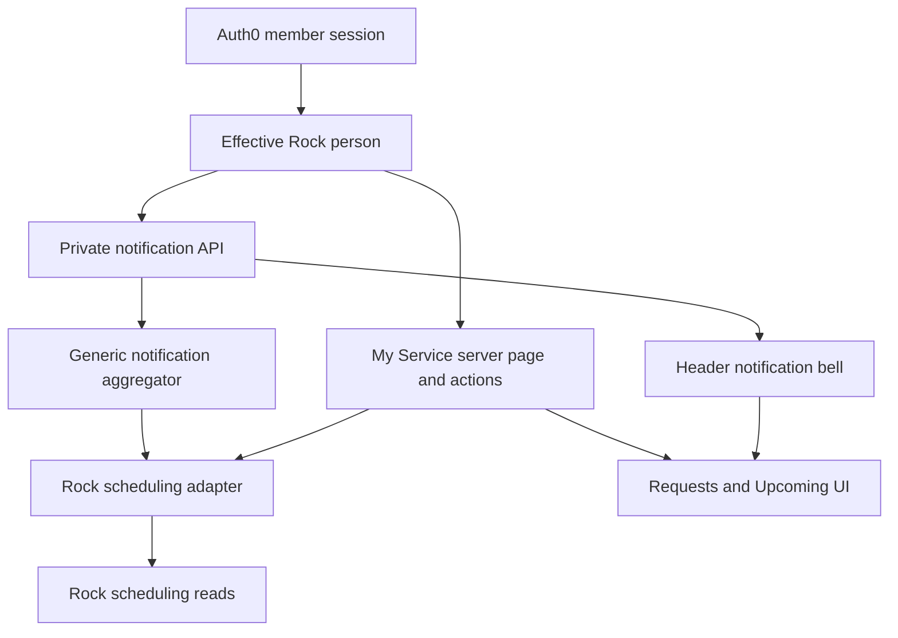
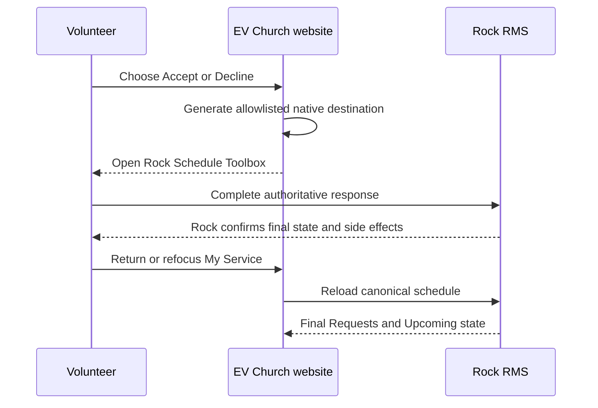
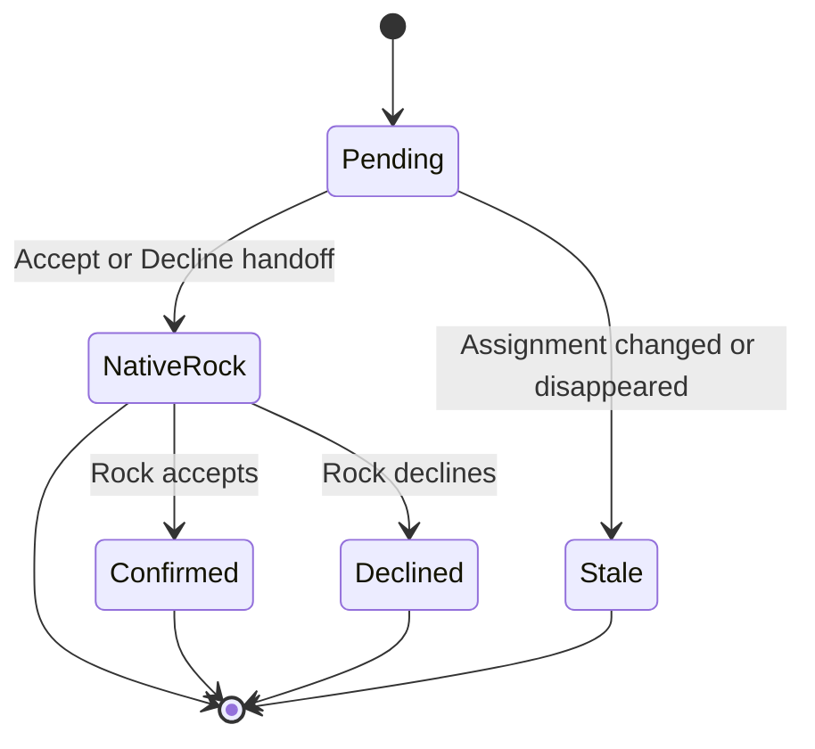

# Member Volunteer Service - Plan

## Goal Capsule

- **Objective:** Add a generic signed-in notification bell and a `/members/my-service` Volunteer Self Service page, with Rock scheduling requests as the first notification source and responses handed to Rock's authoritative toolbox.
- **Authority:** The confirmed Product Contract in this plan governs member behavior. Rock remains authoritative for scheduling state. The current EV Rock instance governs the deployed API and configuration contract.
- **Execution profile:** Deep, security-sensitive external integration across member identity, privileged Rock reads, native response handoff, global header UI, and member pages.
- **Stop conditions:** Do not enable website schedule mutations through Rock's existing public REST actions. Direct in-page responses require a separate atomic Rock endpoint that enforces owner, expected state, response rules, and side effects in one transaction. Do not mutate production schedules without separate authorization.
- **Tail ownership:** Implementation includes focused tests, `pnpm build`, signed-in browser verification, and read-only validation against the deployed Rock instance. Website schedule writes are outside this plan.

---

## Product Contract

### Summary

Add a member-facing page called **My Service** for Volunteer Self Service. It shows the current volunteer's pending scheduling requests and confirmed upcoming commitments. A generic notification bell in the top bar shows actionable notifications, starting with pending Rock scheduling requests, and links to the full page. The first release completes accept and decline through Rock's native Schedule Toolbox because Rock's current public mutation actions cannot enforce the required atomic ownership and state transition.

### Problem Frame

Rock's Schedule Toolbox gives volunteers a public self-service view of scheduling requests and responses, but that experience is separate from the EV Church members area. Members need one EV Church destination for their serving commitments and a top-bar signal when a response is required. The notification surface must remain reusable without moving scheduling ownership out of Rock.

### Key Decisions

- **Use “My Service” as the member-facing destination.** Rock's “Schedule Toolbox” name remains an implementation detail. Governs R1, R2. `(session-settled: user-approved — chosen over exposing Rock's Schedule Toolbox name: the member label should describe the volunteer's own service)`
- **Make the bell a generic notification surface.** Rock scheduling is the first producer, while unrelated future producers remain out of scope. Governs R3, R4, R11. `(session-settled: user-directed — chosen over a scheduling-only bell: the top bar should support later system notifications)`
- **Keep full response management on My Service.** The bell is a compact summary and navigation surface. Governs R4, R5. `(session-settled: user-approved — chosen over duplicating accept and decline inside the dropdown: the durable member page is the management surface)`
- **Limit the first release to volunteer self-service.** Scheduler, assignment, preference, unavailability, self-signup, and family-member tools remain outside this feature. Governs R1, R10. `(session-settled: user-directed — chosen over porting the whole Rock toolbox: the requested experience is the volunteer's personal view and response flow)`

### Actors

- A1. **Signed-in volunteer:** Views and responds to their own Rock scheduling records.
- A2. **Rock RMS:** Owns assignment state, allowed transitions, decline configuration, and scheduling side effects.
- A3. **EV Church website:** Resolves member identity, presents normalized notifications, verifies ownership, and brokers safe Rock actions.
- A4. **Scheduler or schedule coordinator:** May depend on Rock workflows or response communications when a volunteer changes status.

### Requirements

**My Service**

- R1. `/members/my-service` is a signed-in, non-indexable members page available even when the member has no serving assignments.
- R2. My Service shows future pending requests separately from future confirmed commitments, ordered by the occurrence time in the Rock/church timezone.
- R3. Pending assignments are actionable notifications; confirmed commitments remain visible on My Service but do not increase the bell badge.
- R4. Notification items link to the matching My Service request, while accept and decline actions occur on My Service only.
- R5. My Service provides accept and decline entry points that hand the current request to Rock's native Schedule Toolbox without exposing a website mutation endpoint.
- R6. Returning to or refreshing My Service reloads canonical Rock state before changing Requests or Upcoming.
- R7. A stale, cancelled, reassigned, foreign, malformed, or past assignment is never presented as writable.

**Rock behavior and safety**

- R8. Rock remains the system of record; the website does not mirror scheduling state into Payload.
- R9. The website performs no scheduling mutation in the first release; a future write path remains disabled until an atomic Rock endpoint passes the ownership, expected-state, side-effect, and canonical read-back contract.
- R10. Accept and decline use a server-generated, allowlisted native Rock destination so required decline input and scheduler/coordinator side effects remain authoritative.

**Generic notification surface**

- R11. The header consumes a provider-neutral notification contract whose badge counts items that require action, not items that are unread.
- R12. Notification loading is private and independent from member identity hydration, so Rock failure cannot make a signed-in member appear anonymous or delay public-page rendering.
- R13. The bell supports loading, successfully empty, populated, authentication-expired, and unavailable states without confusing failure with an empty inbox.
- R14. The bell works as an accessible disclosure/list on desktop and mobile, with keyboard operation, focus restoration, bounded viewport layout, and mutual exclusion with other mobile header overlays.

### Key Flows

- F1. **Discover a request**
  - **Trigger:** A signed-in member's header finishes identity hydration.
  - **Actors:** A1, A2, A3.
  - **Steps:** The bell loads an actionable count privately; opening it refreshes the normalized list; selecting an item opens its My Service request.
  - **Outcome:** The member reaches a current, canonical request without blocking the surrounding page.
  - **Covered by:** R1, R3, R4, R11, R12, R13.
- F2. **Respond to a request**
  - **Trigger:** The volunteer selects Accept or Decline on My Service.
  - **Actors:** A1, A2, A3, A4.
  - **Steps:** The website derives the effective Rock person; reloads the assignment; generates the allowlisted native Rock destination; and reloads canonical state when the member returns.
  - **Outcome:** Rock owns the response transaction and both website surfaces converge on its final state at the next refresh point.
  - **Covered by:** R5, R6, R7, R8, R9, R10.
- F3. **Preserve native Rock behavior**
  - **Trigger:** The volunteer chooses Accept or Decline in the first release.
  - **Actors:** A1, A2, A3, A4.
  - **Steps:** The website does not mutate; it offers a server-generated link to the native Rock Schedule Toolbox.
  - **Outcome:** The volunteer completes the response through Rock's authoritative flow.
  - **Covered by:** R8, R10.

### Acceptance Examples

- AE1. **Pending and confirmed:** Given two future pending assignments and one future confirmed assignment, the bell badge is `2`, the dropdown lists the two requests, and My Service shows two Requests and one Upcoming commitment. Covers R2, R3, R4, R11.
- AE2. **No requests:** Given confirmed commitments but no pending assignments, the bell has no badge and My Service still shows Upcoming. Covers R2, R3, R11.
- AE3. **No assignments:** Given no current assignments, My Service shows a successful empty state and remains in member navigation. Covers R1, R13.
- AE4. **Accept:** Given a current pending assignment, Accept opens the allowlisted native Rock toolbox; after completion and return, My Service reloads the accepted state, moves the row to Upcoming, and decrements the badge. Covers R5, R6, R9, R10.
- AE5. **Stale response:** Given a request accepted or cancelled elsewhere after page load, the next bell opening, page focus, or page refresh shows Rock's final state without a website overwrite. Covers R5, R6, R7.
- AE6. **Foreign request:** Given a forged assignment identifier owned by another person, the server returns a non-disclosing denial and performs no mutation. Covers R5, R7.
- AE7. **Website write disabled:** Given a forged direct request to a website response endpoint, the website performs no Rock mutation and returns a non-disclosing rejection. Covers R5, R9.
- AE8. **Rock unavailable:** Given a Rock read failure, the bell and My Service show unavailable rather than empty, and no stale action remains enabled. Covers R7, R13.
- AE9. **Native response:** Given any Accept or Decline in the first release, the website performs no write and sends the member to Rock's Schedule Toolbox on the configured HTTPS Rock origin. Covers R10.
- AE10. **Accessible header:** Given keyboard-only use, the member can open the bell, reach each notification, close with Escape, and return focus to the trigger; the panel remains contained on mobile. Covers R14.

### Scope Boundaries

**In scope**

- Generic notification view model, private notification endpoint, actionable badge, dropdown, and full-list link.
- Rock scheduling adapter for the current signed-in person.
- My Service Requests and Upcoming sections.
- Native Rock accept/decline handoff with canonical website refresh on return.
- Member navigation and overview entry points.

**Deferred to follow-up work**

- A purpose-built EV Rock plugin endpoint that atomically combines live Auth0-to-Rock identity, Attendance owner and expected-state checks, canonical status change, required decline input, and coordinator communications. This would replace the native handoff after its repository and deployment ownership are established.
- Durable cross-device notification read/dismiss state.
- Additional notification producers.
- Calendar feeds and add-to-calendar behavior.

**Outside this product's identity**

- Scheduler/admin assignment creation, team coverage, roster management, or mass communications.
- Schedule preferences, unavailability, self-signup, immediate needs, and family-member switching.

### Success Criteria

- A signed-in member can discover a pending serving request from the header and enter Rock's safe response flow from My Service.
- The badge equals the number of current actionable requests and never claims unread semantics.
- Rock remains canonical across stale tabs, response races, failures, and refreshes.
- Optional Rock notification work does not block public-page rendering or authenticated member identity.
- EV's configured Rock response behavior is either preserved or delegated to the native toolbox without an incomplete website mutation.

### Open Questions

- **Deferred product decision:** The current plan ships My Service as discovery plus a generic Rock handoff. A future decision can instead hold release for a purpose-built Rock endpoint so Accept and Decline complete inside My Service; the current public Rock APIs cannot implement that safely.
- **Resolved by rollout gate:** U6 must prove that the member's browser reaches Rock authenticated as the same person and that the generic Schedule Toolbox flow can return cleanly to My Service. Failure stops the handoff release rather than changing product behavior during implementation.

---

## Planning Contract

### Key Technical Decisions

- KTD1. **Normalize notifications at the view-model boundary.** `src/lib/member-notifications.ts` owns a provider-neutral discriminated contract and aggregation function. The first adapter maps Rock pending attendances to source-namespaced stable items. Destinations are application-generated same-origin member paths, lists are bounded, and only valid `requiresAction` items affect the badge. No collection, migration, background sync, or event bus is added. Multi-provider partial-success rules remain deferred until a second producer exists. Implements R3, R8, R11.
- KTD2. **Fetch notifications outside member-chrome hydration.** `src/app/api/member-notifications/route.ts` uses private no-store responses and request-bound session classification. The bell refreshes after profile resolution, whenever opened, after returning from My Service/Rock, and when a backgrounded tab regains visibility. It does not poll. Superseded responses are ignored. This prevents Rock from changing the authentication chrome fallback and gives bounded convergence without implying real-time state. Implements R12, R13.
- KTD3. **Do not use Rock's current public scheduling actions for website writes.** The inspected `ScheduledPersonConfirm` and `ScheduledPersonDecline` actions accept only a numeric Attendance ID and perform neither row ownership nor expected-state checks. A website preflight cannot close the read-write race, and canonical read-back can detect but cannot prevent an overwrite. Direct browser calls, generic Attendance PUT/PATCH, Obsidian block actions, and preflight-plus-v1-action writes are prohibited. Implements R5, R7, R8, R9.
- KTD4. **Use native Rock for first-release responses.** My Service generates its response destination from one configured HTTPS Rock origin and an allowlisted Schedule Toolbox path. The browser cannot supply the origin, destination, return target, person, or Attendance numeric ID. This preserves required decline input, atomic Rock behavior, workflows, and scheduler/coordinator communications. Implements R5, R9, R10.
- KTD5. **Treat actionable as notification state.** The badge counts future pending assignments. Opening the bell does not mark Rock data or create website read state. Accepted, declined, past, inactive, malformed, and unavailable rows are excluded from the badge. Implements R2, R3, R7, R11.
- KTD6. **Keep response entry points on My Service.** The dropdown renders notification content and links, not response controls. My Service owns the allowlisted native handoff and refreshes canonical page and bell state when the page regains focus or the member returns. Implements R4, R5, R6, R9, R14.
- KTD7. **Use Auckland/Rock time and explicit read outcomes.** Scheduling projection evaluates “today” in `Pacific/Auckland` unless the deployed Rock instance reports a different church timezone. The request-bound BFF distinguishes no session, invalid member identity, available Rock data, and Rock unavailable. Implements R2, R6, R7, R13.

### High-Level Technical Design

### Implementation Constraints

- Derive the Rock person from `src/auth/member-session.ts`; never accept a person ID from the browser or notification DTO.
- Keep Rock DTOs private to the scheduling adapter and validate every external field before projection.
- Use short read timeouts and zero retries for optional notification reads. No website scheduling mutation exists in the first release.
- Preserve private response headers: `Cache-Control: private, no-store, max-age=0`, `Pragma: no-cache`, and `Vary: Cookie`.
- Do not log names, emails, schedule notes, decline notes, raw Attendance GUIDs, raw Rock response bodies, or notification text.
- Do not use `ScheduleConfirmationSent` as read state; it records outbound Rock communication delivery.
- Keep the header's measured feedback/impersonation offset and existing desktop/mobile account behavior intact.

### Dependencies and Sequencing

1. Verify the installed EV Rock version, action permissions, exact filtered query shape, Schedule Toolbox URL, group/group-type decline settings, and response-notification configuration with read-only calls.
2. Land the isolated read adapter and native-response policy before any UI exposes a response entry point.
3. Build My Service on the adapter.
4. Add the generic notification projection and private endpoint.
5. Add the bell and navigation, then verify the composed signed-in experience.

### Risks and Mitigations

- **Rock REST action lacks atomic ownership and expected-state checks:** Do not call it from the website; native Rock owns first-release responses.
- **Native handoff becomes a phishing or redirect boundary:** Build the destination only from server configuration with one HTTPS Rock origin and an allowlisted toolbox path.
- **Global header creates latency or auth regressions:** Fetch notifications independently after member chrome hydration and fail closed to unavailable.
- **Stale UI misrepresents canonical state:** Do not use optimistic transitions; reload from Rock at the bounded refresh points in KTD2.
- **Upstream behavior changes:** Pin fixtures to the deployed Rock contract and retain read-only smoke coverage for the exact endpoints and populated records.

### System-Wide Impact

- **Entry points:** The request-bound Auth0 session feeds the private notification API and My Service page. `PublicChrome` remains responsible only for member identity hydration.
- **Authority and state:** Auth0 proves the website session, Rock owns Attendance and response configuration, and the browser owns only transient disclosure/loading state. Payload stores no scheduling or notification state.
- **Failure propagation:** Rock read failure degrades only the bell and My Service panels. It never blocks public rendering or changes member chrome to anonymous.
- **Consistency:** Bell opening, page focus/visibility return, and navigation back from Rock reload canonical state. No first-release website write or optimistic state exists.
- **Security and privacy:** Rock credentials and DTOs remain server-only. Queries interpolate only validated positive integers or canonical UUIDs. Notification text is bounded plain text, destinations are application-generated relative paths, native URLs are server-generated, and logs use coarse redacted outcome codes.
- **Impersonation:** Member impersonation may render read-only schedule data for administrative support, but response links are suppressed because Rock would authenticate the administrator rather than the represented member.
- **Header ownership:** `Header` coordinates bell, account control, and mobile menu open state. `SiteHeader` continues to own only feedback/impersonation strip offset unless its geometry contract changes.
- **Operations:** The initial rollout needs least-privilege Rock read permissions, installed-version fixtures, read-only populated smoke checks, and an independently reversible notification capability. A future atomic Rock write endpoint requires its own plan, credential, audit trail, rate controls, kill switch, and negative permission tests.

### Sources and Research

- Current member identity: `src/auth/member-session.ts`, `src/auth/rock-member-profile.ts`, and `docs/solutions/architecture-patterns/auth0-authentication-payload-authorization.md`.
- Existing safe Rock mutation: `src/lib/members/attendance-entry.ts`, `src/app/(frontend)/members/connect-groups/[rockGroupId]/attendance/actions.ts`, and `docs/solutions/security-issues/rock-form-capability-boundaries.md`.
- Existing private header hydration: `src/components/layout/PublicChrome.tsx`, `src/app/api/member-chrome/route.ts`, and `src/lib/member-chrome.ts`.
- Existing member shell: `src/components/members/MemberPortalChrome.tsx` and `src/app/(frontend)/members/page.tsx`.
- [Rock Schedule Toolbox v19 documentation](https://community.rockrms.com/documentation/engagement/groups/group-schedules/view-your-schedule-toolbox?Version=v19.0).
- [Rock GroupScheduleToolbox source at inspected commit](https://github.com/SparkDevNetwork/Rock/blob/6756f61728aefc4ddf95772fc3d6a2c7dd249981/Rock.Blocks/Group/Scheduling/GroupScheduleToolbox.cs).
- [Rock AttendanceService source at inspected commit](https://github.com/SparkDevNetwork/Rock/blob/6756f61728aefc4ddf95772fc3d6a2c7dd249981/Rock/Model/Event/Attendance/AttendanceService.cs).
- [Rock Attendances REST controller at inspected commit](https://github.com/SparkDevNetwork/Rock/blob/6756f61728aefc4ddf95772fc3d6a2c7dd249981/Rock.Rest/Controllers/AttendancesController.partial.cs).
- [Rock Attendance save hook at inspected commit](https://github.com/SparkDevNetwork/Rock/blob/6756f61728aefc4ddf95772fc3d6a2c7dd249981/Rock/Model/Event/Attendance/Attendance.SaveHook.cs).

---

## Implementation Units

### U6. Deployed Rock read-contract gate

- **Goal:** Establish the installed Rock version, least-privilege read surface, and safe native response destination before application code depends on them.
- **Requirements:** R2, R5, R7, R8, R9, R10, R13; F2, F3; AE6-AE9.
- **Dependencies:** None.
- **Files:**
  - Modify `.env.example` only if a new non-secret Rock toolbox-origin setting is required.
- **Evidence output:** Capture sanitized deployed response shapes and version/permission notes suitable for U1 to convert into fixtures.
- **Approach:**
  1. Verify the exact EV Rock version and narrow read query with empty and populated representative data.
  2. Confirm the service credential can read only the fields required for the member projection and cannot generically mutate Attendance records.
  3. Verify the HTTPS Rock origin and Schedule Toolbox route used for server-generated response links.
  4. Confirm the inspected v1 actions still lack atomic ownership and expected-state checks; keep all website writes disabled regardless of positive action permission.
- **Execution note:** This unit is read-only. Do not test a production response mutation.
- **Patterns to follow:** `docs/solutions/integration-issues/verify-provider-request-contracts-in-composed-auth-flows.md`, `docs/solutions/security-issues/rock-form-capability-boundaries.md`.
- **Test scenarios:**
  - A member with no assignments returns a complete, available empty result.
  - A member with populated pending and confirmed assignments returns the exact projected fields and non-primary PersonAlias ownership resolves to the correct Person.
  - Generic Attendance mutation and unrelated entity access are denied to the scheduling read credential.
  - Invalid or non-HTTPS Rock origins and non-allowlisted toolbox paths produce unavailable with no response link.
- **Verification:** Sanitized contract evidence is ready for U1, the read permission is least privilege, the native destination is fixed and safe, and no website mutation capability is enabled.

### U1. Rock volunteer scheduling adapter

- **Goal:** Provide strict current-person scheduling reads and a safe native response destination.
- **Requirements:** R2, R5, R6, R7, R8, R9, R10; F2, F3; AE4-AE9.
- **Dependencies:** U6.
- **Files:**
  - Create `src/lib/members/volunteer-scheduling.ts`.
  - Create `src/lib/members/volunteer-scheduling.test.ts`.
  - Modify `src/lib/rock-api.ts` only if the deployed read contract needs a request shape the shared client cannot express safely.
  - Modify `src/lib/rock-api.test.ts` when the client changes.
- **Approach:**
  1. Define private Rock Attendance, occurrence, group, group-type, location, schedule, and response-rule DTOs with strict parsers.
  2. Load only future pending, confirmed, and response-policy fields for the effective Rock person; deduplicate by Attendance GUID and sort by canonical occurrence time.
  3. Return application-owned `requests`, `upcoming`, and availability state without exposing Rock DTOs.
  4. Resolve Attendance aliases back to the session's Rock Person, including non-primary aliases, and exclude foreign, past, inactive, declined, and malformed rows.
  5. Generate the native response destination only from the verified server configuration and allowlisted path.
- **Execution note:** Start with characterization fixtures from U6 and the inspected upstream state predicates. Do not add a website write method.
- **Patterns to follow:** `src/lib/members/attendance-entry.ts`, `src/auth/rock-member-profile.ts`, `docs/solutions/integration-issues/verify-provider-request-contracts-in-composed-auth-flows.md`.
- **Test scenarios:**
  - Covers AE1-AE3. Partition pending and confirmed future attendances, exclude past/declined/inactive rows, deduplicate repeated pagination rows, and order equal timestamps deterministically.
  - Covers AE4. Generate the allowlisted native response link for a current owned pending record without calling a mutation endpoint.
  - Covers AE5. A later read replaces the prior pending row with Rock's final canonical state.
  - Covers AE6-AE7. Reject foreign, malformed, or direct website-write inputs without a mutation surface or owner disclosure.
  - Covers AE8. Distinguish malformed or unavailable Rock data from an available empty result.
  - Covers AE9. Every first-release response uses the verified native Rock destination.
  - Render today/future correctly across Auckland midnight and daylight-saving boundaries.
  - Omit a malformed row while retaining valid rows only when completeness can still be proven; otherwise return unavailable.
- **Verification:** Fixtures match deployed Rock shapes; alias ownership and strict projections pass; the module exposes no scheduling mutation operation.

### U2. My Service page and response flow

- **Goal:** Give members a complete personal Requests and Upcoming service view with safe response controls.
- **Requirements:** R1, R2, R4, R5, R6, R7, R10, R13; F2, F3; AE1-AE9.
- **Dependencies:** U1.
- **Files:**
  - Create `src/app/(frontend)/members/my-service/page.tsx`.
  - Create `src/app/(frontend)/members/my-service/page.test.tsx`.
  - Create `src/components/members/VolunteerSchedule.tsx`.
  - Create `src/components/members/VolunteerSchedule.test.tsx`.
- **Approach:**
  1. Load member portal context and schedule data independently so Rock failure preserves the signed-in page shell.
  2. Render Requests first, Upcoming second, and distinct empty, unavailable, and authentication-expired states.
  3. Render server-generated native response links only for current requests and suppress them while member impersonation is active.
  4. Refresh schedule and notification state on page visibility/focus return and ignore superseded requests.
  5. Keep stale loaded content non-actionable when a refresh fails.
- **Patterns to follow:** `src/app/(frontend)/members/connect-groups/[rockGroupId]/attendance/page.tsx`, `src/components/layout/PublicChrome.tsx`, `src/components/members/MemberPortalChrome.tsx`.
- **Test scenarios:**
  - Covers AE1-AE3. Render populated, confirmed-only, and successful empty states with noindex metadata and a safe signed-out return path.
  - Covers AE4. Open the configured native response flow and, after return, move the canonical accepted row to Upcoming.
  - Covers AE5. Replace stale pending content with Rock's current state on focus or refresh.
  - Covers AE6-AE7. No website response route or server action exists; forged submissions cannot reach Rock.
  - Covers AE8. Render authentication expired and Rock unavailable without claiming success or empty state.
  - Covers AE9. Render clear native Rock response controls with a fixed safe return path and no website write.
  - Impersonation renders a read-only schedule and suppresses native response links.
  - A scheduler-cancelled request disappears after refresh with a concise “no longer available” announcement.
  - Cross-tab and native Rock changes converge when the page is reopened, focused, or refreshed.
- **Verification:** The page remains usable when Rock is unavailable, response destinations are server-owned, impersonation is read-only, and all feedback is accessible.

### U3. Generic member notification API

- **Goal:** Expose private provider-neutral notification summary and list responses, beginning with pending schedules.
- **Requirements:** R3, R4, R11, R12, R13; F1; AE1-AE3, AE8.
- **Dependencies:** U1.
- **Files:**
  - Create `src/lib/member-notifications.ts`.
  - Create `src/lib/member-notifications.test.ts`.
  - Create `src/app/api/member-notifications/route.ts`.
  - Create `src/app/api/member-notifications/route.test.ts`.
- **Approach:**
  1. Define a discriminated notification contract with stable ID, kind, title, summary, destination, occurrence time, and `requiresAction`.
  2. Aggregate provider results behind one server function and map pending Rock requests as the first provider.
  3. Return an actionable count for summary mode and a bounded chronological list for full mode, with a My Service overflow link.
  4. Short-circuit anonymous requests and return private headers for every response.
  5. Represent upstream unavailable separately from available-empty and suppress raw Rock errors.
- **Patterns to follow:** `src/app/api/member-chrome/route.ts`, `src/lib/member-chrome.ts`, `src/components/layout/PublicChrome.tsx`.
- **Test scenarios:**
  - Covers AE1-AE3. Return the correct actionable count and stable scheduling items; confirmed-only and no-assignment states have count zero.
  - Covers AE8. Return explicit unavailable when the scheduling provider fails, not an empty available list.
  - Anonymous and expired sessions return an authentication-safe response with no Rock call.
  - Repeated or malformed provider items cannot duplicate IDs, inject destinations, or break valid output.
  - Future informational notification kinds render through the contract but affect the badge only when `requiresAction` is true.
  - Every response carries private no-store and `Vary: Cookie` headers.
- **Verification:** The endpoint never returns Rock person IDs or raw DTOs, never broadens member-chrome, and has deterministic summary/list behavior.

### U4. Header notification bell and dropdown

- **Goal:** Add a signed-in-only generic notification disclosure to desktop and mobile headers without changing header geometry or account behavior.
- **Requirements:** R3, R4, R11, R12, R13, R14; F1; AE1-AE3, AE8, AE10.
- **Dependencies:** U3.
- **Files:**
  - Create `src/components/layout/MemberNotificationsControl.tsx`.
  - Create `src/components/layout/MemberNotificationsControl.test.tsx`.
  - Modify `src/components/layout/Header.tsx`.
  - Modify `src/components/layout/SiteHeader.tsx` only if the existing measured-offset contract needs a prop pass-through.
  - Modify `src/components/layout/MemberAccountControl.test.tsx`.
  - Modify `src/components/layout/SiteHeader.dom.test.tsx` when offset or overlay coordination changes.
- **Approach:**
  1. Mount the control only for a resolved member profile and fetch summary state independently.
  2. Refresh the full list on open, after returning from My Service/Rock, and when the tab regains visibility; ignore older responses that finish after a newer request.
  3. Render a disclosure/list rather than an ARIA menu, with a badge accessible as “actions requiring attention.”
  4. Let `Header` coordinate mutually exclusive bell, account, and mobile-menu state; close on Escape, outside pointer, and route change; restore focus when appropriate.
  5. Keep the panel within the viewport with bounded scrolling, safe-area spacing, wrapped content, and minimum touch targets.
- **Patterns to follow:** `src/components/layout/MemberAccountControl.tsx`, `src/components/layout/Header.tsx`, `src/components/layout/SiteHeader.tsx`.
- **Test scenarios:**
  - Covers AE1-AE3. Render signed-in count, populated list, no-badge confirmed-only state, and empty state; render no bell when signed out.
  - Covers AE8. Show unavailable without an empty-state claim and disable stale links when current data cannot be trusted.
  - Covers AE10. Open and close by keyboard, restore focus, traverse links, announce count/loading/error states, and contain the panel at narrow widths.
  - Opening the bell refreshes data; a late older response cannot restore a request resolved by a newer response.
  - Route navigation closes the panel and the My Service anchor receives sensible focus.
  - Opening the mobile notification panel closes the account/navigation overlay and vice versa.
  - Existing feedback and impersonation strip offsets remain unchanged.
- **Verification:** Desktop and mobile header tests prove accessibility, concurrency ordering, signed-in visibility, and preserved geometry.

### U5. Member navigation and overview entry points

- **Goal:** Make My Service a normal, discoverable member feature beyond the notification bell.
- **Requirements:** R1, R4; AE3.
- **Dependencies:** U2.
- **Files:**
  - Modify `src/components/members/MemberPortalChrome.tsx`.
  - Modify `src/components/members/MemberPortalChrome.test.tsx`.
  - Modify `src/app/(frontend)/members/page.tsx`.
  - Modify `src/app/(frontend)/members/page.test.tsx`.
  - Modify `src/components/layout/MemberAccountControl.tsx`.
  - Modify `src/components/layout/MemberAccountControl.test.tsx`.
- **Approach:**
  1. Add `service` as a member section and render My Service in the members navigation for every signed-in member.
  2. Add an overview card that works for members with and without current service assignments.
  3. Add My Service to the existing signed-in account/drawer navigation without duplicating the bell's notification content.
- **Patterns to follow:** Existing Overview, Daily Reading, Connect Group, and conditional Leader Resources entries.
- **Test scenarios:**
  - Covers AE3. My Service appears in member navigation, overview, desktop account control, and mobile drawer when there are no assignments.
  - The active member-navigation marker selects My Service only on its route.
  - All private links remain `nofollow`, and existing Connect Group direct-link behavior remains unchanged.
  - Header ordering remains deliberate after placing the bell beside the account control.
- **Verification:** My Service is reachable independently of a notification and existing member navigation retains its prior behavior.

### U7. Composed-flow and rollout verification

- **Goal:** Prove the complete signed-in read and native-handoff experience without enabling a website scheduling write.
- **Requirements:** R1-R14; F1-F3; AE1-AE10.
- **Dependencies:** U6, U1, U2, U3, U4, U5.
- **Files:**
  - Update focused tests named in U1-U5 when composed verification reveals a documented contract delta.
- **Approach:**
  1. Verify the signed-in page, bell, keyboard flow, mobile layout, and native Rock handoff with representative read data.
  2. Confirm optional Rock reads never block public chrome or change authenticated identity state.
  3. Verify impersonation is read-only and every browser-supplied or forged website response request has no mutation target.
  4. Exercise bounded refresh points after an external Rock status change and confirm stale responses cannot restore old state.
  5. Roll back by disabling the notification read capability without removing member identity or navigation.
- **Execution note:** Production reads use authorized existing credentials. Complete a response only in Rock's native UI under the volunteer's own Rock session; no website production mutation is part of this plan.
- **Patterns to follow:** `docs/solutions/integration-issues/verify-provider-request-contracts-in-composed-auth-flows.md`, `docs/solutions/security-issues/rock-form-capability-boundaries.md`.
- **Test scenarios:**
  - Read-only smoke covers no assignments and populated pending/confirmed assignments.
  - Public-page header hydration remains responsive during a forced Rock timeout.
  - Native Accept/Decline followed by page focus refresh updates Requests, Upcoming, and badge from canonical Rock data.
  - Impersonated and cross-origin forged response attempts perform zero website Rock writes.
  - Mobile and keyboard passes cover the bell, My Service anchor navigation, native handoff, and overlay exclusivity.
- **Verification:** The production build passes, the deployed read contract is evidenced, and the shipped website exposes no scheduling write capability.

---

## Verification Contract

| Gate | Applies to | Command or evidence | Pass condition |
|---|---|---|---|
| Scheduling adapter tests | U1 | `pnpm vitest src/lib/members/volunteer-scheduling.test.ts src/lib/rock-api.test.ts` | Exact Rock-shaped reads, alias ownership, exclusions, and safe native destinations pass. |
| My Service tests | U2 | `pnpm vitest src/app/\(frontend\)/members/my-service/page.test.tsx src/components/members/VolunteerSchedule.test.tsx` | Auth, rendering, stale state, impersonation, native handoff, and response refresh pass. |
| Notification API tests | U3 | `pnpm vitest src/lib/member-notifications.test.ts src/app/api/member-notifications/route.test.ts` | Generic contract, private headers, actionable counts, and failure distinctions pass. |
| Header and navigation tests | U4, U5 | `pnpm vitest src/components/layout/MemberNotificationsControl.test.tsx src/components/layout/MemberAccountControl.test.tsx src/components/layout/SiteHeader.dom.test.tsx src/components/members/MemberPortalChrome.test.tsx src/app/\(frontend\)/members/page.test.tsx` | Accessibility, responsive overlays, header geometry, and member navigation pass. |
| Production compilation | U1-U7 | `pnpm build` | Payload type generation and Next.js production build complete successfully. |
| Deployed Rock read contract | U1, U6 | Authorized read-only probe against EV Rock | Empty and populated fixtures match the adapter; permissions are no broader than required. |
| Signed-in browser flow | U2-U7 | Real browser on desktop and mobile | Bell, My Service, empty/unavailable states, native handoff, anchors, keyboard focus, and responsive layout match AE1-AE10. |
| No-write proof | U6, U7 | Negative route and permission probes | The website exposes no scheduling mutation target, and the Rock read credential cannot generically mutate Attendance records. |

---

## Definition of Done

- R1-R14 are implemented without adding scheduler/admin scope, local scheduling persistence, or unrelated notification producers.
- U1 provides strict current-person schedule projection and server-owned native response destinations without a mutation operation.
- U2 provides My Service with Requests, Upcoming, explicit failure states, read-only impersonation, and safe native response handoff.
- U3 provides a private provider-neutral notification contract whose badge counts actions required.
- U4 provides an accessible signed-in notification disclosure on desktop and mobile without header geometry regressions.
- U5 makes My Service discoverable from the member area and signed-in navigation even with no assignments.
- U6 records the installed Rock contract, least-privilege read permissions, and allowlisted native destination before implementation depends on them.
- U7 proves the composed website remains read-only for scheduling and converges on native Rock changes at bounded refresh points.
- Focused tests and `pnpm build` pass.
- Browser verification covers signed-in desktop, mobile, keyboard, empty, populated, and unavailable flows.
- No website production scheduling mutation exists in the delivered feature.
- Abandoned experiments, broad API permissions, temporary debug output, raw Rock payload logs, and dead feature flags are absent from the final diff.
